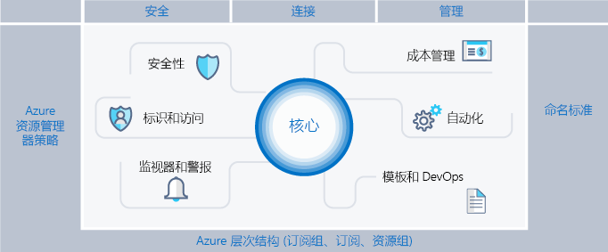
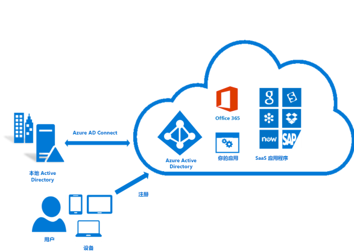
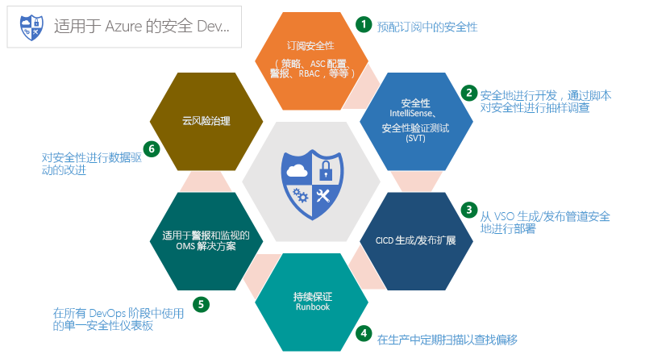
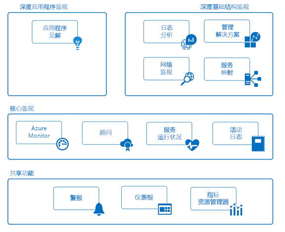

# Azure 企业基架：规范性订阅管理

为了敏捷性和灵活性，企业越来越多地采用公有云。 它们利用云的优势来产生营收和优化企业资源使用情况。 Microsoft Azure 提供多种不同的服务和功能，企业可以像构建块一样将它们组合，解决广泛的工作负荷与应用程序需求。

决定使用 Microsoft Azure 只是实现云优势的第一步。 第二步是了解企业如何有效使用 Azure，并确定解决以下问题所需的基线功能：

* “我担心数据所有权；如何确保数据和系统符合法规要求？”
* “怎么知道每个资源是否发挥了作用，以便可以准确地做出规划和预算？”
* “我想确保我们在公有云中部署或执行的所有操作均将安全放在首位，应如何帮助实现这一点？”

不带任何防护措施的空白订阅，其前景是让人担忧的。 如果不在这方面有所作为，可能会给 Azure 过渡造成阻碍。

本文为技术专业人员提供一个起点，帮助他们解决监管需求，并在监管需求与敏捷性需求之间权衡利弊。 其中会介绍企业基架的概念，它可以引导组织以安全的方式实施和管理 Azure 环境。 本文为开发有效和高效的控件提供了框架。

## 监管需求

在过渡到 Azure 时，必须提前解决监管方面的问题，确保成功地在企业中利用云。 遗憾的是，建立全面监管系统所花费的时间和存在的官僚主义，意味着某些业务小组必须直接与提供商对话，而不与企业 IT 部门沟通。 如果资源未妥善管理，这种方法可能会导致企业受到损害。 公有云的特征 - 敏捷性、灵活性和基于消耗量的定价 - 对于需要快速满足客户（内部和外部）需求的业务小组而言非常重要。 但是，企业 IT 部门需要确保有效地保护数据和系统。

建造建筑物时，我们可以使用基架来打好建筑物的基础。 基架主导总体轮廓，为需要装载的更长久系统提供定位点。 企业基架也是如此：一套灵活的控制机制和 Azure 功能为环境提供结构，为公有云上生成的服务提供定位点。 它为构建者（IT 人员和业务小组）提供创建和附加新服务的基础，同时保持了交付速度。

该基架建立在我们与各种规模的客户交往时收获的实践经验基础之上。 这些客户既包括在云中开发解决方案的小型组织，也包括迁移工作负载和开发云本机解决方案的大型跨国企业和独立软件供应商。 企业基架采用灵活设计，为传统的 IT 工作负载和敏捷工作负载提供有针对性的支持；例如，开发人员可以基于 Azure 平台功能创建软件即服务 (SaaS) 应用程序。

企业基架旨在用作 Azure 中每个新订阅的基础。 它能使管理员确保工作负荷满足组织的最低监管要求，同时又不妨碍业务小组和开发人员尽快实现自身的目标。 我们的经验表明，这极大地加速（而非阻碍）了公有云的增长。

> [!NOTE]
> Microsoft 在预览版中发布了名为 [Azure 蓝图](/azure/governance/blueprints/overview)的新功能，借助此功能便可跨订阅和管理组打包、管理和部署通用映像、模板、策略和脚本。 此功能是基架作为参考模型的用途和将该模型部署到组织之间的桥梁。
>
下图显示了基架的组件。 基础依赖于管理层次结构和订阅的可靠计划。 支柱包括 Resource Manager 策略和强有力的命名标准。 基架的剩余部分是 Azure 核心功能和特性，它们可实现和连接安全且可管理的环境。

## 定义层次结构

基架的基础是从 Azure 企业许可登记表一直到订阅和资源组的层次结构和关系。 企业许可登记表从合同的角度定义了 Azure 服务在贵公司内的形式和用途。 在企业协议中，可将环境进一步细分为部门、帐户，最终细分为订阅和资源组，以与组织的结构相匹配。

Azure 订阅是包含所有资源的基本单位。 它还定义 Azure 中的多种限制，例如核心数、虚拟网络数和其他资源数。 Azure 资源组用于进一步优化订阅模型，并实现更自然的资源分组。

每家企业都是独特的，使用上图中的层次结构可以在公司内部十分灵活地对 Azure 进行组织。 开始使用公有云时，对层次结构建模以反映公司对计费、资源管理和资源访问的需求，是首先要做出的 &mdash; 也是最重要的 &mdash; 决策。

### 部门和帐户

Azure 注册的三种常见模式为：

* **功能**模式

    
* **业务单位**模式

    
* **地理**模式

    

虽然这些模式各占一席之地，但“业务单位”模式逐渐得到广泛采用，因为该模式可灵活建造组织的成本模型以及反映控制范围。 Microsoft 核心工程技术和操作组创建了一个非常有效的“业务单位”模式子集，该子集以“联邦”、“州”和“本地”为模型。 （有关详细信息，请参阅[在 Enterprise 中组织订阅和资源组](https://azure.microsoft.com/blog/organizing-subscriptions-and-resource-groups-within-the-enterprise/)。）

### 管理组

Microsoft 最近发布了一种新的层次结构建模方法：[Azure 管理组](/azure/azure-resource-manager/management-groups-overview)。 管理组比部门和帐户更灵活，可嵌套多达六个级别。 借助管理组，可创建与账单层次结构分离的层次结构，专门用于有效管理资源。 管理组可反映出账单层次结构，企业通常以这种方式开始。 但是，管理组的强大功能在于使用它们为组织建模，而组织中相关订阅 &mdash; 无论其位于账单层次结构中的何处 &mdash; 都组合在一起，且需要分配共同角色以及策略和计划。 一些示例：

* **生产/非生产**。 某些企业创建管理组来识别其生产和非生产订阅。 借助管理组，这些客户可以更轻松地管理角色和策略，例如：非生产订阅可能允许开发人员“参与者”访问权限，但在生产中，开发人员仅具有“读者”访问权限。
* **内部服务/外部服务**。 如生产/非生产一样，企业通常对内部服务和外部（面向客户）服务有不同的要求、策略和角色。

周密的管理组以及 Azure Policy 和计划是 Azure 有效管理的支柱。

### 订阅

决定部门和帐户（或管理组）时，你主要关注的是如何划分 Azure 环境，以便与组织匹配。 然而，订阅才是真正的工作所在，此时的决策会影响安全性、可伸缩性和计费。  许多组织将以下模式视为指南：

* **应用程序/服务**：订阅代表应用程序或服务（应用程序组合）
* **生命周期**：订阅代表服务的生命周期，例如生产或开发。
* **部门**：订阅代表组织中的部门。

前两种模式是最常用的模式，强烈建议使用这两种模式。 生命周期方法适用于大多数组织。 在这种情况下，一般建议使用两个基本订阅。 “生产”和“非生产”，然后使用资源组进一步细分环境。

### 资源组

使用 Azure 资源管理器可将资源放入有意义的组中，便于管理、记帐或自然关联。 资源组是具有相同生命周期的或共享某个属性（例如“所有 SQL 服务器”或“应用程序 A”）的资源的容器。

资源组无法进行嵌套，资源只能属于一个资源组。 某些操作可对资源组中的所有资源执行操作。 例如，删除某个资源组会删除该资源组中的所有资源。 类似于订阅，创建资源组时也存在常见模式，从“传统 IT”工作负载到“敏捷 IT”工作负载会有所不同：

* “传统 IT”工作负载通常按同一生命周期中的项（例如某个应用程序）分组。 由于可按应用程序分组，因此可以管理每个应用程序。
* “敏捷 IT”工作负荷往往侧重面向外部客户的云应用程序。 资源组通常反映部署层（如 Web 层、应用层）和管理层。

> [!NOTE]
> 了解工作负荷可帮助制定资源组策略。 这些模式可以混合搭配。 例如，与“敏捷”资源组位于同一订阅中的共享服务资源组。

## 命名标准

基架的第一个支柱是一致的命名标准。 使用妥善设计的命名标准，可以在门户、帐单和脚本中识别资源。 你很可能已针对本地基础结构制定了现有命名标准。 将 Azure 添加到环境时，应该将这些命名标准扩展到 Azure 资源。

> [!TIP]
> 关于命名约定：
> * 如果可能，请审阅并采纳[模式与实践指南](https://docs.microsoft.com/en-us/azure/architecture/best-practices/naming-conventions)。 本指南可帮助确定一套有意义的命名标准并提供了大量示例。
> * 使用资源管理器策略来帮助实施命名标准
>
>记住，以后更改名称比较难，因此现在花费几分钟即可省去以后的麻烦。

请将命名标准集中在那些更常用和更常搜索的资源上。  例如，为清晰起见，所有资源组都应严格遵循标准。

### 资源标记

资源标记与命名标准紧密一致。 随着资源添加到订阅中，出于计费、管理和操作目的，对其进行逻辑分类变得日益重要。 有关详细信息，请参阅[使用标记整理 Azure 资源](https://docs.microsoft.com/en-us/azure/azure-resource-manager/resource-group-using-tags)。

> [!IMPORTANT]
> 标记可包含个人信息，并且可能属于 GDPR 法规的范围。 请仔细规划管理标记。 如需关于 GDPR 的常规信息，请参阅[服务信任门户](https://servicetrust.microsoft.com/ViewPage/GDPRGetStarted)的 GDPR 部分。

除了计费和管理外，还可通过多种方式使用标记。 标记通常用作自动化的一部分（请参阅后面的部分）。 如果不事先考虑，这可能会导致冲突。 建议的做法是标识企业级别的所有常用标记（例如 ApplicationOwner、CostCenter），并在使用自动化部署资源时以一致的方式应用这些标记。

## Azure Policy 和计划

基架的第二个支柱涉及使用 [Azure Policy 和计划](/azure/azure-policy/azure-policy-introduction)来管理风险，具体方法是对订阅中的资源和服务强制实施规则（具有效果）。 Azure 计划是策略的集合，旨在实现一个目标。 然后，会将 Azure Policy 和计划分配到资源作用域，从而开始特定策略的强制实施。
<计划/策略/工作的图像>

与上文所述的管理组结合使用时，Azure Policy 和计划的功能更强大。 管理组可将计划或策略分配给整个订阅集。

### Resource Manager 策略的常见用途

Azure Policy 和计划是 Azure 工具包中的一个强大工具。 策略允许公司为“传统 IT”工作负载提供控制，从而实现 LOB 应用程序所需的稳定性，同时也允许“敏捷”工作负载；例如，开发客户应用程序而不会使企业面临其他风险。 策略的最常见模式包括：

* **地域法规遵从/数据所有权**。 Azure 在世界各地拥有越来越多的区域。 Enterprise 通常需要确保特定作用域内的资源保留在某一地理区域内，以满足法规要求。
* **避免公开服务器**。 Azure Policy 可禁止部署某些资源类型。 常见的用途是创建策略来拒绝在特定作用域内创建公共 IP，从而避免无意中向 Internet 公开服务器。
* **成本管理和元数据**。 资源标记通常用于将重要的账单数据添加到资源和资源组，例如 CostCenter、所有者等。 这些标记对于准确计费和管理资源非常有用。 策略可强制将资源标记应用于所有已部署资源，使其更易于管理。

### 计划的常见用途

计划的引入为企业提供了一种将逻辑策略组合在一起并作为整体进行跟踪的方法。 计划进一步支持企业解决“敏捷”和“传统”工作负载的需求。 我们已见过极富创意使用计划的方法，但我们通常见到以下用法：

* **在 Azure 安全中心启用监视**。 这是 Azure Policy 中的默认计划，也是计划的一个绝佳示例。 它可启用识别未加密的 SQL 数据库、VM 漏洞和更常见的安全相关需求的策略。
* **特定于法规的计划**。 企业通常对法规要求（如 HIPAA）通用的策略进行分组，以便有效跟踪这些控件的控制和符合性。
* **资源类型和 SKU**。 创建限制可部署资源类型以及可部署 SKU 的计划有助于控制成本，并可确保组织仅部署团队具有技能集和程序来支持的资源。

> [!TIP]
> 我们建议始终使用计划定义，而不是策略定义。 将计划分配给作用域（如订阅或管理组）后，便可轻松将另一个策略添加到计划中，且无需更改任何分配。 这使了解所应用内容和跟踪符合性变得更加轻松。

### 策略和计划分配

创建策略并将其分组到逻辑计划后，必须将策略分配给作用域，无论是管理组、订阅组还是资源组。 通过分配，还可从策略分配中排除子作用域。 例如，如果拒绝在订阅中创建公共 IP，则可为连接到受保护外围网络的资源组创建具有排除项的分配。

在此 [GitHub](https://github.com/Azure/azure-policy) 存储库中，可查找多个 Policy 示例，这些示例展示了如何将 Policy 和计划应用于 Azure 中的各种资源。

## 标识和访问管理

开始使用公有云时，首先也是最关键的问题是“谁应有权访问资源？” 或者“如何控制这种访问权限？” 允许或禁止访问 Azure 门户，以及控制门户中资源的访问权限对于资产在云中的长期成功和安全至关重要。

若要完成保护资源访问安全的任务，首先要配置标识提供者，然后配置角色和访问权限。 连接到本地 Azure Active 的 Azure Active Directory (Azure AD)，是 Azure 标识的基础。 即便如此，Azure AD 并非 Active Directory，而且了解什么是 Azure AD 租户及其与 Azure 注册的关系非常重要。  查看可用[信息](../getting-started/azure-resource-access.md)，以获取 Azure AD 和 AD 的坚实基础。 若要连接 Active Directory 并将其同步到 Azure AD，请在本地安装和配置 [AD Connect 工具](/azure/active-directory/connect/active-directory-aadconnect)。

Azure 在最初发布时，对订阅的访问控制非常直接：只允许管理员或共同管理员访问。 有权访问经典模型中的订阅意味着有权访问门户中的所有资源。 缺少精细控制导致需要衍生订阅来针对 Azure 注册提供合理的访问控制级别。 现在不再需要衍生订阅。 借助基于角色的访问控制 (RBAC)，可将用户分配给提供常见访问权限的标准角色，如“所有者”、“参与者”或“读者”，甚至还可创建自己的角色

实施基于角色的访问时，强烈建议执行以下操作：

* 控制订阅的管理员/共同管理员，因为这些角色拥有广泛的权限。 如果他们需要管理 Azure 经典部署，则仅需将“订阅所有者”添加为共同管理员。

* 使用管理组在多个订阅中分配[角色](/azure/azure-resource-manager/management-groups-overview#management-group-access)，并减少在订阅级别对其进行管理的负担。
* 将 Azure 用户添加到 Active Directory 中的组（例如，应用程序 X 所有者）。 使用同步组为组成员提供适当的权限来管理包含应用程序的资源组。
* 遵循授予**最低特权**的原则，以便完成所需的工作。

> [!IMPORTANT]
>请考虑使用 [Azure AD Privileged Identity Management](/azure/active-directory/privileged-identity-management/pim-configure)、Azure [多重身份验证](/azure/active-directory/authentication/howto-mfa-getstarted)和[条件访问](/azure/active-directory/active-directory-conditional-access-azure-portal)功能，为 Azure 订阅中的管理操作提供更高的安全性和可见性。 这些功能来自有效的 Azure AD Premium 许可证（取决于功能），以进一步保护和管理标识。 Azure AD PIM 通过批准工作流实现“实时”管理访问，并对管理员激活和活动进行全面审核。 Azure MFA 是另一项重要功能，支持登录到 Azure 门户的双重验证。 与条件访问控制相结合时，可以有效地管理泄露风险。

规划和准备标识及访问控制并遵循 Azure 标识管理最佳做法（[链接](/azure/security/azure-security-identity-management-best-practices)）是可采用的最佳风险缓解策略之一，应将其视为每个部署的强制策略。

## 安全

在采用云的过程中，传统上最大的阻碍之一是安全忧虑。 IT 风险管理员和安全部门需确保默认情况下 Azure 中的资源受保护且安全。 Azure 提供了许多功能，利用这些功能可保护资源并检测/预防针对这些资源的威胁。

### Azure 安全中心

除高级威胁防护外，[Azure 安全中心](/azure/security-center/security-center-intro)还提供了整个环境中资源安全状态的统一视图。 Azure 安全中心是一个开放式平台，允许 Microsoft 合作伙伴创建可插入并增强其功能的软件。 Azure 安全中心（免费层）的基线功能提供了评估和建议，可改善安全状况。 其付费层可实现其他有价值的功能，例如实时管理员访问和自适应应用程序控件（允许列表）。

> [!TIP]
>Azure 安全中心是一款非常强大的工具，这款工具不断得到增强，还不断包含新功能，可利用这些功能来检测威胁并保护企业。 强烈建议始终启用 ASC。

### Azure 资源锁

随着组织不断在订阅中添加核心服务，避免业务中断变得越来越重要。 我们经常见到的一种中断是，脚本和工具针对 Azure 订阅错误删除资源而运行的意外结果。 使用[资源锁](/azure/azure-resource-manager/resource-group-lock-resources)可以限制针对高价值资源（修改或删除这些资源会造成重大影响）的操作。 锁应用于订阅、资源组，甚至是各个资源。 常见用例是将锁应用于基本资源，如虚拟网络、网关、网络安全组和密钥存储帐户。

### 安全 DevOps 工具包

“用于 Azure 的安全 DevOps 工具包”(AzSK) 是脚本、工具、扩展、自动化等的集合，最初由 Microsoft 自己的 IT 团队创建，并通过 Github（[链接](https://github.com/azsk/DevOpsKit-docs)）在 OpenSource 中发布。 AzSK 满足了团队端到端 Azure 订阅和资源安全需求，这些团队使用广泛的自动化并顺利地将安全性集成到本机开发运营工作流中，有助于实现以下 6 个重点领域的安全开发运营：

* 保护订阅
* 启用安全开发
* 将安全性集成到 CICD 中
* 持续保障
* 警报和监视
* 云风险管理

AzSK 是一套丰富的工具、脚本和信息，它们是完整 Azure 管理计划的重要组成部分，将其整合到基架中对于支持组织的风险管理目标至关重要

### Azure 更新管理

为确保环境安全，可执行的关键任务之一是务必使用最新更新修补服务器。 虽然许多工具可实现这一点，但 Azure 提供了 [Azure 更新管理](/azure/automation/automation-update-management)解决方案，用于解决关键 OS 修补程序的识别和推出问题。  这利用了 Azure 自动化（本指南后面的[自动化](#automate)部分对此进行了介绍）。

## 监视和警报

收集和分析遥测数据（可用于观察所有 Azure 订阅中所使用服务的活动、性能指标、运行状况和可用性）对于主动管理应用程序和基础结构至关重要，也是每个 Azure 订阅的基本需求。 每个 Azure 服务均以活动日志、指标和诊断日志的形式发出遥测数据。

* 活动日志描述了对订阅中的资源执行的所有操作
* 指标是从资源中发出的描述资源性能和运行状况的数字信息
* 诊断日志由 Azure 服务发出，提供与该服务的操作相关的各种频繁生成的数据。

可在多个级别查看和处理此信息，并不断改进。 Azure 通过下图中列出的服务提供 Azure 资源的“共享”、“核心”和“深度”监视功能。

### 共享功能

* **警报**：可从 Azure 资源收集每个日志、事件和指标，但由于无法获得关键条件和行为的通知，此数据仅可用于历史用途和取证。 Azure 警报会主动通知你在所有应用程序和基础结构中定义的条件。 可在使用操作组通知收件人组的日志、事件和指标之间创建预警规则。 操作组还提供使用外部操作（如 Webhook）自动执行修复的功能，以运行 Azure 自动化 runbook 和 Azure Functions。

* **仪表板**：使用仪表板可聚合监视视图，并在资源和订阅间合并数据，从而提供整个企业范围内 Azure 资源遥测数据的视图。 可创建和配置自己的视图，并与他人共享。 例如，可为 DBA 创建一个由各种磁贴组成的仪表板，以提供所有 Azure 数据库服务的信息，包括 Azure SQL DB、用于 PostgreSQL 的 Azure DB 和用于 MySQL 的 Azure DB。

* **指标资源管理器**：指标是 Azure 资源（例如 % CPU、Disk I/O）生成的数值，可提供对资源操作和性能的见解。 通过指标资源管理器，可定义指标并将感兴趣的指标发送到 Log Analytics 进行聚合和分析。

### 核心监视

* **Azure Monitor**：Azure Monitor 是一款核心平台服务，提供用于监视 Azure 资源的单一源。 Azure Monitor 的 Azure 门户界面为 Azure 中的所有监视功能提供了集中的突出显示点，包括 Application Insights、Log Analytics、网络监视、管理解决方案和服务映射的深度监视功能。 通过 Azure Monitor，可对来自整个云产业中 Azure 资源的指标和日志进行可视化、查询、路由、存档和执行操作。 除门户外，还可通过 Monitor PowerShell Cmdlets、跨平台 CLI 或 Azure Monitor REST API 检索数据。

* **Azure 顾问**：Azure 顾问不断监视订阅和环境中的遥测数据，同时就如何优化 Azure 资源以节省资金并提高构成应用程序的资源的性能、安全性和可用性，提供了最佳做法建议。

* **服务运行状况**：Azure 服务运行状况可识别 Azure 服务中可能影响应用程序的任何问题，并有助于规划计划性维护时段。

* **活动日志**：活动日志描述了对订阅中资源执行的所有操作。 它提供了一条审核线索，可确定对资源执行的任何创建、更新、删除操作的“内容”、“人员”和“时间”。 活动日志事件存储在平台中，可在 90 天内进行查询。 可将活动日志引入 Log Analytics 中，以实现更长的保持期，并在多个资源中进行更深入的查询和分析。

### 深度应用程序监视

* **Application Insights**：使用 Application Insights 可收集特定于应用程序的遥测数据，并可监视云或本地应用程序的性能、可用性和使用情况。 通过使用支持的 SDK 为多种语言（包括 .NET、JavaScript、JAVA、Node.js、Ruby 和 Python）检测应用程序。 Application Insights 事件已引入支持基础结构和安全性监视的同一 Log Analytics 数据存储中，从而可通过丰富的查询语言随着时间推移关联和聚合事件。

### 深度基础结构监视

* **Log Analytics**：Log Analytics 在 Azure 监视中发挥了重要作用，具体表现在：从各种源收集遥测数据和其他数据，以及提供查询语言和分析引擎，用于了解应用程序和资源的运行情况。 可以通过高性能的日志搜索和视图直接与 Log Analytics 数据交互，也可以在其他 Azure 服务（例如 Application Insights 或 Azure 安全中心，可以将其数据存储在 Log Analytics 中）中使用分析工具。

* **网络监视**：使用 Azure 的网络监视服务可深入了解网络流量、性能、安全性、连接性和瓶颈。 精心规划的网络设计应包括配置 Azure 网络监视服务，如网络观察程序和 ExpressRoute 监视器。

* **管理解决方案**：管理解决方案是应用程序或服务的逻辑、见解和预定义 Log Analytics 查询的打包集。 它们依赖于 Log Analytics 并将其作为存储和分析事件数据的基础。 示例管理解决方案包括监视容器和 Azure SQL 数据库分析。

* **服务映射**：服务映射提供了一个图形视图，可查看基础结构组件及其在其他计算机和外部进程上的进程和相互依赖性。 它将事件、性能数据和管理解决方案集成到 Log Analytics 中。

> [!TIP]
> 在创建单个警报之前，请创建一组可在 Azure 警报中使用的共享操作组并进行维护。 通过此操作可集中维护收件人列表的生命周期、通知发送方法（电子邮件、SMS 电话号码）和外部操作的 Webhook（Azure 自动化 runbook、Azure Functions/逻辑应用、ITSM）。

## 成本管理

从本地云迁移到公有云时，要面临的主要变化之一是从资本支出（购买硬件）转换为运营支出（使用时支付服务费用）。 从资本支出到运营支出的这种转换也需要更仔细地管理成本。 云的优势在于，当不需要服务时，只需将其关闭（或调整大小），即可从根本上积极改变所使用服务的成本。 谨慎管理云中的成本是建议的做法，也是成熟客户的日常事务。

Microsoft 提供了多种工具，以便直观显示、跟踪和管理成本。 我们还提供了全套 API，可用于自定义成本并将成本管理集成到自己的工具和仪表板中。 这些工具大致可分为：Azure 门户功能和外部功能

### Azure 门户功能

这些工具可提供有关成本的即时信息以及执行操作的功能

* **订阅资源成本**：借助位于门户中的 [Azure 成本分析](/azure/cost-management/overview)视图，可快速查看有关资源或资源组的成本和每日支出信息。
* **Azure 成本管理**：此产品是 Microsoft 购买 Cloudyn 的结果，通过该产品可管理和分析 Azure 支出以及其他公有云提供程序上的支出。 功能丰富的免费层和付费层均可供选择，如[概述](/azure/cost-management/overview)所示。
* **Azure 预算和操作组**直到最近，了解某些内容的成本并对其采取措施，更多的是手动操作。 随着 Azure 预算及其 API 的引入，现在可在成本达到阈值时创建操作（如[此](https://channel9.msdn.com/Shows/Azure-Friday/Managing-costs-with-the-Azure-Budgets-API-and-Action-Groups)示例中所示）。 例如，当“测试”资源组达到预算的 100% 时，关闭该资源组，或 [另一示例]。
* **Azure 顾问**了解某些内容的成本仅完成了任务的一半，另一半在于了解如何处理该信息。 [Azure 顾问](/azure/advisor/advisor-overview)为节省资金、提高可靠性甚至提高安全性要执行的操作提供了建议。

### 外部成本管理工具

* **PowerBI Azure 使用见解**。 是否要为组织创建自己的可视化效果？ 如果是，则 PowerBI 的 Azure 使用见解内容包是首选工具。 使用此内容包和 PowerBI，可创建自定义可视化效果来表示组织，对成本进行更深入的分析，并添加其他数据源以进一步扩充。

* **使用情况 API**。 除有关预算、预留实例和市场费用的信息之外，[使用情况 API](/rest/api/consumption/) 还允许以编程方式访问成本和使用情况数据。 这些 API 仅适用于企业许可登记表和某些 Web Direct 订阅，但是借助它们可将成本数据集成到自己的工具和数据仓库中。 还可使用 Azure CLI 访问这些 API，见[此处](/cli/azure/consumption?view=azure-cli-latest)。

我们纵观长期使用云并可“熟练”使用云的客户时，发现了一些强烈推荐的做法

* **主动监视成本**。 熟练 Azure 用户的组织会不断监视成本，并在需要采取措施。 某些组织甚至派人专门进行分析并对使用情况的更改提出建议，当这些人员首次找到已运行数月的未使用的 HDInsight 群集时，即可收回成本。
* **使用预留实例**。 管理云中成本的另一个关键租户是使用合适的工具来完成作业。 如果 IaaS VM 必须全天候运行，那么使用预留实例将能够节省大量资金。 权衡自动关闭 VM 和使用 RI 需要经验和分析。
* **有效地使用自动化**：许多工作负载无需每天运行。 即使每天将 VM 关闭 4 小时也可节省 15% 的成本。 自动化将很快收回成本。
* **使用资源标记来提高可见性**：如本文档其他部分所述，使用资源标记可更好地分析成本。

成本管理是有效且高效运行公有云的核心策略。 成功的企业能够控制成本，使成本与实际需求相匹配，而不是过度购买和希望出现需求。

## 自动化

区分使用云提供程序组织成熟度的其中一项功能是其所包含的自动化水平。  自动化是永无止境的过程，随着组织迁移到云，需要投入资源和时间进行构建。  自动化有许多用途，包括一致地推出资源（其中自动化直接与另一个核心基架概念模板和 DevOps 相关联）以解决问题。  自动化是 Azure 基架的“连接组织”，将每个区域链接在一起。

构建此功能时，可使用多种工具，第一方工具（如 Azure 自动化、EventGrid 和 AzureCLI）和大量第三方工具（如 Terraform、Jenkins、Chef 和 Puppet）（仅举几例）。 操作团队自动化功能的核心是 Azure 自动化、事件网格和 Azure Cloud Shell：

* **Azure 自动化**：是一种基于云的功能，可用于创建 Runbook（在 PowerShell 或 Python 中），并可用于自动化进程、配置资源，甚至应用修补程序。  [Azure 自动化](/azure/automation/automation-intro)具有广泛的跨平台功能，这些功能对部署来说不可或缺，但是过于广泛，在此不进行深入介绍。
* **事件网格**：此[服务](/azure/event-grid)是一个完全托管的事件路由系统，可让你对 Azure 环境中的事件做出反应。 正如自动化是成熟云组织的结缔组织，事件网格是良好自动化的结缔组织。 使用事件网格，可创建简单的无服务器操作，以便在创建新资源时向管理员发送电子邮件，并将该资源记录在数据库中。 相同的事件网格可在删除资源时通知，并从数据库中删除该项。
* **Azure Cloud Shell**：是一个基于浏览器的交互式 [shell](/azure/cloud-shell/overview)，用于管理 Azure 中的资源。 它为 PowerShell 或 Bash 提供了完整的环境，可根据需要启动（并代为维护），以便拥有一致的环境来运行脚本。 Azure Cloud Shell 提供了对已安装其他关键工具的访问，以便自动化环境，包括 [Azure CLI](/cli/azure/get-started-with-azure-cli?view=azure-cli-latest)、[Terraform](/azure/virtual-machines/linux/terraform-install-configure) 和越来越多的用于管理容器、数据库 (sqlcmd) 等的其他[工具](https://azure.microsoft.com/updates/cloud-shell-new-cli-tools-and-font-size-selection/)。

自动化是一项全职工作，它将迅速成为云团队中最重要的操作任务之一。 采用“自动化优先”方法的组织在使用 Azure 方面取得了更大的成功：

* 管理成本：积极寻找机会并创建自动化以重新调整资源大小，增加/减少和关闭未使用的资源。
* 操作灵活性：使用自动化（以及模板和 DevOps），可获得一定程度的可重复性，从而提高可用性、增强安全性并使团队可专注于解决业务问题。

## 模板和 DevOps

如“自动化”部分所述，组织的目标应是通过源代码控制的模板和脚本预配资源，并最大限度地减少环境的交互配置。 这种“基础结构即代码”的方法，以及用于持续部署的规范 DevOps 进程，可确保一致性并减少环境间的偏差。 几乎所有 Azure 资源都可通过 [Azure 资源管理器 (ARM) JSON 模板](/azure/azure-resource-manager/resource-group-template-deploy)与 PowerShell 或 Azure 跨平台 CLI 和工具（如 Hashicorp 的 Terraform，该公司提供一流支持并集成到 Azure Cloud Shell 中）部署。

[本文](https://blogs.msdn.microsoft.com/mvpawardprogram/2018/05/01/azure-resource-manager/)等文章提供了有关使用 [Azure DevOps](/azure/devops/user-guide/?view=vsts) 工具链将 DevOps 方法应用于 ARM 模板的最佳做法和经验教训的精彩讨论。 花费时间和精力开发一套特定于组织需求的核心模板，并利用 DevOps 工具链（Azure DevOps、Jenkins、Bamboo、Teamcity、Concourse）开发持续交付管道，专门用于生产和 QA 环境。 GitHub 上有一个大型的 [Azure 快速入门模板](https://github.com/Azure/azure-quickstart-templates)库，可将其用作模板的起点，并且可使用 Azure DevOps 快速创建基于云的交付管道。

作为生产订阅或资源组的最佳做法，目标应该是利用 RBAC 安全性来默认禁用交互用户，以及利用基于服务主体的自动持续交付管道来预配所有资源，并提供所有应用程序代码。 任何管理员或开发人员都不应使用 Azure 门户以交互方式配置资源。 此级别的 DevOps 需要协同努力，并利用 Azure 基架的所有概念，可提供一个一致且更安全的环境，以满足组织扩大规模的需求。

> [!TIP]
> 设计和开发复杂的 ARM 模板时，使用[已链接模板](/azure/azure-resource-manager/resource-group-linked-templates)来整理和重构单个 JSON 文件的复杂资源关系。 这样操作便可单独管理资源，让模板更具可读性、可测试性和可重用性。

Azure 是一个超大规模的云提供商，将组织从本地服务器转移到云环境时，利用云提供商和 SaaS 应用程序所使用的相同概念将为组织提供更高效的方式，以应对业务需求。

## 核心网络

Azure 基架参考模型的最后一个组件是贵组织如何以安全的方式访问 Azure 的核心。 对资源的访问可能是从内部（在企业网络中）或外部（通过 Internet）发起的。 组织中的用户经常会无意中将资源放在错误的位置，使其遭到恶意访问。 与对待本地设备一样，企业必须增设相应的控制机制，确保 Azure 用户做出正确的决策。 为了进行订阅监管，我们指定了可提供基本访问控制的核心资源。 这些核心资源包括：

* **虚拟网络**是子网的容器对象。 尽管严格意义上没有必要，但将应用程序连接到内部企业资源时往往要用到它。
* **用户定义的路由**使你可操作子网内的路由表，从而可通过网络虚拟设备或对等虚拟网络上的远程网关发送流量。
* **虚拟网络对等互连**使你可无缝连接两个或多个 Azure 虚拟网络，从而创建更复杂的中心和辐射设计或共享服务网络。
* **服务终结点**。 过去，PaaS 服务依靠不同的方法来确保从虚拟网络访问这些资源。 服务终结点允许仅从连接的端点安全访问已启用的 PaaS 服务，提高了整体安全性。
* **安全组**是一组广泛的规则，通过安全组可允许或拒绝进/出 Azure 资源的入站和出站流量。 [安全组](/azure/virtual-network/security-overview)由安全规则组成，可使用“服务标记”（定义常见 Azure 服务，如 AzureKeyVault、Sql 等）和“应用程序组”（定义应用程序结构，如 WebServers、AppServers 等）进行扩充

> [!TIP]
> 在网络安全组中使用服务标记和应用程序组，不仅可增强规则的可读性（这对理解的影响至关重要），还可在更大的子网内实现有效的微型分段，从而减少扩展并提高灵活性。

### 虚拟数据中心

Azure 通过我们广泛的合作伙伴网络提供了内部功能和第三方功能，使你拥有有效的安全状态。 更重要的是，Microsoft 以 [Azure 虚拟数据中心](/azure/architecture/vdc/networking-virtual-datacenter)的形式提供了最佳做法和指导。 从单个工作负载转向利用混合功能的多个工作负载时，VDC 指导会提供“窍门”，以便提供随 Azure 中工作负载的增长而增长的灵活网络。  

## 后续步骤

监管对于 Azure 的成功至关重要。 本文阐述企业基架的技术实现，不过，对于宏观的流程以及组件之间的关系，只是一笔带过。 策略监管的流程是自顶向下实施的，由企业的目标决定。 为 Azure 创建的监管模型自然包括 IT 部门的主张，但更重要的是，它应该融入业务小组负责人以及安全和风险管理部门的有力表述。 最后，企业基架旨在降低业务风险，帮助实现组织的使命和目标

了解订阅监管后，接下来可以了解如何实施这些建议。 请参阅 [Examples of implementing Azure subscription governance](azure-scaffold-examples.md)（Azure 订阅监管实施示例）。
