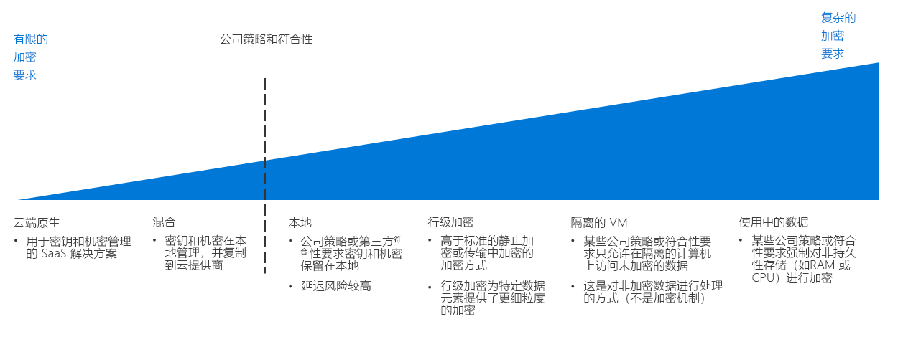

# 加密决策指南Encryption decision guide

对数据进行加密可保护数据免遭未经授权访问。Encrypting data protects it against unauthorized access. 正确实现的加密策略可以为基于云的工作负载提供更多重安全保障，并抵御组织和网络内外攻击者和其他未经授权用户的攻击。Properly implemented encryption policy provides additional layers of security for your cloud-based workloads and guards against attackers and other unauthorized users from both inside and outside your organization and networks.

虽然对资源进行加密通常是可取的，但加密确实会产生成本，进而可能会增加延迟和整体资源使用状况。While encrypting resources is generally desirable, encryption does have costs that can increase latency and overall resource usage. 对于要求严苛的工作负载，力求在加密和性能之间取得恰当的平衡至关重要。For demanding workloads, striking the correct balance between encryption and performance is essential.

跳转到：[密钥管理](#key-management) | [数据加密](#data-encryption) | [了解更多](#learn-more)Jump to: [Key management](#key-management) | [Data encryption](#data-encryption) | [Learn more](#learn-more)

确定云加密策略时，导致拐点出现的主要因素是企业策略和合规性要求。The inflection point when determining a cloud encryption strategy focuses on corporate policy and compliance mandates.

在云环境中实现加密的方法有多种，这些方法的成本和复杂性各异。There are multiple ways to implement encryption in a cloud environment, with varying cost and complexity. 计划加密策略时，要考虑的首要因素是企业策略和第三方合规性。Corporate policy and third-party compliance are the biggest drivers when planning an encryption strategy. 大多数基于云的解决方案都提供了数据加密标准机制，无论数据是静态的，还是在传输中。Most cloud-based solutions provide standard mechanisms for encrypting data, whether at rest or in transit. 不过，对于要求更严格控制的策略和合规性要求（如标准化机密和密钥管理、加密使用中的数据或数据专用加密），可能就需要实现复杂的解决方案。However, for policies and compliance requirements that demand tighter controls, such as standardized secrets and key management, encryption in-use, or data specific encryption, you will likely need to implement a complex solution.

## 密钥管理Key management

为了加强保护，新式密钥管理系统应支持使用硬件安全模块 (HSM) 存储密钥。Modern key management systems should offer support for storing keys using hardware security modules (HSMs) for increased protection. 因此，组织能否创建和存储加密密钥、重要密码、连接字符串和其他 IT 机密信息，关键在于密钥管理系统。Thus, a key management system is critical to your organization's ability to create and store cryptographic keys, important passwords, connection strings, and other IT confidential information.

计划云迁移时，请参阅下表，其中介绍了如何存储和管理加密密钥、证书和机密，这些对创建安全、可管理的云部署至关重要：When planning a cloud migration, the following table describes how you can store and manage encryption keys, certificates, and secrets, which are critical for creating secure and manageable cloud deployments:

| 问题Question | 云原生Cloud Native | 混合Hybrid | 本地On-premises |
|---------------------------------------------------------------------------------------------------------------------------------------|--------------|--------|-------------|
| 组织是否缺少集中式密钥和机密管理？Does your organization lack centralized key and secret management?                                                                    | 是Yes          | 否No     | 否No          |
| 在云中使用这些密钥时，是否需要限制为只有本地硬件才能创建设备密钥和机密？Will you need to limit the creation of keys and secrets to devices to your on-premises hardware, while using these keys in the cloud? | 否No           | 是Yes    | 否No          |
| 组织是否制定了可防止密钥和机密存储在界外的规则或策略？Does your organization have rules or policies in place that would prevent keys and secrets from being stored offsite?                | 否No           | 否No     | 是Yes         |

### 云原生Cloud native

通过云原生密钥管理，可以在基于云的保管库中生成、管理和存储所有密钥和机密。With cloud native key management, all keys and secrets are generated, managed, and stored in a cloud-based vault. 这种方法简化了许多与密钥管理相关的 IT 任务。This approach simplifies many IT tasks related to key management.

云原生密钥管理先决条件：需要先满足以下先决条件，再使用云原生密钥管理系统：Cloud native key management assumptions: Using a cloud native key management system assumes the following:

- 信任由云密钥管理解决方案来创建、管理和托管组织的机密和密钥。You trust the cloud key management solution with creating, managing, and hosting your organization's secrets and keys.
- 将所有依赖访问加密服务或机密的本地应用程序和服务启用为，访问云密钥管理系统。You enable all on-premises applications and services that rely on accessing encryption services or secrets to access the cloud key management system.

### 混合（创建自己的密钥）Hybrid (bring your own key)

使用“创建自己的密钥”这种方法，可以先在本地环境中的专用 HSM 硬件上生成密钥，再将密钥传输到安全的云密钥管理系统，以用于云资源。With a bring-your-own-key approach, you generate keys on dedicated HSM hardware within your on-premises environment, then transfer the keys to a secure cloud key management system for use with cloud resources.

混合密钥管理先决条件：需要先满足以下先决条件，再使用混合密钥管理系统：Hybrid key management assumptions: Using a hybrid key management system assumes the following:

- 信任由云平台的基础安全和访问控制基础结构来托管和使用密钥和机密。You trust the underlying security and access control infrastructure of the cloud platform for hosting and using your keys and secrets.
- 法规或组织策略要求，必须在本地创建和管理组织的机密和密钥。You are required by regulatory or organizational policy to keep the creation and management of your organization's secrets and keys on-premises.

### 本地（保留自己的密钥）On-premises (hold your own key)

在某些情况下，可能出于法规、策略或技术原因，无法将密钥存储在公有云服务提供的密钥管理系统上。In certain scenarios, there may be regulatory, policy, or technical reasons why you can't store keys on a key management system provided by a public cloud service. 在这种情况下，必须使用本地硬件保留密钥，并预配允许基于云的资源出于加密目的访问这些密钥的机制。In these cases, you must maintain keys using on-premises hardware, and provision a mechanism to allow cloud-based resource to access these keys for encryption purposes. 请注意，“保留自己的密钥”方法可能并不与所有云服务都兼容。Note that a hold your own key approach may not be compatible with all cloud services.

本地密钥管理先决条件：需要先满足以下先决条件，再使用本地密钥管理系统：On-premises key management assumptions: Using an on-premises key management system assumes the following:

- 法规或组织策略要求，必须在本地创建、管理和托管组织的机密和密钥。You are required by regulatory or organizational policy to keep the creation, management, and hosting of your organization's secrets and keys on-premises.
- 所有依赖访问加密服务或机密的基于云的应用程序或服务都可以访问本地密钥管理系统。Any cloud-based applications or services that rely on accessing encryption services or secrets can access the on-premises key management system.

## 数据加密Data encryption

计划加密策略时，需要考虑几种不同的数据状态以及各自不同的加密需求：There are several different states of data with different encryption needs to consider when planning your encryption policy:

| 数据状态Data state | 数据Data |
|-----|-----|
| 传输中的数据Data in transit | 内部网络流量、Internet 连接、数据中心或虚拟网络之间的连接Internal network traffic, internet connections, connections between datacenters or virtual networks |
| 静态数据Data at rest    | 数据库、文件、虚拟驱动器、PaaS 存储Databases, files, virtual drives, PaaS storage |
| 使用中的数据Data in use     | 在 RAM 或 CPU 高速缓存中加载的数据Data loaded in RAM or in CPU caches |

### 传输中的数据Data in transit

传输中的数据是在内部资源之间移动、在数据中心或外部网络之间移动，或通过 Internet 移动的数据。Data in transit is data moving between resources on the internal, between datacenters or external networks, or over the internet.

加密传输中的数据通常通过要求对流量使用 SSL/TLS 协议来完成。Encrypting data in transit is usually done by requiring SSL/TLS protocols for traffic. 应始终加密在云托管的资源到外部网络或公共 Internet 之间传输的流量。Traffic transiting between your cloud-hosted resources to external network or the public internet should always be encrypted. PaaS 资源通常也默认对流量强制使用 SSL/TLS 加密。PaaS resources generally also enforce SSL/TLS encryption to traffic by default. 是否对虚拟网络中托管的 IaaS 资源之间的流量强制执行加密，由云采用团队和工作负载所有者决定，通常建议执行加密。Whether you enforce encryption for traffic between IaaS resources hosted inside your virtual networks is a decision for your Cloud Adoption Team and workload owner and is generally recommended.

**加密传输中的数据先决条件**。**Encrypting data in transit assumptions**. 需要先满足以下先决条件，再为传输中的数据实现适当的加密策略：Implementing proper encryption policy for data in transit assumes the following:

- 云环境中所有可公开访问的终结点都将使用 SSL/TLS 协议与公共 Internet 进行通信。All publicly accessible endpoints in your cloud environment will communicate with the public internet using SSL/TLS protocols.
- 如果通过公共 Internet 将云网络与本地网络或其他外部网络连接，使用加密 VPN 协议。When connecting cloud networks with on-premises or other external network over the public internet, use encrypted VPN protocols.
- 如果使用专用 WAN 连接（如 ExpressRoute）将云网络与本地网络或其他外部网络连接，使用与相应虚拟 VPN 或部署到云网络的加密设备配对的 VPN 或其他本地加密设备。When connecting cloud networks with on-premises or other external network using a dedicated WAN connection such as ExpressRoute, you will use a VPN or other encryption appliance on-premises paired with a corresponding virtual VPN or encryption appliance deployed to your cloud network.
- 若有不得添加到对 IT 人员可见的流量日志或其他诊断报告中的敏感数据，加密虚拟网络中资源之间的所有流量。If you have sensitive data that shouldn't be included in traffic logs or other diagnostics reports visible to IT staff, you will encrypt all traffic between resources in your virtual network.

### 静态数据Data at rest

静态数据表示任何未被主动移动或处理的数据，包括文件、数据库、虚拟机驱动器、PaaS 存储帐户或类似资产。Data at rest represents any data not being actively moved or processed, including files, databases, virtual machine drives, PaaS storage accounts, or similar assets. 加密已存储的数据可保护虚拟设备或文件免遭外部网络渗透、内部未授权用户或意外泄露造成的未经授权访问。Encrypting stored data protects virtual devices or files against unauthorized access either from external network penetration, rogue internal users, or accidental releases.

默认情况下，通常强制加密 PaaS 存储和数据库资源。PaaS storage and database resources generally enforce encryption by default. 可使用密钥管理系统中存储的加密密钥，通过虚拟磁盘加密来保护 IaaS 虚拟资源。IaaS virtual resources can be secured through virtual disk encryption using cryptographic keys stored in your key management system.

静态数据加密还涉及更多高级数据库加密技术（如列级别加密和行级别加密），可便于更好地控制要保护的确切数据。Encryption for data at rest also encompasses more advanced database encryption techniques, such as column-level and row level encryption, which provides much more control over exactly what data is being secured.

应根据总体策略和合规性要求、存储数据的敏感性以及工作负载性能要求，确定哪些资产需要加密。Your overall policy and compliance requirements, the sensitivity of the data being stored, and the performance requirements of your workloads should determine which assets require encryption.

**加密静态数据先决条件**。**Encrypting Data at Rest Assumptions**. 需要先满足以下先决条件，再加密静态数据：Encrypting data at rest assumes the following:

- 要存储的数据不适合公共使用。You are storing data that is not meant for public consumption.
- 工作负载可以接受磁盘加密造成的额外延迟成本。Your workloads can accept the added latency cost of disk encryption.

### 使用中的数据Data in use

加密使用中的数据涉及保护非永久性存储（如 RAM 或 CPU 高速缓存）中的数据。Encryption for data in use involves securing data in nonpersistent storage, such as RAM or CPU caches. 使用全内存加密等技术，以及 Intel 的 Secure Guard Extensions (SGX) 等 Enclave 技术。Use of technologies such as full memory encryption, enclave technologies, such as Intel's Secure Guard Extensions (SGX). 这还包括可用于创建安全、受信任的执行环境的同态加密等加密技术。This also includes cryptographic techniques, such as homomorphic encryption that can be used to create secure, trusted execution environments.

**加密使用中的数据先决条件**。**Encrypting data in use assumptions**. 需要先满足以下先决条件，再加密使用中的数据：Encrypting data in use assumes the following:

- 要求必须始终将数据所有权与基础云平台分离开来，即使在 RAM 和 CPU 级别，也不例外。You are required to maintain data ownership separate from the underlying cloud platform at all times, even at the RAM and CPU level.

## 了解详细信息Learn more

若要详细了解 Azure 平台中的加密和密钥管理，请参阅以下资源。See the following for more information about encryption and key management in the Azure platform.

- [Azure 加密概述](/azure/security/security-azure-encryption-overview)。[Azure encryption overview](/azure/security/security-azure-encryption-overview). 详细介绍了 Azure 如何使用加密来保护静态数据和传输中的数据。A detailed description of how Azure uses encryption to secure both data at rest and data in transit.
- [Azure Key Vault](/azure/key-vault/key-vault-overview)。[Azure Key Vault](/azure/key-vault/key-vault-overview). Key Vault 是用于在 Azure 中存储和管理加密密钥、机密和证书的主要密钥管理系统。Key Vault is the primary key management system for storing and managing cryptographic keys, secrets, and certificates within Azure.
- [Azure 中的机密计算](/solutions/confidential-compute)。[Confidential computing in Azure](/solutions/confidential-compute). Azure 的机密计算计划提供了工具和技术，可用于创建受信任的执行环境或其他加密机制来保护使用中的数据。Azure's confidential computing initiative provides tools and technology to create trusted execution environments or other encryption mechanisms to secure data in use.

## 后续步骤Next steps

了解软件定义网络如何为云部署提供虚拟化网络功能。Learn how Software Defined Networks provide virtualized networking capabilities for cloud deployments.

> [!div class="nextstepaction"]
> [哪种软件定义网络模式最适合我的部署？Which Software Defined Network pattern is best for my deployment?](../software-defined-network/overview.md)
