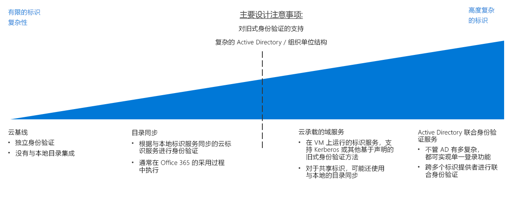

# 标识决策指南Identity decision guide

在任何环境中，无论是本地环境、混合环境，还是纯云环境，IT 都需要控制哪些管理员、用户和组可以访问资源。In any environment, whether on-premises, hybrid, or cloud-only, IT needs to control which administrators, users, and groups have access to resources. 标识和访问管理 (IAM) 服务使你能够管理云中的访问控制。Identity and access management (IAM) services enable you to manage access control in the cloud.

跳转到：[确定标识集成要求](#determine-identity-integration-requirements) | [云原生](#cloud-baseline) | [目录同步](#directory-synchronization) | [云托管的域服务](#cloud-hosted-domain-services) | [Active Directory 联合身份验证服务](#active-directory-federation-services) | [不断演变的标识集成](#evolving-identity-integration) | [了解更多信息](#learn-more)Jump to: [Determine Identity Integration Requirements](#determine-identity-integration-requirements) | [Cloud native](#cloud-baseline) | [Directory Synchronization](#directory-synchronization) | [Cloud hosted domain services](#cloud-hosted-domain-services) | [Active Directory Federation Services](#active-directory-federation-services) | [Evolving identity integration](#evolving-identity-integration) | [Learn more](#learn-more)

在云环境中有几种管理标识的方法，它们的成本和复杂性各不相同。There are several ways to manage identity in a cloud environment, which vary in cost and complexity. 构建基于云的标识服务的一个关键因素是现有本地标识基础结构所需的集成级别。A key factor in structuring your cloud-based identity services is the level of integration required with your existing on-premises identity infrastructure.

基于云的软件即服务 (SaaS) 标识解决方案为云资源提供基本级别的访问控制和标识管理。Cloud-based software as a service (SaaS) identity solutions provide a base level of access control and identity management for cloud resources. 然而，如果组织的 Active Directory (AD) 基础结构具有复杂的林结构或自定义组织单元 (OU)，则基于云的工作负载可能需要将目录复制到云中，以在本地环境和云环境之间获得一组一致的标识、组和角色。However, if your organization's Active Directory (AD) infrastructure has a complex forest structure or customized organizational units (OUs), your cloud-based workloads may require directory replication to the cloud for a consistent set of identities, groups, and roles between your on-premises and cloud environments. 如果全局解决方案需要目录复制，则复杂性会显著增加。If directory replication is required for a global solution, complexity can increase significantly. 此外，对依赖于传统身份验证机制的应用程序的支持可能需要在云中部署域服务。Additionally, support for applications dependent on legacy authentication mechanisms may require the deployment of domain services in the cloud.

## 确定标识集成要求Determine identity integration requirements

| 问题Question | 云基线Cloud baseline | 目录同步Directory synchronization | 云托管的域服务Cloud-hosted Domain Services | AD 联合身份验证服务AD Federation Services |
|------|------|------|------|------|
| 你当前是否缺少本地目录服务？Do you currently lack an on-premises directory service? | 是Yes | 否No | 否No | 否No |
| 你的工作负载是否需要针对本地标识服务进行身份验证？Do your workloads need to authenticate against on-premises identity services? | 否No | 是Yes | 否No | 否No |
| 你的工作负载是否依赖于传统身份验证机制，例如 Kerberos 或 NTLM？Do your workloads depend on legacy authentication mechanisms, such as Kerberos or NTLM? | 否No | 否No | 是Yes | 否No |
| 云和本地标识服务之间的集成是否不可能？Is integration between cloud and on-premises identity services impossible? | 否No | 否No | 是Yes | 否No |
| 你是否需要跨多个标识提供者进行单一登录？Do you require single sign-on across multiple identity providers? | 否No | 否No | 否No | 是Yes |

在迁移到 Azure 的计划中，你需要确定如何以最佳方式集成现有标识管理和云标识服务。As part of planning your migration to Azure, you will need to determine how best to integrate your existing identity management and cloud identity services. 以下是常见集成方案。The following are common integration scenarios.

### 云基线Cloud baseline

公有云平台提供了本机 IAM 系统，用于授予用户和组对管理功能的访问权限。Public cloud platforms provide a native IAM system for granting users and groups access to management features. 如果组织缺少重要的本地标识解决方案，并且你计划迁移工作负载，以与基于云的身份验证机制兼容，则应使用云原生标识服务构建标识基础结构。If your organization lacks a significant on-premises identity solution, and you plan on migrating workloads to be compatible with cloud-based authentication mechanisms, you should build your identity infrastructure using a cloud-native identity service.

**云基线假设**。**Cloud baseline assumptions**. 使用纯云原生标识基础结构时假设如下条件：Using a purely cloud-native identity infrastructure assumes the following:

- 基于云的资源将不会依赖于本地目录服务或 Active Directory 服务器，或者可以修改工作负载来删除这些依赖项。Your cloud-based resources will not have dependencies on on-premises directory services or Active Directory servers, or workloads can be modified to remove those dependencies your.
- 迁移的应用程序或服务工作负载要么支持与云标识提供者兼容的身份验证机制，要么可以轻松进行修改以支持它们。The application or service workloads being migrated either support authentication mechanisms compatible with cloud identity providers or can be modified easily to support them. 云原生标识提供者依赖于 Internet 就绪的身份验证机制，如 SAML、OAuth 和 OpenID Connect。Cloud native identity providers rely on internet-ready authentication mechanisms such as SAML, OAuth, and OpenID Connect. 使用 Kerberos 或 NTLM 等协议依赖于传统身份验证方法的现有工作负载在迁移到云之前可能需要进行重构。Existing workloads that depend on legacy authentication methods using protocols such as Kerberos or NTLM may need to be refactored before migrating to the cloud.

> [!TIP]
> 大多数云原生标识服务并不能完全替代传统本地目录。Most cloud-native identity services are not full replacements for traditional on-premises directories. 如果不使用其他工具或服务，目录功能（如计算机管理或组策略）可能不可用。Directory features such as computer management or group policy may not be available without using additional tools or services.

将标识服务完全迁移到基于云的提供程序，就不需要维护你自己的标识基础结构，从而大大简化了 IT 管理。Completely migrating your identity services to a cloud-based provider eliminates the need to maintain your own identity infrastructure, significantly simplifying your IT management.

### 目录同步Directory synchronization

对于具有现有标识基础结构的组织，目录同步通常是保存现有用户和访问权限管理的最佳解决方案，同时提供管理云资源所需的 IAM 功能。For organizations with an existing identity infrastructure, directory synchronization is often the best solution for preserving existing user and access management while providing the required IAM capabilities for managing cloud resources. 这个过程不断在云环境和本地环境之间复制目录信息，允许用户使用单一登录 (SSO)，并在整个组织中使用一致的标识、角色和权限系统。This process continuously replicates directory information between the cloud and on-premises environments, allowing single sign-on (SSO) for users and a consistent identity, role, and permission system across your entire organization.

注意：采用 Office 365 的组织可能已经在其本地 Active Directory 基础结构和 Azure Active Directory 之间实现[目录同步](/office365/enterprise/set-up-directory-synchronization)。Note: Organizations that have adopted Office 365 may have already implemented [directory synchronization](/office365/enterprise/set-up-directory-synchronization) between their on-premises Active Directory infrastructure and Azure Active Directory.

目录同步假设。**Directory synchronization assumptions**. 使用同步标识解决方案时假设如下条件：Using a synchronized identity solution assumes the following:

- 你需要跨云和本地 IT 基础结构维护一组通用的用户帐户和组。You need to maintain a common set of user accounts and groups across your cloud and on-premises IT infrastructure.
- 本地标识服务支持使用云标识提供者进行复制。Your on-premises identity services support replication with your cloud identity provider.
- 你需要为访问云和本地标识提供者的用户提供 SSO 机制。You require SSO mechanisms for users accessing cloud and on-premises identity providers.

> [!TIP]
> 任何依赖于传统身份验证机制的基于云的工作负载，不受 Azure AD 等基于云的标识服务支持，仍然需要连接到本地域服务，或提供这些服务的云环境中的虚拟服务器。Any cloud-based workloads that depend on legacy authentication mechanisms that are not supported by cloud-based identity services like Azure AD will still require either connectivity to on-premises domain services or virtual servers in the cloud environment providing these services. 此外，使用本地标识服务还会引入对云和本地网络之间连接性的依赖项。Using on-premises identity services also introduces dependencies on connectivity between the cloud and on-premises networks.

### 云托管的域服务Cloud-hosted domain services

如果你有依赖于使用传统协议（如 Kerberos 或 NTLM）的基于声明进行身份验证的工作负载，并且这些工作负载无法重构以接受 SAML 或 OAuth 和 OpenID Connect 等新式身份验证协议，则可能需要将某些域服务作为云部署的一部分迁移到云。If you have workloads that depend on claims-based authentication using legacy protocols such as Kerberos or NTLM, and those workloads cannot be refactored to accept modern authentication protocols such as SAML or OAuth and OpenID Connect, you may need to migrate some of your domain services to the cloud as part of your cloud deployment.

这种类型的部署包括在基于云的虚拟网络中部署运行 Active Directory 的虚拟机，以便为云中的资源提供域服务。This type of deployment involves deploying virtual machines running Active Directory in your cloud-based virtual networks to provide domain services for resources in the cloud. 迁移到云网络的任何现有应用程序和服务都应该能够使用这些云托管的目录服务器，只需稍加修改即可。Any existing applications and services migrating to your cloud network should be able to use of these cloud-hosted directory servers with minor modifications.

你的现有目录和域服务很可能将继续在本地环境中使用。It's likely that your existing directories and domain services will continue to be used in your on-premises environment. 在此场景中，建议同时使用目录同步来在云环境和本地环境中提供一组通用的用户和角色。In this scenario, it's recommended that you also use directory synchronization to provide a common set of users and roles in both the cloud and on-premises environments.

云托管域服务假设。**Cloud hosted domain services assumptions**. 执行目录迁移时假设如下条件：Performing a directory migration assumes the following:

- 你的工作负载依赖于使用 Kerberos 或 NTLM 等协议的基于的身份验证。Your workloads depend on claims-based authentication using protocols like Kerberos or NTLM.
- 为管理或应用 Active Directory 组策略，工作负载虚拟机需要加入域。Your workload virtual machines need to be domain-joined for management or application of Active Directory group policy purposes.

> [!TIP]
> 虽然目录迁移结合云托管的域服务在迁移现有工作负载时提供了极大的灵活性，但在云虚拟网络中托管虚拟机来提供这些服务确实增加了 IT 管理任务的复杂性。While a directory migration coupled with cloud-hosted domain services provides great flexibility when migrating existing workloads, hosting virtual machines within your cloud virtual network to provide these services does increase the complexity of your IT management tasks. 随着云迁移体验日趋成熟，请检查托管这些服务器的长期维护需求。As your cloud migration experience matures, examine the long-term maintenance requirements of hosting these servers. 考虑重构现有工作负载，以与 Azure Active Directory 等云标识提供者兼容是否可以减少对这些云托管服务器的需求。Consider whether refactoring existing workloads for compatibility with cloud identity providers such as Azure Active Directory can reduce the need for these cloud-hosted servers.

### Active Directory 联合身份验证服务Active Directory Federation Services

联合身份验证将在多个标识管理系统之间建立信任关系，可以支持常见身份验证和授权功能。Identity federation establishes trust relationships across multiple identity management systems to allow common authentication and authorization capabilities. 然后，你可以支持跨组织内或由客户或业务合作伙伴管理的标识系统中多个域的单一登录功能。You can then support single sign-on capabilities across multiple domains within your organization or identity systems managed by your customers or business partners.

Azure AD 使用 [Active Directory 联合身份验证服务](/azure/active-directory/hybrid/how-to-connect-fed-whatis) (AD FS) 支持本地 Active Directory 域的联合身份验证。Azure AD supports federation of on-premises Active Directory domains using [Active Directory Federation Services](/azure/active-directory/hybrid/how-to-connect-fed-whatis) (AD FS). 请参阅参考架构[将 AD FS 扩展到 Azure](../../../reference-architectures/identity/adfs.md)，了解如何在 Azure 中实现此功能。See the reference architecture [Extend AD FS to Azure](../../../reference-architectures/identity/adfs.md) to see how this can be implemented in Azure.

## 不断演变的标识集成Evolving identity integration

标识集成是一个迭代过程。Identity integration is an iterative process. 你可能需要从一个云原生解决方案开始，该解决方案具有少量用户和初始部署的相应角色。You may want to start with a cloud native solution with a small set of users and corresponding roles for an initial deployment. 随着迁移日趋成熟，可以考虑采用联合模型，或者将本地标识服务的完整目录迁移到云中。As your migration matures, consider adopting a federated model or performing a full directory migration of your on-premises identity services to the cloud. 在迁移过程的每个迭代中重新访问标识策略。Revisit your identity strategy in every iteration of your migration process.

## 了解详细信息Learn more

有关 Azure 平台上标识服务的更多信息，请参见下面的内容。See the following for more information about identity services on the Azure platform.

- [Azure AD](https://azure.microsoft.com/services/active-directory)。[Azure AD](https://azure.microsoft.com/services/active-directory). Azure AD 提供基于云的标识服务。Azure AD provides cloud-based identity services. 它允许你管理对 Azure 资源的访问权限，并控制标识管理、设备注册、用户预配、应用程序访问控制和数据保护。It allows you to manage access to your Azure resources and control identity management, device registration, user provisioning, application access control, and data protection.
- [Azure AD Connect](/azure/active-directory/hybrid/whatis-hybrid-identity)。[Azure AD Connect](/azure/active-directory/hybrid/whatis-hybrid-identity). Azure AD Connect 工具可将 Azure AD 实例与现有标识管理解决方案连接起来，从而允许对云中的现有目录进行同步。The Azure AD Connect tool allows you to connect Azure AD instances with your existing identity management solutions, allowing synchronization of your existing directory in the cloud.
- [基于角色的访问控制](/azure/role-based-access-control/overview) (RBAC)。[Role-based access control](/azure/role-based-access-control/overview) (RBAC). Azure AD 提供了 RBAC，可有效且安全地管理对管理平面中的资源访问。Azure AD provides RBAC to efficiently and securely manage access to resources in the management plane. 作业和职责按角色进行组织，用户被赋予这些角色。Jobs and responsibilities are organized into roles, and users are assigned to these roles. RBAC 可控制谁有权访问资源，以及用户可以对该资源执行哪些操作。RBAC allows you to control who has access to a resource along with which actions a user can perform on that resource.
- [Azure AD Privileged Identity Management](/azure/active-directory/privileged-identity-management/pim-configure) (PIM)。[Azure AD Privileged Identity Management](/azure/active-directory/privileged-identity-management/pim-configure) (PIM). PIM 降低了资源访问特权的公开时间，并通过报告和警报增加了对其使用的可见性。PIM lowers the exposure time of resource access privileges and increases your visibility into their use through reports and alerts. 它限制用户采用其“实时”(JIT) 权限，或通过分配持续时间较短的权限（之后权限会自动撤销）来实现这一目的。It limits users to taking on their privileges "just in time" (JIT), or by assigning privileges for a shorter duration, after which privileges are revoked automatically.
- [将本地 Active Directory 域与 Azure Active Directory 集成](../../../reference-architectures/identity/azure-ad.md)。[Integrate on-premises Active Directory domains with Azure Active Directory](../../../reference-architectures/identity/azure-ad.md). 此参考体系结构提供了本地 Active Directory 域和 Azure AD 之间目录同步的示例。This reference architecture provides an example of directory synchronization between on-premises Active Directory domains and Azure AD.
- [将 Active Directory 域服务 (AD DS) 扩展到 Azure。Extend Active Directory Domain Services (AD DS) to Azure.](../../../reference-architectures/identity/adds-extend-domain.md) 此参考体系结构提供了部署 AD DS 服务器以将域服务扩展到基于云的资源的示例。This reference architecture provides an example of deploying AD DS servers to extend domain services to cloud-based resources.
- [将 Active Directory 联合身份验证服务 (AD FS) 扩展到 Azure](../../../reference-architectures/identity/adfs.md)。[Extend Active Directory Federation Services (AD FS) to Azure](../../../reference-architectures/identity/adfs.md). 此参考体系结构配置了 Active Directory 联合身份验证服务 (AD FS)，以使用 Azure AD 目录执行联合身份验证和授权。This reference architecture configures Active Directory Federation Services (AD FS) to perform federated authentication and authorization with your Azure AD directory.

## 后续步骤Next steps

了解如何在云中强制执行策略。Learn how to implement policy enforcement in the cloud.

> [!div class="nextstepaction"]
> [策略强制执行Policy enforcement](../policy-enforcement/overview.md)
