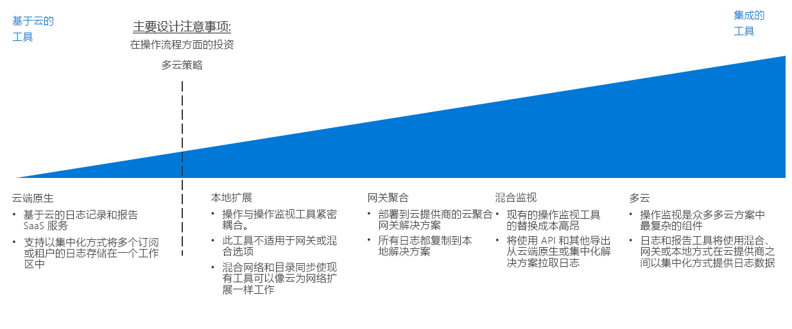

# 日志记录和报告决策指南

所有组织都需要一些机制，以便在性能、运行时间和安全问题成为严重问题之前通知 IT 团队。 通过成功的监视策略可以了解组成工作负荷和网络基础结构的各个组件的执行情况。 在公有云迁移环境中，对于确保组织符合运行时间、安全性和策略符合性目标，将日志记录和报告与任何现有监视系统集成，同时向相应的 IT 人员呈现重要事件和指标十分关键。

跳转到：[规划监视基础结构](#planning-your-monitoring-infrastructure) | [云原生](#cloud-native) | [本地扩展](#on-premises-extension) | [网关聚合](#gateway-aggregation)  | [混合监视（本地）](#hybrid-monitoring-on-premises) | [混合监视（基于云）](#hybrid-monitoring-cloud-based) | [多云](#multi-cloud) | [了解详细信息](#learn-more)

确定云标识策略时的转折点主要基于组织在运营流程中进行的现有投资，并且在某种程度上基于为支持多云策略而产生的任何要求。

有多种方式可用于对云中的活动进行日志记录和报告。 云原生和集中日志记录是两个常见的软件即服务 (SaaS) 选项，由订阅设计和订阅数进行驱动。

## 规划监视基础结构

规划部署时，需要考虑存储日志记录数据的位置以及如何将基于云的报告和监视服务与现有流程和工具集成。

| 问题 | 云原生 | 本地扩展 | 混合监视 | 网关聚合 |
|-----|-----|-----|-----|-----|
| 是否具有现有的本地监视基础结构？ | 否 | 是 | 是 |  否 |
| 是否具有阻止在外部存储位置存储日志数据的要求？ | 否 | 是 | 否 | 否 |
| 是否需要将云监视与本地系统集成？ | 否 | 否 | 是 | 否 |
是否需要在将遥测数据提交到监视系统之前进行处理或筛选？ | 否 | 否 | 否 | 是 |

### 云原生

如果组织当前缺少已建立的日志记录和报告系统，或者如果计划的云部署不需要与现有本地或其他外部监视系统集成，则云原生 SaaS 解决方案是最简单的选择。

在此方案中，日志数据会记录并存储在与工作负荷相同的云环境中，同时作为云平台的一部分来提供用于处理信息并呈现给 IT 人员的日志记录和报告工具。

云原生日志记录解决方案可以专门针对每个订阅或工作负荷来实现，以实现较小部署或实验部署，并采用集中方式进行组织以监视整个云资产中的日志数据。

**云原生假设**。 使用云原生日志记录和报告系统假设以下情况：

- 无需将日志数据从云工作负荷集成到现有本地系统中。
- 不会使用基于云的报告系统监视本地系统。

### 本地扩展

在需要将云遥测数据与不支持混合日志记录和报告，或是支持通过最少量的重新开发迁移应用程序和服务的本地系统集成的方案中，需要将监视代理部署到 VM，这些代理会将日志数据直接发送到本地系统，而不是将其存储在云环境中。

若要支持这种方法，云资源需要能够通过[混合网络](../software-defined-network/hybrid.md)和[云托管的域服务](../identity/overview.md#cloud-hosted-domain-services)的组合，直接与本地系统进行通信。 实施此方法时，云虚拟网络充当本地环境的网络扩展。 因此，云托管的工作负荷可以直接与本地日志记录和报告系统进行通信。

此方法利用对监视工具的现有投资，只需对任何云部署的应用程序或服务进行有限修改。 这通常是在直接迁移过程支持监视的最快方法。 但是，它不会捕获由基于云的 PaaS 和 SaaS 资源生成的日志数据，并且会忽略由云平台自身生成的任何与 VM 相关的日志（如 VM 状态）。 因此，此模式应是临时解决方案，直到实现更全面的混合监视解决方案。

仅本地假设：

- 在支持技术要求时或是由于法规或策略要求，只需在本地环境中维护日志数据。
- 本地系统不支持混合日志记录和报告或网关聚合解决方案。
- 基于云的应用程序可以将遥测数据直接提交到本地日志记录系统，或是可以向工作负荷 VM 部署向本地提交的监视代理。
- 工作负荷不依赖于需要基于云的日志记录和报告的 PaaS 或 SaaS 服务。

### 网关聚合

对于基于云的遥测数据量非常大或现有本地监视系统需要先修改日志数据才能进行处理的方案，可能需要日志数据[网关聚合](../../../patterns/gateway-aggregation.md)服务。

网关服务会部署到云提供程序。 随后配置相关应用程序和服务以将遥测数据提交到网关而不是默认日志记录系统。 网关随后便可以处理数据：聚合、合并或以其他方式设置其格式，然后再将其提交到监视服务以便进行引入和分析。

此外，网关可以用于聚合和预处理为云原生或混合系统绑定的遥测数据。

网关聚合假设：

- 预计会有非常高水平的遥测数据来自基于云的应用程序或服务。
- 需要在将遥测数据提交到监视系统之前对其设置格式或以其他方式进行优化。
- 监视系统具有可用于在网关进行处理之后引入日志数据的 API 或其他机制。

### 混合监视（本地）

混合监视解决方案来自本地和云资源的日常数据合并，以提供 IT 资产运营状态的集成视图。

如果对替换难度或成本较高的本地监视系统进行了现有投资，则可能需要来自云工作负荷的遥测数据集成到预先存在的本地监视解决方案中。 在混合本地监视系统中，本地遥测数据会继续使用现有本地监视系统。 基于云的遥测数据会直接发送到云监视系统，或者数据会与工作负荷一起存储在云中，随后按固定间隔汇总并引入到本地系统中。

**本地混合监视假设**。 使用本地日志记录和报告系统进行混合监视假设存在以下情况：

- 需要使用现有本地报告系统监视云工作负荷。
- 需要在本地维护日志数据的所有权。
- 本地管理系统具有可用于从基于云的系统引入日志数据的 API 或其他机制。

> [!TIP]
> 作为云迁移的迭代性质的一部分，可能会从不同的云原生和本地监视转换到部分混合方法。 请确保使监视体系结构方面的更改与整体 IT 和运营流程保持一致。

### 混合监视（基于云）

如果不是迫切需要维护本地监视系统，或者要将本地监视系统替换为 SaaS 解决方案，则还可以选择将本地日志数据与基于云的集中监视系统集成。

与以本地为中心的方法相反，在此方案中，云工作负荷会使用其默认云日志记录机制，而本地应用程序和服务会将遥测数据直接发送到基于云的日志记录系统，或按固定间隔聚合这些数据以便引入到云系统中。 基于云的监视系统随后会充当整个 IT 资产的主要监视和报告系统。

基于云的混合监视假设：使用基于云的日志记录和报告系统进行混合监视假设存在以下情况：

- 不依赖于现有本地监视系统。
- 工作负荷没有在本地存储日志数据的法规或策略要求。
- 基于云的监视系统具有可用于从本地应用程序和服务引入日志数据的 API 或其他机制。

### 多云

跨多个云平台集成日志记录和报告功能可能十分复杂。 在平台之间提供的服务通常无法直接比较，这些服务提供的日志记录和遥测功能也有所不同。
多云日志记录支持通常需要先使用网关服务将日志数据处理为通用格式，然后再将数据提交到混合日志记录解决方案。

## 了解详细信息

[Azure Monitor](/azure/azure-monitor/overview) 是 Azure 中的默认报告和监视服务。 它提供：

- 用于收集应用遥测数据、主机遥测数据（如 VM）、容器指标、Azure 平台指标和事件日志的统一平台。
- 可视化效果、查询、警报和分析工具。 通过它可以了解虚拟机、来宾操作系统、虚拟网络和工作负荷应用程序事件。
- 用于与外部服务集成以及自动执行监视和警报服务的 [REST API](/azure/monitoring-and-diagnostics/monitoring-rest-api-walkthrough)
- 与许多常见第三方供应商的[集成](/azure/monitoring-and-diagnostics/monitoring-partners)。
