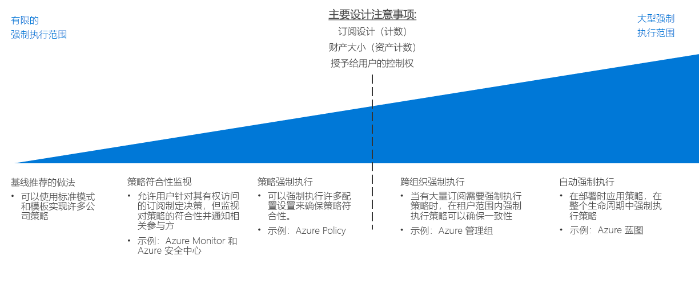

# 策略强制实施决策指南

除非可以在整个组织中强制实施策略，否则定义组织策略无效。 规划任何云迁移的一个重要方面是，确定如何以最佳方式将云平台提供的工具与现有 IT 流程结合起来，以在整个云资产中最大限度地实现策略符合性。

跳转到：[基线建议的做法](#baseline-recommended-practices) | [策略符合性监视](#policy-compliance-monitoring) | [策略强制实施](#policy-enforcement) | [跨组织策略](#cross-organization-policy) | [自动强制实施](#automated-enforcement)

随着云资产的增长，你将面临在更大的资源、订阅和租户数组中维护和实施策略的相应需求。 资产越大，强制实施机制就要越复杂，以确保一致的遵从性和快速违规检测。 在资源或订阅级别上由平台提供的策略强制实施机制通常足以满足较小的云部署，而较大的部署可能需要利用更复杂的机制，包括部署标准、资源分组和组织，以及将策略实施与日志记录和报告系统集成。

在选择策略强制实施策略的复杂性时，关键拐点主要集中在[订阅设计](../subscriptions/overview.md)所需的订阅或租户的数量上。 向云资产中各种用户角色授予的控制数量也可能会影响这些决策。

## 基线建议的做法

对于单个订阅和简单的云部署，可以使用大多数云平台原生的功能来实施许多公司策略。 即使在这种相对较低的部署复杂性级别上，在 CAF [决策指南](../overview.md)中讨论的模式的一致使用也可以帮助建立策略符合性的基线级别。

例如：

- [部署模板](../resource-consistency/overview.md)可以预配具有标准化结构和配置的资源。
- [标记和命名标准](../resource-tagging/overview.md)可有助于组织操作，并支持核算和业务需求。
- 流量管理和网络限制可以通过[软件定义的网络](../software-defined-network/overview.md)来实现。
- [基于角色的访问控制](../identity/overview.md)可保护和隔离云资源。

通过查看在这些指南中讨论的标准模式的应用程序如何帮助满足组织需求，来开始进行云策略强制实施规划。

## 策略符合性监视

另一个关键因素（即使对于相对较小的云部署）是验证基于云的应用程序和服务是否符合组织策略的能力，在资源不符合要求时及时通知责任方。 有效地[记录和报告](../log-and-report/overview.md)云工作负载的符合性状态是公司策略强制实施战略的关键部分。

随着云资产的增长，[Azure 安全中心](/azure/security-center/)等其他工具可提供集成的安全性和威胁检测，并帮助对本地资产和云资产应用集中式策略管理和警报。

## 策略强制执行

还可以在订阅级别应用配置设置和资源创建规则，以帮助确保策略一致性。

[Azure Policy](/azure/governance/policy/overview) 是用于创建、分配和管理策略的 Azure 服务。 这些策略将在整个资源中强制实施不同的规则和效果，以便这些资源符合公司标准和服务级别协议。 Azure Policy 评估资源是否符合指定策略。 例如，你可能希望限制环境中虚拟机的 SKU 大小。 实施相应策略后，将评估新资源和现有资源的符合性。 通过使用正确的策略，可以确保现有资源的符合性。

## 跨组织策略

随着云资产增长到跨越许多需强制实施的订阅，你将需要专注于租户范围内的强制实施策略，以确保策略一致性。

[订阅设计](../subscriptions/overview.md)需要考虑策略，因为策略与组织结构相关。 除了帮助支持订阅设计中的复杂组织之外，[Azure 管理组](../subscriptions/overview.md#management-groups)还可以用于跨多个订阅分配 Azure Policy 规则。

## 自动强制实施

虽然标准化的部署模板在较小范围内是有效的，但借助 [Azure 蓝图](/azure/governance/blueprints/overview)，Azure 解决方案可进行大规模标准化预配和部署业务流程。 可使用创建的任何资源的一致策略设置部署跨多个订阅的工作负载。

对于集成云和本地资源的 IT 环境，可能需要使用日志记录和报告系统来提供混合监视功能。 第三方或自定义操作监视系统可以提供额外的策略强制实施功能。 对于复杂的云资产，考虑如何以最佳方式将这些系统与云资产集成。

## 后续步骤

了解如何使用资源一致性来组织和标准化云部署，以支持订阅设计和治理目标。

> [!div class="nextstepaction"]
> [资源一致性](../resource-consistency/overview.md)
