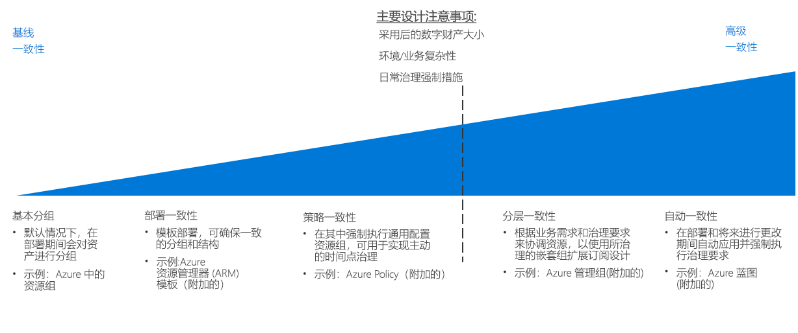

# CAF：资源一致性决策指南

Azure[订阅设计](../subscriptions/overview.md)定义如何组织云资产与你的组织结构、 记帐实践和工作负荷要求。 除了此级别的结构，跨云资产满足你组织的监管策略要求需要一致地组织、 部署和管理对订阅中的资源的能力。

跳转到：[基本分组](#basic-grouping) | [部署一致性](#deployment-consistency) | [策略一致性](#policy-consistency) | [层次结构一致性](#hierarchical-consistency)  | [自动一致性](#automated-consistency)

有关云资源的资源的一致性要求的级别的决策主要由以下因素驱动： 迁移后数字空间大小、 业务或不适合归入现有订阅中的环境要求设计方法或需要实施段时间后已部署的资源调控。 

随着这些因素也在不断提升，确保一致的部署、 分组和管理基于云的资源的优点变得更重要的。 实现更多高级级别的资源以满足不断增长的要求的一致性需要更多自动化、 工具和一致性强制中所用的工作，这会导致更多的时间所用的更改管理和跟踪。

## 基本分组

在 Azure 中，[资源组](/azure/azure-resource-manager/resource-group-overview#resource-groups)是一种核心资源组织机制，用于在订阅中对资源进行逻辑分组。

资源组充当具有共同生命周期或共享管理约束（如策略或基于角色的访问控制 (RBAC) 要求）的资源的容器。 资源组无法进行嵌套，资源只能属于一个资源组。 某些操作可对资源组中的所有资源执行操作。 例如，删除某个资源组会删除该组中的所有资源。 创建资源组时有常见的模式，通常分为两类：

- “传统 IT”工作负载：通常按相同生命周期中的项（如某个应用程序）分组。 由于可按应用程序分组，因此可以管理每个应用程序。
- “敏捷 IT”工作负载：侧重于面向外部客户的云应用程序。 资源组通常反映部署的功能层（如 Web 层、应用层）和管理层。

## 部署一致性

构建基于基础资源分组机制，Azure 平台提供的系统使用模板将资源部署到云环境。 在部署工作负载时，可以使用模板创建一致的组织和命名约定，强制执行资源部署和管理设计的这些方面。

借助 [Azure 资源管理器模板](/azure/azure-resource-manager/resource-group-overview#template-deployment)，可以使用预定的配置和资源组结构以一致的状态重复部署资源。 资源管理器模板可帮助用户定义一组标准作为部署的基础。

例如，您可以用于部署为 web 服务器与分发服务器之间的流量的负载均衡器结合使用包含两个虚拟机的 web 服务器工作负荷的标准模板。 然后可以重复使用此模板以创建组结构上相同的虚拟机和负载均衡器，需要此类型的工作负荷时，部署名称和 IP 地址的唯一更改涉及。

请注意，还能够以编程方式部署这些模板并将它们与 CI/CD 系统集成。

## 策略一致性

为确保在创建资源时应用治理策略，资源分组设计的一部分涉及在部署资源时使用通用配置。

通过组合资源组和标准化资源管理器模板，你可以强制执行部署中所需设置的标准，以及对每个资源组或资源应用的 [Azure Policy](/azure/governance/policy/overview) 规则的标准。

例如，用户可能要求订阅中部署的所有虚拟机都连接到由核心 IT 团队管理的公共子网。 你可以创建一个用于部署工作负载 VM 的标准模板，这将为工作负载创建单独的资源组，并在其中部署所需的 VM。 此资源组将具有仅允许资源组中的网络接口加入共享子网的策略规则。

有关在云部署中强制执行策略决策的更深入讨论，请参阅[策略实施](../policy-enforcement/overview.md)。

## 层次结构一致性

资源组，可支持更高级别的应用 Azure 策略规则在订阅中，在组织中的层次结构和访问资源组级别的控制。 但是，随着云资产的大小的增长，你可能需要支持可以使用 Azure 企业协议的企业/部门/帐户/订阅层次结构支持更复杂的跨订阅监管要求。 

[Azure 管理组](../subscriptions/overview.md#management-groups)可以分组到建立企业协议的结构的其他层次结构中的订阅的组织订阅到更复杂的组织结构。 此备用层次结构，可跨多个订阅和它们所包含的资源应用访问控制和策略强制机制。 可以使用管理组层次结构以匹配操作或业务监管要求的云资源的订阅。 

## 自动一致性

对于大型云部署，全局治理变得更加重要和复杂。 在部署资源时自动应用和强制执行治理要求，以及满足现有部署的更新要求，这一点至关重要。

[Azure 蓝图](/azure/governance/blueprints/overview)使组织能够支持 Azure 中大型云资产的全局治理。 蓝图超越了标准 Azure 资源管理器模板提供的功能，可创建能够部署资源和应用策略规则的完整部署业务流程。 蓝图支持版本控制，能够对使用蓝图的所有订阅应用更新，以及锁定已部署订阅，以避免未经授权创建和修改资源。

使用这些部署包，IT 和开发团队能够快速部署新工作负载和网络资产，顺应不断变化的组织策略要求。 此外，蓝图还可以整合到 CI/CD 管道中，以便在更新时将修订的治理标准应用于部署。

## 后续步骤

了解如何使用资源命名和标记进一步组织和管理云资源。

> [!div class="nextstepaction"]
> [资源命名和标记](../resource-tagging/overview.md)
