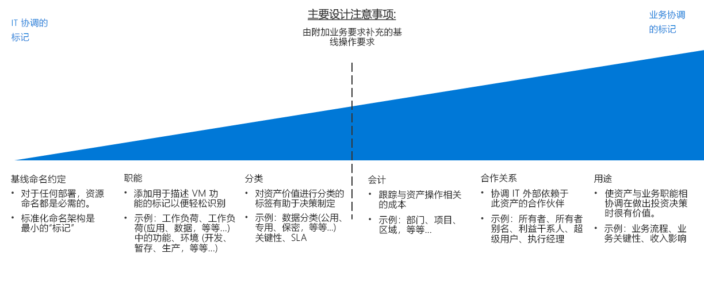

# 资源组织和标记决策指南

除非部署非常简单，否则组织的基于云的资源是 IT 最重要的任务之一。 组织资源具有三个主要用途：

- **资源管理**。 IT 团队需要快速查找与特定工作负荷、环境、所有权组或其他重要信息关联的资源。 组织资源对于分配组织角色和访问权限以便进行资源管理非常重要。
- **操作**。 除了使 IT 可以更方便地管理资源，合适的组织方案还使你可以在资源创建、操作监视和 DevOps 流程创建过程中利用自动化。
- **计帐**。 使业务组了解云资源消耗情况需要 IT 了解哪些工作负荷和团队在使用哪些资源。 若要支持诸如退款和报销计帐等方法，云资源需要进行组织以反映所有权和使用情况。

## 标记决策指南

跳转到：[基线命名约定](#baseline-naming-conventions) | [资源标记模式](#resource-tagging-patterns) | [命名和标记策略](#naming-and-tagging-policy) | [了解详细信息](#learn-more)

标记方法可以简单或复杂，其重点从支持管理云工作负荷的 IT 团队到集成与整个业务各个方面相关的信息。

与 IT 保持一致的标记重点可减少监视资产的复杂性，并显著降低基于功能和分类进行管理决策的难度。

还包括非 IT 策略的标记方案可能投入更多时间来创建反映企业利益的标记标准，并随着时间推移而维护这些标准。 但是，此过程的结果是形成能够更好地考虑 IT 资产的成本和价值的标记系统。 资产价值与其运营成本的这种关联是改变组织中 IT 对成本中心的认知的首要步骤之一。

## 基线命名约定

标准化命名约定是组织云托管资源的起点。 通过结构合理的命名系统可以快速标识资源以便用于管理和计帐。 如果组织的其他部分有现有的 IT 命名约定，请考虑云资源命名约定是否应与它们保持一致，或是否应建立单独的基于云的标准。

另请注意，不同的 Azure 资源类型具有不同的[命名要求](../../../best-practices/naming-conventions.md#naming-rules-and-restrictions)。 命名约定必须是与这些命名要求兼容。

## 资源标记模式

对于比只能提供一致命名约定更复杂的组织，云平台支持标记资源的功能。

标记是附加到资源的元数据元素。 标记由键/值字符串对组成。 包含在这些对中的值由你决定，但是作为全面的命名和标记策略的一部分，应用一致的全局标记集是整体治理策略的关键部分。

下面是常见标记模式的一些示例：

<!-- markdownlint-disable MD033 -->

| 标记类型 | 示例 | 说明 |
|-----|-----|-----|
| 功能            | app = catalogsearch1  tier = web  webserver = apache env = prod  env = staging  env = dev                 | 按照资源在工作负荷中的用途、它们部署到的环境或是其他功能和操作详细信息对资源进行分类。                                 |
| 分类        | confidentiality=private sla = 24hours                                 | 按照使用方法和对其应用的策略对资源进行分类                               |
| 计帐            | department = finance  project = catalogsearch  region = northamerica | 允许资源与组织中的特定组相关联，以便进行计费 |
| 合作关系           | owner = jsmith  contactalias = catsearchowners stakeholders = user1;user2;user3                        | 提供有关与资源相关或在其他方面受资源影响的人员（IT 外部）的信息                      |
| 目的               | businessprocess=support businessimpact=moderate revenueimpact=high   | 使资源与业务功能保持一致，以更好地支持投资决策  |

<!-- markdownlint-enable MD033 -->

## 命名和标记策略

命名和标记策略会随时间推移而发展。 但是，在云迁移开始时便确定核心组织优先事项十分关键。 作为规划过程的一部分，请仔细考虑以下问题：

- 命名和标记策略如何以最佳方式与组织中的现有命名和组织策略集成？
- 是否会实现退款或报销计帐系统？ 如何在此组织结构中表示部门、业务组和团队？
- 哪些标记信息是所有资源都需要的？ 哪些标记信息由各个团队决定实现或不实现？
- 标记是否需要表示资源的详细信息（如法规符合性要求）？ 操作详细信息（如运行时间要求、修补计划或安全要求）怎么样？

## 了解详细信息

有关 Azure 中的命名和标记的详细信息，请参阅：

- [Azure 资源的命名约定](../../../best-practices/naming-conventions.md)。 有关 Azure 资源的建议命名约定，请参阅 Azure 云基础知识站点中的本指导。
- [使用标记组织 Azure 资源](/azure/azure-resource-manager/resource-group-using-tags?toc=/azure/billing/TOC.json)。 可以在资源组和单个资源级别应用 Azure 中的标记，从而可以基于所应用的标记灵活地确定任何会计报表的粒度。

## 后续步骤

了解如何使用加密保护云环境中的数据。

> [!div class="nextstepaction"]
> [加密](../encryption/overview.md)
