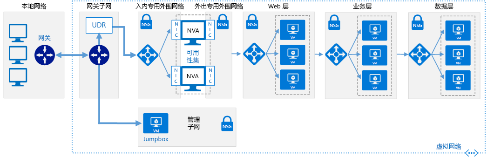

# 软件定义网络：云外围网络

云 DMZ 网络体系结构使用虚拟专用网络 (VPN) 来连接网络，允许在本地网络和基于云的网络之间进行有限访问。 DMZ 在云中部署，可为从基于云的资源访问本地网络提供保护。

此体系结构旨在为以下方案提供支持：组织想要开始将基于云的工作负荷与本地工作负荷集成，但可能还没有完全成熟的云安全策略或获得了两个环境之间的安全专用 WAN 连接。 因此，云网络应被视为隔离区，从而确保本地服务的安全。

DMZ 部署网络虚拟设备 (NVA) 来实现防火墙和数据包检查等安全功能。 在本地和基于云的应用程序或服务之间传递的流量必须通过可在其中对这些流量进行审核的 DMZ。 可用于确定允许哪些流量通过 DMZ 网络的 VPN 连接和规则受到 IT 安全团队的严格控制。

## 云 DMZ 假设

部署云 DMZ 的假设条件如下：

- 安全团队尚未使本地和基于云的安全要求和策略保持完全一致。
- 基于云的工作负荷需要对托管在本地或第三方网络上的服务进行有限访问，或本地环境中的用户或应用程序需要对云托管的资源进行有限访问。
- 在本地网络和云服务提供商之间实现 VPN 连接不受公司策略、法规要求或技术兼容性问题的限制。
- 工作负荷要么不需要多个订阅来绕过订阅资源限制，要么涉及多个订阅，但不需要集中管理分布在多个订阅中的资源所使用的连接或共享服务。

在考虑实现云 DMZ 虚拟网络体系结构时，云采用团队应考虑以下问题：

- 将本地网络与云网络连接会增加安全需求的复杂性。 即使云网络与本地环境之间的连接是安全的，仍然需要确保云资源的安全。
- 云 DMZ 体系结构通常用作敲门砖，同时进一步保护连接并在内部和云网络之间实现安全策略的一致性，从而允许更广泛地全面采用混合网络体系结构。

## 了解详细信息

有关在 Azure 平台中实现云 DMZ 的详细信息，请参阅以下内容。

- [在 Azure 和本地数据中心之间实现 DMZ](../../../reference-architectures/dmz/secure-vnet-hybrid.md)。 本文讨论如何在 Azure 中实现安全的混合网络体系结构。
