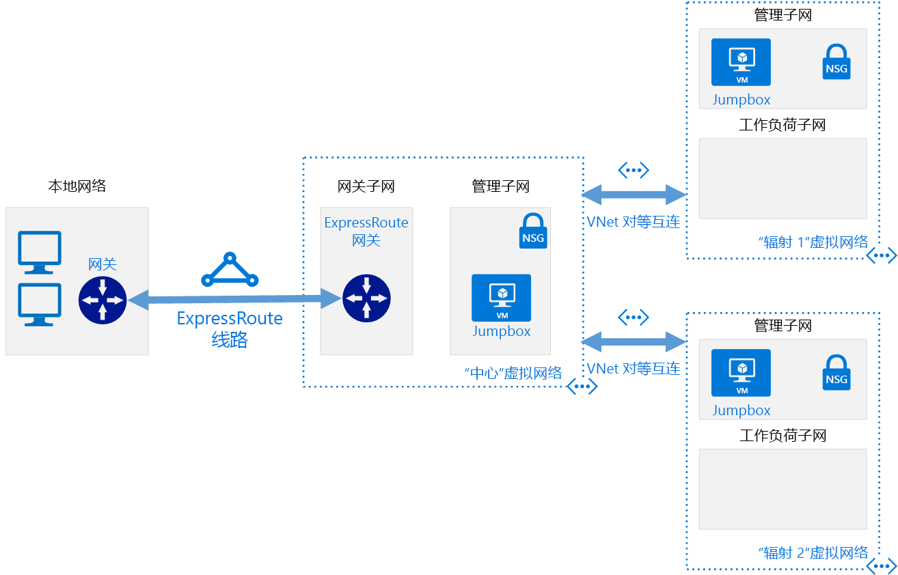

# 软件定义网络：中心和分支Software Defined Networks: Hub and Spoke

中心和分支网络模型将基于 Azure 的云网络基础结构组织到多个连接的虚拟网络中。The hub and spoke networking model organizes your Azure-based cloud network infrastructure into multiple connected virtual networks. 通过此模型可以更高效地管理常见通信或安全要求，以及应对潜在的订阅限制。This model allows you to more efficiently manage common communication or security requirements and deal with potential subscription limitations.

在中心和分支模型中，中心是一个虚拟网络，充当用于管理外部连接和托管多个工作负荷所使用的服务的中央位置。In the hub and spoke model, the *hub* is a virtual network that acts as a central location for managing external connectivity and hosting services used by multiple workloads. 分支是托管工作负荷并通过[虚拟网络对等互连](/virtual-network/virtual-network-peering-overview)连接到中央中心的虚拟网络。The *spokes* are virtual networks that host workloads and connect to the central hub through [virtual network peering](/virtual-network/virtual-network-peering-overview).

传入或传出工作负荷分支网络的所有流量都通过中心网络进行路由，在其中可以通过集中管理的 IT 规则或流程对这些流量进行路由、检查或在其他方面进行管理。All traffic passing in or out of the workload spoke networks is routed through the hub network where it can be routed, inspected, or otherwise managed by centrally managed IT rules or processes.

此模型旨在解决以下问题：This model aims to address the following issues:

- 成本节省和管理效率。Cost savings and management efficiency. 将可以由多个工作负荷（例如网络虚拟设备 (NVAs) 和 DNS 服务器）共享的服务集中放置在单个位置中使 IT 可以跨多个工作负荷尽量减少冗余资源和管理工作。Centralizing services that can be shared by multiple workloads, such as network virtual appliances (NVAs) and DNS servers, in a single location allows IT to minimize redundant resources and management effort across multiple workloads.
- 克服订阅限制。Overcoming subscriptions limits. 基于云的大型工作负荷需要使用的资源可能会多于单个 Azure 订阅中允许使用的资源（请参阅[订阅限制](/azure/azure-subscription-service-limits)）。Large cloud-based workloads may require the use of more resources than are allowed within a single Azure subscription (see [subscription limits](/azure/azure-subscription-service-limits)). 将来自不同订阅的工作负荷虚拟网络对等互连到一个中央中心可以克服这些限制。Peering workload virtual networks from different subscriptions to a central hub can overcome these limits.
- 关注点分离。Separation of concerns. 能够在中央 IT 团队与工作负荷团队之间部署单独的工作负荷。The ability to deploy individual workloads between central IT teams and workloads teams.

下图显示一个示例中心和分支体系结构，其中包括集中管理的混合连接。The following diagram shows an example hub and spoke architecture including centrally managed hybrid connectivity.

中心和分支体系结构通常与混合网络体系结构一起使用，从而提供与多个工作负荷之间共享的本地环境的集中管理连接。The hub and spoke architecture is often used alongside the hybrid networking architecture, providing a centrally managed connection to your on-premises environment shared between multiple workloads. 在此方案中，工作负荷与本地之间传输的所有流量都会经过中心，在其中可以对这些流量进行管理和保护。In this scenario, all traffic traveling between the workloads and on-premises passes through the hub where it can be managed and secured.

## 中心和分支假设Hub and spoke assumptions

实现中心和分支虚拟网络体系结构的假设条件如下：Implementing a hub and spoke virtual networking architecture assumes the following:

- 云部署涉及在单独工作环境（如开发、测试和生产）中托管且全部依赖于一组公用服务（例如 DNS 或目录服务）的工作负荷。Your cloud deployments will involve workloads hosted in separate working environments, such as development, test, and production, that all rely on a set of common services such as DNS or directory services.
- 工作负荷无需相互通信，但具有公用外部通信和共享服务要求。Your workloads do not need to communicate with each other but have common external communications and shared services requirements.
- 工作负荷需要的资源多于单个 Azure 订阅中可用的资源。Your workloads require more resources than are available within a single Azure subscription.
- 需要向工作负荷团队提供对其自己的资源的委托管理权限，同时维护对外部连接的中央安全控制。You need to provide workload teams with delegated management rights over their own resources while maintaining central security control over external connectivity.

## 全局中心和分支Global hub and spoke

中心和分支体系结构通常使用部署到相同 Azure 区域的虚拟网络来实现，以尽量降低网络之间的延迟。Hub and spoke architectures are commonly implemented with virtual networks deployed to the same Azure Region to minimize latency between networks. 但是，遍布全球的大型组织可能需要跨多个区域部署工作负荷，以实现可用性、灾难恢复或法规要求。However, large organizations with global reach may need to deploy workloads across multiple regions for availability, disaster recovery, or regulatory requirements. 通过使用 Azure [全局虚拟网络对等互连](/azure/virtual-network/virtual-network-peering-overview)，中心和分支模型可以跨区域扩展集中管理和共享的服务，以支持分布在全世界的工作负荷。Through the use of Azure [global virtual network peering](/azure/virtual-network/virtual-network-peering-overview), the hub and spoke model can extend centralized management and shared services across regions to support workloads distributed across the world.

## 了解详细信息Learn more

有关如何在 Azure 上实现中心和分支网络的示例，请参阅 Azure 参考体系结构站点上的以下示例：For examples of how to implement hub and spoke networks on Azure, see the following examples on the Azure Reference Architectures site:

- [在 Azure 中实现中心辐射型网络拓扑Implement a hub-spoke network topology in Azure](../../../reference-architectures/hybrid-networking/hub-spoke.md)
- [在 Azure 中使用共享服务实现中心辐射型网络拓扑Implement a hub-spoke network topology with shared services in Azure](../../../reference-architectures/hybrid-networking/shared-services.md)
