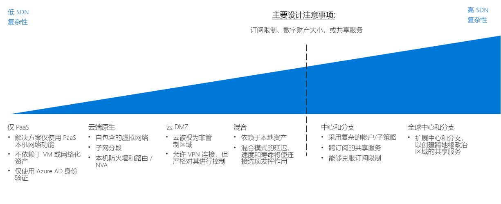

# CAF：软件定义网络决策指南CAF: Software Defined Network decision guide

软件定义网络 (SDN) 是一种网络体系结构，旨在实现可通过软件集中管理、配置和修改的虚拟化网络功能。Software Defined Networking (SDN) is a network architecture designed to allow virtualized networking functionality that can be centrally managed, configured, and modified through software. SDN 通过物理网络基础结构提供抽象层，并支持物理路由器、防火墙和其他可在本地网络中找到的网络硬件的虚拟化等效项。SDN provides an abstraction layer over the physical networking infrastructure, and enables the virtualized equivalent to physical routers, firewalls, and other networking hardware you would find in an on-premises network.

SDN 允许 IT 人员使用虚拟资源配置和部署支持工作负荷需求的网络结构和功能。SDN allows IT staff to configure and deploy network structures and capabilities that support workload needs using virtualized resources. 基于软件的部署管理的灵活性支持快速修改网络资源并能够同时支持敏捷和传统部署模型。The flexibility of software-based deployment management enables rapid modification of networking resources and allows the ability to support both agile and traditional deployment models. 使用 SDN 技术创建的虚拟网络对在公有云平台上创建安全的网络至关重要。Virtualized networks created with SDN technology are critical to creating secure networks on a public cloud platform.

## 网络决策指南Networking decision guide

跳转到：[仅限 PaaS](paas-only.md) | [云原生](cloud-native.md) | | [云外围网络](cloud-dmz.md)[混合](hybrid.md) | [中心/分支模型](hub-spoke.md) | [了解更多](#learn-more)Jump to: [PaaS Only](paas-only.md) | [Cloud native](cloud-native.md) | | [Cloud DMZ](cloud-dmz.md) [Hybrid](hybrid.md) | [Hub/Spoke model](hub-spoke.md) | [Learn more](#learn-more)

SDN 提供具有不同程度的定价和复杂性的多个选项。SDN provides several options with varying degrees of pricing and complexity. 上述发现指南提供了对这些选项快速进行个性化的参考，以便符合具体的业务和技术策略。The above discovery guide provides a reference to quickly personalize these options to best align with specific business and technology strategies.

本指南中的转折点取决于云策略团队就网络基础结构作出决策前所作的多个关键决策。The inflection point in this guide depends on several key decisions that your Cloud Strategy team have made before making decisions about networking architecture. 其中最重要的是涉及[数字资产定义](../../digital-estate/overview.md)和[订阅设计](../subscriptions/overview.md)的决策（可能还需要与云帐户和全球市场策略相关的决策提供意见）。Most important among these are decisions involving your [Digital Estate definition](../../digital-estate/overview.md) and [Subscription Design](../subscriptions/overview.md) (which may also require inputs from decisions made related to your cloud accounting and global markets strategies).

具有少于 1,000 个 VM 的小型、单区域部署不太可能会显著影响此转折点。Small, single region deployments of less than 1,000 VMs are less likely to be significantly affected by this inflection point. 相反，具有超过 1,000 个 VM、多个业务单位或多个地缘政治市场的大规模采用可能会因 SDN 决策和此关键转折点受到显著影响。Conversely, large adoption efforts with more than 1,000 VMs, multiple business units, or multiple geo-politic markets, could be substantially affected by your SDN decision and this key inflection point.

## 选择适当的虚拟网络体系结构Choosing the right virtual networking architectures

本部分就决策指南进行展开，帮助你选择适当的虚拟网络体系结构。This section expands on the decision guide to help you choose the right virtual networking architectures.

可通过多种方法来实现 SDN 技术，用于创建基于云的虚拟网络。There are many ways to implement SDN technologies to create cloud-based virtual networks. 如何构建迁移中使用的虚拟网络以及这些网络如何与现有 IT 基础结构进行交互，具体取决于工作负荷要求和治理要求的结合。How you structure the virtual networks used in your migration and how those networks interact with your existing IT infrastructure will depend on a combination of the workload requirements and your governance requirements.

计划在规划云迁移时考虑哪种虚拟网络体系结构或体系结构组合时，请考虑以下问题，帮助确定最适合组织的体系结构：When planning which virtual networking architecture or combination of architectures to consider when planning your cloud migration, consider the following questions to help determine what's right for your organization:

| 问题Question | 仅限 PaaSPaaS Only | 云原生Cloud Native | 云外围网络Cloud DMZ | 混合Hybrid | 中心和分支Hub and Spoke |
|-----|-----|-----|-----|-----|-----|
| 除服务自身提供的网络功能外，工作负荷是否仅使用 PaaS 服务，不需要其他任何网络功能？Will your workload only use PaaS services and not require networking capabilities beyond those provided by the services themselves? | 是Yes | 否No | 否No | 否No | 否No |
| 工作负荷是否要求与本地应用程序集成？Does your workload require integration with on-premises applications? | 否No | 否No | 是Yes | 是Yes | 是Yes |
| 是否已在本地和云网络之间建立成熟的安全策略和安全连接？Have you established mature security policies and secure connectivity between your on-premises and cloud networks? | 否No | 否No | 否No | 是Yes | 是Yes |
| 工作负荷是否需要不通过云标识服务支持的身份验证服务，或者是否需要直接访问本地域控制器？Does your workload require authentication services not supported through cloud identity services, or do you need direct access to on-premises domain controllers? | 否No | 否No | 否No | 是Yes | 是Yes |
| 是否需要部署和管理大量 VM 和工作负荷？Will you need to deploy and manage a large number of VMs and workloads? | 否No | 否No | 否No | 否No | 是Yes |
| 向各个工作负荷团队委派对资源的控制时，是否需要提供集中管理和本地连接？Will you need to provide centralized management and on-premises connectivity while delegating control over resources to individual workload teams? | 否No | 否No | 否No | 否No | 是Yes |

## 虚拟网络体系结构Virtual networking architectures

详细了解主软件定义的网络体系结构：Learn more about the primary software defined networking architectures:

- [**仅限 PaaS**](paas-only.md)：平台即服务 (PaaS) 产品支持有限的内置网络功能集，并可能不需要显式定义的软件定义网络即可支持工作负荷要求。[**PaaS Only**](paas-only.md): Platform as a service (PaaS) products support a limited set of built-in networking features and may not require an explicitly defined software defined network to support workload requirements.
- [**云原生**](cloud-native.md)：云原生虚拟网络是将资源部署到云平台时默认的软件定义网络体系结构。[**Cloud Native**](cloud-native.md): A cloud native virtual network is the default software defined networking architecture when deploying resources to a cloud platform.
- [**云外围网络**](cloud-dmz.md)：在本地和云网络之间提供有限的连接，通过云环境上的某个外围安全区域进行保护。[**Cloud DMZ**](cloud-dmz.md): Provides limited connectivity between your on-premises and cloud network which is secured through the implementation of a demilitarized zone on the cloud environment.
- [**混合**](hybrid.md)：混合云网络体系结构允许虚拟网络访问本地资源，反之亦然。[**Hybrid**](hybrid.md): The hybrid cloud network architecture allows virtual networks to access your on-premises resources and vice versa.
- [**中心和分支**](hub-spoke.md)：使用中心和分支体系结构，可以集中管理外部连接和共享服务，隔离各个工作负荷并克服潜在的订阅限制。[**Hub and Spoke**](hub-spoke.md): The hub and spoke architecture allows you to centrally manage external connectivity and shared services, isolate individual workloads, and overcome potential subscription limits.

## 了解详细信息Learn more

有关 Azure 平台中的软件定义网络的详细信息，请参阅以下内容。See the following for more information about software defined networking in the Azure platform.

- [Azure 虚拟网络](/azure/virtual-network/virtual-networks-overview)。[Azure Virtual Network](/azure/virtual-network/virtual-networks-overview). 在 Azure 上，由 Azure 虚拟网络提供核心的 SDN 功能，作为物理本地网络的云模拟。On Azure, the core SDN capability is provided by Azure Virtual Network, which acts as a cloud analog to physical on-premises networks. 虚拟网络还在平台上充当资源之间的默认隔离边界。Virtual networks also act as a default isolation boundary between resources on the platform.
- [Azure 网络安全最佳做法](/azure/security/azure-security-network-security-best-practices)。[Azure Network Security Best Practices](/azure/security/azure-security-network-security-best-practices). Azure 安全团队关于如何配置虚拟网络的建议，以最大程度减少安全漏洞。Recommendations from the Azure Security team on how to configure your virtual networks to minimize security vulnerabilities.

## 后续步骤Next steps

了解运营团队如何利用日志、监视和报告来管理云工作负荷的运行状况和策略符合性。Learn how logs, monitoring, and reporting are used by operations teams to manage the health and policy compliance of cloud workloads.

> [!div class="nextstepaction"]
> [日志和报告Logs and Reporting](../log-and-report/overview.md)
