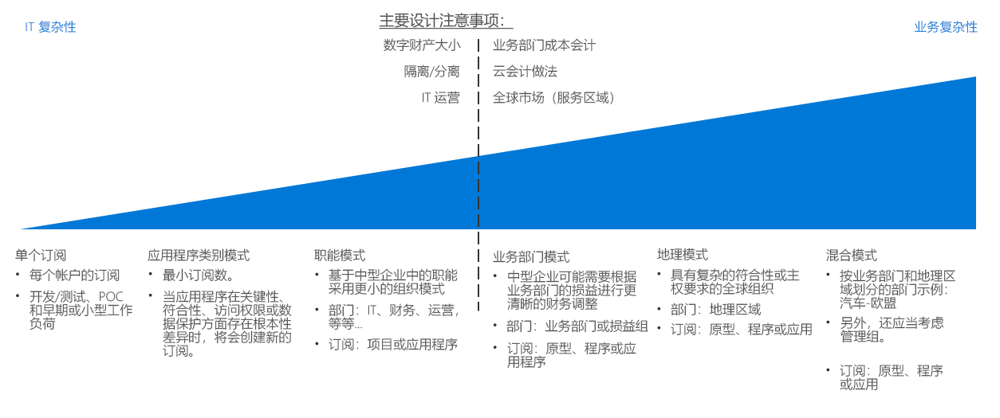
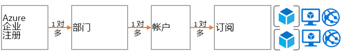
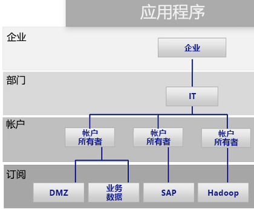
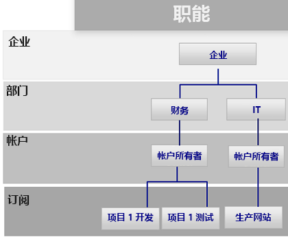
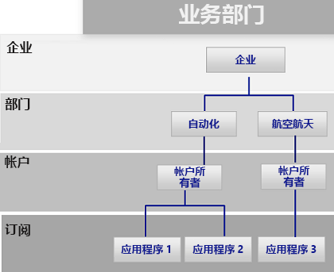
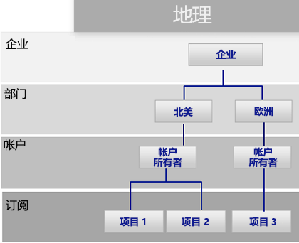

# 订阅决策指南Subscription decision guide

所有云平台都基于核心所有权模型，用于为组织提供大量计费和资源管理选项。All cloud platforms are based on a core ownership model that provides organizations with numerous billing and resource management options. Azure 采用的结构不同于其他云提供商，因为它提供各种关于组织层次结构和分组订阅所有权的支持选项。The structure that Azure uses is different from other cloud providers because it includes various support options for organizational hierarchy and grouped subscription ownership. 无论如何，通常有一个人负责计费，并将另一个人指定为管理资源的顶级所有者。Regardless, there is generally one individual responsible for billing and another who is assigned as the top-level owner for managing resources.

跳转到：[订阅设计和 Azure 企业协议](#subscriptions-design-and-azure-enterprise-agreements) | [订阅设计模式](#subscription-design-patterns) | [管理组](#management-groups) | [处于订阅级别的组织](#organization-at-the-subscription-level)Jump to: [Subscriptions design and Azure Enterprise Agreements](#subscriptions-design-and-azure-enterprise-agreements) | [Subscription design patterns](#subscription-design-patterns) | [Management groups](#management-groups) | [Organization at the subscription level](#organization-at-the-subscription-level)

订阅设计是公司在云采用期间用来建立结构或整理资产的最常见策略之一。Subscription design is one of the most common strategies that companies use to establish a structure or organize assets during cloud adoption.

**订阅层次结构**：订阅是 Azure 服务（如虚拟机、SQL DB、应用服务或容器）的逻辑集合。**Subscription hierarchy**: A *subscription* is a logical collection of Azure services (such as virtual machines, SQL DB, App Services, or containers). Azure 中的所有资产都部署到单个订阅中。Each asset in Azure is deployed to a single subscription. 然后，每个订阅都被一个帐户所拥有。Each subscription is then owned by one *account*. 此帐户是跨订阅提供计费和管理访问权限的用户帐户（或最好是服务帐户）。This account is a user account (or preferably a service account) that provides billing and administrative access across a subscription. 对于承诺通过企业协议 (EA) 使用特定量 Azure 的客户，就多出另一个控制级别，称为“部门”。For customers who have made a commitment to use a specific amount of Azure through an Enterprise Agreement (EA), another level of control called a *department* is added. 在 EA 门户中，订阅、帐户和部门可用于创建层次结构，以用于计费和管理目的。In the EA portal, subscription, accounts, and departments can be used to create a hierarchy for billing and management purposes.

订阅设计的复杂性各不相同。The complexity of subscription designs varies. 设计策略决策有独特的拐点，因为它们通常同时涉及业务约束和 IT 约束。Decisions regarding a design strategy have unique inflection points, as they typically involve both business and IT constraints. 制定技术决策前，IT 架构师和决策者应咨询业务利益干系人和云策略团队，以了解相应的云核算方法、业务部门内的成本核算做法，以及组织的全球市场需求。Before making technical decisions, IT architects and decision makers should work with the business stakeholders and the cloud strategy team to understand the desired cloud accounting approach, cost accounting practices within your business units, and global market needs for your organization.

**拐点**：上图中的虚线表示，订阅设计的简单模式和更复杂模式之间的拐点。**Inflection point**: The dashed line in the image above references an inflection point between simple and more complex patterns for subscription design. 其他基于数字资产规模与 Azure 订阅限制、隔离和分离策略以及 IT 运营部门的技术决策点通常会对订阅设计产生重大影响。Additional technical decision points based on digital estate size versus Azure subscription limits, isolation and segregation policies, and IT operational divisions usually have a significant effect on subscription design.

**其他注意事项**：选择订阅设计时需要注意的一点是，订阅不是对资源或部署进行分组的唯一方法。**Other considerations**: An important thing to note when selecting a subscription design is that subscriptions aren’t the only way to group resources or deployments. 由于订阅是在 Azure 早期阶段提出，因此存在与旧 Azure 解决方案（如 Azure 服务管理器）相关的限制。Subscriptions were created in the early days of Azure, as such they have limitations related to previous Azure solutions like Azure Service Manager.

部署结构、自动化和新资源分组方法可能会影响结构订阅设计。Deployment structure, automation, and new approaches to grouping resources can affect your structure subscription design. 最终确定订阅设计前，请先考虑[资源一致性](../resource-consistency/overview.md)决策可能会对设计选择产生什么影响。Before finalizing a subscription design, consider how [resource consistency](../resource-consistency/overview.md) decisions might influence your design choices. 例如，大型跨国组织最初可能会考虑使用复杂的订阅管理模式。For example, a large multinational organization might initially consider a complex pattern for subscription management. 不过，通过添加管理组层次结构，这家公司可使用更简单的业务部门模式实现更大权益。However, that same company might realize greater benefits with a simpler business unit pattern by adding a management group hierarchy.

## 订阅设计和 Azure 企业协议Subscriptions design and Azure Enterprise agreements

所有 Azure 订阅都与一个帐户相关联，此帐户负责每个订阅的计费和顶级访问控制。All Azure subscriptions are associated with one account, which is connected to billing and top-level access control for each subscription. 一个帐户可以拥有多个订阅，并能为组织提供基本级别的订阅。A single account can own multiple subscriptions and can provide a base level of subscriptions organization.

对于小型 Azure 部署，单个订阅或小型订阅集合就可能构成整个云资产。For small Azure deployments, a single subscription or a small collection of subscriptions may compose your entire cloud estate. 不过，大型 Azure 部署可能需要跨多个订阅，以支持组织结构，并规避[订阅配额和限制](/azure/azure-subscription-service-limits)。However, large Azure deployments likely need to span multiple subscriptions to support your organizational structure and bypass [subscription quotas and limits](/azure/azure-subscription-service-limits).

每个 Azure 企业协议都提供了进一步的功能，即将订阅和帐户整理到反映组织优先级的层次结构中。Each Azure Enterprise Agreement provides a further ability to organize subscriptions, and accounts into hierarchies that reflect your organizational priorities. 组织企业许可登记表从合同的角度规定了 Azure 服务在公司内的形式和用途。Your organizational enterprise enrollment defines the shape and use of Azure services within your company from a contractual point of view. 在每个企业协议中，为了与组织结构保持一致，可以将环境进一步细分为部门、帐户和订阅。Within each enterprise agreement, you can further subdivide the environment into departments, accounts, and subscriptions to match your organization's structure.

## 订阅设计模式Subscription design patterns

每个企业都不同。Every enterprise is different. 因此，在整个 Azure 企业协议中启用的部门/帐户/订阅层次结构，可以显著提高 Azure 资产整理方式的灵活性。Therefore, the department/account/subscription hierarchy enabled throughout an Azure Enterprise Agreement allows for significant flexibility in how Azure is organized. 开始使用公有云时，首要和最重要的决策是，对组织的层次结构进行建模，以反映公司在计费、资源管理和资源访问方面的需求。Modeling your organization's hierarchy to reflect the needs of your company for billing, resource management, and resource access is the first, and most important, decision that you make when starting in the public cloud.

为了支持可能的组织优先级，以下订阅模式的订阅设计复杂性一般会上升：The following subscription patterns reflect a general increase in subscription design complexity to support potential organizational priorities:

### 一个订阅Single subscription

对于需要部署少量云托管资产的组织，每帐户单个订阅可能就足够了。A single subscription per account may suffice for organizations that need to deploy a small number of cloud-hosted assets. 这通常是在开始云采用流程时实现的第一个订阅模式，因为它可便于实现小规模试验部署或概念证明部署，从而探索云平台的功能。This is often the first subscription pattern you implement when beginning your cloud adoption process, allowing small-scale experimental or proof of concept deployments to explore the capabilities of a cloud platform.

不过，单个订阅支持的资源数量存在技术限制。However, there can be technical limitations to the number of resources that a single subscription will support. 随着云资产规模增长，建议支持采用无法与单个订阅配合使用的方式来整理资源，以更好地整理策略和访问控制。As the size of your cloud estate grows, you may likely want to also support organizing your resources to better organize policies and access control in a manner not supported with a single subscription.

### 应用程序类别模式Application category pattern

随着组织的云占用情况上升，使用多个订阅的可能性也相应增加。As the size of an organization's cloud footprint grows, the use of multiple subscriptions becomes increasingly likely. 在此方案中，通常会创建订阅来支持在业务关键性、合规性要求、访问控制或数据保护需求方面存在根本差异的应用程序。In this scenario, subscriptions are generally created to support applications that have fundamental differences in business criticality, compliance requirements, access controls, or data protection needs. 支持这些应用程序类别的订阅和帐户全都被整理到一个部门下，此部门由中央 IT 运营人员拥有和管理。The subscriptions and accounts supporting these application categories are all organized under a single department which is owned and administered by central IT operations staff.

每个组织都会选择以不同方式对应用程序进行分类，通常会根据特定应用程序或服务，或者按照应用程序原型来分隔订阅。Each organization will choose to categorize applications differently, often separating subscriptions based on specific applications or services or along the lines of application archetypes. 能证明将单独的订阅归于此模式下是合理的工作负载包括：Workloads that might justify a separate subscription under this pattern include:

- 实验性应用程序或低风险应用程序Experimental or low-risk applications
- 包含受保护数据的应用程序Applications with protected data
- 任务关键工作负载Mission-critical workloads
- 符合法规要求（如 HIPAA 或 FedRAMP）的应用程序Applications subject to regulatory requirements (such as HIPAA or FedRAMP)
- 批处理工作负载Batch workloads
- 大数据工作负载（如 Hadoop）Big data workloads such as Hadoop
- 使用部署业务流程协调程序（如 Kubernetes）的容器化工作负载Containerized workloads using deployment orchestrators such as Kubernetes
- 分析工作负载Analytics workloads

此模式支持多个帐户所有者负责具体工作负载。This pattern supports multiple accounts owners responsible for specific workloads. 因为在企业协议层次结构的部门级别缺少更复杂的结构，所以此模式不需要实现 Azure 企业协议。As it lacks a more complex structure at the department level of the enterprise agreement hierarchy, this pattern does not require an Azure Enterprise Agreement to implement.

### 职能模式Functional pattern

此模式使用提供给 Azure 企业协议客户的企业/部门/帐户/订阅层次结构，按照职能（如财务、销售或 IT 支持）整理订阅和帐户。This pattern organizes subscriptions and accounts along functional lines, such as finance, sales, or IT support, using the Enterprise/Department/Account/subscription hierarchy provided to Azure enterprise agreement customers.

### 业务部门模式Business unit pattern

此模式使用 Azure 企业协议层次结构，根据损益类别、业务部门、部门、利润中心或类似业务结构对订阅和帐户进行分组。This pattern groups subscriptions and accounts based on profit and loss category, business unit, division, profit center, or similar business structure using the Azure Enterprise Agreement hierarchy.

### 地理模式Geographic pattern

对于在全球运营的组织，此模式使用 Azure 企业协议层次结构，根据地理区域对订阅和帐户进行分组。For organizations with global operations, this pattern groups subscriptions and accounts based on geographic regions using the Azure Enterprise Agreement hierarchy.

### 混合模式Mixed patterns

企业/部门/帐户/订阅层次结构。enterprise/department/account/subscriptions hierarchy. 不过，可以将地理区域模式和业务部门模式等组合起来，以反映公司内更复杂的计费和组织结构。However, you can combine patterns such as geographic region and business unit to reflect more complex billing and organizational structures within your company. 此外，[资源一致性设计](../resource-consistency/overview.md)还可以进一步扩展订阅设计的治理和组织结构。In addition, your [resource consistency design](../resource-consistency/overview.md) can further extend the governance and organizational structure of your subscription design.

如下一部分所述，管理组可有助于支持更复杂的组织结构。Management groups, as discussed in the following section, can help support more complicated organizational structures.

下一部分中介绍的管理组可有助于支持更复杂的组织结构。Management groups, discussed in the following section, can help support more complicated organizational structures.

## 管理组Management groups

除了通过企业协议提供的部门和组织结构之外，[Azure 管理组](/azure/governance/management-groups/index)还为跨多个订阅整理策略、访问控制和合规性要求提供了更多灵活性。In addition to the department and organization structure provided through Enterprise Agreements, [Azure management groups](/azure/governance/management-groups/index) offer additional flexibility for organizing policy, access control, and compliance across multiple subscriptions. 最多可以将管理组嵌套六个级别，这样就能创建与计费层次结构相互独立的层次结构。Management groups can be nested up to six levels, allowing you to create a hierarchy that is separate from your billing hierarchy. 这完全是为了高效管理资源。This can be solely for efficient management of resources.

管理组可反映出计费层次结构，企业通常是这样起步的。Management groups can mirror your billing hierarchy, and often enterprises start that way. 不过，管理组的强大功能在于，如果相关订阅（无论位于计费层次结构中的何处）被组合在一起，且需要与策略和计划一起分配的常见角色，可使用管理组为组织建模。However, the power of management groups is when you use them to model your organization where related subscriptions &mdash; regardless of where they are in the billing hierarchy &mdash; are grouped together and need common roles assigned along with policies and initiatives.

示例包括：Examples include:

- 生产/非生产：某些企业创建管理组来识别其生产和非生产订阅。Production/non-production: Some enterprises create management groups to identify their production and non-production subscriptions. 借助管理组，这些客户可以更轻松地管理角色和策略，例如：非生产订阅可能允许开发人员“参与者”访问权限，但在生产中，开发人员仅具有“读者”访问权限。Management groups allow these customers to more easily manage roles and policies, for example: non-production subscription may allow developers "contributor" access, but in production, they have only "reader" access.
- 内部服务/外部服务：与生产/非生产很像，企业通常对内部服务与面向客户的外部服务有不同的要求、策略和角色。Internal services/external services: Much like production/non-production, enterprises often have different requirements, policies, and roles for internal services versus external customer-facing services.

## 处于订阅级别的组织Organization at the subscription level

确定部门和帐户（或管理组）时，主要需要决定如何细分 Azure 环境来与组织保持一致。When determining your departments and accounts (or management groups), you will primarily need to decide how you're going to divide your Azure environment to match your organization. 然而，订阅才是真正的工作所在，这些决策将会影响安全性、可伸缩性和计费。However, subscriptions are where the real work happens, and these decisions will impact security, scalability, and billing.

请考虑以下模式作为导向：Consider the following patterns as guides:

- **应用程序/服务**：订阅代表应用程序或服务（应用程序组合）。**Application/service**: Subscriptions represent an application or a service (portfolio of applications).

- **生命周期**：订阅代表服务生命周期，如生产或开发。**Lifecycle**: Subscriptions represent a lifecycle of a service, such as production or development.

- **部门**：订阅代表组织中的部门。**Department**: Subscriptions represent departments in the organization.

前两种模式是最常用的模式，强烈建议使用这两种模式。The first two patterns are the most commonly used and are both highly recommended. 生命周期方法适用于大多数组织。The lifecycle approach is appropriate for most organizations. 在这种情况下，一般建议先使用两个基本订阅（生产和非生产），再使用资源组进一步细分环境。In this case, the general recommendation is to use two base subscriptions: production and non-production, and then use resource groups to break out the environments further.

有关如何使用 Azure 订阅和资源组来分组和管理资源的一般说明，请参阅 ](../../getting-started/azure-resource-access.md)Azure 中的资源访问管理[。For a general description of how Azure subscriptions and resource groups are used to group and manage resources, see [Resource access management in Azure](../../getting-started/azure-resource-access.md).

## 后续步骤Next steps

了解如何在云中使用标识服务进行访问控制和管理。Learn how identity services are used for access control and management in the cloud.

> [!div class="nextstepaction"]
> [标识Identity](../identity/overview.md)
