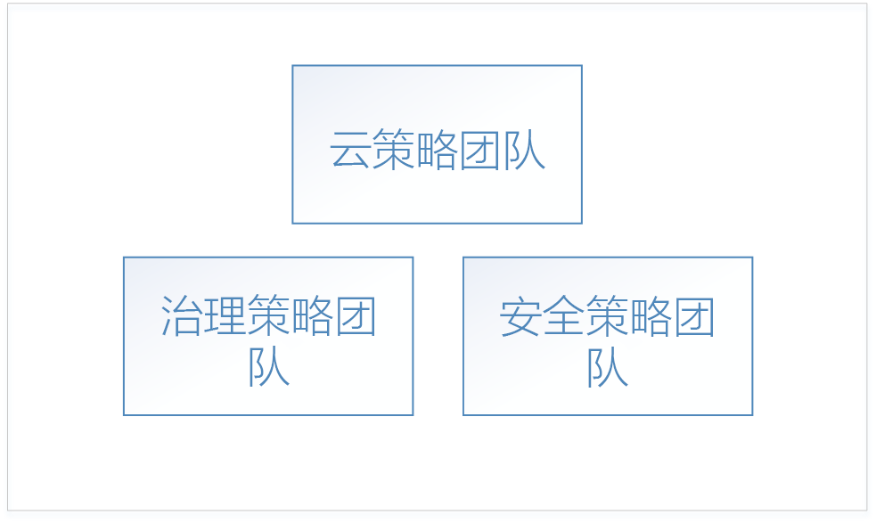
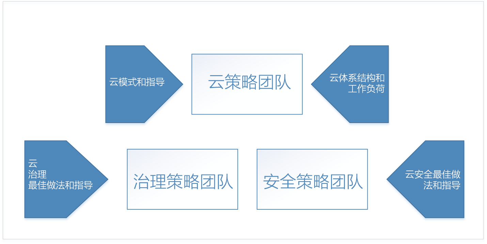
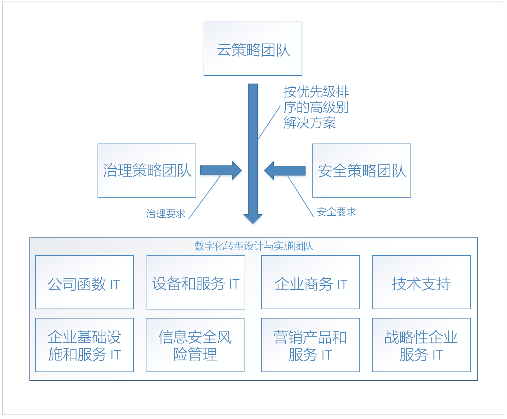

# 企业云的采用：入门 

通过**数字化转型**迁移到云计算意味着从本地操作方式转变为云操作方式。 这种转变包括以全新方式开展业务 - 例如，数字化转型需要从软件和数据中心硬件的资本开销转变为因使用云资源带来的操作开销。 

## 数字化转型：流程

为了成功采用云，企业必须让其组织、人员、流程做好此数字化转型的准备。 每个企业的组织结构不同，因此并没有统一的方式来实现组织就绪性。 本文档概述了企业做准备时可以采取的概要步骤。 你的组织必须花时间制定详细的计划来完成所列出的每个步骤。

数字化转型的概要流程如下：

1. 创建云策略团队。 此团队负责领导数字化转型。 在此阶段组建治理团队和安全团队对于数字化转型也很重要。
2. 云策略团队成员需要了解云技术的最新知识以及该技术与其他技术的差异。  
3. 云策略团队在为企业做准备时，需针对数字化转型构建业务案例 - 枚举当前业务策略中存在的所有差距，确定消除这些差距所需的高级解决方案。
4. 协调高级解决方案与业务组的要求。 确定每个业务组中负责每个解决方案的设计和实施事务的利益干系人。
5. 转换现有的角色、技能和流程，将云角色、技能和流程包括进去。  
<!--6. Develop processes for operating in the cloud to make solutions more robust in terms of availability, resiliency, and security. 
7. Optimize solutions for performance, scalability, and cost efficiency.-->

## 步骤 1：创建云策略团队

在企业数字化转型过程中，第一步是召集整个组织的业务主管，创建一个云策略团队 (CST)。 该团队由财务、IT 基础结构和应用组的业务主管组成。 这些团队可以参与云分析和试验阶段的工作。

例如，云策略团队可以由 CTO 掌管，可以包含企业体系结构团队、IT 财务部门的成员以及来自各 IT 应用组（人力资源、财务等）的资深技术专家和基础结构、安全和网络团队的主管。  

另外还需组建两个其他的高级团队：治理团队和安全团队。 这些团队负责企业治理策略和安全策略的设计、实施和持续审核。 治理团队需要处理过资产保护、成本管理、组策略和相关主题事项的成员。 安全团队需要熟悉当前的行业安全标准和企业安全要求的成员。

治理团队负责设计和实施企业在云中的治理模型，以及部署和维护那些需要数字化转型的共享基础设施资产。 这些资产包括硬件、软件和云资源，是将本地网络连接到云中的虚拟网络所必需的。

安全团队负责设计和实施企业在云中的安全策略，并与治理团队密切合作。 安全团队负责本地网络安全边界的扩展，使之包括云中的虚拟网络。 具体事项可能包括：负责维护云虚拟网络上的入站和出站防火墙，并确保采用适当的工具和策略，防止用户部署未经授权的资源。

## 步骤 2：了解云领域的最新知识
 
在企业数字化转型过程中，下一步是让云策略团队的成员了解云技术会对企业的业务运营方式造成哪些改变。 这是针对业务、人员和技术的变化进行的准备和规划。 必须让云策略团队的成员了解云中的内容与本地的内容相比，有哪些是新的，哪些是不同的。

若要了解云，需先概要了解 [Azure 工作原理](what-is-azure.md)。 接下来了解 [Azure 治理](what-is-governance.md)基础知识，以便[了解资源访问管理](azure-resource-access.md)。

进行深入学习时，治理团队应查看目录治理部分的概念和设计指南。 可以通过基础结构和工作负荷部分了解云中的典型体系结构和工作负荷。

## 步骤 3：确定业务策略中存在的差距

下一步是让云策略团队枚举出需要通过数字化转型解决方案来解决的业务问题。 例如，企业现有的本地数据中心的硬件过旧，需要更换。 又比如，企业的新功能和新服务面市困难，竞争力弱。 这些差距也就是企业数字化转型的目标。

业务策略中存在的差距可以分为下述几类：

|类别|Description|
|-----|-----|
|成本管理|代表企业技术付款方式的差距。|
|调控|代表企业在通过相关流程保护其资产免遭用户不当使用方面的差距。资产的不当使用可能会导致成本溢出问题、安全问题或符合性问题。 | 
|合规性|代表企业在遵循自己的内部流程和策略以及外部法律、法规和标准方面的差距。 |
|安全|代表企业在保护其技术和数据资产免受外部威胁方面的差距。 |
|数据治理|代表企业在管理数据（尤其是客户数据）方面的差距。 例如，欧盟新颁布的一般数据保护条例 (GDPR) 对客户数据的保护有严格的要求，因此可能需要使用新的硬件和软件。|    

企业将所有业务策略差距划分成上述类别以后，下一步就是确定每个问题的高级解决方案。

下表介绍了几个示例：

|业务策略差距|类别 &nbsp; &nbsp; &nbsp; &nbsp; &nbsp;|解决方案 &nbsp;&nbsp;&nbsp;&nbsp;&nbsp;&nbsp;&nbsp;&nbsp;&nbsp;&nbsp;&nbsp;&nbsp;&nbsp;&nbsp;|
|-----|-----|-----|
| 当前托管在本地的服务在高峰需求（大约为使用量的 10%）时间遇到了可用性、复原能力和可伸缩性方面的问题。 本地数据中心的服务器的使用寿命已到头。 企业 IT 部门建议为数据中心购买新的其规格足以应对高峰需求的本地硬件。| 成本管理 | 将受影响的现有本地工作负荷迁移到云中的可缩放资源，仅按使用情况付费。 |
| 外部数据管理法律和法规要求企业根据一系列标准控制的规定对静态数据加密，这需要新的硬件和软件。 | 数据治理 | 将数据移到适合静态数据的 Azure 存储服务加密。 |
| 托管在本地数据中心的服务遇到分布式拒绝服务 (DDoS) 攻击，此类攻击针对面向公众的服务。 此类攻击难以消除，需要新的硬件、软件和安全人员才能有效对付。 | 安全 | 将服务迁移到 Azure，充分利用 Azure DDoS 防护功能。|

将业务策略中的所有差距都枚举出来并确定高级解决方案以后，即可确定列表的优先级。 可以根据业务策略差距以及企业在每个类别中的短期和长期目标来确定列表的优先级。 例如，如果企业的短期目标是减少随后两个财政季度的 IT 支出，则可按照与“成本管理”类别中的每项业务差距相关联的预计成本节省情况来确定该类别中业务差距的优先级。

此流程的输出是一个堆栈排名形式的列表，其中包含与业务类别相符的高级解决方案。 

## 步骤 4：协调高级解决方案与业务组的解决方案设计要求 

将数字化转型的目标枚举出来并确定其优先级且提出高级解决方案以后，下一步是由云策略团队来协调每个高级解决方案与每个业务组中的设计和实施团队的要求。 

团队会根据优先级列表和每个高级解决方案来设计每个解决方案。 设计过程会涉及到新基础结构和新工作负荷的具体化。 可能还会更改人员的角色和所遵循的流程。 此阶段必须让每个设计团队邀请治理团队和安全团队来审核每项设计，这也很重要。 每项设计都必须符合治理团队和安全团队定义的策略和过程，这两个团队必须参与每项设计的最终定型。

每项解决方案的设计都非同小可，在确定设计时必须兼顾其他团队的其他解决方案设计。 例如，如果多项设计都需要将现有的本地应用程序和服务迁移到云，则需进行通盘考虑，设计一项总体迁移策略，这样可以提高效率。 又比如，某些现有的本地应用程序和服务可能无法迁移，而解决方案需要将其替换为新的开发内容或第三方服务。 在这种情况下，可能需要进行通盘考虑，确定各个方案之间的交集，看能否将第三方服务用于多个解决方案，以便提高效率。

完成解决方案的设计以后，团队需继续完成每项设计的实施阶段。 可以使用标准的项目管理流程来运行每项解决方案设计的实施阶段。

## 步骤 5：针对云来转换现有的角色、技能和流程

在 IT 行业历史的每一个进化阶段，最显著的行业变化通常以人员角色的变化为标志。 在从大型机过渡到客户端/服务器模型期间，计算机操作员角色大部分消失了，取而代之的是系统管理员角色。 当虚拟化时代到来后，对物理服务器操作人员的需求降低了，取而代之的是对虚拟化专家的需求。 同样，当各个机构转向云计算时，角色可能会再次变化。 例如，数据中心专家可能会被云财务分析员替代。 即使出现 IT 工作职务并未变化的情况，日常工作角色也会显著改变。 

IT 员工可能会对自己的角色和职位感到忧虑，因为他们认识到，为云解决方案提供支持需要不同的技能组合。 但是，那些上进的员工会不断探索并学习新的云技术，因此不需这样忧虑。 他们可以带头采用云服务，帮助组织了解相关的变化，并且勇于接受这种变化。 

### 了解员工忧虑的问题

在数字化转型过程中，每个团队都应该及时了解员工忧虑的任何问题。 在了解员工忧虑的问题时，请确定以下内容： 
* 忧虑的类型。 例如，员工可能会抗拒数字化转型带来的工作职责的改变。
* 忧虑的问题在未解决的情况下会带来的影响。 例如，抗拒数字化转型可能会导致员工在执行所需的更改时行动缓慢。 
* 针对忧虑的问题加强特定领域的配备。 例如，如果 IT 部门的员工不愿掌握新技能，则可针对这方面的忧虑来完备 IT 利益干系人方面的内容。 对于某些忧虑的问题，可能难以确定那些需要加强的领域，这种情况下可能需要将问题上报给高管层。 

### 确定差距

在处理企业数字化转型过程中的问题时，还需要确定**差距**。 差距是指在进行数字化转型时，企业目前缺乏的必需角色、技能或流程。 

一开始请枚举出数字化转型带来的新职责，在强调新职责的同时，也要强调当前不再需要履行的职责。 确定每项职责对应的领域。 对于新职责，请确定其与相对应领域的具体对应程度。 某些职责可能跨多个领域，这表明需要加强对应性，因此应将其视为需关注的问题。 如果无法确定需负责的领域，则将其视为差距。

接下来，请确定为职责提供支持所需的技能。 确定企业是否有具备这些技能的现有资源。 如果没有现有资源，请确定需要哪些培训计划或人才收购计划。 确定一个时间范围，以便及时为职责提供所需支持，使数字化转型步入正轨。

最后，确定将要执行这些技能的角色。 部分现有员工会承担角色的部分工作，另外一些情况下可能需要全新的角色。 

### 跨团队合作伙伴

在弥补组织数字化转型过程中的差距时，所需技能通常不会局限于单个角色，有时甚至不会局限于单个部门。 技能的关系和依赖项可能涉及到一个或多个角色，这些角色可能存在于多个部门中。 例如，某位工作负荷所有者可能需要担任 IT 角色的人员来预配核心资源（例如订阅和资源组）。

这些依赖项代表组织在管理角色之间的工作流时需实施的新流程。 在上面的示例中，可以通过多种不同类型的流程为工作负荷所有者和 IT 角色之间的关系提供支持。 例如，可以创建一项工作流工具来管理流程，也可以使用简单的电子邮件模板。

请跟踪这些依赖项并记下将为其提供支持的流程，以及该流程目前是否存在。 对于需要工具的流程，请确保部署工具的时间线符合数字化转型总体计划的要求。

## 后续步骤

数字化转型是一种迭代过程，每一次迭代都会带来相关团队效率的提升。 

> [!div class="nextstepaction"]
> [了解 Azure 工作原理](what-is-azure.md)