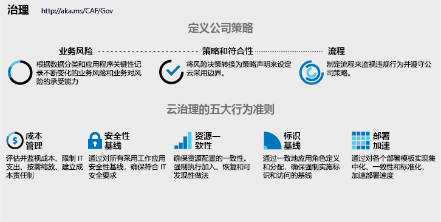

# 实施云治理策略

<!-- markdownlint-disable MD033 -->

<ul class="panelContent cardsI">
<li style="display: flex; flex-direction: column;">
    

        

            

                

对业务流程或技术平台的任何更改都会为企业带来风险。 云治理团队（其成员有时被称为云管理者）的任务是降低这些风险，同时尽可能减少对采用或创新工作的干扰。  不过，云治理要求的不只是技术实现。 在公司叙述或公司策略方面的细微变化也会对采用造成巨大影响。 在实施之前，务必在定义公司策略时考虑到 IT 之外的因素。  
                

            

        

    

</li>
<li style="display: flex; flex-direction: column;">
    <a href="../_images/operational-transformation-govern-highres.png" style="display: flex; flex-direction: column; flex: 1 0 auto;">
        

            

                

                    

 
<i>图 1.公司策略和云治理五大规则的图示</i>
                    

                

            

        

    </a>
</li>
</ul>

<!-- markdownlint-enable MD033 -->

## 定义公司策略

无论使用什么云平台，定义公司策略都应侧重于识别和降低业务风险。 健全的云治理策略首先拥有优良的企业策略。 以下由三个步骤组成的过程可引导此类策略的迭代开发。

<!-- markdownlint-disable MD033 -->

<ul  class="panelContent cardsF">
<li style="display: flex; flex-direction: column;">
    <a href="./policy-compliance/understanding-business-risk.md" style="display: flex; flex-direction: column; flex: 1 0 auto;">
        

            

                

                    

                        

                            
                        

                    

                    

                        <h3>业务风险</h3>
                        
通过调查当前的云采用计划和数据分类来识别企业面临的风险。 根据业务来平衡风险容限并降低成本。

                    

                

            

        

    </a>
</li>
<li style="display: flex; flex-direction: column;">
    <a href="./policy-compliance/define-policy.md" style="display: flex; flex-direction: column; flex: 1 0 auto;">
        

            

                

                    

                        

                            
                        

                    

                    

                        <h3>策略和符合性</h3>
                        
评估风险容限，告知管理云采用和降低风险的影响最小的策略。 在某些行业中，第三方符合性会影响初始策略的创建。

                    

                

            

        

    </a>
</li>
<li style="display: flex; flex-direction: column;">
    <a href="./policy-compliance/processes.md" style="display: flex; flex-direction: column; flex: 1 0 auto;">
        

            

                

                    

                        

                            
                        

                    

                    

                        <h3>进程</h3>
                        
在采用和创新活动过程中自然会发生策略违规。 执行相关进程有助于监视和强制执行对策略的遵从性。

                    

                

            

        

    </a>
</li>
</ul>

<!-- markdownlint-enable MD033 -->

## 后续步骤

良好的云治理策略始于了解业务风险。

> [!div class="nextstepaction"]
> [了解业务风险](./policy-compliance/understanding-business-risk.md)
