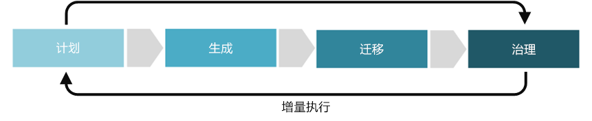

# 部署加速规则改进Deployment Acceleration discipline improvement

部署加速规则侧重于制定一系列策略，以确保可一致且重复地部署和配置资源，并在整个生命周期内保持合规性。The Deployment Acceleration discipline focuses on establishing policies that ensure that resources are deployed and configured consistently and repeatably, and remain in compliance throughout their lifecycle. 在云治理的五个规则中，部署加速包括有关自动部署、源管理部署项目、监视已部署资源，以维持所需状态和审核任何合规性问题的决策。Within the Five Disciplines of Cloud Governance, Deployment Acceleration includes decisions regarding automating deployments, source-controlling deployment artifacts, monitoring deployed resources to maintain desired state, and auditing any compliance issues.

本文概述了贵公司可以参与以更好制定和完善部署加速规则的一些潜在任务。This article outlines some potential tasks your company can engage in to better develop and mature the Deployment Acceleration discipline. 在实现云解决方案中，这些任务可分为计划、构建、采用和操作几个阶段，然后在允许开发[云治理增量方法](../journeys/overview.md#an-incremental-approach-to-cloud-governance)的基础上进行迭代。These tasks can be broken down into planning, building, adopting, and operating phases of implementing a cloud solution, which are then iterated on allowing the development of an [incremental approach to cloud governance](../journeys/overview.md#an-incremental-approach-to-cloud-governance).

*图 1.云治理增量方法的采用阶段。**Figure 1. Adoption phases of the incremental approach to cloud governance.*

单个文档很难涵盖所有的业务需求。It's impossible for any one document to account for the requirements of all businesses. 因此，本文针对治理成熟过程的每个阶段只概述了建议的最小和可能的示例活动。As such, this article outlines suggested minimum and potential example activities for each phase of the governance maturation process. 这些活动的初衷是帮助生成[策略 MVP](../journeys/overview.md#an-incremental-approach-to-cloud-governance)，并为增量策略演化建立框架。The initial objective of these activities is to help you build a [Policy MVP](../journeys/overview.md#an-incremental-approach-to-cloud-governance) and establish a framework for incremental policy evolution. 云治理团队将需要决定在这些活动需要投入多少成本才能提高标识基线治理能力。Your Cloud Governance team will need to decide how much to invest in these activities to improve your Identity Baseline governance capabilities.

> [!CAUTION]
> 本文列出的最小活动或可能的活动都不针对特定的企业策略或第三方合规性要求。Neither the minimum or potential activities outlined in this article are aligned to specific corporate policies or third party compliance requirements. 本指南旨在帮助促进对话，使两个需求与云治理模型保持一致。This guidance is designed to help facilitate the conversations that will lead to alignment of both requirements with a cloud governance model.

## 规划和准备情况Planning and readiness

这个治理成熟阶段弥合了业务结果与可操作策略之间的分歧。This phase of governance maturity bridges the divide between business outcomes and actionable strategies. 在此过程中，领导团队定义具体指标，将这些指标对应到数字资产，并开始规划整个迁移工作。During this process, the leadership team defines specific metrics, maps those metrics to the digital estate, and begins planning the overall migration effort.

最小建议的活动：**Minimum suggested activities:**

- 评估[部署加速工具链](toolchain.md)选项，并实现适用于组织的混合策略。Evaluate your [Deployment Acceleration toolchain](toolchain.md) options and implement a hybrid strategy that is appropriate to your organization.
- 制定草拟的“体系结构指南”文档并分发给关键的利益干系人。Develop a draft Architecture Guidelines document and distribute to key stakeholders.
- 培训受“体系结构指南”制定影响的人员和团队，并使其参与进来。Educate and involve the people and teams affected by the development of Architecture Guidelines.
- 培训开发团队和 IT 人员，让他们了解 DevSecOps 原则和策略，以及部署加速规则中完全自动化部署的重要性。Train development teams and IT staff to understand DevSecOps principles and strategies and the importance of fully automated deployments in the Deployment Acceleration Discipline.

可能的活动：**Potential activities:**

- 定义将管理云中部署加速的角色和工作。Define roles and assignments that will govern Deployment Acceleration in the cloud.

## 生成和预部署Build and pre-deployment

最小建议的活动：**Minimum suggested activities:**

- 对于新的基于云的应用程序，请在开发过程的早期引入完全自动化的部署。For new cloud-based applications, introduce fully automated deployments early in the development process. 此投入将提高测试流程的可靠性，并确保开发、QA 和生产环境的一致性。This investment will improve the reliability of your testing processes and ensure consistency across your development, QA, and production environments.
- 使用源管理平台（如 GitHub 或 Azure DevOps）存储所有部署项目，例如部署模板或配置脚本。Store all deployment artifacts such as deployment templates or configuration scripts using a source-control platform such as GitHub or Azure DevOps.
- 在实现[部署加速工具链](toolchain.md)之前，请考虑进行试验性测试，确保尽可能简化部署。Consider a pilot test before implementing your [Deployment Acceleration toolchain](toolchain.md), making sure it streamlines your deployments as much as possible. 在预部署阶段运用试验性测试的反馈，并根据需要重复测试。Apply feedback from pilot tests during the pre-deployment phase, repeating as needed.
- 评估应用程序的逻辑和物理架构，并确定使用其他基于云的资源自动部署应用程序资源或改进架构部分的机会。Evaluate the logical and physical architecture of your applications, and identify opportunities to automate the deployment of application resources or improve portions of the architecture using other cloud-based resources.
- 更新“体系结构指南”文档，以包含部署和用户采用计划，并分发给关键的利益干系人。Update the Architecture Guidelines document to include deployment and user adoption plans, and distribute to key stakeholders.
- 持续对受体系结构指导规则影响最大的人员和团队进行培训。Continue to educate the people and teams most affected by the architecture guidelines.

可能的活动：**Potential activities:**

- 定义持续集成和持续部署 (CI/CD) 管道，通过开发、QA 和生产环境完全管理对应用程序的发布更新。Define a continuous integration and continuous deployment (CI/CD) pipeline to fully manage releasing updates to your application through your development, QA, and production environments.

## 采用和迁移Adopt and migrate

迁移是侧重于在现有数字资产中移动、测试和采用应用程序或工作负载的增量过程。Migration is an incremental process that focuses on the movement, testing, and adoption of applications or workloads in an existing digital estate.

最小建议的活动：**Minimum suggested activities:**

- 将[部署加速工具链](toolchain.md)从开发迁移到生产环境。Migrate your [Deployment Acceleration toolchain](toolchain.md) from development to production.
- 更新“体系结构指南”文档并分发给关键的利益干系人。Update the Architecture Guidelines document and distribute to key stakeholders.
- 制定培训材料和文档、宣传、激励以及其他计划，帮助推动开发者和 IT 采用。Develop educational materials and documentation, awareness communications, incentives, and other programs to help drive developer and IT adoption.

可能的活动：**Potential activities:**

- 验证在生成和预部署阶段定义的最佳做法是否正确执行。Validate that the best practices defined during the build and pre-deployment phases are properly executed.
- 发布之前，确保每个应用程序或工作负载与部署加速策略保持一致。Ensure that each application or workload aligns with the Deployment Acceleration strategy before release.

## 运营和实施后Operate and post-implementation

转换完成后，治理和运维必须依存于应用程序或工作负载的自然生命周期。Once the transformation is complete, governance and operations must live on for the natural lifecycle of an application or workload. 治理成熟度这一阶段侧重于在实施解决方案并且转换周期开始稳定之后通常出现的活动。This phase of governance maturity focuses on the activities that commonly come after the solution is implemented and the transformation cycle begins to stabilize.

最小建议的活动：**Minimum suggested activities:**

- 根据组织不断变化的标识需求的变更，自定义[部署加速工具链](toolchain.md)。Customize your [Deployment Acceleration toolchain](toolchain.md) based on changes to your organization’s changing identity needs.
- 自动化通知和报表，提醒你出现潜在配置问题或恶意威胁。Automate notifications and reports to alert you of potential configuration issues or malicious threats.
- 监视并报告应用程序和资源使用情况。Monitor and report on application and resource usage.
- 报告部署后的指标并分发给利益干系人。Report on post-deployment metrics and distribute to stakeholders.
- 修订“体系结构指南”以指导未来的采用流程。Revise the Architecture Guidelines to guide future adoption processes.
- 继续定期培训受影响的人员和团队并保持沟通，确保持续遵循体系结构指南的说明。Continue to communicate with and train the affected people and teams on a regular basis to ensure ongoing adherence to Architecture Guidelines.

可能的活动：**Potential activities:**

- 配置所需的状态配置监视和报告工具。Configure a desired state configuration monitoring and reporting tool.
- 定期检查配置工具和脚本，以便改进流程并识别常见问题。Regularly review configuration tools and scripts to improve processes and identify common issues.
- 与开发、运营和安全团队合作，使 DevSecOps 做法日趋成熟，打破导致效率低下的组织孤岛。Work with development, operations, and security teams to help mature DevSecOps practices and break down organizational silos that lead to inefficiencies.

## 后续步骤Next steps

至此，你已了解云标识治理的概念，接下来，请检查[标识基线工具链](toolchain.md)，确定在 Azure 平台上开发标识基线治理规则时所需的 Azure 工具和功能。Now that you understand the concept of cloud identity governance, examine the [Identity Baseline toolchain](toolchain.md) to identify Azure tools and features that you'll need when developing the Identity Baseline governance discipline on the Azure platform.

> [!div class="nextstepaction"]
> [适用于 Azure 的标识基线工具链Identity Baseline toolchain for Azure](toolchain.md)
