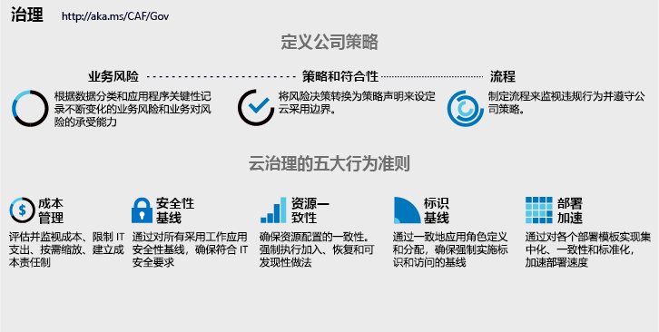

# 云治理的五个规则

<!-- markdownlint-disable MD033 -->

<ul class="panelContent cardsI">
<li style="display: flex; flex-direction: column;">
    

        

            

                

对业务流程或技术平台的任何更改都会带来风险。 云治理团队（其成员有时被称为云管理员）的任务是降低这些风险，同时尽可能减少对采用或创新工作的干扰。  CAF 治理模型通过重点关注<a href="#corporate-policy">制定公司策略</a>和<a href="#disciplines-of-cloud-governance">云治理规则</a>，指导这些决策（而不考虑所选的云平台）。 <a href="#actionable-journeys">可操作设计指南</a>使用 Azure 服务演示了此模型。 本文可作为 CAF 治理模型五大规则的登录页面。
                

            

        

    

</li>
<li style="display: flex; flex-direction: column;">
    <a href="../_images/operational-transformation-govern-highres.png" style="display: flex; flex-direction: column; flex: 1 0 auto;">
        

            

                

                    

 
<i>图 1.公司策略和云治理五大规则的图示</i>
                    

                

            

        

    </a>
</li>
</ul>

<!-- markdownlint-enable MD033 -->

## 云治理规则

在每个云提供商中，都有通用的云治理规则，可以作为指导，帮助通知策略和协调工具链。 这些规则指导关于适当自动化级别和跨云提供商强制实施公司策略的决策。

<!-- markdownlint-disable MD033 -->

<ul class="panelContent cardsA">
<li style="display: flex; flex-direction: column;">
    <a href="./cost-management/overview.md" style="display: flex; flex-direction: column; flex: 1 0 auto;">
        

            

                

                    

                        

                            
                        

                    

                    

                        <h3>成本管理</h3>
                        
成本是云用户的主要考虑因素。 制定适用于所有云平台成本控制的策略。

                    

                

            

        

    </a>
</li>
<li style="display: flex; flex-direction: column;">
    <a href="./security-baseline/overview.md" style="display: flex; flex-direction: column; flex: 1 0 auto;">
        

            

                

                    

                        

                            
                        

                    

                    

                        <h3>安全基线</h3>
                        
安全是一个复杂且个人的主题，对每个公司都是唯一的。 确立安全要求后，云治理策略和实施将跨网络、数据和资产配置应用这些要求。

                    

                

            

        

    </a>
</li>
<li style="display: flex; flex-direction: column;">
    <a href="./identity-baseline/overview.md" style="display: flex; flex-direction: column; flex: 1 0 auto;">
        

            

                

                    

                        

                            
                        

                    

                    

                        <h3>标识基线</h3>
                        
标识要求的应用程序不一致会增加漏洞风险。 标识基线规则重点关注确保标识在云采用工作量中一致应用的方式。

                    

                

            

        

    </a>
</li>
<li style="display: flex; flex-direction: column;">
    <a href="./resource-consistency/overview.md" style="display: flex; flex-direction: column; flex: 1 0 auto;">
        

            

                

                    

                        

                            
                        

                    

                    

                        <h3>资源一致性</h3>
                        
云操作取决于资源配置的一致性。 通过治理工具，资源可以一致配置，以缓解与入职、偏移、可发现性和恢复相关的风险。

                    

                

            

        

    </a>
</li>
<li style="display: flex; flex-direction: column;">
    <a href="./deployment-acceleration/overview.md" style="display: flex; flex-direction: column; flex: 1 0 auto;">
        

            

                

                    

                        

                            
                        

                    

                    

                        <h3>部署加速</h3>
                        
部署和配置方法中的集中、标准化和一致性可改进治理实践。 当通过基于云的治理工具提供时，它们将创建可加速部署活动的云因素。

                    

                

            

        

    </a>
</li>
</ul>

<!-- markdownlint-enable MD033 -->
