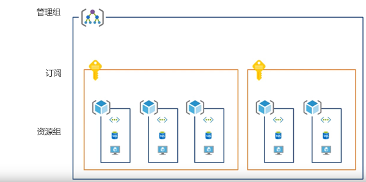
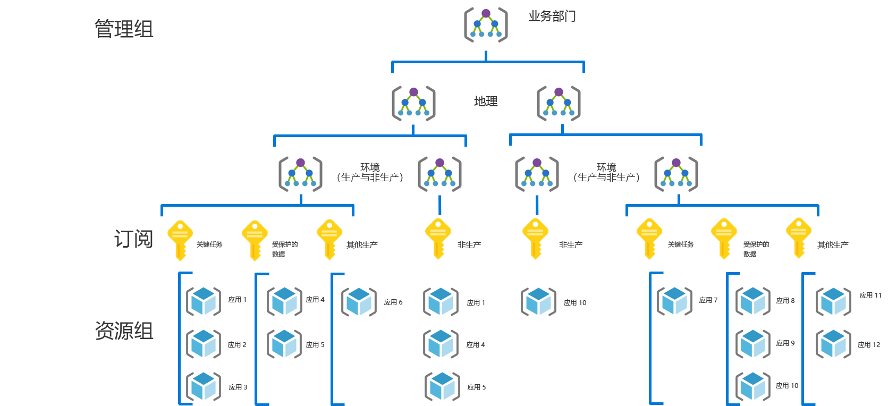
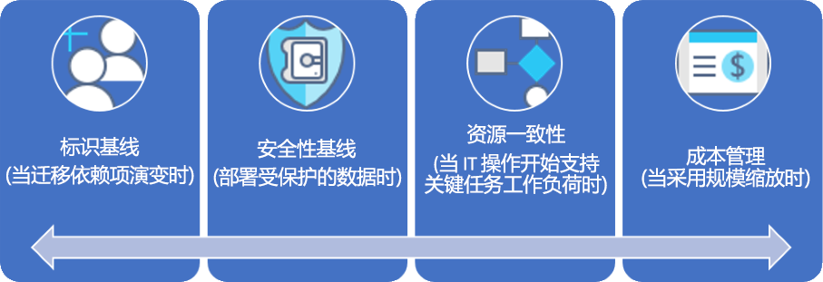

# CAF：大型企业治理之旅

## 最佳做法概述

此治理过程遵循虚构公司在治理成熟的各个阶段的经验。 它基于实际客户过程。 建议的最佳做法基于虚构公司的约束和需求。

作为快速起点，本概述根据最佳做法定义了治理的最低可行产品 (MVP)。 本概述还提供了一些治理演变的链接。随着新的业务或技术风险的出现，这些演变将添加更多的最佳做法。

> [!WARNING]
> 此 MVP 是基于一组假设的基线起始点。 即使是这一组最低限度的最佳做法，也是基于唯一的业务风险和风险承受能力驱动的企业策略。 若要查看这些假设是否适用，请阅读本文后面的[长文](./narrative.md)。

### 治理最佳做法

此最佳做法可作为组织可用于快速一致地在多个 Azure 订阅中添加治理护栏的基础。

### 资源组织

下图显示用于组织资源的治理 MVP 层次结构。

应将每个应用程序部署在管理组、订阅和资源组层次结构的适当区域中。 在部署规划期间，云治理团队将在层次结构中创建必要的节点，为云采用团队提供支持。

1. 每个业务单位的管理组的详细层次结构反映了地理位置，然后是环境类型（生产、非生产）。
2. 订阅业务单位、地理位置、环境和“应用程序分类”的每个唯一组合。
3. 每个应用程序的单独资源组。
4. 应在此分组层次结构的每个级别应用一致的命名法。

这些模式提供了增长空间，而不会导致不必要的层次结构复杂化。

[!INCLUDE [governance-of-resources](../../../../../includes/cloud-adoption/governance/governance-of-resources.md)]

## 治理演变

部署此 MVP 后，其他的治理层可以快速整合到环境中。 以下是一些发展 MVP 以满足特定业务需求的方法：

- [适用于受保护数据的安全基线](./security-baseline-evolution.md)
- [关键任务应用程序的资源配置](./resource-consistency-evolution.md)
- [成本管理控制](./cost-management-evolution.md)
- [多云演变控制](./multi-cloud-evolution.md)

<!-- markdownlint-disable MD026 -->

## 此最佳做法有什么作用？

在 MVP 中，建立了[部署加速](../../deployment-acceleration/overview.md)规则的做法和工具，以快速应用公司策略。 具体而言，MVP 使用 Azure 蓝图、Azure Policy 和 Azure 管理组来应用一些基本的公司策略（例如，此虚构公司的说明中定义的策略）。 使用 Azure 资源管理器模板和 Azure 策略应用这些公司策略，为标识和安全性建立非常小的基线。

## 不断演变的最佳做法

随着时间的推移，这种治理 MVP 将用于改进治理做法。 随着采用的发展，业务风险也会增加。 CAF 治理模型中的各种规则将不断改进，以缓解这些风险。 本系列的后续文章讨论了影响虚构公司的公司策略的演变。 这些演变的发生跨三项规则：

- 标识基线，作为迁移依赖项在叙述中的演变
- 成本管理，作为采用规模。
- 安全基线，作为受保护的数据部署。
- 资源一致性，作为 IT 操作开始支持任务关键型工作负荷。

## 后续步骤

现在你熟悉了治理 MVP 并了解了要遵循的治理演变，请阅读其他上下文的支持说明。

> [!div class="nextstepaction"]
> [阅读支持说明](./narrative.md)
