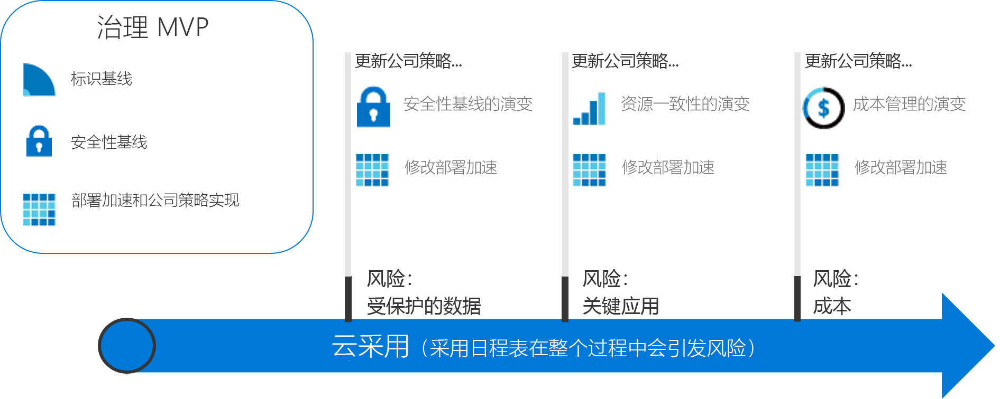

# 可操作的治理过程

本部分的治理过程阐释了 CAF 治理模型的增量方法。 你可以建立一个敏捷的治理平台，通过不断发展以满足任何云治理场景的需求。

## 评审并采用云治理最佳做法

若要启动采用路径，请选择以下过程之一。 每个过程都根据一组虚构的客户体验概述了一系列最佳做法。 对于不熟悉 CAF 治理模型增量方法的读者，建议在采用任一最佳做法之前，请先阅读下面的治理理论概述。

<!-- markdownlint-disable MD033 -->

<ul class="panelContent cardsZ">
<li style="display: flex; flex-direction: column;">
    <a href="./small-to-medium-enterprise/overview.md" style="display: flex; flex-direction: column; flex: 1 0 auto;">
        

            

                

                    

                        <h3>小到中型企业</h3>
                        
该治理过程适用于：拥有的数据中心不超过 5 个，并通过中央 IT 或成本分析模型管理成本的企业。

                    

                

            

        

    </a>
</li>
<li style="display: flex; flex-direction: column;">
    <a href="./large-enterprise/overview.md" style="display: flex; flex-direction: column; flex: 1 0 auto;">
        

            

                

                    

                        <h3>大型企业</h3>
                        
该治理过程适用于：拥有的数据中心超过 5 个，并跨多个业务部门管理成本的企业。

                    

                

            

        

    </a>
</li>
</ul>

<!-- markdownlint-enable MD033 -->

## 云治理的增量方法

采用云是一个过程，而非终点。 在这个过程中，设定有明确的里程碑和有形的业务效益。 但是，当公司开始这一过程时，采用云的最终状态通常是未知的。 云治理创建了防范措施，确保公司在整个过程中保持安全。

这些治理过程基于实际客户的过程介绍了虚构公司的体验。 每个过程都完整展示了客户在云采用中的各个治理方面。

### 建立最终状态

没有目标的旅程只是盲目漫游。 在开始第一步前，请务必对最终状态有一个粗略的了解是。 下面的信息图提供了最终状态的参考框架。 它不是你的起点，但显示了你的潜在目标。

CAF 治理模型确定了过程中的重要关键区域。 由于采用了更多的云服务，每个区域都涉及公司必须解决的不同类型的风险。 在此框架中，治理过程标识云治理团队所需的操作。 在此过程中，还将进一步描述 CAF 治理模型的每个原则。 从广义上说，这些原则包括：

公司策略。 公司策略推动云治理。 治理过程将侧重于公司策略的特定方面：

- 业务风险：识别和了解公司风险。
- 策略和符合性：将风险转换成支持任何符合性要求的策略声明。
- 流程：确保遵守规定的策略。

云治理的五个规则。 这些规则支持公司策略。 每个规则可帮助公司避免潜在陷阱：

- 成本管理
- 安全基线
- 资源一致性
- 标识基线
- 部署加速

从根本上讲，公司策略是一个早期预警系统，可用来发现潜在问题。 这些规则有助于公司降低风险，并建立防范措施。

### 发展到最终状态

由于治理需求将在整个云采用过程中不断演进，因此，需要一种不同的治理方法。 公司不能再坐等小团队在每条高速公路上建造护栏和画好路线图，然后再迈出第一步。 应更快速顺利地生成业务结果。 IT 治理还必须快速发展，并与业务需求保持同步，以便在云采用期间保持相关度，避免成为“影子 IT”。

增量治理方法支持这些特征。 增量治理依赖于一小组公司策略、流程和工具，以便为采用和治理建立基础。 该基础被称为“最小可行性产品 (MVP)”。 通过建立 MVP，治理团队可在整个采用生命周期中快速地将治理付诸实施。 在云采用过程中，可以在任何时候建立 MVP。 但是，最好尽早采用 MVP。

快速响应变化中风险的能力可使云治理团队以新的方式参与进来。 云治理团队可以作为侦察员身份加入云策略团队，领先于云采用团队、绘制路线，并快速建立防范措施，以缓解与采用计划相关的风险。 这些实时治理层称为“治理演变”。 通过这种方法，治理策略发展将领先于云采用团队。

下图显示了一个简单的治理 MVP 和三个治理演变。 在演变过程中，定义了额外的公司策略来缓解新的风险。 然后，部署加速规则在每个部署中应用这些更改。

> [!NOTE]
> 治理不是安全、网络、标识、财务、DevOps 或运维等关键职能部门的替代。 在此过程中，将与来自每个职能团队的成员进行交互并依赖于这些成员。 这些成员应纳入云治理团队中，以加速决策和操作。

## 选择治理过程

这些过程展示了如何实现治理 MVP。 在这里，每个过程都展示了云治理团队如何领先于云采用团队，以合作伙伴的身份加速采用进程。 CAF 治理模型将指导从基础到后续演进的治理应用。

若要开始治理过程，请选择以下两个选项之一。 这些选项基于综合客户体验。 为便于导航，标题基于企业规模划分。 但是，读者的决策可能更为复杂。 下表概述了这两个选项之间的差异。

> [!NOTE]
> 这两种过程都不太可能完全符合你的情况。 请选择最接近的过程作为起点。 在整个过程中，还提供了其他信息来帮助你自定义决策，以满足特定条件。

### 业务特征

|                                            | 小到中型企业                                                                              | 大型企业                                                                                               |
|--------------------------------------------|---------------------------------------------------------------------------------------------------------|----------------------------------------------------------------------------------------------------------------|
| 地理位置（国家/地区或地缘政治区域） | 客户或员工主要居住在一个地理位置                                                      | 客户或员工居住在多个地理位置                                                              |
| 受影响的业务部门                    | 单个业务部门                                                                                    | 多个业务部门                                                                                        |
| IT 预算                                  | 单个 IT 预算                                                                                        | 各业务部门分配的预算                                                                         |
| IT 投入                             | 资本支出 (CapEx) 驱动的投入每年计划一次，通常仅涵盖基本维护。 | 资本支出驱动的投资每年计划一次，通常包括维护和 3 到 5 年的更新周期。 |

### 采用云治理之前的当前状态

|                                             | 小到中型企业                                                                               | 大型企业                                                                                                          |
|---------------------------------------------|----------------------------------------------------------------------------------------------------------|---------------------------------------------------------------------------------------------------------------------------|
| 数据中心或第三方托管提供商 | 少于五个数据中心                                                                                  | 五个以上数据中心                                                                                                   |
| 网络                                  | 没有 WAN 或 1 &ndash; 2 WAN 提供商                                                                             | 复杂网络或全局 WAN                                                                                             |
| 标识                                    | 单林、单域。 不要求基于声明的身份验证或第三方 MFA 设备。 | 复杂、多个林、多个域。 应用程序需要基于声明的身份验证或第三方 MFA 设备。 |

### 在演进云治理之后所需的未来状态

|                                              | 小到中型企业                                                                        | 大型企业                                                                                        |
|----------------------------------------------|---------------------------------------------------------------------------------------------------|---------------------------------------------------------------------------------------------------------|
| 成本管理 - 云会计           | 成本分析模型。 账单通过 IT 集中。                                                | 退款模型。 可以通过 IT 采购分发账单。                                  |
| 安全基线 - 受保护的数据           | 公司财务数据和 IP。 有限的客户数据。 无第三方合规性要求。     | 多个客户的财务和 PII 数据集合。 可能需要考虑第三方合规性。 |
| 资源一致性 - 任务关键型应用程序 | 服务中断会带来不便，但不会造成经济损失。 现有 IT 操作相对不成熟。 | 服务中断已定义并监控财务影响。 IT 运维已建立且成熟。         |

对于投入云治理的客户来说，这两种过程代表两种极端的体验。 大多数公司的反映都结合了上述两种情况。 在评审过程之后，使用 CAF 治理模型来启动治理对话，并修改基线过程，以更加贴近你的需求。

## 后续步骤

选择以下过程之一：

> [!div class="nextstepaction"]
> [小到中型企业治理过程](./small-to-medium-enterprise/overview.md)
>
> [大型企业治理过程](./large-enterprise/overview.md)
