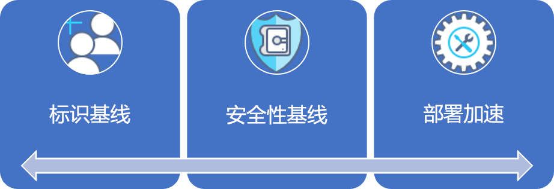
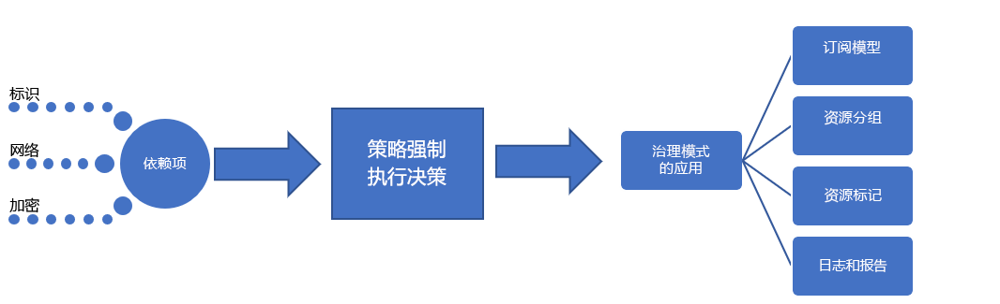

# 中小型企业：最佳做法介绍Small-to-medium enterprise: Best practice explained

治理过程由一组初始[企业策略](./initial-corporate-policy.md)开始。The governance journey starts with a set of initial [corporate policies](./initial-corporate-policy.md). 这些策略用于建立反映[最佳做法](./overview.md)的治理 MVP。These policies are used to establish a governance MVP that reflects [best practices](./overview.md).

在本文中，我们将讨论创建治理 MVP 所需的高级策略。In this article, we discuss the high-level strategies that are required to create a governance MVP. 治理 MVP 的核心是[部署加速](../../deployment-acceleration/overview.md)规则。The core of the governance MVP is the [Deployment Acceleration](../../deployment-acceleration/overview.md) discipline. 此阶段应用的工具和模式将实现未来扩大治理所需的增量演变。The tools and patterns applied at this stage will enable the incremental evolutions needed to expand governance in the future.

## 治理 MVP（云采用基础）Governance MVP (Cloud Adoption Foundation)

得益于多个简单原则和基于云的治理工具，可实现快速采用治理和公司策略。Rapid adoption of governance and corporate policy is achievable, thanks to a few simple principles and cloud-based governance tooling. 这些是方法在任何管理进程中前三个领域。These are the first three disciplines to approach in any governance process. 本文将充分叙述每个规则。Each will be expanded upon in this article.

为了建立基础，本文将讨论创建治理 MVP 所需的标识基线、安全基线和部署加速背后的高级策略，它将作为所有采用的基础。To establish the starting point, this article will discuss the high-level strategies behind Identity Baseline, Security Baseline, and Deployment Acceleration that are required to create a governance MVP, which will serve as the foundation for all adoption.

## 实现进程Implementation process

治理 MVP 的实现对标识、安全性和网络具有依赖关系。The implementation of the governance MVP has dependencies on Identity, Security, and Networking. 解决依赖项后，云治理团队将决定治理的几个方面。Once the dependencies are resolved, the Cloud Governance team will decide a few aspects of governance. 来自云治理团队和支持团队的决策将通过强制资产的单个包来实现。The decisions from the Cloud Governance team and from supporting teams will be implemented through a single package of enforcement assets.

还可以使用简单的清单来描述此实现：This implementation can also be described using a simple checklist:

1. 征求关于核心依赖关系的决定：标识、网络和加密。Solicit decisions regarding core dependencies: Identity, Network, and Encryption.
2. 确定要在企业策略强制执行期间使用的模式。Determine the pattern to be used during corporate policy enforcement.
3. 确定资源一致性、 资源标记和日志记录和报告领域的相应管理模式。Determine the appropriate governance patterns for the Resource Consistency, Resource Tagging, and Logging and Reporting disciplines.
4. 实施与所选策略强制执行模式一致的治理工具，以应用依赖决策和治理决策。Implement the governance tools aligned to the chosen policy enforcement pattern to apply the dependent decisions and governance decisions.

[!INCLUDE [implementation-process](../../../../../includes/cloud-adoption/governance/implementation-process.md)]

## 治理定义模式的应用程序Application of governance-defined patterns

云治理团队负责以下决策和实现。The Cloud Governance team is responsible for the following decisions and implementations. 许多人需要其他团队的意见，但云治理团队可能同时拥有决策和实施。Many require inputs from other teams, but the Cloud Governance team is likely to own both the decision and the implementation. 下列部分概述了针对此用例的决策以及每个决策的详细信息。The following sections outline the decisions made for this use case and details of each decision.

### 订阅模型Subscription model

已为 Azure 订阅选择“应用程序类别”模式。The **Application Category** pattern has been chosen for Azure subscriptions.

- 应用程序原型是一种对具有类似需求的应用程序进行分组的方法。An application archetype is a way to group applications with similar needs. 常见示例包括：具有受保护数据的应用程序、受治理的应用程序（例如 HIPAA 或 FedRAMP）、低风险应用程序、具有本地依赖项的应用程序、Azure 中的 SAP 或其他大型机、或扩展本地 SAP 或大型机的应用程序。Common examples include: Applications with protected data, governed applications (such as HIPAA or FedRAMP), low- risk applications, applications with on-premises dependencies, SAP or other mainframes in Azure, or applications that extend on-premises SAP or mainframes. 根据数据分类和支持业务的应用程序类型，这些原型在每个组织中都是独一无二的。These archetypes are unique per organization, based on data classifications and the types of applications that power the business. 数字资产的依赖项映射可帮助在组织中定义应用程序原型。Dependency mapping of the digital estate can aid in defining the application archetypes in an organization.
- 鉴于目前的重点，不太可能需要部门。Departments are not likely to be required given the current focus. 预计部署将限制在单个计费单元内。Deployments are expected to be constrained within a single billing unit. 在采用阶段，甚至可能没有企业协议来集中计费。At the stage of adoption, there may not even be an enterprise agreement to centralize billing. 此级别的采用很有可能由单个即用即付的 Azure 订阅进行管理。It's likely that this level of adoption is being managed by a single pay-as-you-go Azure subscription.
- 不考虑 EA 门户的使用或企业协议的存在，仍然应该定义并同意订阅模型，以最大限度地减少管理成本，而不仅仅是计费。Regardless of the use of the EA Portal or the existence of an enterprise agreement, a subscription model should still be defined and agreed upon to minimize administrative overheard beyond just billing.
- 在“应用程序类别”模式中，为每个应用程序原型创建订阅。In the **Application Category** pattern, subscriptions are created for each application archetype. 每个订阅属于每个环境（开发、测试和生产）的帐户。Each subscription belongs to an account per environment (Development, Test, and Production).
- 作为订阅设计的一部分，应根据前两点同意共同的命名约定。A common naming convention should be agreed on as part of the subscription design, based on the previous two points.

### 资源一致性Resource Consistency

已选择“部署一致性”作为资源一致性。The **Deployment Consistency** pattern has been chosen as a Resource Consistency.

- 为每个应用程序创建资源组。Resource groups are created for each application. 为每个应用程序原型创建管理组。Management groups are created for each application archetype. Azure Policy 应该应用于所有来自相关管理组的订阅。Azure Policy should be applied to all subscriptions from the associated management group.
- 作为部署过程的一部分，资源组的 Azure 资源一致性模板应该存储在源代码管理中。As part of the deployment process, Azure Resource Consistency templates for the resource group should be stored in source control.
- 每个资源组都和特定的工作负荷或应用程序相关联。Each resource group is associated with a specific workload or application.
- 随着公司政策的成熟，Azure 管理组可以更新治理设计。Azure management groups enable updating governance designs as corporate policy matures.
- Azure Policy 的广泛实施可能超出团队的时间承诺，目前可能无法提供大量值。Extensive implementation of Azure Policy could exceed the team’s time commitments and may not provide a great deal of value at this time. 但是，应创建简单的默认策略并将其应用于每个管理组，以强制实施少量的当前云治理策略声明。However, a simple default policy should be created and applied to each management group to enforce the small number of current cloud governance policy statements. 此策略将定义特定治理要求的实现。This policy will define the implementation of specific governance requirements. 可在所有已部署的资产中应用这些实现。Those implementations can then be applied across all deployed assets.

### 资源标记Resource tagging

已选择要标记的“分类”模式作为资源标记的模型。The **Classification** pattern to tagging has been chosen as a model for resource tagging.

- 已部署的资产应使用以下值标记：数据分类、紧迫性、SLA 和环境。Deployed assets should be tagged with the following values: Data Classification, Criticality, SLA, and Environment.
- 这四个值将决定治理、操作和安全决策。These four values will drive governance, operations, and security decisions.
- 如果正在为大型公司内的业务部门或团队实施此治理之旅，则标记还应包括计费单元的元数据。If this governance journey is being implemented for a business unit or team within a larger corporation, tagging should also include metadata for the billing unit.

### 日志记录和报告Logging and reporting

此时，建议使用“云原生”模式进行日志记录和报告，但不需要任何开发团队。At this point, a **Cloud Native** pattern to logging and reporting is suggested but not required of any development team.

- 没有针对为日志记录或报告目的而收集的数据设置治理要求。No governance requirements have been set regarding the data to be collected for logging or reporting purposes.
- 在发布任何受保护数据或任务关键型工作负荷之前，还需要进行其他分析。Additional analysis will be needed before releasing any protected data or mission-critical workloads.

## 治理进程的演变Evolution of governance processes

随着治理的发展，一些策略声明不能或不应受自动化工具控制。As governance evolves, some policy statements can’t or shouldn’t be controlled by automated tooling. 其他策略将导致 IT 安全团队和本地标识管理团队随着时间的推移而付出努力。Other policies will result in effort by the IT Security team and the on-premises Identity Management team over time. 为了帮助避免出现新的风险，云治理团队将监督以下进程。To help mitigate new risks as they arise, the Cloud Governance team will oversee the following processes.

**采用加速**：云治理团队已查看过多个团队的部署脚本。**Adoption acceleration**: The Cloud Governance team has been reviewing deployment scripts across multiple teams. 它们维护一组用作部署模板的脚本。They maintain a set of scripts that serve as deployment templates. 云采用和 DevOps 团队使用这些模板来更快地定义部署。Those templates are used by the cloud adoption and DevOps teams to define deployments more quickly. 这些脚本的每一个都包含强制执行多个治理策略的必要需求，且不需要云采用工程师的任何额外协助。Each of those scripts contains the necessary requirements to enforce a number of governance policies, with no additional effort from cloud adoption engineers. 作为这些脚本的管理人，云治理团队可以更快地实现策略更改。As the curators of these scripts, the Cloud Governance team can more quickly implement policy changes. 作为脚本管理的结果，云治理团队被视为采用加速的来源。As a result of script curation, the Cloud Governance team is seen as a source of adoption acceleration. 这将在部署之间创建一致性，但没有严格强制遵守。This creates consistency among deployments, without strictly forcing adherence.

**工程师培训**：云治理团队提供双月培训课程，并为工程师创建了两个视频。**Engineer training**: The Cloud Governance team offers bi-monthly training sessions and has created two videos for engineers. 这些资料帮助工程师快速了解治理文化和部署期间的工作方式。These materials help engineers quickly learn the governance culture and how things are done during deployments. 该团队正在添加培训资产，以显示生产和非生产部署之间的差异，以便工程师了解新策略将如何影响采用。The team is adding training assets that show the difference between production and non-production deployments, so that engineers will understand how the new policies will affect adoption. 这将在部署之间创建一致性，但没有严格强制遵守。This creates consistency among deployments, without strictly forcing adherence.

**部署计划**：部署任何包含受保护数据的资产之前，云治理团队将查看部署脚本，以验证治理对齐方式。**Deployment planning**: Before deploying any asset containing protected data, the Cloud Governance team will review deployment scripts to validate governance alignment. 将使用编程工具审核具有已批准部署的现有团队。Existing teams with previously approved deployments will be audited using programmatic tooling.

**月度审核和报告**：云治理团队每个月都会对所有云部署进行审核，以验证是否继续与策略保持一致。**Monthly audit and reporting**: Each month, the Cloud Governance team runs an audit of all cloud deployments to validate continued alignment to policy. 如果发现偏差，则会记录并共享给云采用团队。When deviations are discovered, they are documented and shared with the cloud adoption teams. 当强制执行不会导致业务中断或数据泄漏时，策略会自动强制执行。When enforcement doesn't risk a business interruption or data leak, the policies are automatically enforced. 审核结束时，云治理团队将为云策略团队和每个云采用团队编译一份报告，以传达策略的整体遵从情况。At the end of the audit, the Cloud Governance team compiles a report for the Cloud Strategy team and each cloud adoption team to communicate overall adherence to policy. 此外，也将存储本报告用于审核和法律目的。The report is also stored for auditing and legal purposes.

**季度策略评审**：云治理团队和云策略团队每个季度都会评审审核结果并对公司策略提出更改建议。**Quarterly policy review**: Each quarter, the Cloud Governance team and the Cloud Strategy team will review audit results and suggest changes to corporate policy. 其中许多建议是持续改进和观察使用模式得出的结果。Many of those suggestions are the result of continuous improvements and the observation of usage patterns. 批准的策略变更在后续审计周期中被整合到治理工具中。Approved policy changes are integrated into governance tooling during subsequent audit cycles.

## 备用模式Alternative patterns

如果在此治理之旅中选择的任何模式与读者的要求不一致，则可以使用每种模式的替代方法：If any of the patterns selected in this governance journey don't align with the reader's requirements, alternatives to each pattern are available:

- [加密模式Encryption patterns](../../../decision-guides/encryption/overview.md)
- [标识模式Identity patterns](../../../decision-guides/identity/overview.md)
- [日志记录和报告模式Logging and Reporting patterns](../../../decision-guides/log-and-report/overview.md)
- [策略强制执行模式Policy Enforcement patterns](../../../decision-guides/policy-enforcement/overview.md)
- [资源一致性模式Resource Consistency patterns](../../../decision-guides/resource-consistency/overview.md)
- [资源标记模式Resource Tagging patterns](../../../decision-guides/resource-tagging/overview.md)
- [软件定义的网络模式Software Defined Network patterns](../../../decision-guides/software-defined-network/overview.md)
- [订阅设计模式Subscription Design patterns](../../../decision-guides/subscriptions/overview.md)

## 后续步骤Next steps

实施本指南后，每个云采用团队都可以建立健全的治理基础。Once this guide is implemented, each cloud adoption team can go forth with a sound governance foundation. 云治理团队将并行工作，不断更新公司策略和治理规则。The Cloud Governance team will work in parallel to continuously update the corporate policies and governance disciplines.

两个团队将使用公差指标来确定继续支持云采用所需的下一步发展。The two teams will use the tolerance indicators to identify the next evolution needed to continue supporting cloud adoption. 对于此旅程中的虚拟公司而言，下一步是发展安全基线，以支持将受保护的数据移至云端。For the fictional company in this journey, the next step is evolving the Security Baseline to support moving protected data to the cloud.

> [!div class="nextstepaction"]
> [安全基线演变Security Baseline evolution](./security-baseline-evolution.md)