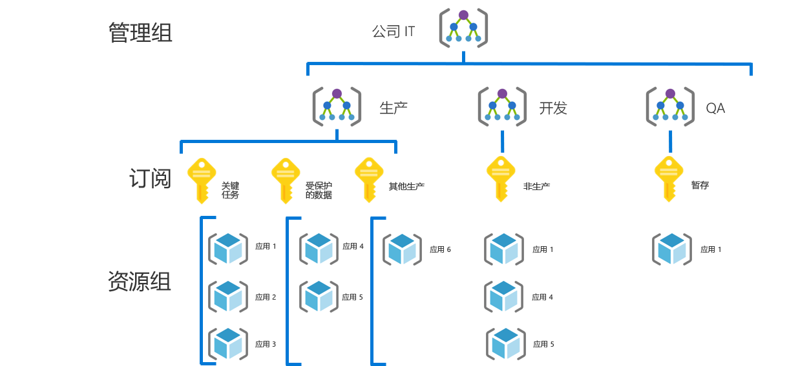

# 中小型企业治理过程Small-to-medium enterprise governance journey

## 最佳做法概述Best practice overview

此治理过程遵循虚构公司在治理成熟的各个阶段的经验。This governance journey follows the experiences of a fictional company through various stages of governance maturity. 它基于实际客户过程。It is based on real customer journeys. 建议的最佳做法基于虚构公司的约束和需求。The suggested best practices are based on the constraints and needs of the fictional company.

作为快速起点，本概述根据最佳做法定义了治理的最低可行产品 (MVP)。As a quick starting point, this overview defines a minimum viable product (MVP) for governance based on best practices. 本概述还提供了一些治理演变的链接。随着新的业务或技术风险的出现，这些演变将添加更多的最佳做法。It also provides links to some governance evolutions that add further best practices as new business or technical risks emerge.

> [!WARNING]
> 此 MVP 是基于一组假设的基线起始点。This MVP is a baseline starting point, based on a set of assumptions. 即使是这一组最低限度的最佳做法，也是基于唯一的业务风险和风险承受能力驱动的企业策略。Even this minimal set of best practices is based on corporate policies driven by unique business risks and risk tolerances. 若要查看这些假设是否适用，请阅读本文后面的[长文](./narrative.md)。To see if these assumptions apply to you, read the [longer narrative](./narrative.md) that follows this article.

## 治理最佳做法Governance best practice

此最佳做法可作为组织可用于快速一致地在多个 Azure 订阅中添加治理护栏的基础。This best practice serves as a foundation that an organization can use to quickly and consistently add governance guardrails across multiple Azure subscriptions.

### 资源组织Resource organization

下图显示用于组织资源的治理 MVP 层次结构。The following diagram shows the governance MVP hierarchy for organizing resources.

应将每个应用程序部署在管理组、订阅和资源组层次结构的适当区域中。Every application should be deployed in the proper area of the management group, subscription, and resource group hierarchy. 在部署规划期间，云治理团队将在层次结构中创建必要的节点，为云采用团队提供支持。During deployment planning, the Cloud Governance team will create the necessary nodes in the hierarchy to empower the cloud adoption teams.  

1. 每种类型的环境（如生产、开发和测试）的管理组。A management group for each type of environment (such as Production, Development, and Test).
2. 每个“应用程序分类”的订阅。A subscription for each "application categorization".
3. 每个应用程序的单独资源组。A separate resource group for each application.
4. 应在此分组层次结构的每个级别应用一致的命名法。Consistent nomenclature should be applied at each level of this grouping hierarchy.

下面是此模式的使用示例：Here is an example of this pattern in use:

这些模式提供了增长空间，而不会导致不必要的层次结构复杂化。These patterns provide room for growth without complicating the hierarchy unnecessarily.

[!INCLUDE [governance-of-resources](../../../../../includes/cloud-adoption/governance/governance-of-resources.md)]

## 治理演变Governance evolutions

部署此 MVP 后，其他的治理层可以快速整合到环境中。Once this MVP has been deployed, additional layers of governance can be quickly incorporated into the environment. 以下是一些发展 MVP 以满足特定业务需求的方法：Here are some ways to evolve the MVP to meet specific business needs:

- [适用于受保护数据的安全基线Security Baseline for protected data](./security-baseline-evolution.md)
- [关键任务应用程序的资源配置Resource configurations for mission-critical applications](./resource-consistency-evolution.md)
- [成本管理控制Controls for Cost Management](./cost-management-evolution.md)
- [多云演变控制Controls for multi-cloud evolution](./multi-cloud-evolution.md)

<!-- markdownlint-disable MD026 -->

## 此最佳做法有什么作用？What does this best practice do?

在 MVP 中，建立了[部署加速](../../deployment-acceleration/overview.md)规则的做法和工具，以快速应用公司策略。In the MVP, practices and tools from the [Deployment Acceleration](../../deployment-acceleration/overview.md) discipline are established to quickly apply corporate policy. 具体而言，MVP 使用 Azure 蓝图、Azure Policy 和 Azure 管理组来应用一些基本的公司策略（例如，此虚构公司的说明中定义的策略）。In particular, the MVP uses Azure Blueprints, Azure Policy, and Azure management groups to apply a few basic corporate policies, as defined in the narrative for this fictional company. 使用 Azure 资源管理器模板和 Azure 策略应用这些公司策略，为标识和安全性建立非常小的基线。Those corporate policies are applied using Resource Manager templates and Azure policies to establish a very small baseline for identity and security.

## 不断演变的最佳做法Evolving the best practice

随着时间的推移，这种治理 MVP 将用于改进治理做法。Over time, this governance MVP will be used to evolve the governance practices. 随着采用的发展，业务风险也会增加。As adoption advances, business risk grows. CAF 治理模型中的各种规则将不断改进，以缓解这些风险。Various disciplines within the CAF governance model will evolve to mitigate those risks. 本系列的后续文章讨论了影响虚构公司的公司策略的演变。Later articles in this series discuss the evolution of corporate policy affecting the fictional company. 这些演变的发生跨三项规则：These evolutions happen across three disciplines:

- 成本管理，作为采用规模。Cost Management, as adoption scales.
- 安全基线，作为受保护的数据部署。Security Baseline, as protected data is deployed.
- 资源一致性，作为 IT 操作开始支持任务关键型工作负荷。Resource Consistency, as IT Operations begins supporting mission-critical workloads.

## 后续步骤Next steps

现在你熟悉了治理 MVP 并了解了要遵循的治理演变，请阅读其他上下文的支持说明。Now that you’re familiar with the governance MVP and have an idea of the governance evolutions to follow, read the supporting narrative for additional context.

> [!div class="nextstepaction"]
> [阅读支持说明Read the supporting narrative](./narrative.md)
