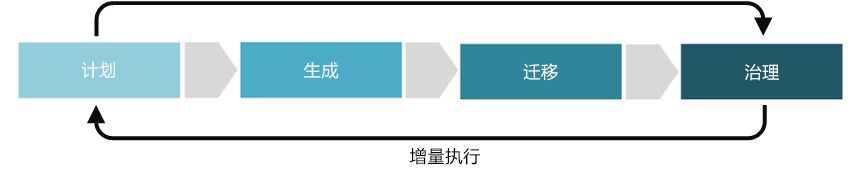

# 资源一致性规则改进

资源一致性规则侧重于建立与环境、应用程序或工作负载的运营管理相关的策略的方法。 在云治理的五个规则中，资源一致性包括应用程序、工作负载和资产性能的监视。 资源一致性还包括满足规模需求、纠正性能服务级别协议 (SLA) 违规以及通过自动补救主动避免 SLA 违规所需的任务。

本文概述了贵公司可以参与以更好制定和完善资源一致性规则的一些潜在任务。 在实现云解决方案中，这些任务可分为计划、构建、采用和操作几个阶段，然后在允许开发[云治理增量方法](../journeys/overview.md#an-incremental-approach-to-cloud-governance)的基础上进行迭代。

*图 1.云治理增量方法的采用阶段。*

单个文档很难涵盖所有的业务需求。 因此，本文针对治理成熟过程的每个阶段只概述了建议的最小和可能的示例活动。 这些活动的最初目标是帮助生成[策略 MVP](../journeys/overview.md#an-incremental-approach-to-cloud-governance)，并为增量策略演化建立框架。 云治理团队将需要决定在这些活动需要投入多少成本才能提高资源一致性治理能力。

> [!CAUTION]
> 本文列出的最小活动或可能的活动都不针对特定的企业策略或第三方符合性要求。 本指南旨在帮助促进对话，使两个需求与云治理模型保持一致。

## 规划和准备情况

这个治理成熟阶段弥合了业务结果与可操作策略之间的分歧。 在此过程中，领导团队定义具体指标，将这些指标对应到数字资产，并开始规划整个迁移工作。

**最小建议的活动：**

* 评估[资源一致性工具链](toolchain.md)选项。
* 了解云策略的授权要求。
* 制定草拟的“体系结构指南”文档并分发给关键的利益干系人。
* 熟悉以组形式用于为解决方案部署、管理和监视所有资源的资源管理器。
* 培训受“体系结构指南”制定影响的人员和团队，并使其参与进来。
* 向迁移积压工作 (backlog) 添加优先资源部署任务。

**可能的活动：**

* 与业务利益干系人和/或云策略团队合作，整体了解业务单元和组织中所期望的云会计方法和成本会计做法。
* 定义[监视和策略实施](compliance-processes.md)要求。
* 检查停机的业务价值和成本，以定义补救策略和 SLA 需求。
* 确定是否为资源部署[简单工作负载](./governance-simple-workload.md)或[多团队](./governance-multiple-teams.md)治理策略。
* 确定已规划工作负载的可伸缩性需求。

## 生成和预部署

成功迁移环境需要许多技术和非技术先决条件。 此过程侧重于推进迁移的决策、准备情况和核心基础结构。

**最小建议的活动：**

* 在预部署阶段推出，以实现[资源一致性工具链](toolchain.md)。
* 更新“体系结构指南”文档并分发给关键的利益干系人。
* 在优先迁移积压工作 (backlog) 上实现资源部署任务。
* 制定培训材料和文档、宣传、激励以及其他项目，帮助推动用户采用。

**可能的活动：**

* 决定[订阅设计策略](../../decision-guides/subscriptions/overview.md)，选择最适合组织和工作负载需求的订阅模式。
* 使用[资源一致性](../../decision-guides/resource-consistency/overview.md)策略，最终强制执行体系结构指南。
* 实现资源的[资源命名和标记标准](../../decision-guides/resource-tagging/overview.md)以便匹配组织需求和会计需求。
* 若要创建主动式时间点治理，请在部署资源和资源组时，使用部署模板和自动化来强制执行公共配置和一致的分组结构。
* 建立最低特权的权限模型，其中默认用户没有任何权限。
* 确定组织中每个工作负载和帐户的所有者，以及需要访问以维护或修改这些资源的人员。 定义与这些需求相匹配的云角色和职责，并将这些角色用作访问控制的基础。
* 定义资源之间的依赖关系。
* 实现自动资源缩放，以便匹配计划阶段中定义的需求。
* 执行访问性能以衡量所接收服务的质量。
* 考虑使用配置设置和资源创建规则来部署管理 SLA 强制执行的[策略](/azure/governance/policy/overview)。

## 采用和迁移

迁移是一个渐进过程，侧重于现有数字资产中应用程序或工作负载的移动、测试和采用。

**最小建议的活动：**

* 将[资源一致性工具链](toolchain.md)从预部署迁移到生产环境。
* 更新“体系结构指南”文档并分发给关键的利益干系人。
* 制定培训材料和文档、宣传、激励以及其他项目，帮助推动用户采用。
* 迁移任何现有自动补救脚本或工具，以支持定义的 SLA 需求。

**可能的活动：**

* 完成并测试监视和报告数据。 使用所选的本地、云网关或混合解决方案。
* 确定是否需要更改资源的 SLA 或管理策略。
* 实现查询功能以高效查找云资产上的资源，从而改进操作任务。
* 保持资源与不断变化的业务需求和治理需求一致。
* 确保虚拟机、虚拟网络和存储帐户反映每个版本的实际资源访问需求，并根据需要进行调整。
* 验证资源的自动缩放是否满足访问需求。
* 查看用户对资源、资源组和 Azure 订阅的访问，并根据需要调整访问控制。
* 监视资源访问计划的变化，并在需要进行额外签核时与利益干系人进行验证。
* 更新“体系结构指南”文档的更改以反映实际成本。
* 确定组织是否需要与业务单位的损益表保持更为清晰的财务一致性。
* 对于全球性组织，实现 SLA 符合性或主权要求。
* 对于云聚合，将网关解决方案部署到云提供商。
* 对于不支持混合或网关选项的工具，将监视与操作监视工具紧密耦合。

## 运营和实现后

转换完成后，治理和运维必须依存于应用程序或工作负载的自然生命周期。 治理成熟度这一阶段侧重于在实施解决方案并且转换周期开始稳定之后通常出现的活动。

**最小建议的活动：**

* 基于组织不断变化的“成本管理”需求更新，自定义[资源一致性工具链](toolchain.md)。
* 考虑自动化任何通知和报表以反映实际资源使用情况。
* 优化“体系结构指南”以指导未来的采用流程。
* 定期培训受影响的团队，以确保持续遵守体系结构指南。

**可能的活动：**

* 每季度调整计划以反映实际资源使用情况的变化。
* 在未来的部署过程中，自动应用和强制执行治理需求。
* 评估未充分利用的资源并确定其是否值得继续使用。
* 检测计划与实际资源使用情况之间的错位和异常。
* 协助云采用团队和云策略团队理解并解决这些异常。
* 确定是否需要更改帐单和 SLA 的资源一致性。
* 评估日志记录和监视工具，确定是否需要调整本地、云网关或混合解决方案。
* 对于业务单元和地理分布式组，确定组织是否应考虑使用额外云管理功能（例如 [Azure 管理组](/azure/governance/management-groups/)）来更好地应用集中式策略并满足 SLA 需求。

## 后续步骤

了解云资源治理的概念后，接下来请详细了解在准备学习如何设计[单个工作负载](governance-simple-workload.md)或[多个团队](governance-multiple-teams.md)的治理模型之前，在 Azure 中[如何管理资源访问](azure-resource-access.md)。

> [!div class="nextstepaction"]
> [了解 Azure 中的资源访问](azure-resource-access.md)
> [了解 Azure 中的 SLA](https://azure.microsoft.com/support/legal/sla/)
> [了解日志记录、报告和监视](../../decision-guides/log-and-report/overview.md)
