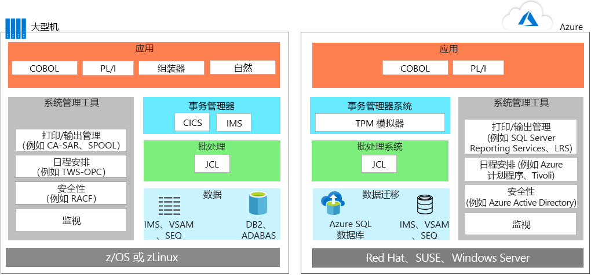
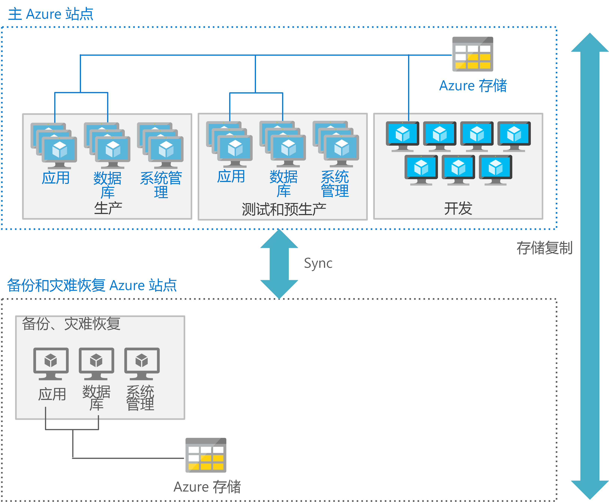

# 大型机应用程序迁移Mainframe application migration

将应用程序从大型机环境迁移到 Azure 时，大多数团队都遵循这一有效方法：尽可能地随时随地重用，然后开始分阶段部署，重新编写或替换应用程序。When migrating applications from mainframe environments to Azure, most teams follow a pragmatic approach: reuse wherever and whenever possible, and then start a phased deployment where applications are rewritten or replaced.

应用程序迁移通常涉及以下一种或多种策略：Application migration typically involves one or more of the following strategies:

- 重新托管：可以从大型机移动现有代码、程序和应用程序，然后重新编译代码，以在云实例中托管的大型机仿真器上运行。Rehost: You can move existing code, programs, and applications from the mainframe, and then recompile the code to run in a mainframe emulator hosted in a cloud instance. 此方法通常首先将应用程序移至基于云的仿真器，然后将数据库迁移到基于云的数据库。This approach typically starts with moving applications to a cloud-based emulator, and then migrating the database to a cloud-based database. 需要进行一些工程和重构以及数据和文件转换。Some engineering and refactoring are required along with data and file conversions.

    或者，可以使用传统的托管提供程序重新托管。Alternatively, you can rehost using a traditional hosting provider. 云的主要优点之一是外包基础结构管理。One of the principal benefits of the cloud is outsourcing infrastructure management. 可以找到托管大型机工作负荷的数据中心提供程序。You can find a datacenter provider that will host your mainframe workloads for you. 该模型可能会争得时间，减少供应商锁定，并节省临时成本。This model may buy time, reduce vendor lock in, and produce interim cost savings.

- 停用：在迁移之前，应停用所有不再需要的应用程序。Retire: All applications that are no longer needed should be retired before migration.

- 重新生成：一些组织选择使用现代技术完全重写程序。Rebuild: Some organizations choose to completely rewrite programs using modern techniques. 鉴于此方法增加了成本和复杂性，它并不像直接迁移方法那样普遍。Given the added cost and complexity of this approach, it’s not as common as a lift-and-shift approach. 通常在此类迁移后，使用代码转换引擎开始替换模块和代码是有意义的。Often after this type of migration, it makes sense to begin replacing modules and code using code transformation engines.

- 将：此方法将大型机功能替换为云中的等效功能。Replace: This approach replaces mainframe functionality with equivalent features in the cloud. 服务型软件 (SaaS) 是一个选项，该选项使用专门为企业关系（例如，财务、人力资源、制造业或企业资源计划）而创建的解决方案。Software as a service (SaaS) is one option, which is using a solution created specifically for an enterprise concern, such as finance, human resources, manufacturing, or enterprise resource planning. 此外，许多特定于行业的应用现可用于解决自定义大型机解决方案以前解决的问题。In addition, many industry-specific apps are now available to solve problems that custom mainframe solutions used to previously solve.

应考虑计划要最初迁移的工作负荷开始，然后确定移动关联应用程序、旧版代码库和数据库的需求。You should consider starting by planning those workloads that you want to initially migrate, and then determine those requirements for moving associated applications, legacy codebases, and databases.

## Azure 中的大型机仿真Mainframe emulation in Azure

Azure 云服务可以仿真传统的大型机环境，由此可重用现有的大型机代码和应用程序。Azure cloud services can emulate traditional mainframe environments, enabling you to reuse existing mainframe code and applications. 可仿真的常见服务器组件包括联机事务处理 (OLTP)、批和数据引入系统。Common server components that you can emulate include online transaction processing (OLTP), batch, and data ingestion systems.

### OLTP 系统OLTP systems

许多大型机都有 OLTP 系统，可以为大量用户处理数千或数百万次更新。Many mainframes have OLTP systems that process thousands or millions of updates for huge numbers of users. 这些应用程序通常使用事务处理和屏幕窗体处理软件，例如客户信息控制系统 (CICS)、信息管理系统 (IMS) 和终端接口处理器 (TIP)。These applications often use transaction processing and screen-form handling software, such as customer information control system (CICS), information management systes (IMS), and terminal interface processor (TIP).

将 OLTP 应用程序移至 Azure 时，大型机事务处理 (TP) 监视器的仿真器可以使用 Azure 上的虚拟机 (VM) 作为基础结构即服务 (IaaS) 运行。When moving OLTP applications to Azure, emulators for mainframe transaction processing (TP) monitors are available to run as infrastructure as a service (IaaS) using virtual machines (VMs) on Azure. 此外可以通过 Web 服务器实现屏幕处理和窗体功能。The screen handling and form functionality can also be implemented by web servers. 此方法可以与数据库 API 结合使用，例如 ActiveX 数据对象 (ADO)、开放式数据库连接 (ODBC) 和用于数据访问和事务的 Java 数据库连接 (JDBC)。This approach can be combined with database APIs, such as ActiveX data object (ADO), open database connectivity (ODBC), and Java database connectivity (JDBC) for data access and transactions.

### 时间约束的批量更新Time-constrained batch updates

许多大型机系统每月或每年更新数百万个帐户记录，例如银行、保险和政府中使用的记录。Many mainframe systems perform monthly or annual updates of millions of account records, such as those used in banking, insurance, and government. 大型机通过提供高吞吐量数据处理系统来处理这些类型的工作负荷。Mainframes handle these types of workloads by offering high-throughput data handling systems. 大型机批处理作业通常是串行的，并且取决于大型机主干提供的每秒输入/输出操作 (IOPS) 以提高性能。Mainframes batch jobs are typically serial in nature and depend on the input/output operations per second (IOPS) provided by the mainframe backbone for performance.

基于云的批环境使用并行计算和高速网络来提高性能。Cloud-based batch environments use parallel compute and high-speed networks for performance. 如果需要优化批性能，Azure 提供了各种计算、存储和网络选项。If you need to optimize batch performance, Azure provides various compute, storage, and networking options.

### 数据引入系统Data ingestion systems

大型机从零售业、金融服务业、制造业和其他处理解决方案中获取大批量数据。Mainframes ingest large batches of data from retail, financial services, manufacturing, and other solutions for processing. 借助 Azure，可以使用简单的命令行实用程序（例如，[AzCopy](/azure/storage/common/storage-use-azcopy)）将数据复制到存储位置或从存储位置复制数据。With Azure, you can use simple command-line utilities such as [AzCopy](/azure/storage/common/storage-use-azcopy) for copying data to and from storage location. 还可以使用 [Azure 数据工厂](/azure/data-factory/introduction)服务，由此可从不同的数据存储中引入数据，以便创建和计划数据驱动的工作流。You can also use the [Azure Data Factory](/azure/data-factory/introduction) service, enabling you to ingest data from disparate data stores to create and schedule data-driven workflows.

除了仿真环境，Azure 还提供可以增强现有大型机环境的平台即服务 (PaaS) 和分析服务。In addition to emulation environments, Azure provides platform as a service (PaaS) and analytics services that can enhance existing mainframe environments.

## 将 OLTP 工作负荷迁移到 AzureMigrate OLTP workloads to Azure

直接迁移方法是将现有应用程序快速迁移到 Azure 的无代码选项。The lift-and-shift approach is the no code option for quickly migrating existing applications to Azure. 每个应用程序按原样进行迁移，既发挥了云的优势，又无需承担更改代码所带来的风险或成本。Each application is migrated as is, which provides the benefits of the cloud without the risks or costs of making code changes. 在 Azure 上使用用于大型机事务处理 (TP) 监视器的仿真器支持此方法。Using an emulator for mainframe transaction processing (TP) monitors on Azure supports this approach.

TP 监视器可从各种供应商处获得，并在虚拟机上运行，这是 Azure 上的基础结构即服务 (IaaS) 选项。TP monitors are available from various vendors and run on virtual machines, an infrastructure as a service (IaaS) option on Azure. 下面的前后图显示了 IBM DB 2（关系数据库管理系统 (DBMS)）支持的联机应用程序在 IBM z/OS 大型机上的迁移。The following before and after diagrams show a migration of an online application backed by IBM DB2, a relational database management system (DBMS), on an IBM z/OS mainframe. 用于 z/OS 的 DB2 使用虚拟存储访问方法 (VSAM) 文件来存储数据，并使用索引顺序访问方法 (ISAM) 来处理平面文件。DB2 for z/OS uses virtual storage access method (VSAM) files to store the data and Indexed Sequential Access Method (ISAM) for flat files. 此体系结构还使用 CICS 进行事务监视。This architecture also uses CICS for transaction monitoring.

在 Azure 上，仿真环境用于运行 TP 管理器和使用 JCL 的批处理作业。On Azure, emulation environments are used to run the TP manager and the batch jobs that use JCL. 在数据层中，DB2 替换为 [Azure SQL 数据库](/azure/sql-database/sql-database-technical-overview)，但也可以使用 Microsoft SQL Server、DB2 LUW 或 Oracle Database。In the data tier, DB2 is replaced by [Azure SQL Database](/azure/sql-database/sql-database-technical-overview), although Microsoft SQL Server, DB2 LUW, or Oracle Database can also be used. 仿真器支持 IMS、VSAM 和 SEQ。An emulator supports IMS, VSAM, and SEQ. 大型机的系统管理工具替换为在 VM 中运行的 Azure 服务和其他供应商提供的软件。The mainframe’s system management tools are replaced by Azure services, and software from other vendors, that run in VMs.

通常使用 Web 服务器实现屏幕处理和窗体输入功能，此功能可以与数据库 API（如ADO、ODBC 和 JDBC）结合使用，进行数据访问和事务处理。The screen handling and form entry functionality is commonly implemented using web servers, which can be combined with database APIs, such as ADO, ODBC, and JDBC for data access and transactions. 要使用的 Azure IaaS 组件的确切阵容取决于你喜欢的操作系统。The exact line-up of Azure IaaS components to use depends on the operating system you prefer. 例如：For example:

- 基于 Windows 的 VM：用于屏幕处理和业务逻辑的 Internet Information Server (IIS) 以及 ASP.NET。Windows–based VMs: Internet Information Server (IIS) along with ASP.NET for the screen handling and business logic. 使用 ADO.NET 进行数据访问和事务处理。Use ADO.NET for data access and transactions.

- 基于 Linux 的 VM：提供基于 Java 的应用程序服务器，例如用于屏幕处理和基于 Java 的业务功能的 Apache Tomcat。Linux–based VMs: The Java-based application servers that are available, such as Apache Tomcat for screen handling and Java-based business functionality. 使用 JDBC 进行数据访问和事务处理。Use JDBC for data access and transactions.

## 将批工作负荷迁移到 AzureMigrate batch workloads to Azure

Azure 中的批操作与大型机上的典型批环境不同。Batch operations in Azure differ from the typical batch environment on mainframes. 大型机批处理作业通常是串行的，并且取决于大型机主干提供的 (IOPS) 以提高性能。Mainframe batch jobs are typically serial in nature and depend on the IOPS provided by the mainframe backbone for performance. 基于云的批环境使用并行计算和高速网络来提高性能。Cloud-based batch environments use parallel computing and high-speed networks for performance.

要使用 Azure 优化批性能，请考虑[计算](/azure/virtual-machines/windows/overview)、[存储](/azure/storage/blobs/storage-blobs-introduction)、[网络](https://azure.microsoft.com/blog/maximize-your-vm-s-performance-with-accelerated-networking-now-generally-available-for-both-windows-and-linux/)以及[监视](/azure/azure-monitor/overview)选项，如下所示。To optimize batch performance using Azure, consider the [compute](/azure/virtual-machines/windows/overview), [storage](/azure/storage/blobs/storage-blobs-introduction), [networking](https://azure.microsoft.com/blog/maximize-your-vm-s-performance-with-accelerated-networking-now-generally-available-for-both-windows-and-linux/), and [monitoring](/azure/azure-monitor/overview) options as follows.

### 计算Compute

使用：Use:

- 具有最高时钟速度的 VM。VMs with the highest clock speed. 大型机应用程序通常是单线程的，并且大型机 CPU 具有非常高的时钟速度。Mainframe applications are often single-threaded and mainframe CPUs have a very high clock speed.

- 具有较大内存容量的 VM 允许缓存数据和应用程序工作区域。VMs with large memory capacity to allow caching of data and application work areas.

- 如果应用程序支持多线程，具有更高密度 vCPU 的 VM 可以利用多线程处理。VMs with higher density vCPUs to take advantage of multi-threaded processing if the application supports multiple threads.

- 并行处理，因为 Azure 可以轻松横向扩展以进行并行处理，为批运行提供更多的计算能力。Parallel processing, as Azure easily scales out for parallel processing, delivering more compute power for a batch run.

### 存储Storage

使用：Use:

- [Azure 高级 SSD](/azure/virtual-machines/windows/premium-storage) 或 [Azure 超级 SSD](/azure/virtual-machines/windows/disks-ultra-ssd) 适用于最大的可用 IOPS。[Azure Premium SSD](/azure/virtual-machines/windows/premium-storage) or [Azure Ultra SSD](/azure/virtual-machines/windows/disks-ultra-ssd) for maximum available IOPS.

- 使用多个磁盘进行条带化，以在每个存储大小中获得更多 IOPS。Striping with multiple disks for more IOPS per storage size.

- 对存储进行分区以在多个 Azure 存储设备上分配 IO。Partitioning for storage to spread IO over multiple Azure storage devices.

### 网络Networking

- 使用 [Azure 加速网络](/azure/virtual-network/create-vm-accelerated-networking-powershell)以尽量降低延迟。Use [Azure Accelerated Networking](/azure/virtual-network/create-vm-accelerated-networking-powershell) to minimize latency.

### 监视Monitoring

- 使用监视工具 [Azure Monitor](/azure/azure-monitor/overview)、[Azure Application Insights](/azure/application-insights/app-insights-overview)，甚至 Azure 日志使管理员能够监视批运行的任何过度性能并帮助消除瓶颈。Use monitoring tools, [Azure Monitor](/azure/azure-monitor/overview), [Azure Application Insights](/azure/application-insights/app-insights-overview), and even the Azure logs enable administrators to monitor any over performance of batch runs and help eliminate bottlenecks.

## 迁移开发环境Migrate development environments

云的分布式体系结构依赖于一组不同的开发工具，这些工具提供了新式做法和编程语言的优点。The cloud’s distributed architectures rely on a different set of development tools that provide the advantage of modern practices and programming languages. 要简化此转换，可以将开发环境与其他旨在仿真 IBM z/OS 环境的工具结合使用。To ease this transition, you can use a development environment with other tools that are designed to emulate IBM z/OS environments. 以下列表显示 Microsoft 和其他供应商提供的选项：The following list shows options from Microsoft and other vendors:

| 组件Component        | Azure 选项Azure Options                                                                                                                                  |
|------------------|---------------------------------------------------------------------------------------------------------------------------------------------------|
| z/OSz/OS             | Windows、Linux 或 UNIXWindows, Linux, or UNIX                                                                                                                      |
| CICSCICS             | Azure 服务由 Micro Focus、Oracle、GT Software (Fujitsu)、TmaxSoft、Raincode 和 NTT 数据提供，或使用 kubernetes 重写Azure services offered by Micro Focus, Oracle, GT Software (Fujitsu), TmaxSoft, Raincode, and NTT Data, or rewrite using Kubernetes |
| IMSIMS              | Micro Focus 和 Oracle 所提供的 Azure 服务Azure services offered by Micro Focus and Oracle                                                                                  |
| 汇编程序Assembler        | Raincode 和 TmaxSoft 提供的 Azure 服务；或 COBOL、C 或 Java，或映射到操作系统函数Azure services from Raincode and TmaxSoft; or COBOL, C, or Java, or map to operating system functions               |
| JCLJCL              | JCL、PowerShell 或其他脚本工具JCL, PowerShell, or other scripting tools                                                                                                   |
| COBOLCOBOL            | COBOL、C 或 JavaCOBOL, C, or Java                                                                                                                            |
| NaturalNatural          | Natural、COBOL、C 或 JavaNatural, COBOL, C, or Java                                                                                                                  |
| FORTRAN 和 PL/IFORTRAN and PL/I | FORTRAN、PL/I、COBOL、C 或 JavaFORTRAN, PL/I, COBOL, C, or Java                                                                                                           |
| REXX 和 PL/IREXX and PL/I    | REXX、PowerShell 或其他脚本工具REXX, PowerShell, or other scripting tools                                                                                                  |

## 将数据库和数据迁移Migrate databases and data

应用程序迁移通常涉及重新托管的数据层。Application migration usually involves rehosting the data tier. 借助 [Azure 数据库迁移服务](/azure/dms/dms-overview)，可以将 SQL Server、开放源代码和其他关系数据库迁移到 Azure 上完全托管的解决方案，例如 [Azure SQL 数据库托管实例](/azure/sql-database/sql-database-managed-instance)、[Azure Database Service for PostgreSQL](/azure/postgresql/overview) 和 [Azure Database for MySQL](/azure/mysql/overview)。You can migrate SQL Server, open-source, and other relational databases to fully-managed solutions on Azure, such as [Azure SQL Database Managed Instance](/azure/sql-database/sql-database-managed-instance), [Azure Database Service for PostgreSQL](/azure/postgresql/overview), and [Azure Database for MySQL](/azure/mysql/overview) with [Azure Database Migration Service](/azure/dms/dms-overview).

例如，如果大型机数据层使用以下项，则可以进行迁移：For example, you can migrate if the mainframe data tier uses:

- IBM DB2 数据库或 IMS 数据库，请在 Azure 上使用 Azure SQL 数据库、SQL Server、DB2 LUW 或 Oracle Database。IBM DB2 or an IMS database, use Azure SQL database, SQL Server, DB2 LUW, or Oracle Database on Azure.

- VSAM 和其他平面文件，使用适用于 Azure SQL、SQL Server、DB2 LUW 或 Oracle 的索引顺序访问方法 (ISAM) 平面文件。VSAM and other flat files, use Indexed Sequential Access Method (ISAM) flat files for Azure SQL, SQL Server, DB2 LUW, or Oracle.

- Generation Date Groups (GDG)，迁移到 Azure 上使用命名约定的文件和提供与 GDG 类似功能的文件扩展名的文件。Generation Date Groups (GDGs), migrate to files on Azure that use a naming convention and filename extensions that provide similar functionality to GDGs.

IBM 数据层包括一些也必须迁移的关键组件。The IBM data tier includes several key components that you must also migrate. 例如，迁移数据库时，还要迁移池中包含的数据集合（每个数据集合都包含 dbextents，其中 dbextents 是 z/OS VSAM 数据集）。For example, when you migrate a database, you also migrate a collection of data contained in pools, each containing dbextents, which are z/OS VSAM data sets. 迁移必须包括标识存储池中数据位置的目录。Your migration must include the directory that identifies data locations in the storage pools. 此外，迁移计划必须考虑数据库日志，其中包含对数据库执行操作的记录。Also, your migration plan must consider the database log, which contains a record of operations performed on the database. 数据库可以有一个、两个（双日志或备用日志）日志或四个（双日志和备用日志）日志。A database can have one, two (dual or alternate), or four (dual and alternate) logs.

数据库迁移还包含以下组件：Database migration also includes these components:

- 数据库管理器：提供对数据库中数据的访问。Database manager: Provides access to data in the database. 在 z/OS 环境中，数据库管理器可在其自己的分区中运行。The database manager runs in its own partition in a z/OS environment.

- 应用程序请求方：在将请求传递到应用程序服务器之前，接受来自应用程序的请求。Application requester: Accepts requests from applications before passing them to an application server.

- 联机资源适配器：包括用于 CICS 事务的应用程序请求程序组件。Online resource adapter: Includes application requester components for use in CICS transactions.

- Batch 资源适配器:Z/OS 批应用程序的实现应用程序请求方组件。Batch resource adapter: Implements application requester components for z/OS batch applications.

- 交互式 SQL (ISQL)：作为 CICS 应用程序和接口运行，使用户能够输入 SQL 语句或运算符命令。Interactive SQL (ISQL): Runs as a CICS application and interface enabling users to enter SQL statements or operator commands.

- CICS 应用程序：使用 CICS 中的可用资源和数据源在 CICS 的控制下运行。CICS application: Runs under the control of CICS, using available resources and data sources in CICS.

- Batch 应用程序：运行流程逻辑而无需与用户进行交互式通信，例如，生成大量数据更新或从数据库生成报告。Batch application: Runs process logic without interactive communication with users to, for example, produce bulk data updates or generate reports from a database.

## 优化 Azure 的规模和吞吐量Optimize scale and throughput for Azure

通常情况下，大型机纵向扩展，而云横向扩展。要优化在 Azure 上运行的大型机样式应用程序的规模和吞吐量，了解大型机如何分离和隔离应用程序是非常重要的。Generally speaking, mainframes scale up, while the cloud scales out. To optimize scale and throughput of mainframe-style applications running on Azure, it is important that you understand at how mainframes can separate and isolate applications. A z/OS 大型机使用名为逻辑分区 (LPARS) 的功能来隔离和管理单个实例上特定应用程序的资源。A z/OS mainframe uses a feature called Logical Partitions (LPARS) to isolate and manage the resources for a specific application on a single instance.

例如，大型机对具有关联 COBOL 程序的 CICS 区域使用一个逻辑分区 (LPAR)，对于 DB2 使用单独的 LPAR。For example, a mainframe might use one logical partition (LPAR) for a CICS region with associated COBOL programs, and a separate LPAR for DB2. 其他 LPAR 通常用于开发、测试和过渡环境。Additional LPARs are often used for the development, testing, and staging environments.

在 Azure 上，更常见的做法是使用单独的 VM 来实现这一目的。On Azure, it’s more common to use separate VMs to serve this purpose. Azure 体系结构通常为应用层部署 VM、为数据层部署单独一组 VM、为开发部署另一组 VM 等。Azure architectures typically deploy VMs for the application tier, a separate set of VMs for the data tier, another set for development, and so on. 每个处理层都可以使用最适合该环境的 VM 类型和功能进行优化。Each tier of processing can be optimized using the most suitable type of VMs and  features for that environment.

此外，每一层还可以提供适当的灾难恢复服务。In addition, each tier can also provide appropriate disaster recovery services. 例如，生产和数据库 VM 可能需要热或温恢复，而开发和测试 VM 支持冷恢复。For example, production and database VMs might require a hot or warm recovery, while the development and testing VMs support a cold recovery.

下图显示了使用主站点和辅助站点进行 Azure 部署的可能性。The following figure shows a possible Azure deployment using a primary and a secondary site. 在主站点中，以高可用性部署生产、预生产和测试 VM。In the primary site, the production, preproduction, and testing VMs are deployed with high availability. 辅助站点用于备份和灾难恢复。The secondary site is for backup and disaster recovery.

## 对 Azure 执行分阶段大型机任务Perform a staged mainframe to Azure

将解决方案从大型机移至 Azure 可能需要进行分阶段迁移，从而先移动一些应用程序，而其他应用程序则暂时或永久地保留在大型机上。Moving solutions from a mainframe to Azure may involve a *staged* migration, whereby some applications are moved first, and others remain on the mainframe temporarily or permanently. 此方法通常需要允许应用程序和数据库在大型机和 Azure 之间进行互操作的系统。This approach typically requires systems that allow applications and databases to interoperate between the mainframe and Azure.

常见方案是将应用程序移至 Azure，同时将应用程序使用的数据保存在大型机上。A common scenario is to move an application to Azure while keeping the data used by the application on the mainframe. 特定软件用于使 Azure 上的应用程序能够访问大型机中的数据。Specific software is used to enable the applications on Azure to access data from the mainframe. 幸运的是，广泛的解决方案提供 Azure 和现有大型机环境之间的集成、对混合场景的支持以及随时间推移的迁移。Fortunately, a wide range of solutions provide integration between Azure and existing mainframe environments, support for hybrid scenarios, and migration over time. Microsoft 合作伙伴、独立软件供应商和系统集成商可以在过程中为你提供帮助。Microsoft partners, independent software vendors, and system integrators can help you on your journey.

一种选项是 [Microsoft Host Integration Server](https://docs.microsoft.com/host-integration-server/) (HIS)，该解决方案提供了 Azure 中的应用程序访问大型机上保留的 DB2 中的数据所需的分布式关系数据库体系结构 (DRDA)。One option is [Microsoft Host Integration Server](https://docs.microsoft.com/host-integration-server/) (HIS), a solution that provides the distributed relational database architecture (DRDA) required for applications in Azure to access data in DB2 that remains on the mainframe. 大型机到 Azure 集成的其他选项包括 IBM、Attunity、Codit 和其他供应商提供的解决方案以及开源选项。Other options for mainframe-to-Azure integration include solutions from IBM, Attunity, Codit, other vendors, and open source options.

## 合作伙伴解决方案Partner solutions

如果正在考虑大型机迁移，合作伙伴生态系统可提供帮助。If you are considering a mainframe migration, the partner ecosystem is available to assist you.

Azure 为当前在大型机上运行的系统提供了经过验证的、高度可用且可缩放的基础结构。Azure provides a proven, highly available, and scalable infrastructure for systems that currently run on mainframes. 可相对轻松地迁移某些工作负荷。Some workloads can be migrated with relative ease. 可以使用合作伙伴解决方案重新托管依赖于旧版系统软件（如 CICS 和 IMS）的其他工作负荷，并随着时间的推移迁移到 Azure。Other workloads that depend on legacy system software, such as CICS and IMS, can be rehosted using partner solutions and migrated to Azure over time. 无论你做出何种选择，Microsoft 和我们的合作伙伴都可以帮助你优化 Azure，同时保持大型机系统软件功能。Regardless of the choice you make, Microsoft and our partners are available to assist you in optimizing for Azure while maintaining mainframe system software functionality.

有关选择合作伙伴解决方案的详细指南，请参阅[平台现代化联盟](https://www.platformmodernization.org/pages/mainframe.aspx)。For detailed guidance about choosing a partner solution, refer to the [Platform Modernization Alliance](https://www.platformmodernization.org/pages/mainframe.aspx).

## 了解详细信息Learn more

有关详细信息，请参阅以下资源：For more information, see the following resources:

- [Azure 入门Get started with Azure](/azure)

- [平台现代化联盟：大型机迁移Platform Modernization Alliance: Mainframe migration](https://www.platformmodernization.org/pages/mainframe.aspx)

- [Deploy IBM DB2 pureScale on Azure](https://azure.microsoft.com/resources/deploy-ibm-db2-purescale-on-azure)（在 Azure 上部署 IBM DB2 pureScale）[Deploy IBM DB2 pureScale on Azure](https://azure.microsoft.com/resources/deploy-ibm-db2-purescale-on-azure)

- [Host Integration Server (HIS) 文档Host Integration Server (HIS) documentation](https://docs.microsoft.com/host-integration-server/)
