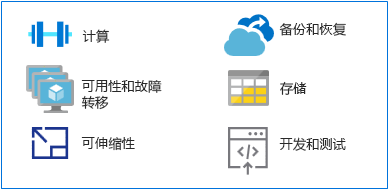

# 从大型机迁移到 Azure

作为运行传统大型机应用程序的替代平台，Azure 在高可用性环境中可提供超大规模计算和存储。 用户无需花费大型机环境的相关成本，就能够获得基于云的新式平台的价值及灵活性。

本部分提供从大型机平台迁移到 Azure 的技术指导。

## MIPS 与 vCPU

没有现成的通用映射公式用于确定运行大型机工作负载所需的虚拟中央处理单元 (vCPU) 数量。 但是，映射到 Azure 上的 vCPU 指标通常为每秒百万条指令 (MIPS)。 MIPS 通过为给定计算机提供每秒周期数的恒定值来测量大型机的总体计算能力。

一个小型组织可能需要不到 500 MIPS，而一个大型组织通常使用量超过 5,000 MIPS。 单个 MIPS 的费用是 1,000 美元，如果一个大型组织每年需要部署 5,000-MIPS 的基础设施，则需要花费约 500 万美元。 这种规模的典型 Azure 部署的年成本估算约为 MIPS 基础设施成本的十分之一。 有关详细信息，请参阅[揭秘大型机到 Azure 的迁移](https://azure.microsoft.com/resources/demystifying-mainframe-to-azure-migration)白皮书中的“表 4”。

要准确计算 Azure 上 vCPU 的 MIPS，需要确定 vCPU 的类型，以及当前运行的确切工作负载。 但是，基准研究为估计所需 vCPU 的数量和类型提供了良好的基础。 一份近期的 [HPE zREF 基准](https://h20195.www2.hpe.com/v2/getpdf.aspx/4aa4-2452enw.pdf)提供了以下估计：

- 用于在线 (CICS) 作业的 HP Proliant 服务器上运行的每个基于 Intel 的核心为 288 MIPS。

- 用于 COBOL 批处理作业的每个 Intel 核心为 170 MIPS。

本指南估计用于在线处理的每个 vCPU 为 200 MIPS，用于批处理的每个 vCPU 为 100 MIPS。

> [!NOTE]
> 随着新的虚拟机 (VM) 系列在 Azure 中推出，这些估计值可能会发生变化。

## 高可用性和故障转移

当使用大型机耦合和并行系统综合体时，大型机系统通常提供 5 个 9 的可用性 (99.999%)。 然而，系统运营商仍需要安排停机时间来维护和加载初始程序 (IPL)。 实际可用性接近 2 到 3 个 9，与基于 Intel 的高端服务器相当。

相比之下，Azure 提供基于承诺的服务级别协议 (SLA)，默认为多个 9 可用性，通过本地或基于地理位置的服务复制进行优化。

Azure 通过从本地或其他地理区域的多个存储设备复制数据来提供额外的可用性。 如果发生基于 Azure 的故障，计算资源可以访问本地或区域级别的复制数据。

使用 Azure 平台即服务 (PaaS) 资源（如 [Azure SQL 数据库](/azure/sql-database/sql-database-technical-overview)和 [Azure Cosmos 数据库](/azure/cosmos-db/introduction)）时，Azure 可自动处理故障转移。 使用 Azure 基础结构即服务 (IaaS) 时，故障转移依赖于特定的系统功能，例如 SQL Server AlwaysOn 功能、故障转移群集实例和可用性组。

## 可伸缩性

大型机通常可以纵向扩展，而云环境可以横向扩展。大型机可以通过使用耦合设备 (CF) 横向扩展，但硬件和存储的成本很高，使得大型机的横向扩展成本非常高。

另外，CF 提供紧密耦合的计算，而 Azure 的横向扩展功能是松散耦合的。 云可以纵向扩展以匹配确切的用户规范，计算能力、存储和服务在基于使用情况的计费模型下按需扩展。

## 备份和恢复

大型机客户通常通过维护灾难恢复站点或使用独立的大型机提供商来应对灾难事故。 与灾难恢复站点的同步通常通过数据的脱机副本完成。 两种选择都会产生高昂的成本。

通过大型机耦合设备也可以获得自动化异地冗余（虽然费用很高），并且通常保留用于任务关键型系统。 相比之下，Azure 在本地或区域级别或通过异地冗余为[备份](/azure/backup/backup-introduction-to-azure-backup)、[恢复](/azure/site-recovery/site-recovery-overview)和[冗余](/azure/storage/common/storage-redundancy)提供了易于实现且经济高效的选项。

## 存储

在了解大型机的工作方式时会涉及理解各种交叉的术语。 例如，中央存储、实际内存、实际存储和主存储，通常都指的是直接连接到大型机处理器的存储。

大型机硬件包括处理器和许多其他设备，如直接访问存储设备 (DASD)、磁带驱动器和几种类型的用户控制台。 磁带和 DASD 用于系统功能和用户程序。

大型机的物理存储类型包括：

- 中央存储：直接位于大型机处理器上，也称为处理器或实际存储。

- 辅助存储：与大型机分开放置，此类型包括 DASD 上的存储，也称为分页存储。

云提供一系列灵活的可扩展选项，用户只需支付所需的选项。 [Azure 存储](/azure/storage/common/storage-introduction)为数据对象提供可大规模缩放的对象存储，为云提供文件系统服务、可靠的消息传送存储，以及 NoSQL 存储。 对于 VM，托管和非托管磁盘提供持久且安全的磁盘存储。

## 大型机开发和测试

大型机迁移项目的主要驱动力是应用程序开发的变化。 组织希望他们的开发环境更加灵活，能够响应各种业务需求。

大型机通常采用独立逻辑分区 (LPAR) 进行开发和测试，例如 QA 和暂存 LPAR。 大型机开发解决方案包括编译器（COBOL、PL/I、汇编程序）和编辑器。 最常见的是用于在 IBM 大型机上运行的 z/OS 操作系统的交互式系统生产力工具 (ISPF)。 其他还包括 ROSCOE 编程工具 (RPF) 和 Computer Associates 工具，如 CA Librarian 和 CA-Panvalet。

仿真环境和编译器在 x86 平台上可用，因此，开发和测试通常可以是从大型机迁移到 Azure 的第一批工作负载。 [Azure 中的 DevOps 工具](https://azure.microsoft.com/solutions/devops/)的可用性和广泛使用正在加速开发和测试环境的迁移。

在 Azure 上开发和测试解决方案并准备好部署到大型机时，需要将代码复制到大型机并在那里进行编译。

## 后续步骤

> [!div class="nextstepaction"]
> [大型机应用程序迁移](application-strategies.md)
