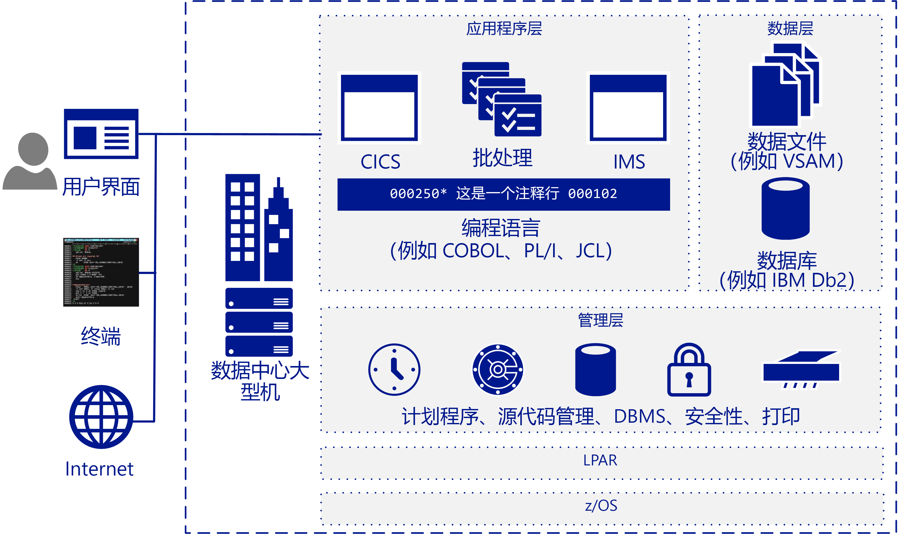

# 大型机迁移概述Mainframe migration overview

许多公司和组织受益于将其部分或所有大型机工作负荷、应用程序和数据库迁移到云。Many companies and organizations benefit from moving some or all their mainframe workloads, applications, and databases to the cloud. Azure 采用云规模提供了类似于大型机的功能，而没有与大型机相关联的许多缺点。Azure provides mainframe-like features at cloud scale without many of the drawbacks associated with mainframes.

大型机这一术语通常指大型计算机系统，但当前部署的绝大多数大型机是运行 MVS、DOS、VSE、OS/390 或 z/OS 的 IBM System Z 服务器或与 IBM 插件兼容的系统。The term mainframe generally refers to a large computer system, but the vast majority currently of mainframes deployed are IBM System Z servers or IBM plug-compatible systems running MVS, DOS, VSE, OS/390, or z/OS. 大型机系统一直在众多行业中用于运行至关重要的信息系统，并且用于高度特定的方案，如大型、高容量的事务密集型 IT 环境。Mainframe systems continue to be used in many industries to run vital information systems, and they have a place in highly-specific scenarios, such as large, high-volume, transaction intensive IT environments.

迁移到云使公司可以实现其基础结构现代化。Migrating to the cloud enables companies to modernize their infrastructure. 借助云服务，每当组织需要时，便可将大型机应用程序（以及它们提供的价值）作为工作负荷进行使用。With cloud services you can make mainframe applications, and the value that they provide, available as a workload whenever your organization needs it. 许多工作负荷只需进行轻微的代码更改（如更新数据库的名称）便可传输到 Azure。Many workloads can be transferred to Azure with only minor code changes, such as updating the names of databases. 可以使用分阶段的方法迁移更复杂的工作负荷。You can migrate more complex workloads using a phased approach.

大多数财富 500 强公司已在运行 Azure 以用于其关键工作负荷。Most Fortune 500 companies are already running Azure for their critical workloads. Azure 的大量底线激励促使实现了许多迁移项目。Azure's significant bottom-line incentives motivate many migration projects. 公司通常首先将开发和测试工作负荷转移到 Azure，接下来将 DevOps、电子邮件和灾难恢复作为服务进行转移。Companies typically move development and test workloads to Azure first, followed by DevOps, email, and disaster recovery as a service.

## 目标受众Intended audience

如果你在考虑将迁移或添加云服务作为 IT 环境的选项，则本指南适用你。If you’re considering a migration or the addition of cloud services as an option for your IT environment, this guide is for you.

本指南可帮助 IT 组织开始迁移对话。This guidance helps IT organizations start the migration conversation. 与大型机相比，你可能更熟悉 Azure 和基于云的基础结构，因此本指南从大型机工作原理概述开始，接下来是用于确定迁移内容和方式的各种策略。You may be more familiar with Azure and cloud-based infrastructures than you are with mainframes, so this guide starts with an overview of how mainframes work, and continues with various strategies for determining what and how to migrate.

## 大型机体系结构Mainframe architecture

在 20 世纪 50 年代后期，大型机设计作为纵向扩展服务器来运行高容量联机事务处理和批处理。In the late 1950s, mainframes were designed as scale-up servers to run high-volume online transactions and batch processing. 因此，大型机具有用于联机事务表单的软件（有时称为绿屏）以及用于处理批处理运行的高性能 I/O 系统。Because of this, mainframes have software for online transaction forms (sometimes called green screens) and high-performance I/O systems for processing batch runs.

大型机在可靠性和可用性方面声誉良好，并且以能够运行海量联机事务和批处理作业而闻名。Mainframes have a reputation for high reliability and availability, and are known for their ability to run huge online transactions and batch jobs. 事务源自单个请求（通常来自终端处的用户）发起的一次处理。A transaction results from a piece of processing initiated by a single request, typically from a user at a terminal. 事务还可以来自多种其他源，包括网页、远程工作站和其他信息系统中的应用程序。Transactions can also come from multiple other sources, including web pages, remote workstations, and applications from other information systems. 事务还可以在预定义时间自动触发，如下图所示。A transaction can also be triggered automatically at a predefined time as the following figure shows.

典型 IBM 大型机体系结构包括以下常见组件：A typical IBM mainframe architecture includes these common components:

- **前端系统：** 用户可以启动从终端、网页或远程工作站发起事务。**Front-end systems:** Users can initiate transactions from terminals, web pages, or remote workstations. 大型机应用程序通常具有可以在迁移到 Azure 之后保留的自定义用户界面。Mainframe applications often have custom user interfaces that can be preserved after migration to Azure. 终端仿真器仍然用于访问大型机应用程序，也称为绿屏终端。Terminal emulators are still used to access mainframe applications, and are also called green-screen terminals.

- **应用层：** 大型机通常包括客户信息控制系统 (CICS)，这是用于 IBM z/OS 大型机的领先的事务管理套件，经常与 IBM 信息管理系统（IMS，基于消息的事务管理器）一起使用。**Application tier:** Mainframes typically include a customer information control system (CICS), a leading transaction management suite for the IBM z/OS mainframe that is often used with IBM Information Management System (IMS), a message-based transaction manager. 批处理系统可为大量帐户记录处理高吞吐量数据更新。Batch systems handle high-throughput data updates for large volumes of account records.

- **代码：** 大型机使用的编程语言包括 COBOL、Fortran，PL/I 和 Natural。**Code:** Programming languages used by mainframes include COBOL, Fortran, PL/I, and Natural. 作业控制语言 (JCL) 用于处理 z/OS。Job control language (JCL) is used to work with z/OS.

- **数据库层：** 适用于 z/OS 的一种常用关系数据库管理系统 (DBMS) 是 IBM DD2。**Database tier:** A common relational database management system (DBMS) for z/OS is IBM DD2. 它管理称为 dbspace 的数据结构，这些数据结构包含一个或多个表，并分配给物理数据集组成的存储池（称为 dbextent）。It manages data structures called *dbspaces* that contain one or more tables and are assigned to storage pools of physical data sets called *dbextents*. 两个重要的数据库组件是标识存储池中的数据位置的目录，以及包含对数据库执行的操作的记录的日志。Two important database components are the directory that identifies data locations in the storage pools, and the log that contains a record of operations performed on the database. 支持各种平面文件数据格式。Various flat-file data formats are supported. DB2 for z/OS 通常使用虚拟存储访问方法 (VSAM) 数据集存储数据。DB2 for z/OS typically uses virtual storage access method (VSAM) datasets to store the data.

- **管理层：** IBM 大型机包括计划软件（如 TWS-OPC）、用于打印和输出管理的工具（如 CA-SAR 和 SPOOL）以及用于代码的源代码管理系统。**Management tier:** IBM mainframes include scheduling software such as TWS-OPC, tools for print and output management such as CA-SAR and SPOOL, and a source control system for code. z/OS 的安全访问控制由资源访问控制设施 (RACF) 进行处理。Secure access control for z/OS is handled by resource access control facility (RACF). 数据库管理器提供对数据库中数据的访问，在 z/OS 环境中自己的分区内运行。A database manager provides access to data in the database and runs in its own partition in a z/OS environment.

- **LPAR：** 逻辑分区（或 LPAR）用于划分计算资源。**LPAR:** Logical partitions, or LPARs, are used to divide compute resources. 物理大型机分区为多个 LPAR。A physical mainframe is partitioned into multiple LPARs.

- **z/OS：** 这是最常用于 IBM 大型机的 64 位操作系统。**z/OS:** A 64-bit operating system that is most commonly used for IBM mainframes.

IBM 系统使用事务监视器（如 CICS）跟踪和管理业务事务的所有方面。IBM systems use a transaction monitor such as CICS to track and manage all aspects of a business transaction. CICS 管理资源的共享、数据的完整性和执行的优先顺序。CICS manages the sharing of resources, the integrity of data, and prioritization of execution. CICS 授权用户、分配资源并将应用程序进行的数据库请求传递给数据库管理器（如 IBM DB2）。CICS authorizes users, allocates resources, and passes database requests by the application to a database manager, such as IBM DB2.

为进行更精确的优化，CICS 通常与 IMS/TM（以前称为 IMS/数据通信或 IMS/DC）一起使用。For more precise tuning, CICS is commonly used with IMS/TM (formerly IMS/Data Communications or IMS/DC). IMS 旨在通过保留数据的单个副本来减少数据冗余。IMS was designed to reduce data redundancy by maintaining a single copy of the data. 它会在整个过程中维护状态并在数据存储中记录业务功能，从而作为事务监视器对 CICS 进行补充。It complements CICS as a transaction monitor by maintaining state throughout the process and recording business functions in a data store.

## 大型机操作Mainframe operations

以下是典型大型机操作：The following are typical mainframe operations:

- **联机：** 工作负荷包括事务处理、数据库管理和连接。**Online:** Workloads include transaction processing, database management, and connections. 它们通常使用 IBM DB2、CICS 和 z/OS 连接器来实现。They are often implemented using IBM DB2, CICS, and z/OS connectors.

- **批处理：** 作业在无需进行用户交互的情况下运行，通常采用定期计划（如每个工作日早晨）。**Batch:** Jobs run without user interaction, typically on a regular schedule such as every weekday morning. 可以使用 JCL 仿真器（如 Micro Focus Enterprise Server 或 BMC Control-M 软件）在基于 Windows 或 Linux 的系统上运行批处理作业。Batch jobs can be run on systems based on Windows or Linux by using a JCL emulator such as Micro Focus Enterprise Server or BMC Control-M software.

- **作业控制语言 (JCL)：** 指定处理批处理作业所需的资源。**Job control language (JCL):** Specify resources needed to process batch jobs. JCL 通过一组作业控制语句将此信息传达给 z/OS。JCL conveys this information to z/OS through a set of job control statements. 基本 JCL 包含六种类型的语句：JOB、ASSGN、DLBL、EXTENT、LIBDEF 和 EXEC。Basic JCL contains six types of statements: JOB, ASSGN, DLBL, EXTENT, LIBDEF, and EXEC. 一个作业可以包含多个 EXEC 语句（步骤），每个步骤可以具有多个 LIBDEF、ASSGN、DLBL 和 EXTENT 语句。A job can contain several EXEC statements (steps), and each step could have several LIBDEF, ASSGN, DLBL, and EXTENT statements.

- **初始程序负荷 (IPL)：** 是指将操作系统的副本从磁盘加载到处理器的实际存储中并运行它。**Initial program load (IPL):**  Refers to loading a copy of the operating system from disk into a processor’s real storage and running it. IPL 用于从停机中恢复。IPLs are used to recover from downtime. IPL 如同在 Windows 或 Linux VM 上启动操作系统一样。An IPL is like booting the operating system on Windows or Linux VMs.

## 后续步骤Next steps

> [!div class="nextstepaction"]
> [神话和事实Myths and facts](myths-and-facts.md)
