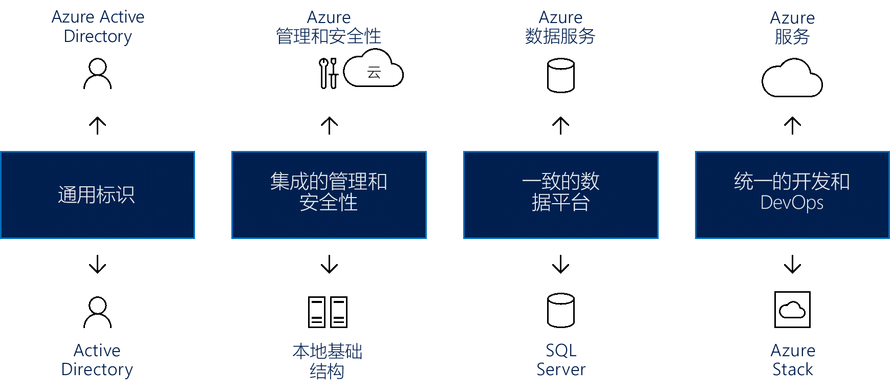

# 形成混合云一致性Create hybrid cloud consistency

本文将引导你完成形成混合云一致性的高级方法。This article guides you through the high level approaches for creating hybrid cloud consistency.

在迁移期间使用混合部署模型可降低风险，并且有助于实现平滑的基础结构转换。Hybrid deployment models during migration can reduce risk and contribute to a smooth infrastructure transition. 云平台在业务流程方面提供最大程度的灵活性。Cloud platforms offer the greatest level of flexibility when it comes to business processes. 许多组织对移动到云犹豫不决，而是想要对最敏感的数据保持完全控制。Many organizations are hesitant to make the move to the cloud, preferring instead to keep full control over the most sensitive data. 遗憾的是，本地服务器达不到与云相同的创新速度。Unfortunately, on-premises servers don’t allow for the same rate of innovation as the cloud. 混合云解决方案让你能够两全其美：同时享有云的创新速度和本地管理的舒适性。A hybrid cloud solution allows you the best of both worlds: The speed of cloud innovation AND the comfort of on-premises management.

## 集成混合云一致性Integrate hybrid cloud consistency

使用混合云解决方案让组织得以缩放计算资源。Using a hybrid cloud solution allows organizations to scale computing resources. 它还消除了进行大量资本支出来应对短期需求高峰的需要。It also eliminates the need to make massive capital expenditures to handle short-term spikes in demand. 如果业务发生变化，需要为更敏感的数据或应用程序释放本地资源，则取消预配云资源会更轻松、更快速且更便宜。When changes to your business drive the need to free up local resources for more sensitive data or applications, it is easier, faster, and less expensive to deprovision cloud resources. 只需为组织临时使用的资源付费，而无需购买和维护其他资源。You pay only for those resources your organization temporarily uses, instead of having to purchase and maintain additional resources. 这减少了可能会在很长一段时间内保持空闲的设备数量。This reduces the amount of equipment that might remain idle over long periods of time. 混合云计算一个"全球最佳"平台，交付云计算的灵活性、 可伸缩性和成本效益; 的所有优势所有这些都有最低可能降低数据暴露。Hybrid cloud computing is a "best of all possible worlds" platform, delivering all the benefits of cloud computing flexibility, scalability, and cost efficiencies; all with the lowest possible risk of data exposure.

*图 1.跨标识、管理、安全性、数据、开发和 DevOps 形成混合云一致性*
*Figure 1. Creating hybrid cloud consistency across identity, management, security, data, development, and DevOps*

真正的混合云解决方案必须提供四个组件，其中每个组件都可带来明显的好处，包括：A true hybrid cloud solution must provide four components, each of which brings significant benefits, including:

- 用于本地和云应用程序的通用标识：这可通过为用户提供针对其所有应用程序的单一登录 (SSO)，提高用户的工作效率。Common identity for on-premises and cloud applications: This improves user productivity by giving users single sign-on (SSO) to all their applications. 它还确保应用程序和用户可跨网络/云边界实现一致性。It also ensures consistency as applications and users cross network/cloud boundaries.
- 跨混合云的集成管理和安全性：这提供了一种监视、管理和保护环境的统一方法，从而提高可见性和控制力。Integrated management and security across your hybrid cloud: This provides you with a cohesive way to monitor, manage, and secure the environment, enabling increased visibility and control.
- 用于数据中心和云的一致数据平台：这带来了数据可移植性以及对本地和云数据服务的无缝访问，方便深入了解所有数据源。A consistent data platform for the datacenter and the cloud: This creates data portability, combined with seamless access to on-premises and cloud data services for deep insight into all data sources.
- 跨云和本地数据中心的统一开发及 DevOps：这让你能够根据需要在两个环境之间移动应用程序，从而提高开发人员的工作效率，因为这两个位置现在具有相同的开发环境。Unified development and DevOps across the cloud and on-premises datacenters: This allows you to move applications between the two environments as needed, improving developer productivity, as both places now have the same development environment.
  
从 Azure 角度来看，这些组件的示例包括：Examples of these components from an Azure perspective include:

- Azure Active Directory (Azure AD)，它可与本地 Azure AD 配合使用，为所有用户提供通用标识。Azure Active Directory (Azure AD), which works with on-premises Azure AD to provide common identity for all users. 跨本地部署及通过云实现的 SSO，使用户可以轻松安全地访问所需的应用程序和资产。SSO across on-premises and via the cloud makes it simple for users to safely access the applications and assets they need. 管理员可以管理安全和管理控制，以便用户可以访问所需的内容，能够灵活地调整这些权限，而不会影响用户体验。Administrators can manage security and governance controls so that users can access what they need, with flexibility to adjust those permissions without affecting the user experience.
- Azure 为云和本地基础结构提供集成的管理和安全服务，其中包括用于监视、配置和保护混合云的集成工具集。Azure provides integrated management and security services for both cloud and on-premises infrastructure that include an integrated set of tools for monitoring, configuring, and protecting hybrid clouds. 这种端到端的管理方法专门解决组织所面临的现实挑战，并将混合云解决方案考虑在内。This end-to-end approach to management specifically addresses real-world challenges facing organizations considering a hybrid cloud solution.
- Azure 混合云提供可确保无缝、高效且安全地访问所有数据的常用工具。Azure hybrid cloud provides common tools that ensure secure access to all data, seamlessly and efficiently. Azure 数据服务与 Microsoft SQL Server 相结合，可创建一致的数据平台。Azure data services combine with Microsoft SQL Server to create a consistent data platform. 借助一致的混合云模型，用户能够使用操作和分析数据，在本地和云中为数据仓库、数据分析和数据可视化提供相同的服务。A consistent hybrid cloud model allows users to work with both operational and analytical data, providing the same services on-premises and in the cloud for data warehousing, data analysis, and data visualization.
- Microsoft Azure 云服务与 Microsoft Azure Stack 本地部署相结合，可提供统一的开发和 DevOps 环境。Microsoft Azure cloud services, combined with Microsoft Azure Stack on-premises, provide unified development and DevOps. 跨云和本地部署的一致性意味着 DevOps 团队可以构建在任一环境中运行的应用程序，并且可以轻松部署到合适的位置。Consistency across the cloud and on-premises means that your DevOps team can build applications that run in either environment, and can easily deploy to the right location. 还可以在混合解决方案中重复使用模板，这可以进一步简化 DevOps 流程。You can reuse templates across the hybrid solution as well, which can further simplify DevOps processes.

## 混合云环境中的 Azure StackAzure Stack in a hybrid cloud environment

Microsoft Azure Stack 是混合云解决方案，使组织能在其数据中心运行与 Azure 一致的的服务，同时提供与 Azure 公共云服务一致的简化开发、管理和安全性体验。Microsoft Azure Stack is a hybrid cloud solution that allows organizations to run Azure-consistent services in their datacenter, providing a simplified development, management, and security experience that is consistent with Azure public cloud services. Azure Stack 是 Azure 的扩展，让你可以从本地环境运行 Azure 服务，并能在需要时移动到 Azure 云。Azure Stack is an extension of Azure, enabling you to run Azure services from your on-premises environments and then move to the Azure cloud if and when required.

Azure Stack 允许使用相同的工具部署及运行 IaaS 和 PaaS，并提供与 Azure 公共云相同的体验。Azure Stack allows you to deploy and operate both IaaS and PaaS using the same tools and offering the same experience as the Azure public cloud. 无论是通过 Web UI 门户还是通过 PowerShell 管理 Azure Stack，IT 管理员和 Azure 最终用户都会拥有一致的观感。Management of Azure Stack, whether through the web UI portal or through PowerShell, has a consistent look and feel for IT administrators and end users with Azure.

Azure 和 Azure Stack 为面向客户的应用程序和内部业务线应用程序开启了新的混合用例，包括：Azure and Azure Stack unlock new hybrid use cases for both customer-facing and internal line-of-business applications, including:

- **边缘解决方案和断开连接的解决方案**。**Edge and disconnected solutions**. 客户可以在 Azure Stack 本地处理数据，然后在 Azure 中聚合这些数据以作进一步分析，并在两者之间使用共同的应用程序逻辑，以此满足延迟和连接要求。Customers can address latency and connectivity requirements by processing data locally in Azure Stack and then aggregating in Azure for further analytics, with common application logic across both. 许多客户对于此边缘方案在不同背景下的应用感兴趣，其中包括工厂车间、游轮和矿井。Many customers are interested in this edge scenario across different contexts, including factory floors, cruise ships, and mine shafts.
- **满足各种法规要求的云应用程序**。**Cloud applications that meet various regulations**. 客户可在 Azure 中开发和部署应用程序，并能够完全灵活地在 Azure Stack 本地进行部署，以满足法规或政策要求，无需更改任何代码。Customers can develop and deploy applications in Azure, with full flexibility to deploy on-premises on Azure Stack to meet regulatory or policy requirements, with no code changes needed. 说明性应用示例包括全球审计、财务报告、外汇交易、在线游戏和费用报告。Illustrative application examples include global audit, financial reporting, foreign exchange trading, online gaming, and expense reporting. 客户有时希望根据业务和技术要求将同一应用程序的不同实例部署到 Azure 或 Azure Stack。Customers are sometimes looking to deploy different instances of the same application to Azure or Azure Stack, based on business and technical requirements. 虽然 Azure 能够满足大多数要求，但 Azure Stack 会在需要时对部署方法提供补充。While Azure meets most requirements, Azure Stack complements the deployment approach where needed.
- **本地云应用程序模型**。**Cloud application model on-premises**. 客户可以使用 Azure Web 服务、容器、无服务器体系结构和微服务体系结构来更新和扩展现有应用程序或构建新的应用程序。Customers can use Azure web services, containers, serverless, and microservice architectures to update and extend existing applications or build new ones. 可以在云中的 Azure 与本地 Azure Stack 之间使用一致的 DevOps 流程。You can use consistent DevOps processes across Azure in the cloud and Azure Stack on-premises. 人们越来越关注应用程序现代化，包括核心任务关键应用程序的现代化。There is a growing interest in application modernization, including for core mission-critical applications.

通过两个部署选项提供 Azure Stack：Azure Stack is offered via two deployment options:

- **Azure Stack 集成系统**。**Azure Stack integrated systems**. Azure Stack 集成系统通过 Microsoft 与硬件合作伙伴的合作关系提供，这带来了提供云创新速度并具有管理简洁性的解决方案。Azure Stack integrated systems are offered through a partnership of Microsoft and hardware partners, creating a solution that provides cloud-paced innovation balanced with simplicity in management. 由于 Azure Stack 作为集成的硬件和软件系统提供，不仅可获得适当的灵活性和控制，还能继续采用云中的创新。Because Azure Stack is offered as an integrated system of hardware and software, you get the right amount of flexibility and control, while still adopting innovation from the cloud. Azure Stack 集成系统的大小从 4 个节点到 12 个节点不等，由硬件合作伙伴和 Microsoft 共同提供支持。Azure Stack integrated systems range in size from 4–12 nodes and are jointly supported by the hardware partner and Microsoft. 使用 Azure Stack 集成系统可实现针对生产工作负荷的新方案。Use Azure Stack integrated systems to enable new scenarios for your production workloads.
- **Azure Stack 开发工具包**。**Azure Stack Development Kit**. Microsoft Azure Stack 开发工具包是 Azure Stack 的单节点部署，可以使用它来评估和了解 Azure Stack。Microsoft Azure Stack Development Kit is a single-node deployment of Azure Stack, which you can use to evaluate and learn about Azure Stack. 还可以将该工具包用作开发人员环境，在其中使用与 Azure 一致的 API 和工具进行开发。You can also use the kit as a developer environment, where you can develop using APIs and tooling that are consistent with Azure. Azure Stack 开发工具包不适合用作生产环境。Azure Stack Development Kit is not intended to be used as a production environment.

## Azure Stack One Cloud 生态系统Azure Stack One Cloud Ecosystem

可以使用完整的 Azure 生态系统来加速 Azure Stack 计划：You can speed up Azure Stack initiatives by using the complete Azure ecosystem:

- Azure 可确保大多数经过 Azure 认证的应用程序和服务能够在 Azure Stack 上运行。Azure ensures that most applications and services certified for Azure will work on Azure Stack. 多家 ISV &mdash; Bitnami、Docker、Kemp Technologies、Pivotal Cloud Foundry、Red Hat Enterprise Linux 和 SUSE Linux 等 &mdash; 正在将其解决方案扩展到 Azure Stack。Several ISVs &mdash; including Bitnami, Docker, Kemp Technologies, Pivotal Cloud Foundry, Red Hat Enterprise Linux, and SUSE Linux &mdash; are extending their solutions to Azure Stack.
- 可以选择将 Azure Stack 作为完全的托管服务交付和运行。You can opt to have Azure Stack delivered and operated as a fully managed service. 多个合作伙伴 &mdash; Tieto、Yourhosting、Revera、Pulsant 和 NTT 等 &mdash; 将很快在 Azure 和 Azure Stack 中提供托管服务产品。Several partners &mdash; including Tieto, Yourhosting, Revera, Pulsant, and NTT &mdash; will have managed service offerings across Azure and Azure Stack shortly. 这些合作伙伴已在通过云解决方案提供商（云服务提供商）计划为 Azure 提供托管服务，且现在正在将其产品/服务扩展为包括混合解决方案。These partners have been delivering managed services for Azure via the Cloud Solution Provider (Cloud Providers) program and are now extending their offerings to include hybrid solutions.
- 作为完全托管的完整混合云解决方案的一个示例，Avanade 提供了包括云转换服务、软件、基础结构、设置和配置在内的一体化产品/服务，以及持续的托管服务，因此，客户可以像现在使用 Azure 一样使用 Azure Stack。As an example of a complete, fully managed hybrid cloud solution, Avanade is delivering an all-in-one offer that includes cloud transformation services, software, infrastructure, setup and configuration, and ongoing managed services so customers can consume Azure Stack just as they do with Azure today.
- 系统集成商 (SI) 可以通过为客户构建端到端 Azure 解决方案来帮助加速应用程序现代化计划。Systems Integrators (SI) can help accelerate application modernization initiatives by building end-to-end Azure solutions for customers. 他们带来了深厚的 Azure 技能集、领域和行业知识以及流程专业知识（例如，DevOps）。They bring in-depth Azure skill sets, domain and industry knowledge, and process expertise (e.g., DevOps). 每个 Azure Stack 云都是 SI 设计解决方案、引领和影响系统部署、自定义所含功能以及交付运营活动的机会。Every Azure Stack cloud is an opportunity for an SI to design the solution, lead and influence system deployment, customize the included capabilities, and deliver operational activities. 其中包括 Avanade、DXC、Dell EMC Services、InFront Consulting Group、HPE Pointnext 和 Pricewaterhouse Coopers (PwC) 等 SI。This includes SIs like Avanade, DXC, Dell EMC Services, InFront Consulting Group, HPE Pointnext, and Pricewaterhouse Coopers (PwC).
