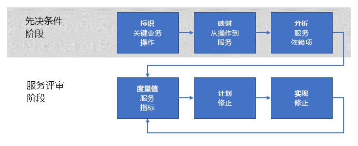

# 建立操作适用性评审Establishing an operational fitness review

企业开始在 Azure 中操作工作负荷以后，下一步是建立**操作适用性评审**过程，以便枚举、实现并以迭代方式评审这些工作负荷的**非功能性**要求。As your enterprise begins to operate workloads in Azure, the next step is to establish an **operational fitness review** process to enumerate, implement, and iteratively review the **non-functional** requirements for these workloads. 非功能性要求与服务的预期操作行为相关。_Non-functional_ requirements are related to the expected operational behavior of the service. 有五种基本类别的非功能性要求，称为[软件质量的要素](../../guide/pillars.md)：可伸缩性、可用性、复原能力（包括业务连续性和灾难恢复）、管理和安全性。There are five essential categories of non-functional requirements referred to as the [pillars of software quality](../../guide/pillars.md): scalability, availability, resiliency (including business continuity and disaster recovery), management, and security. 操作适用性评审过程的目的是确保任务关键型工作负荷满足企业对质量要素的预期。The purpose of an operational fitness review process is ensuring that your mission critical workloads meet the expectations of your business with respect to the quality pillars.

因此，企业应通过操作适用性评审过程充分了解在生产环境中运行工作负荷时产生的问题，确定如何纠正问题，然后解决它们。For this reason,  your enterprise should undertake an operational fitness review process to fully understand the issues that result from running the workload in a production environment, determine how to remediate the issues, then resolve them. 本文概述了可供需要实现此目标的企业使用的高级操作适用性评审过程。This article outlines a high-level operational fitness review process that your enterprise can use to achieve this goal.

## Microsoft 的操作适用性Operational fitness at Microsoft

Azure 平台的开发从一开始就是 Microsoft 的许多团队承担的持续开发和集成项目。From the outset, the development of the Azure platform has been a continuous development and integration project undertaken by many teams across Microsoft. 如果不能通过一个可靠的过程来定期枚举和实施基本的非功能性要求，则很难确保 Azure 这样大且复杂的项目的质量和一致性。It would be very difficult to ensure quality and consistency for a project of Azure's size and complexity without a robust process for enumerating and implementing the fundamental non-functional requirements on a regular basis.

Microsoft 遵循的这些过程是本文档中概述的内容的基础。These processes followed by Microsoft form the basis for those outlined in this document.

## 了解问题Understanding the problem

根据[入门](../../cloud-adoption/getting-started/overview.md)中的介绍，在企业数字化转型过程中，第一步是确定需要通过 Azure 来解决的业务问题。As you learned in [Getting started](../../cloud-adoption/getting-started/overview.md), the first step in an enterprise's digital transformation is identifying the business problems to be solved by adopting Azure. 下一步是确定问题的高级解决方案，例如将工作负荷迁移到云，或者调整现有的本地服务，使之包含云功能。The next step is to determine a high-level solution to the problem, such as migrating a workload to the cloud, or adapting an existing on-premises service to include cloud functionality. 最后，设计并实施解决方案。Finally, the solution is designed and implemented.

在此过程中，通常关注服务的功能。During this process, the focus is often on the _features_ of the service. 也就是说，有一系列功能性要求需要服务来执行。That is, there are a set of desired _functional_ requirements for the service to perform. 例如，产品交付服务需要相关功能来确定产品的源和目标位置，在完成交付、客户通知等操作时对产品进行跟踪。For example, a product delivery service requires features for determining the source and destination locations of the product, tracking the product during delivery, customer notifications, and others.

与此相反，非功能性要求则与服务的[可用性](../../checklist/availability.md)、[复原能力](../../resiliency/index.md)和[可伸缩性](../../checklist/scalability.md)等属性相关。In contrast, the _non-functional_ requirements relate to properties such as the service's [availability](../../checklist/availability.md), [resiliency](../../resiliency/index.md), and [scalability](../../checklist/scalability.md). 这些属性不同于功能性要求，因为它们不直接影响服务中任何具体特性的最终功能。These properties differ from the functional requirements because they do not directly affect the final function of any particular feature in the service. 但是，这些非功能性要求与服务的性能和连续性相关。However, these non-functional requirements are related to the _performance_ and _continuity_ of the service.

某些非功能性要求可以通过服务级别协议 (SLA) 条款来指定。Some non-functional requirements can be specified in terms of a service level agreement (SLA). 例如，就服务连续性来说，可以将服务的可用性要求表述为某个百分比，比如**在 99.99% 的时间可用**。For example, with regard to service continuity, an availability requirement for the service can be expressed as a percentage such as **available 99.99% of the time**. 其他非功能性要求可能更加难以定义，并且可能随着生产需求的变化而变化。Other non-functional requirements may be more difficult to define and may change as production needs evolve. 例如，某个面向使用者的服务在热门过后可能会开始面临非预期的吞吐量要求。For example, a consumer-facing service might start facing unanticipated throughput requirements after a surge of popularity.

![NOTE] 若要更深入地了解如何定义复原能力要求，包括如何对 RPO、RTO、SLA 和相关概念进行说明，请参阅[设计适用于 Azure 的可复原应用程序](../../resiliency/index.md#define-your-availability-requirements)。![NOTE] Defining the requirements for resiliency, including explanations of RPO, RTO, SLA, and related concepts, are explored in more depth in [Designing resilient applications for Azure](../../resiliency/index.md#define-your-availability-requirements).

## 操作适用性评审过程Operational fitness review process

若要维护企业服务的性能和连续性，关键是实施操作适用性评审过程。The key to maintaining the performance and continuity of an enterprise's services is to implement an _operational fitness review_ process.

此过程大致分为两个阶段。At a high level, the process has two phases. 在先决条件阶段，需确定要求并将其映射到支持服务。In the prerequisites phase, the requirements are established and mapped to supporting services. 此情况出现频率较低；也许每年出现一次，或者在引入新操作时出现。This occurs less frequently; perhaps annually or when new operations are introduced. 先决条件阶段的输出在流阶段使用。The output of the prerequisites phase is used in the flow phase. 流阶段出现频率较高；建议每月一次。The flow phase occurs more frequently; we recommend monthly.

### 先决条件阶段Prerequisites phase

此阶段的步骤用于捕获对重要服务进行定期评审所需满足的要求。The steps in this phase are intended to capture the necessary requirements for conducting a regular review of the important services.

- **确定关键业务操作**。**Identify critical business operations**. 确定企业的**任务关键型**业务操作。Identify the enterprise's **mission critical** business operations. 业务操作独立于任何支持服务功能。Business operations are independent from any supporting service functionality. 换句话说，业务操作代表企业需执行的实际活动，受一组 IT 服务的支持。In other words, business operations represent the actual activities that the business needs to perform and are supported by a set of IT services. 术语“任务关键型”或“业务关键型”反映了在操作受阻的情况下对业务的严重影响。The term _mission critical_, or alternatively _business critical_, reflects a severe impact to the business if the operation is impeded. 例如，在线零售商可能会有“允许客户向购物车添加商品”或“处理信用卡付款”之类的业务操作。For example, an online retailer may have a business operation such as "enable a customer to add an item to a shopping cart" or "process a credit card payment". 如果其中一项操作失败，客户将无法完成交易，企业将无法完成销售。If either of these operations were to fail, a customer would be unable to complete the transaction and the enterprise would fail to realize sales.

- **将操作映射到服务**。**Map operations to services**. 将这些业务操作映射到支持它们的服务。Map these business operations to the services that support them. 在上面的购物车示例中，可能涉及多项服务：库存管理服务、购物车服务，等等。In the above shopping cart example, several services may be involved: an inventory stock management service, a shopping cart service, and others. 在上面的信用卡付款示例中，本地付款服务可能会与第三方款项处理服务交互。In the credit card payment example above, an on-premises payment service may interact with a third-party payment processing service.

- **分析服务依赖关系**。**Analyze service dependencies**. 大多数业务操作需要在多项支持服务之间进行协调。Most business operations require orchestration between multiple supporting services. 必须了解服务之间的依赖关系以及任务关键型事务在这些服务之间的流动。It is important to understand the dependences between the services and the flow of mission critical transactions through these services. 另外还应考虑本地服务和 Azure 服务之间的依赖关系。You should also consider the dependencies between on-premises services and Azure services. 在购物车示例中，库存管理服务可能托管在本地，通过员工从某个物理仓库引入数据输入，但它可能将数据存储在 Azure 服务（例如 [Azure 存储](/azure/storage/common/storage-introduction)）中或数据库（例如 [Azure Cosmos DB](/azure/cosmos-db/introduction)）中。In the shopping cart example, the inventory stock management service may be hosted on-premises and ingest data input by employees from a physical warehouse, but it may store data in an Azure service such as [Azure storage](/azure/storage/common/storage-introduction) or a database such as [Azure Cosmos DB](/azure/cosmos-db/introduction).

这些活动的输出是一组适用于服务操作的**记分卡指标**。An output from these activities is a set of **scorecard metrics** for service operations. 这些指标按照非功能性条件（例如可用性、可伸缩性和灾难恢复）进行分类。The metrics are categorized in terms of non-functional criteria such as availability, scalability, and disaster recovery. 记分卡指标表述服务在操作方面应满足的条件。Scorecard metrics express the criteria that the service is expected to meet operationally. 这些指标可以在任何粒度级别表述，只要该级别适合服务操作。These metrics can be expressed at any level of granularity that is appropriate for the service operation.

记分卡应该以简单的术语表述，方便业务负责人和工程人员进行有意义的讨论。The scorecard should be expressed in simple terms to facilitate meaningful discussion between the business owners and engineering. 例如，可伸缩性记分卡指标为绿色时，表示性能符合所需标准；为黄色时，表示性能不符合所需标准，但正在积极实施计划的补救措施；为红色时，表示性能不符合所需标准，且没有任何计划或措施。For example, a scalability scorecard metric could be expressed as _green_ for performing at the desired criteria, _yellow_ for failing to meet the desired criteria but actively implementing a planned remediation, and _red_ for failing to meet the desired criteria with no plan or action.

必须强调的是，这些指标应该直接反映业务需求。It is important to emphasize that these metrics should directly reflect business needs.

### 服务评审阶段Service review phase

服务评审阶段是操作适用性评审过程的核心。The service review phase is core of the operational fitness review process.

- **衡量服务指标**。**Measure service metrics**. 使用记分卡指标时，应对服务进行监视，确保其符合业务预期。Using the scorecard metrics, the services should be monitored to ensure that they meet the business expectations. 这意味着服务监视很重要。This means that service monitoring is essential. 如果无法针对非功能性要求监视一组服务，则应将相应的记分卡指标视为红色。If you are not able to monitor a set of services with respect to the non-functional requirements, then the corresponding scorecard metrics should be considered red. 在这种情况下，若要进行补救，第一步是实施适当的服务监视。In this case, the first step for remediation is to implement the appropriate service monitoring.
例如，如果企业预期某项服务在操作时的可用性为 99.99%，但尚未准备好生产遥测来衡量可用性，则应假定你不符合要求。For example, if the business expects a service to operate with 99.99% availability, but there is no production telemetry in place to measure the availability, you should assume that you're not meeting the requirement.

- **计划补救**。**Plan remediation**. 对于其指标低于某个可接受阈值的每项服务操作，请确定对服务进行补救以使操作指标回到可接受范围的成本。For each service operation with metrics that fall below an acceptable threshold, determine the cost of remediating the service to bring operation to an acceptable metric. 如果补救该服务的成本高于该服务预期会产生的收入，则应考虑无形成本，例如客户体验成本。If the cost of remediating the service is greater than the expected revenue generation of the service, move on to consider the non-tangible costs such as customer experience. 例如，客户在难以使用该服务成功下单时，可能会改为选择你的竞争对手下单。For example, if customers have difficulty placing a successful order using the service, they may choose a competitor instead.

- **实施补救**。**Implement remediation**. 在业务负责人和工程人员共同制定某项计划以后，就应该实施该计划。After the business owners and engineering converge on a plan, it should be implemented. 只要评审记分卡指标，就应该报告实施状态。The status of the implementation should be reported whenever scorecard metrics are reviewed.

此过程为迭代过程，理想情况下，企业应指定一个团队来专门负责它。This process is iterative, and ideally your enterprise should have a team dedicated to owning it. 该团队应定期会面，对现有补救项目进行评审，开始对新的工作负荷进行基础评审，并跟踪企业的总记分卡。This team should meet regularly to review existing remediation projects, kick off the fundamentals review of new workloads, and track the enterprise's overall scorecard. 该团队应该具有足够的权限，可以确保对落后于计划或无法满足指标要求的补救团队问责。The team should have the authority to ensure accountability for remediation teams that are behind schedule or fail to meet metrics.

## 操作适用性评审团队的结构Structure of the operational fitness review team

操作适用性评审团队由以下角色组成：The operational fitness review team is composed of the following roles:

1. **业务负责人**。**Business owner**. 此角色提供标识每个“任务关键型”业务操作并确定其优先级所需的业务知识。This role provides knowledge of the business to identify and prioritize each "mission critical" business operation. 此角色还会对补救成本与业务影响进行比较，推动补救决策的最后达成。This role also compares the mitigation cost to the business impact and drives the final decision on remediation.

2. **业务大使**。**Business advocate**. 此角色负责将业务操作细分成不同的部分，并将这些部分映射到本地和云的服务及基础设施。This role is responsible for breaking down business operations into discreet parts and mapping those parts to on-premises and cloud services and infrastructure. 此角色需深入了解与每项业务操作相关联的技术。The role requires deep knowledge of the technology associated with each business operation.

3. **工程负责人**。**Engineering owner**. 此角色负责与业务操作相关联的服务的实施。This role is responsible for implementating the services associated with the business operation. 这些人员可能参与任何解决方案的设计、实施和部署，以便解决操作适用性评审团队发现的非功能性要求问题。These individuals may participate in the design, implementation, and deployment of any solutions for solving non-functional requirement issues uncovered by the operational fitness review team.

4. **服务负责人**。**Service owner**. 此角色负责操作企业的应用程序和服务。This role is responsible for operating the business's applications and services. 这些人员收集这些应用程序和服务的日志记录和使用情况数据。These individuals collect logging and usage data for these applications and services. 该数据用于确定问题并验证部署后的修补程序。This data is used both to identify issues and verify fixes once deployed.

## 操作适用性评审会议Operational fitness review meeting

建议操作适用性评审团队定期会面。We recommend that your operational fitness review team meet on a regular basis. 例如，该团队可以每月会面一次，而向高级领导报告状态和指标则每季一次。For example, the could team meet on a monthly cadence and report status and metrics to senior leadership on a quarterly basis.

此过程及会面的详细计划取决于具体需要。The details of the process and meeting should be adapted to fit your specific needs. 建议从以下任务着手：We recommend the following tasks as a starting point:

1. 业务负责人和业务大使负责枚举并确定每项业务操作的非功能性要求，工程人员和服务负责人可以提供意见。The business owner and business advocate enumerate and determine the non-functional requirements for each business operation, with input from the engineering and service owners. 对于以前已确定的业务操作，则需审核并验证优先级。For business operations that have been previously identified, the priority is reviewed and verified. 对于新的业务操作，则会为其分配现有列表中的某个优先级。For new business operations, a priority in the existing list is assigned.

2. 工程人员和服务负责人会将业务操作的**当前状态**映射到相应的本地服务和云服务。The engineering and service owners map the **current state** of business operations to the corresponding on-premises and cloud services. 映射包含每项服务中的组件的列表，形成一棵依赖关系树。The mapping is composed of a list of the components in each service, oriented as a dependency tree. 列表和依赖关系树生成以后，整棵树的**关键路径**就确定了。Once the list and dependency tree are generated, the **critical paths** through the tree are determined.

3. 工程人员和服务负责人会针对上一步列出的服务来审核操作日志记录和监视的当前状态。The engineering and service owners review the current state of operational logging and monitoring for the services listed in the previous step. 若要确定那些导致无法满足非功能性要求的服务组件，可靠的日志记录和监视很关键。Robust logging and monitoring are critical, in order to identify service components that contribute to failuring to meet non-functional requirements. 如果没有完备的日志记录和监视，则必须制定并实施计划，确保其到位。If sufficient logging and monitoring are not in place, a plan must be created and implemented to put them in place.

4. 将会为新的业务操作创建记分卡指标。Scorecard metrics are created for new business operation. 根据非功能性要求，记分卡包含在步骤 2 中确定的每项服务的构成组件的列表。此外还有一个指标，表示组件符合要求的程度。The scorecard is composed of the list of constituent components for each service identified in step 2, aligned with the non-functional requirements and a metric representing how well the component meets the requirement.

5. 对于那些不符合非功能性要求的构成组件，将会设计一项高级解决方案并指定一位工程负责人。For those constituent components that fail to meet non-functional requirements, a high-level solution is designed and an engineering owner is assigned. 此时，业务负责人和业务大使应该根据业务操作的预期收入建立补救工作的预算。At this point, the business owner and business advocate should establish a budget for the remediation work, based on the expected revenue of the business operation.

6. 最后，对正在进行的补救工作进行评审。Finally, a review is conducted of the ongoing remediation work. 对于正在进行的工作，每个记分卡指标都会对照着预期的指标进行审核。Each of the scorecard metrics for work in progress is reviewed against the expected metrics. 对于符合指标的构成组件，服务负责人会提供日志记录和监视数据来确认是否符合指标。For constituent components that are meeting metrics, the service owner presents logging and monitoring data to confirm that the metric is met. 对于那些不符合指标的构成组件，每位工程负责人都要对妨碍指标实现的问题进行说明，并探讨任何适用于补救的新设计。For those constituent components that are not meeting metrics, each engineering owner explains the issues that are preventing metrics from being reached and any new designs for remediation.

## 推荐的资源Recommended resources

- [软件质量的要素](../../guide/pillars.md)。[Pillars of software quality](../../guide/pillars.md).
Azure 应用程序体系结构指南的此部分介绍软件质量的五大要素：可伸缩性、可用性、复原能力、管理和安全性。This section of the Azure Application Architecture guide describes the five pillars of software quality: Scalability, availability, resiliency, management, and security.
- [Azure 应用程序的十个设计原则](../../guide/design-principles/index.md)。[Ten design principles for Azure applications](../../guide/design-principles/index.md).
Azure 应用程序体系结构指南的此部分讨论一组可以提高应用程序的可伸缩性、复原能力和可管理性的设计原则。This section of the Azure Application Architecture guide discusses a set of design principles to make your application more scalable, resilient, and manageable.
- [设计适用于 Azure 的可复原应用程序](../../resiliency/index.md)。[Designing resilient applications for Azure](../../resiliency/index.md).
此指南首先解释术语“复原能力”的定义和相关概念。This guide starts with a definition of the term resiliency and related concepts. 然后，介绍在应用程序从设计和实施到部署和运营的整个生存期内，使用结构化的方法实现复原的过程。Then it describes a process for achieving resiliency, using a structured approach over the lifetime of an application, from design and implementation to deployment and operations.
- [云设计模式](../../patterns/index.md)。[Cloud Design Patterns](../../patterns/index.md).
使用这些设计模式，工程团队可以按照软件质量的要素要求来生成应用程序。These design patterns are useful for engineering teams when building applications on the pillars of software quality.