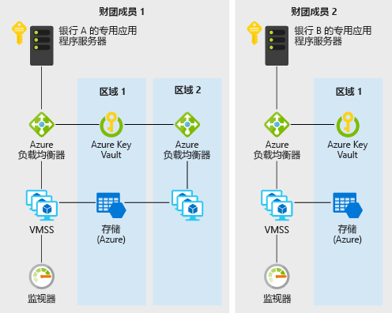

# Azure 上银行间的分散式信任Decentralized trust between banks on Azure

本示例方案适用于银行，或者希望在不借助集中式数据库的情况下，为信息共享建立可信环境的其他任何机构。This example scenario is useful for banks or any other institutions that want to establish a trusted environment for information sharing without resorting to a centralized database. 本示例将在维护不同银行信用评分信息的上下文中描述方案，但该体系结构可应用于如下所述的任何方案：组织联盟希望能够在不借助于任何一方运行的中心系统的情况下，相互共享验证的信息。For the purpose of this example, we will describe the scenario in the context of maintaining credit score information between banks, but the architecture can be applied to any scenario where a consortium of organizations want to share validated information with one another without resorting to the use of a central system ran by one single party.

金融系统中的银行一贯依赖于征信局等集中源来了解有关个人信用评分和历史信息。Traditionally, banks within a financial system rely on centralized sources such as credit bureaus for information on an individual's credit score and history. 集中式方法会将操作风险凝聚到一起，有时还会涉及到某个不必要的第三方。A centralized approach presents a concentration of operational risk and sometimes an unnecessary third party.

使用 DLT（分布式账本技术），银行联盟可以建立更高效、不易受到攻击并可充当新平台的分散式系统，在其中可以实施创新结构来解决隐私、速度和成本方面的传统难题。With DLTs (distributed ledger technology), a consortium of banks can establish a decentralized system that can be more efficient, less susceptible to attack, and serve as a new platform where innovative structures can be implemented to solve traditional challenges with privacy, speed, and cost.

本示例将演示如何快速预配虚拟机规模集、虚拟网络、Key Vault、存储、负载均衡器和 Monitor 等 Azure 服务，以部署高效的专用 Ethereum PoA 区块链，让成员银行在其中建立自身的节点。This example will show you how Azure services such as virtual machine scale set, Virtual Network, Key Vault, Storage, Load Balancer, and Monitor can be quickly provisioned for the deployment of an efficient private Ethereum PoA blockchain where member banks can establish their own nodes.

## 相关用例Relevant use cases

其他这些用例采用类似的设计模式：These other uses cases have similar design patterns:

* 分配的预算在跨国公司的不同业务部门之间转移Movement of allocated budgets between different business units of a multinational corporation
* 跨界付款Cross-border payments
* 贸易融资方案Trade finance scenarios
* 涉及不同公司的会员系统Loyalty systems involving different companies
* 供应链生态系统，等等Supply chain ecosystems and many more

## 体系结构Architecture

此方案包括在由两个或更多个成员组成的联盟中创建可缩放、安全、受监视的专用企业区块链网络所需的后端组件。This scenario covers the back-end components that are necessary to create a scalable, secure, and monitored private, enterprise blockchain network within a consortium of two or more members. 你需要根据组织的政策要求，详细考虑如何预配这些组件（即，在不同的订阅和资源组中预配）和连接要求（即，VPN 或 ExpressRoute）。Details of how these components are provisioned (that is, within different subscriptions and resource groups) as well as the connectivity requirements (that is, VPN or ExpressRoute) are left for your consideration based on your organization's policy requirements. 数据流如下：Here's how data flows:

1. 银行 A 通过 JSON-RPC 将事务发送到区块链网络，以创建/更新个人的信用记录。Bank A creates/updates an individual's credit record by sending a transaction to the blockchain network via JSON-RPC.
2. 数据从银行 A 的专用应用程序服务器发送到 Azure 负载均衡器，然后发送到虚拟机规模集上的验证节点 VM。Data flows from Bank A's private application server to the Azure load balancer and subsequently to a validating node VM on the virtual machine scale set.
3. Ethereum PoA 网络在预设的时间（在本方案中为 2 秒）创建一个区块。The Ethereum PoA network creates a block at a preset time (2 seconds for this scenario).
4. 事务捆绑到创建的区块，并通过区块链网络进行验证。The transaction is bundled into the created block and validated across the blockchain network.
5. 银行 B 可以通过与其自身的节点通信（同样通过 JSON-RPC），来读取银行 A 创建的信用记录。Bank B can read the credit record created by bank A by communicating with its own node similarly via JSON-RPC.

### 组件Components

* 虚拟机规模集中的虚拟机提供按需计算设施用于托管区块链的验证程序进程Virtual Machines within Virtual Machine Scale Sets provides the on-demand compute facility to host the validator processes for the blockchain
* Key Vault 用作安全存储设施，可存储每个验证程序的私钥Key Vault is used as the secure storage facility for the private keys of each validator
* 负载均衡器分散 RPC、对等互连和监管 DApp 请求Load Balancer spreads the RPC, peering, and Governance DApp requests
* 用于托管持久性网络信息并协调租用的存储Storage hosting persistent network information and coordinating leasing
* Operations Management Suite（绑定多个 Azure 服务）提供可用节点数、每分钟事务数和联盟成员的见解Operations Management Suite (a bundling of a few Azure services) provides insight into available nodes, transactions per minute and consortium members

### 备选项Alternatives

之所以在本示例中选择 Ethereum PoA 方法，是因为此方法是一个良好的入口点，可让组织联盟创建一个可以通过可信、分散且可轻松理解的方式交换和共享信息的环境。The Ethereum PoA approach is chosen for this example because it is a good entry point for a consortium of organizations that want to create an environment where information can be exchanged and shared with one another easily in a trusted, decentralized, and easy to understand way. 此外，可用的 Azure 解决方案模板不仅为联盟领袖提供快速方便的方法用于启动 Ethereum PoA 区块链，而且还可让联盟中的成员组织在其自己的 Azure 资源组和订阅中运转其自己的 Azure 资源以加入现有网络。The available Azure solution templates also provide a fast and convenient way not just for a consortium leader to start an Ethereum PoA blockchain, but also for member organizations in the consortium to spin up their own Azure resources within their own resource group and subscription to join an existing network.

对于其他扩展方案或不同方案，可能会出现交易隐私等方面的忧虑。For other extended or different scenarios, concerns such as transaction privacy may arise. 例如，在证券转让方案中，联盟中的成员可能不希望其他人（甚至是其他成员）看到其交易。For example, in a securities transfer scenario, members in a consortium may not want their transactions to be visible even to other members. Ethereum PoA 中的其他替代方案可按自身的方式解决这些忧虑：Other alternatives to Ethereum PoA exist that addresses these concerns in their own way:

* CordaCorda
* QuorumQuorum
* HyperledgerHyperledger

## 注意事项Considerations

### 可用性Availability

[Azure Monitor][monitor] 用于持续监视区块链网络中的问题，以确保可用性。[Azure Monitor][monitor] is used to continuously monitor the blockchain network for issues to ensure availability. 成功部署此方案中使用的区块链解决方案模板后，会将基于 Azure Monitor 的自定义监视仪表板的链接发送给您。A link to a custom monitoring dashboard based on Azure Monitor will be sent to you upon successful deployment of the blockchain solution template used in this scenario. 该仪表板显示过去 30 分钟报告了检测信号的节点，以及其他有用的统计信息。The dashboard shows nodes that are reporting heartbeats in the past 30 minutes as well as other useful statistics. 

若要了解其他可用性主题，请参阅 Azure 体系结构中心的[可用性核对清单][availability]。For other availability topics, see the [availability checklist][availability] in the Azure Architecture Center.

### 可伸缩性Scalability

在区块链方面，一个常见的考虑因素是区块链在预设时间内可以包含的事务数。A popular concern for blockchain is the number of transactions that a blockchain can include within a preset amount of time. 此方案使用权威证明，与使用工作证明相比，可以更好地管理可伸缩性。This scenario uses Proof-of-Authority where such scalability can be better managed than Proof-of-Work. 在基于权威证明的网络中，达成共识的参与者是已知的并且是受管理的，因此权威证明更适合相互了解的组织联盟的专用区块链。In Proof-of-Authority based networks, consensus participants are known and managed, making it more suitable for private blockchain for a consortium of organization that knows one another. 通过自定义仪表板可以轻松监视平均区块时间、每分钟事务数和计算资源消耗量等参数。Parameters such as average block time, transactions per minute and compute resource consumption can be easily monitored via the custom dashboard. 然后，可以根据规模要求相应地调整资源。Resources can then be adjusted accordingly based on scale requirements.

有关如何设计可缩放方案的通用指南，请参阅 Azure 体系结构中心的[可伸缩性核对清单][scalability]。For general guidance on designing scalable scenario, see the [scalability checklist][scalability] in the Azure Architecture Center.

### 安全Security

[Azure Key Vault][vault] 用于轻松存储和管理验证程序的私钥。[Azure Key Vault][vault] is used to easily store and manage the private keys of validators. 本示例中的默认部署将创建一个可通过 Internet 访问的区块链网络。The default deployment in this example creates a blockchain network that is accessible via the internet. 对于需要专用网络的生产方案，成员可以通过 VNet 间的 VPN 网关相互连接。For production scenario where a private network is desired, members can be connected to each other via VNet-to-VNet VPN gateway connections. 以下“相关资源”部分包含了配置 VPN 的步骤。The steps for configuring a VPN are included in the related resources section below.

若需安全解决方案的通用设计指南，请参阅 [Azure 安全性文档][security]。For general guidance on designing secure solutions, see the [Azure Security Documentation][security].

### 复原Resiliency

由于验证程序节点可以部署在不同的区域，Ethereum PoA 区块链本身能够提供某种程度的复原能力。The Ethereum PoA blockchain can itself provide some degree of resilience as the validator nodes can be deployed in different regions. Azure 提供在超过 54 个全球区域中进行部署的选项。Azure has options for deployments in over 54 regions worldwide. 如本方案中所述的区块链提供独特、全新的协作功能用于提高复原能力。A blockchain such as the one in this scenario provides unique and refreshing possibilities of cooperation to increase resilience. 网络复原能力不能仅仅由单个集中式方案参与方提供，而应该由联盟的所有成员提供。The resilience of the network is not just provided for by a single centralized party but all members of the consortium. 基于权威证明的区块链允许对网络复原能力进行更多的精心规划。A Proof-of-Authority based blockchain allows network resilience to be even more planned and deliberate.

若需可复原解决方案的通用设计指南，请参阅[设计适用于 Azure 的可复原应用程序][resiliency]。For general guidance on designing resilient solutions, see [Designing resilient applications for Azure][resiliency].

## 定价Pricing

为了方便用户了解运行本方案的成本，我们已在成本计算器中预配置了所有服务。To explore the cost of running this scenario, all of the services are pre-configured in the cost calculator. 若要了解自己的特定用例的定价变化情况，请根据预期的性能和可用性要求更改相应的变量。To see how the pricing would change for your particular use case, change the appropriate variables to match your expected performance and availability requirements.

我们已根据运行应用程序的规模集 VM 实例数（实例可能驻留在不同的区域中）提供了三个示例性的成本配置文件。We have provided three sample cost profiles based on the number of scale set VM instances that run your applications (the instances can reside in different regions).

* [小型][small-pricing]：此定价示例适用于每个月使用 2 个 VM 并禁用监视的情况[Small][small-pricing]: this pricing example correlates to 2 VMs per month with monitoring turned off
* [中型][medium-pricing]：此定价示例适用于每个月使用 7 个 VM 并启用监视的情况[Medium][medium-pricing]: this pricing example correlates to 7 VMs per month with monitoring turned on
* [大型][large-pricing]：此定价示例适用于每个月使用 15 个 VM 并启用监视的情况[Large][large-pricing]: this pricing example correlates to 15 VMs per month with monitoring turned on

以上定价适用于启动或加入区块链网络的一个联盟成员。The above pricing is for one consortium member to start or join a blockchain network. 通常，在涉及到多个公司或组织的联盟中，每个成员会获取自身的 Azure 订阅。Typically in a consortium where there are multiple companies or organizations involved, each member will get their own Azure subscription.

## 后续步骤Next Steps

若要查看此方案的示例，请在 Azure 上部署 [Ethereum PoA 区块链演示应用程序][deploy]，然后浏览[方案源代码的自述文件][source]。To see an example of this scenario, deploy the [Ethereum PoA blockchain demo application][deploy] on Azure, then go through the [README of the scenario source code][source].

## 相关资源Related resources

有关使用适用于 Azure 的 Ethereum 权威证明解决方案模板的详细信息，请查看此[用法指南][guide]。For more information on using the Ethereum Proof-of-Authority solution template for Azure, review this [usage guide][guide].

<!-- links -->
[small-pricing]: https://azure.com/e/4e429d721eb54adc9a1558fae3e67990
[medium-pricing]: https://azure.com/e/bb42cd77437744be8ed7064403bfe2ef
[large-pricing]: https://azure.com/e/e205b443de3e4adfadf4e09ffee30c56
[guide]: /azure/blockchain-workbench/ethereum-poa-deployment
[deploy]: https://portal.azure.com/?pub_source=email&pub_status=success#create/microsoft-azure-blockchain.azure-blockchain-ethereumethereum-poa-consortium
[source]: https://github.com/vitoc/creditscoreblockchain
[monitor]: /azure/monitoring-and-diagnostics/monitoring-overview-azure-monitor
[availability]: /azure/architecture/checklist/availability
[scalability]: /azure/architecture/checklist/scalability
[resiliency]: ../../resiliency/index.md
[security]: /azure/security/
[vault]: https://azure.microsoft.com/services/key-vault/
