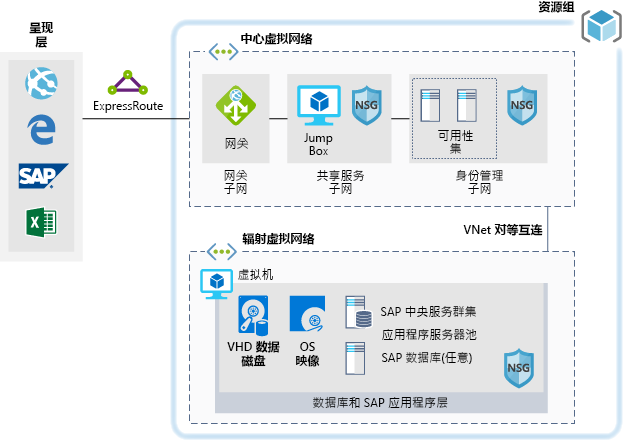

# Azure 上的 SAP 工作负荷的开发/测试环境

本示例演示如何针对 Azure 上的 Windows 或 Linux 环境中的 SAP NetWeaver 建立开发/测试环境。 使用的数据库为 AnyDB，这是一个 SAP 术语，指任何受支持的 DBMS（不是 SAP HANA）。 由于此体系结构设计用于非生产环境，因此在部署时只有一个虚拟机 (VM)，其大小可以根据你组织的需要进行更改。

对于生产用例，请查看下面提供的 SAP 参考体系结构：

* [适用于 AnyDB 的 SAP NetWeaver][sap-netweaver]
* [SAP S/4HANA][sap-hana]
* [Azure SAP 大型实例][sap-large]

## 相关用例

以下用例可以考虑本方案：

* 非关键性 SAP 非生产工作负荷（沙盒、开发、测试、质量保证）
* 非关键性 SAP 业务型工作负荷

## 体系结构

本方案演示如何在单个虚拟机上预配单个 SAP 系统数据库和 SAP 应用程序服务器。 数据流经方案的情形如下所示：

1. 客户使用 SAP 用户界面或其他客户端工具（Excel、Web 浏览器或其他 Web 应用程序）来访问基于 Azure 的 SAP 系统。
2. 使用既定的 ExpressRoute 来提供连接。 ExpressRoute 连接在 Azure 中的 ExpressRoute 网关处终止。 网络流量的路径是：通过 ExpressRoute 网关到达网关子网，再从网关子网到达应用程序层辐射子网（参见[中心辐射][hub-spoke]模式），最后通过网络安全网关到达 SAP 应用程序虚拟机。
3. 标识管理服务器提供身份验证服务。
4. 跳转盒提供本地管理功能。

### 组件

* [虚拟网络](/azure/virtual-network/virtual-networks-overview)是在 Azure 中进行网络通信的基础。
* [虚拟机](/azure/virtual-machines/windows/overview)：Azure 虚拟机使用 Windows 或 Linux Server 按需提供具有高可伸缩性并且十分安全的虚拟化基础结构。
* 使用 [ExpressRoute](/azure/expressroute/expressroute-introduction) 可通过连接服务提供商所提供的专用连接，将本地网络扩展到 Microsoft 云。
* [网络安全组](/azure/virtual-network/security-overview)用于限制发往虚拟网络中的资源的网络流量。 网络安全组包含一个安全规则列表，这些规则可根据源或目标 IP 地址、端口和协议允许或拒绝入站或出站网络流量。 
* [资源组](/azure/azure-resource-manager/resource-group-overview#resource-groups)充当 Azure 资源的逻辑容器。

## 注意事项

### 可用性

 Microsoft 提供了用于单个 VM 实例的服务级别协议 (SLA)。 若要详细了解适用于虚拟机的 Microsoft Azure 服务级别协议，请参阅[虚拟机的 SLA](https://azure.microsoft.com/support/legal/sla/virtual-machines)

### 可伸缩性

有关如何设计可缩放解决方案的通用指南，请参阅 Azure 体系结构中心的[可伸缩性核对清单][scalability]。

### 安全

若需安全解决方案的通用设计指南，请参阅 [Azure 安全性文档][security]。

### 复原

若需可复原解决方案的通用设计指南，请参阅[设计适用于 Azure 的可复原应用程序][resiliency]。

## 定价

为帮助你了解运行本方案的成本，我们在以下成本计算器示例中预配置了所有服务。 若要了解自己的特定用例的定价变化情况，请按预期的流量更改相应的变量。

我们已根据你预期接收的流量提供了四个示例成本配置文件：

|大小|SAP|VM 类型|存储|Azure 定价计算器|
|----|----|-------|-------|---------------|
|小型|8000|D8s_v3|2xP20、1xP10|[小型](https://azure.com/e/9d26b9612da9466bb7a800eab56e71d1)|
|中型|16000|D16s_v3|3xP20、1xP10|[中型](https://azure.com/e/465bd07047d148baab032b2f461550cd)|
大型|32000|E32s_v3|3xP20、1xP10|[大型](https://azure.com/e/ada2e849d68b41c3839cc976000c6931)|
特大型|64000|M64s|4xP20、1xP10|[特大型](https://azure.com/e/975fb58a965c4fbbb54c5c9179c61cef)|

> [!NOTE]
> 此定价为指导价，仅指出了 VM 和存储费用。 此费用不包括网络、备份存储和数据传入/传出费用。

* [小](https://azure.com/e/9d26b9612da9466bb7a800eab56e71d1)：小型系统，其 VM 类型为 D8s_v3，使用 8x vCPU，32 GB RAM 和 200 GB 临时存储，另外还有两个 512 GB 的和一个 128 GB 的高级存储磁盘。
* [中](https://azure.com/e/465bd07047d148baab032b2f461550cd)：中型系统，其 VM 类型为 D16s_v3，使用 16x vCPU，64 GB RAM 和 400 GB 临时存储，另外还有三个 512 GB 的和一个 128 GB 的高级存储磁盘。
* [大](https://azure.com/e/ada2e849d68b41c3839cc976000c6931)：大型系统，其 VM 类型为 E32s_v3，使用 32x vCPU，256 GB RAM 和 512 GB 临时存储，另外还有三个 512 GB 的和一个 128 GB 的高级存储磁盘。
* [特大](https://azure.com/e/975fb58a965c4fbbb54c5c9179c61cef)：特大型系统，其 VM 类型为 M64s，使用 64x vCPU，1024 GB RAM 和 2000 GB 临时存储，另外还有四个 512 GB 的和一个 128 GB 的高级存储磁盘。

## 部署

单击此处即可部署本方案的底层基础结构。

> [!NOTE]
> 部署过程中不会安装 SAP 和 Oracle。 需要单独部署这些组件。

<!-- links -->
[resiliency]: /azure/architecture/resiliency/
[security]: /azure/security/
[scalability]: /azure/architecture/checklist/scalability
[sap-netweaver]: /azure/architecture/reference-architectures/sap/sap-netweaver
[sap-hana]: /azure/architecture/reference-architectures/sap/sap-s4hana
[sap-large]: /azure/architecture/reference-architectures/sap/hana-large-instances
[hub-spoke]: /azure/architecture/reference-architectures/hybrid-networking/hub-spoke
