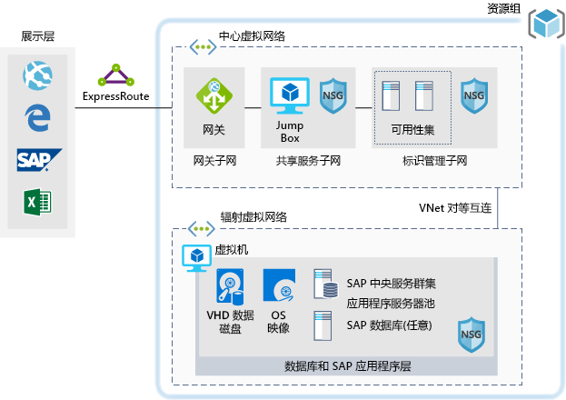

# 用于开发/测试工作负荷的 SAPSAP for dev/test workloads

本示例介绍了如何运行一个开发/测试实现，以便在 Azure 上的 Windows 或 Linux 环境中实现 SAP NetWeaver。This example provides guidance for how to run a dev/test implementation of SAP NetWeaver in a Windows or Linux environment on Azure. 使用的数据库为 AnyDB，这是一个 SAP 术语，指任何受支持的 DBMS（不是 SAP HANA）。The database used is AnyDB, the SAP term for any supported DBMS (that isn't SAP HANA). 由于此体系结构设计用于非生产环境，因此在部署时只有一个虚拟机 (VM)，其大小可以根据你组织的需要进行更改。Because this architecture is designed for non-production environments, it's deployed with just a single virtual machine (VM) and it's size can be changed to accommodate your organization's needs.

对于生产用例，请查看下面提供的 SAP 参考体系结构：For production use cases review the SAP reference architectures available below:

* [适用于 AnyDB 的 SAP NetWeaver][sap-netweaver][SAP netweaver for AnyDB][sap-netweaver]
* [SAP S/4Hana][sap-hana][SAP S/4Hana][sap-hana]
* [Azure SAP 大型实例][sap-large][SAP on Azure large instances][sap-large]

## 相关的用例Related use cases

以下用例可以考虑本方案：Consider this scenario for the following use cases:

* 非关键性 SAP 非生产工作负荷（沙盒、开发、测试、质量保证）Non-critical SAP non-productive workloads (sandbox, development, test, quality assurance)
* 非关键性 SAP 业务型工作负荷Non-critical SAP business one workloads

## 体系结构Architecture

本方案介绍如何在单个虚拟机上预配单个 SAP 系统数据库和 SAP 应用程序服务器。数据流经方案的情形如下所示：This scenario covers the provision of a single SAP system database and SAP application Server on a single virtual machine, the data flows through the scenario as follows:

1. 展示层的客户使用其 SAP GUI 或本地的其他用户界面（Internet Explorer、Excel 或其他 Web 应用程序）来访问基于 Azure 的 SAP 系统。Customers from the Presentation Tier use their SAP GUI, or other user interfaces (Internet Explorer, Excel, or other web application) on premise to access the Azure-based SAP system.
2. 使用既定的 Express Route 来提供连接。Connectivity is provided through the use of an established Express Route. Express Route 连接在 Azure 中的 Express Route 网关处终止。The Express Route connection is terminated in Azure at the Express Route Gateway. 网络流量的路径是：通过 Express Route 网关到达网关子网，再从网关子网到达应用程序层辐射子网（参见[中心辐射][hub-spoke]模式），最后通过网络安全网关到达 SAP 应用程序虚拟机。Network traffic routes through the Express Route gateway to the Gateway Subnet and from the gateway subnet to the Application Tier Spoke subnet (see the [hub-spoke][hub-spoke] pattern) and via a Network Security Gateway to the SAP application virtual machine.
3. 标识管理服务器提供身份验证服务。The identity management servers provide authentication services.
4. 跳转盒提供本地管理功能。The jump box provides local management capabilities.

### 组件Components

* [资源组](/azure/azure-resource-manager/resource-group-overview#resource-groups)是 Azure 资源的逻辑容器[Resource Groups](/azure/azure-resource-manager/resource-group-overview#resource-groups) is a logical container for Azure resources.
* [虚拟网络](/azure/virtual-network/virtual-networks-overview)是在 Azure 中进行通信的基础[Virtual Networks](/azure/virtual-network/virtual-networks-overview) is the basis of network communications within Azure
* [虚拟机](/azure/virtual-machines/windows/overview)：Azure 虚拟机使用 Windows 或 Linux Server 按需提供具有高可伸缩性并且十分安全的虚拟化基础结构[Virtual Machine](/azure/virtual-machines/windows/overview) Azure Virtual Machines provides on-demand, high-scale, secure, virtualized infrastructure using Windows or Linux Server
* 使用 [Express Route](/azure/expressroute/expressroute-introduction) 可通过连接服务提供商所提供的专用连接，将本地网络扩展到 Microsoft 云。[Express Route](/azure/expressroute/expressroute-introduction) lets you extend your on-premises networks into the Microsoft cloud over a private connection facilitated by a connectivity provider.
* [网络安全组](/azure/virtual-network/security-overview)用于限制发往虚拟网络中的资源的网络流量。[Network Security Group](/azure/virtual-network/security-overview) lets you limit network traffic to resources in a virtual network. 网络安全组包含一个安全规则列表，这些规则可根据源或目标 IP 地址、端口和协议允许或拒绝入站或出站网络流量。A network security group contains a list of security rules that allow or deny inbound or outbound network traffic based on source or destination IP address, port, and protocol. 

## 注意事项Considerations

### 可用性Availability

 Microsoft 提供了用于单个 VM 实例的服务级别协议 (SLA)。Microsoft offers a service level agreement (SLA) for single VM instances. 若要详细了解适用于虚拟机的 Microsoft Azure 服务级别协议，请参阅[虚拟机的 SLA](https://azure.microsoft.com/support/legal/sla/virtual-machines)For more information on Microsoft Azure Service Level Agreement for Virtual Machines [SLA For Virtual Machines](https://azure.microsoft.com/support/legal/sla/virtual-machines)

### 可伸缩性Scalability

有关如何设计可缩放解决方案的通用指南，请参阅 Azure 体系结构中心的[可伸缩性核对清单][scalability]。For general guidance on designing scalable solutions, see the [scalability checklist][scalability] in the Azure Architecture Center.

### 安全Security

若需安全解决方案的通用设计指南，请参阅 [Azure 安全性文档][security]。For general guidance on designing secure solutions, see the [Azure Security Documentation][security].

### 复原Resiliency

若需可复原解决方案的通用设计指南，请参阅[设计适用于 Azure 的可复原应用程序][resiliency]。For general guidance on designing resilient solutions, see [Designing resilient applications for Azure][resiliency].

## 定价Pricing

为了方便用户了解运行本方案的成本，我们已在成本计算器中预配置了所有服务。Explore the cost of running this scenario, all of the services are pre-configured in the cost calculator.  若要了解自己的特定用例的定价变化情况，请按预期的流量更改相应的变量。To see how the pricing would change for your particular use case change the appropriate variables to match your expected traffic.

我们已根据你预期接收的流量提供了四个示例性的成本配置文件：We have provided four sample cost profiles based on amount of traffic you expect to get:

|大小Size|SAPSAPs|VM 类型VM Type|存储Storage|Azure 定价计算器Azure Pricing Calculator|
|----|----|-------|-------|---------------|
|小型Small|80008000|D8s_v3D8s_v3|2xP20、1xP102xP20, 1xP10|[小型Small](https://azure.com/e/9d26b9612da9466bb7a800eab56e71d1)|
|中型Medium|1600016000|D16s_v3D16s_v3|3xP20、1xP103xP20, 1xP10|[中型Medium](https://azure.com/e/465bd07047d148baab032b2f461550cd)|
大型Large|3200032000|E32s_v3E32s_v3|3xP20、1xP103xP20, 1xP10|[大型Large](https://azure.com/e/ada2e849d68b41c3839cc976000c6931)|
特大型Extra Large|6400064000|M64sM64s|4xP20、1xP104xP20, 1xP10|[特大型Extra Large](https://azure.com/e/975fb58a965c4fbbb54c5c9179c61cef)|

注意：定价为指导价，仅表明 VM 和存储成本（不包括网络、备份存储和数据入口/出口费用）。Note: pricing is a guide and only indicates the VMs and storage costs (excludes, networking, backup storage, and data ingress/egress charges).

* [小](https://azure.com/e/9d26b9612da9466bb7a800eab56e71d1)：小型系统，其 VM 类型为 D8s_v3，使用 8x vCPU，32 GB RAM 和 200 GB 临时存储，另外还有两个 512 GB 的和一个 128 GB 的高级存储磁盘。[Small](https://azure.com/e/9d26b9612da9466bb7a800eab56e71d1): A small system consists of VM type D8s_v3 with 8x vCPUs, 32 GB RAM and 200 GB temp storage, additionally two 512 GB and one 128 GB premium storage disks.
* [中](https://azure.com/e/465bd07047d148baab032b2f461550cd)：中型系统，其 VM 类型为 D16s_v3，使用 16x vCPU，64 GB RAM 和 400 GB 临时存储，另外还有三个 512 GB 的和一个 128 GB 的高级存储磁盘。[Medium](https://azure.com/e/465bd07047d148baab032b2f461550cd): A medium system consists of VM type D16s_v3 with 16x vCPUs, 64 GB RAM and 400 GB temp storage, additionally three 512 GB and one 128 GB premium storage disks.
* [大](https://azure.com/e/ada2e849d68b41c3839cc976000c6931)：大型系统，其 VM 类型为 E32s_v3，使用 32x vCPU，256 GB RAM 和 512 GB 临时存储，另外还有三个 512 GB 的和一个 128 GB 的高级存储磁盘。[Large](https://azure.com/e/ada2e849d68b41c3839cc976000c6931): A large system consists of VM type E32s_v3 with 32x vCPUs, 256 GB RAM and 512 GB temp storage, additionally three 512GB and one 128GB premium storage disks.
* [特大](https://azure.com/e/975fb58a965c4fbbb54c5c9179c61cef)：特大型系统，其 VM 类型为 M64s，使用 64x vCPU，1024 GB RAM 和 2000 GB 临时存储，另外还有四个 512 GB 的和一个 128 GB 的高级存储磁盘。[Extra Large](https://azure.com/e/975fb58a965c4fbbb54c5c9179c61cef): An extra large system consists of a VM type M64s with 64x vCPUs, 1024 GB RAM and 2000 GB temp storage, additionally four 512 GB and one 128 GB premium storage disks.

## 部署Deployment

若要部署类似于上述方案的底层基础结构，请使用部署按钮To deploy the underlying infrastructure similar to the scenario above, use the deploy button

\* SAP 不会自动安装，请在生成基础结构后手动进行安装。\* SAP won't be automatically installed, manually install it after the infrastructure has been built.

<!-- links -->
[reference architecture]:  /azure/architecture/reference-architectures/sap
[resiliency]: /azure/architecture/resiliency/
[security]: /azure/security/
[scalability]: /azure/architecture/checklist/scalability
[sap-netweaver]: /azure/architecture/reference-architectures/sap/sap-netweaver
[sap-hana]: /azure/architecture/reference-architectures/sap/sap-s4hana
[sap-large]: /azure/architecture/reference-architectures/sap/hana-large-instances
[hub-spoke]: /azure/architecture/reference-architectures/hybrid-networking/hub-spoke