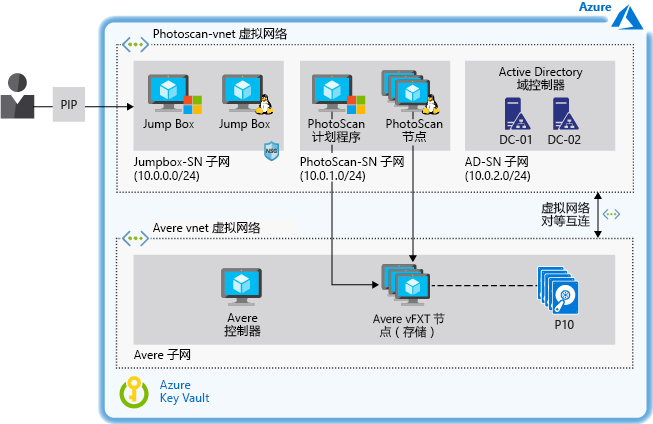

# 在 Azure 上加速基于数码图像的建模Accelerate digital image-based modeling on Azure

对于想要在 Azure 基础结构即服务 (IaaS) 上执行基于图像的建模的任何组织，本示例方案可以提供体系结构和设计方面的指导。This example scenario provides architecture and design guidance for any organization that wants to perform image-based modeling on Azure infrastructure-as-a-service (IaaS). 本方案适合用于在使用高性能存储（可加速处理时间）的 Azure 虚拟机 (VM) 上运行摄影软件。The scenario is designed for running photogrammetry software on Azure Virtual Machines (VMs) using high-performance storage that accelerates processing time. 环境可按需纵向扩展和缩减，并支持 TB 量级的存储且不牺牲性能。The environment can be scaled up and down as needed and supports terabytes of storage without sacrificing performance.

## 相关用例Relevant use cases

相关用例包括：Relevant use cases include:

- 建筑物建模和测量、工程结构，以及事故现场取证。Modeling and measuring buildings, engineering structures, and forensic accident scenes.
- 为电脑游戏和电影创建视觉效果。Creating visual effects for computer games and movies.
- 在城市规划和其他应用中，使用数码图像间接生成不同规模的对象的测量数据。Using digital images to indirectly generate measurements of objects of various scales as in urban planning and other applications.

## 体系结构Architecture

本示例将介绍基于 Avere vFXT 存储的 Agisoft PhotoScan 摄影软件的用法。This example describes the use of Agisoft PhotoScan photogrammetry software backed by Avere vFXT storage. 之所以选择 PhotoScan，是因为它在地理信息系统 (GIS) 应用、文化遗产文档、游戏开发和视觉效果生成等应用中非常流行。PhotoScan was chosen for its popularity in geographic information system (GIS) applications, cultural heritage documentation, game development, and visual effects production. 它适合用于近距离摄影和航空摄影。It is suitable for both close-range photogrammetry and aerial photogrammetry.

本文中的概念适用于基于计划程序的任何高性能计算 (HPC) 工作负荷以及作为基础结构管理的工作节点。The concepts in this article apply to any high-performance computing (HPC) workload based on a scheduler and worker nodes managed as infrastructure.  在基准测试期间，为此工作负荷选择了 Avere vFXT，因为它的性能非常优异。For this workload, Avere vFXT was selected for its superior performance during benchmark tests.  但是，本方案将存储与处理相分离，以便可以使用其他存储解决方案（请本文档稍后的[替代方案](#alternatives)）。However, the scenario decouples the storage from the processing so that other storage solutions can be used (see [alternatives](#alternatives) later in this document).

本体系结构还包含用于控制对 Azure 资源的访问的 Active Directory 域控制器，并通过域名系统 (DNS) 提供内部名称解析。This architecture also includes Active Directory domain controllers to control access to Azure resources and provide internal name resolution through the Domain Name System (DNS). 跳转盒提供对运行该解决方案的 Windows 和 Linux VM 的管理员访问权限。Jump boxes provide administrator access to the Windows and Linux VMs that run the solution.

1. 用户将多个图像提交到 PhotoScan。User submits a number of images to PhotoScan.
2. PhotoScan 计划程序在充当头节点的 Windows VM 上运行，并定向用户图像的处理。The PhotoScan Scheduler runs on a Windows VM that serves as the head node and directs processing of the user's images.
3. PhotoScan 在照片上搜索通用点，并使用 VM 上运行的 PhotoScan 处理节点和图形处理单元 (GPU) 构造几何图形（网格）。PhotoScan searches for common points on the photographs and constructs the geometry (mesh) using the PhotoScan processing nodes running on VMs with graphics processing units (GPUs).
4. Avere vFXT 在 Azure 上提供基于网络文件系统版本 3 (NFSv3) 的、至少包括四个 VM 的高性能存储解决方案。Avere vFXT provides a high-performance storage solution on Azure based on Network File System version 3 (NFSv3) and comprised of at least four VMs.
5. PhotoScan 呈现模型。PhotoScan renders the model.

### 组件Components

- [Agisoft PhotoScan](http://www.agisoft.com/)：PhotoScan 计划程序在 Windows 2016 Server VM 上运行，处理节点使用五个包含 GPU 的、运行 CentOS Linux 7.5 的 VM。[Agisoft PhotoScan](http://www.agisoft.com/): The PhotoScan Scheduler runs on a Windows 2016 Server VM, and the processing nodes use five VMs with GPUs that run CentOS Linux 7.5.
- [Avere vFXT](/azure/avere-vfxt/avere-vfxt-overview) 是一个文件缓存解决方案，它使用对象存储和传统的网络连接存储 (NAS) 来优化大型数据集的存储。[Avere vFXT](/azure/avere-vfxt/avere-vfxt-overview) is a file caching solution that uses object storage and traditional network-attached storage (NAS) to optimize storage of large datasets. 其中包括：It includes:
  - Avere 控制器。Avere Controller. 此 VM 执行用于安装 Avere vFXT 群集和运行 Ubuntu 18.04 LTS 的脚本。This VM executes the script that installs the Avere vFXT cluster and runs Ubuntu 18.04 LTS. 以后可以使用该 VM 来添加或删除群集节点，以及销毁群集。The VM can be used later to add or remove cluster nodes and to destroy the cluster as well.
  - vFXT 群集。vFXT cluster. 至少使用三个 VM，对基于 Avere OS 5.0.2.1 的每个 Avere vFXT 节点各使用一个。At least three VMs are used, one for each of the Avere vFXT nodes based on Avere OS 5.0.2.1. 这些 VM 构成了附加到 Azure Blob 存储的 vFXT 群集。These VMs form the vFXT cluster, which is attached to Azure Blob storage.
- [Microsoft Active Directory 域控制器](/windows/desktop/ad/active-directory-domain-services)可让主机访问域资源以及提供 DNS 名称解析。[Microsoft Active Directory domain controllers](/windows/desktop/ad/active-directory-domain-services) allow the host access to domain resources and provide DNS name resolution. Avere vFXT 中添加的记录数&mdash;等 vFXT 群集中的每个 A 记录指向 Avere vFXT 的每个节点的 IP 地址。Avere vFXT adds a number of A records &mdash; for example, each A record in a vFXT cluster points to the IP address of each Avere vFXT node. 在此设置中，所有 VM 使用轮循模式访问 vFXT 导出内容。In this setup, all VMs use the round-robin pattern to access vFXT exports.
- [其他 VM](/azure/virtual-machines/) 充当跳转盒，管理员使用它们来访问计划程序和处理节点。[Other VMs](/azure/virtual-machines/) serve as jump boxes used by the administrator to access the scheduler and processing nodes. 必须提供 Windows 跳转盒才能让管理员通过远程桌面协议访问头节点。The Windows jumpbox is mandatory to allow the administrator to access the head node via remote desktop protocol. 第二个跳转盒是可选的，运行用于管理工作节点的 Linux。The second jumpbox is optional and runs Linux for administration of the worker nodes.
- [网络安全组](/azure/virtual-network/manage-network-security-group) (NSG) 限制对公共 IP 地址 (PIP) 的访问，并允许端口 3389 和 22 访问附加到跳转盒子网的 VM。[Network security groups](/azure/virtual-network/manage-network-security-group) (NSGs) limit access to the public IP address (PIP) and allow ports 3389 and 22 for access to the VMs attached to the Jumpbox subnet.
- [虚拟网络对等互连](/azure/virtual-network/virtual-network-peering-overview)将 PhotoScan 虚拟网络连接到 Avere 虚拟网络。[Virtual network peering](/azure/virtual-network/virtual-network-peering-overview) connects a PhotoScan virtual network to an Avere virtual network.
- [Azure Blob 存储](/azure/storage/blobs/storage-blobs-introduction)与用作核心文件管理器的 Avere vFXT 配合工作，存储正在处理的提交数据。[Azure Blob storage](/azure/storage/blobs/storage-blobs-introduction) works with Avere vFXT as the core filer to store the committed data being processed. Avere vFXT 识别 Azure Blob 中存储的活动数据，并将其分层到固态硬盘 (SSD)。当 PhotoScan 作业正在运行时，SSD 用于缓存其计算节点。Avere vFXT identifies the active data stored in Azure Blob and tiers it into solid-state drives (SSD) used for caching in its compute nodes while a PhotoScan job is running. 如果进行了更改，数据将以异步方式提交回到核心文件管理器。If changes are made, the data is asynchronously committed back to the core filer.
- [Azure Key Vault](/azure/key-vault/key-vault-overview) 用于存储管理员密码和 PhotoScan 激活码。[Azure Key Vault](/azure/key-vault/key-vault-overview) is used to store the administrator passwords and PhotoScan activation code.

### 备选项Alternatives

- 若要利用 Azure 服务来管理 HPC 群集，请使用 Azure CycleCloud 或 Azure Batch 等工具，而不要通过模板或脚本管理资源。To take advantage of Azure services for managing an HPC cluster, use tools such as Azure CycleCloud or Azure Batch instead of managing the resources through templates or scripts.
- 在 Azure 上，部署 BeeGFS 并行虚拟文件系统而不是 Avere vFXT 作为后端存储。Deploy the BeeGFS parallel virtual file system as the back-end storage on Azure instead of Avere vFXT. 在 Azure 上使用 [BeeGFS 模板](https://github.com/paulomarquesc/beegfs-template)部署此端到端解决方案。Use the [BeeGFS template](https://github.com/paulomarquesc/beegfs-template) to deploy this end-to-end solution on Azure.
- 部署所选的存储解决方案，例如 GlusterFS、Lustre 或 Windows Storage Spaces Direct。Deploy the storage solution of your choice, such as GlusterFS, Lustre, or Windows Storage Spaces Direct. 为此，请编辑 [PhotoScan 模板](https://github.com/paulomarquesc/photoscan-template)，使之能够与所需的存储解决方案配合工作。To do this, edit the [PhotoScan template](https://github.com/paulomarquesc/photoscan-template) to work with the storage solution you want.
- 部署使用 Windows 操作系统而不是默认的 Linux 操作系统的工作节点。Deploy the worker nodes with the Windows operating system instead of Linux, the default option. 选择 Windows 节点时，部署模板不会执行存储集成选项。When choosing Windows nodes, storage integration options are not executed by the deployment templates. 必须手动将环境与现有存储解决方案相集成，或者根据[存储库](https://github.com/paulomarquesc/photoscan-template/blob/master/docs/AverePostDeploymentSteps.md)中所述，自定义 PhotoScan 模板以提供此类自动化功能。You must manually integrate the environment with an existing storage solution, or customize the PhotoScan template to provide such automation, as described in the [repository](https://github.com/paulomarquesc/photoscan-template/blob/master/docs/AverePostDeploymentSteps.md).

## 注意事项Considerations

本方案专门用来为 HPC 工作负荷（无论是部署在 Windows 还是 Linux 上）提供高性能存储。This scenario is designed specifically to provide high-performance storage for an HPC workload, whether it is deployed on Windows or Linux. 一般而言，HPC 工作负荷的存储配置应该符合对本地部署使用的相应最佳做法。In general, the storage configuration of the HPC workload should match the appropriate best practices used for on-premises deployments.

部署注意事项取决于所用的应用程序和服务，但需要记住几条额外的说明：Deployment considerations depend on the applications and services used, but a few notes apply:

- 生成高性能应用程序时，请使用 Azure 高级存储并[优化应用层](/azure/virtual-machines/windows/premium-storage-performance)。When building high-performance applications, use Azure Premium Storage and [optimize the application layer](/azure/virtual-machines/windows/premium-storage-performance). 使用 Azure Blob 存储[热层访问](/azure/storage/blobs/storage-blob-storage-tiers)来优化频繁访问的存储。Optimize storage for frequent access using Azure Blob [hot tier access](/azure/storage/blobs/storage-blob-storage-tiers).
- 使用存储资源[复制选项](/azure/storage/common/storage-redundancy)满足可用性和性能需求的。Use a storage [replication option](/azure/storage/common/storage-redundancy) that meets your availability and performance requirements. 在本示例中，默认为 Avere vFXT 配置了高可用性和本地冗余存储 (LRS)。In this example, Avere vFXT is configured for high availability by default, with locally redundant storage (LRS). 为实现负载均衡，此设置中的所有 VM 使用轮循模式访问 vFXT 导出内容。For load balancing, all VMs in this setup use the round-robin pattern to access vFXT exports.
- 如果 Windows 客户端和 Linux 客户端都消耗后端存储，请使用 Samba 服务器来支持 Windows 节点。If the backend storage will be consumed by both Windows clients and Linux clients, use Samba servers to support the Windows nodes. 本示例方案的某个基于 BeeGFS 的[版本](https://github.com/paulomarquesc/beegfs-template)使用 Samba 来支持 Windows 上运行的 HPC 工作负荷 (PhotoScan) 的计划程序节点。A [version](https://github.com/paulomarquesc/beegfs-template) of this example scenario based on BeeGFS uses Samba to support the scheduler node of the HPC workload (PhotoScan) running on Windows. 部署的负载均衡器充当 DNS 轮循机制的智能替代项。A load balancer is deployed to act like a smart replacement for DNS round robin.
- 使用最适合 [Windows](/azure/virtual-machines/windows/sizes-hpc) 或 [Linux](/azure/virtual-machines/linux/sizes?toc=%2fazure%2fvirtual-machines%2flinux%2ftoc.json) 工作负荷的 VM 类型运行 HPC 应用程序。Run HPC applications using the VM type best suited for your [Windows](/azure/virtual-machines/windows/sizes-hpc) or [Linux](/azure/virtual-machines/linux/sizes?toc=%2fazure%2fvirtual-machines%2flinux%2ftoc.json) workload.
- 若要将 HPC 工作负荷与存储资源相隔离，请将其部署在其自身的虚拟网络中，然后使用虚拟网络[对等互连](/azure/virtual-network/virtual-network-peering-overview)连接两者。To isolate the HPC workload from the storage resources, deploy each in its own virtual network, then use virtual network [peering](/azure/virtual-network/virtual-network-peering-overview) to connect the two. 对等互连可在不同虚拟网络中的资源之间创建低延迟、高带宽连接，并仅通过专用 IP 地址在 Microsoft 主干基础结构中路由流量。Peering creates a low-latency, high-bandwidth connection between resources in different virtual networks and routes traffic through the Microsoft backbone infrastructure through private IP addresses only.

### 安全Security

本示例重点描述如何为 HPC 工作负荷部署高性能存储解决方案，而不是安全解决方案。This example focuses on deploying a high-performance storage solution for an HPC workload and is not a security solution. 如需进行任何更改，请务必与安全团队协商。Make sure to involve your security team for any changes.

为提高安全性，本示例基础结构允许所有 Windows VM 加入域，并使用 Active Directory 进行集中式身份验证。For added security, this example infrastructure enables all the Windows VMs to be domain-joined and uses Active Directory for central authentication. 它还为所有 VM 提供自定义 DNS 服务。It also provides custom DNS services for all VMs. 为了帮助保护环境，此模板依赖于[网络安全组 (NSG)](/azure/virtual-network/security-overview)。To help protect the environment, this template relies on [network security groups (NSGs)](/azure/virtual-network/security-overview). NSG 提供基本的流量筛选器和安全规则。NSGs offer basic traffic filters and security rules.

请考虑使用以下选项来进一步提高本方案的安全性：Consider the following options to further improve security in this scenario:

- 使用 Fortinet、Checkpoint 和 Juniper 等网络虚拟设备。Use network virtual appliances such as Fortinet, Checkpoint, and Juniper.
- 对资源组应用[基于角色的访问控制](/azure/role-based-access-control/overview)。Apply [role-based access control](/azure/role-based-access-control/overview) to the resource groups.
- 如果通过 Internet 访问跳转盒，请启用 VM [JIT](/azure/security-center/security-center-just-in-time)。Enable VM [JIT](/azure/security-center/security-center-just-in-time) access if jump boxes are accessed via the Internet.
- 使用 [Azure Key Vault](/azure/key-vault/quick-create-portal) 存储管理员帐户使用的密码。Use [Azure Key Vault](/azure/key-vault/quick-create-portal) to store the passwords used by administrator accounts.

## 定价Pricing

运行此方案的成本可以极大地改变取决于多种因素。The cost of running this scenario can vary greatly depending on multiple factors.  具体的成本取决于 VM 的数量和大小、所需的存储量以及完成作业所需的时间。The number and size of VMs, how much storage is required, and the amount of time to complete a job will determine your cost.

[Azure 定价计算器](https://azure.com/e/42362ddfd2e245a28a8e78bc609c80f3)中的以下示例成本配置文件基于 Avere vFXT 和 PhotoScan 的典型配置：The following sample cost profile in the [Azure pricing calculator](https://azure.com/e/42362ddfd2e245a28a8e78bc609c80f3) is based on a typical configuration for Avere vFXT and PhotoScan:

- 1 个 A1\_v2 Ubuntu VM，用于运行 Avere 控制器。1 A1\_v2 Ubuntu VM to run the Avere controller.
- 3 个 D16s\_v3 Avere OS VM，构成 vFXT 群集的每个 Avere vFXT 节点各使用 1 个。3 D16s\_v3 Avere OS VMs, one for each of the Avere vFXT nodes that form the vFXT cluster.
- 5 个 NC24\_v2 Linux VM，用于提供 PhotoScan 处理节点所需的 GPU。5 NC24\_v2 Linux VMs to provide the GPUs needed by the PhotoScan processing nodes.
- 1 个 D8s\_v3 CentOS VM，用于 PhotoScan 计划程序节点。1 D8s\_v3 CentOS VM for the PhotoScan scheduler node.
- 1 个 DS2\_v2 CentOS，用作管理员跳转盒。1 DS2\_v2 CentOS used as administrator jumpbox.
- 2 个 DS2\_v2 VM，用于 Active Directory 域控制器。2 DS2\_v2 VMs for the Active Directory domain controllers.
- 高级托管磁盘。Premium managed disks.
- 常规用途 v2 (GPv2) Blob 存储，使用 LRS 并支持热层访问（只有 GPv2 存储帐户能够公开访问层属性）。General purpose v2 (GPv2) Blob storage with LRS and hot tier access (only GPv2 storage accounts expose the Access Tier attribute).
- 支持 10 TB 数据传输的虚拟网络。Virtual network with support for 10 TB data transfer.

有关本体系结构的详细信息，请参阅[电子书](https://azure.microsoft.com/en-us/resources/deploy-agisoft-photoscan-on-azure-with-azere-vfxt-for-azure-or-beegfs/)。For details about this architecture, see the [ebook](https://azure.microsoft.com/en-us/resources/deploy-agisoft-photoscan-on-azure-with-azere-vfxt-for-azure-or-beegfs/). 若要了解特定用例的定价变化，请根据预期部署在定价计算器中选择不同的 VM 大小。To see how the pricing would change for your particular use case, choose different VM sizes in the pricing calculator to match your expected deployment.

## 部署Deployment

有关部署本体系结构的分步说明，包括使用 Avere FxT 或 BeeGFS 所在满足的所有先决条件，请下载电子书：[使用 Avere vFXT for Azure 或 BeeGFS 在 Azure 上部署 Agisoft PhotoScan](https://azure.microsoft.com/en-us/resources/deploy-agisoft-photoscan-on-azure-with-azere-vfxt-for-azure-or-beegfs/)。For step-by-step instructions for deploying this architecture, including all the prerequisites for using either Avere FxT or BeeGFS, download the ebook: [Deploy Agisoft PhotoScan on Azure With Avere vFXT for Azure or BeeGFS](https://azure.microsoft.com/en-us/resources/deploy-agisoft-photoscan-on-azure-with-azere-vfxt-for-azure-or-beegfs/).

## 相关资源Related resources

以下资源提供了有关本方案中使用的组件的详细信息，以及 Azure 上的批量计算的替代方法。The following resources will provide more information on the components utilized in this scenario, along with alternative approaches for batch computing on Azure.

- [Avere vFXT for Azure](/azure/avere-vfxt/avere-vfxt-overview) 概述Overview of [Avere vFXT for Azure](/azure/avere-vfxt/avere-vfxt-overview)
- [Agisoft PhotoScan](https://www.agisoft.com/) 主页[Agisoft PhotoScan](https://www.agisoft.com/) home Page
- [Azure 存储性能和可伸缩性清单Azure Storage Performance and Scalability Checklist](/azure/storage/common/storage-performance-checklist)
- [Microsoft Azure 上的并行虚拟文件系统：Lustre、GlusterFS 和 BeeGFS 的性能测试](https://azure.microsoft.com/mediahandler/files/resourcefiles/parallel-virtual-file-systems-on-microsoft-azure/Parallel_Virtual_File_Systems_on_Microsoft_Azure.pdf) (PDF)[Parallel Virtual File Systems on Microsoft Azure: Performance tests of Lustre, GlusterFS, and BeeGFS](https://azure.microsoft.com/mediahandler/files/resourcefiles/parallel-virtual-file-systems-on-microsoft-azure/Parallel_Virtual_File_Systems_on_Microsoft_Azure.pdf) (PDF)
- [Azure 上的计算机辅助工程 (CAE)](/azure/architecture/example-scenario/apps/hpc-saas) 示例方案An example scenario for [computer-aided engineering (CAE) on Azure](/azure/architecture/example-scenario/apps/hpc-saas)
- [HPC on Azure](https://azure.microsoft.com/en-us/solutions/high-performance-computing/) 主页[HPC on Azure](https://azure.microsoft.com/en-us/solutions/high-performance-computing/) home page
- [大型计算：HPC 和 Microsoft Batch](https://azure.microsoft.com/en-us/solutions/big-compute/) 概述Overview of [Big Compute: HPC &amp; Microsoft Batch](https://azure.microsoft.com/en-us/solutions/big-compute/)