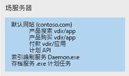
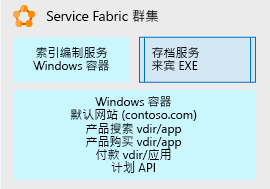

# 使用 Service Fabric 分解整体应用程序

本示例方案逐步讲解一种使用 [Service Fabric](/azure/service-fabric/service-fabric-overview) 即平台服务来分解一个庞大的整体应用程序的方法。 本文假设要采用迭代方法将一个 IIS/ASP.NET 网站分解成由多个可管理的微服务组成的应用程序。

将整体体系结构转移到微服务体系结构可提供以下优势：

- 可以更改一个可理解的小型代码单元，并仅部署该单元。
- 每个代码单元可在数分钟甚至更少的时间内即可完成部署。
- 如果该小型单元出现错误，只有该单元停止工作，而整个应用程序不会停止工作。
- 可在多个开发团队之间轻松离散分发小型代码单元。
- 新进的开发人员可以快速轻松地掌握每个单元的离散功能。

本示例使用服务器场中的大型 IIS 应用程序，但迭代分解和托管的概念可用于任何类型的大型应用程序。 本解决方案使用 Windows，但 Service Fabric 也可以在 Linux 上运行。 它可以在本地、Azure 中或者所选云提供商的 VM 节点上运行。

## 相关用例

如果使用大型整体 Web 应用程序的组织遇到了以下问题，他们可以考虑此方案：

- 更改小型代码时出现了中断整个网站的错误。
- 由于需要更新并发布整个网站，发布过程花费了好几天时间。
- 由于代码基非常复杂，每个人需要了解太多的代码，因此，在新开发人员或团队入职时花费了很长的时间来逐步熟悉项目。

## 体系结构

使用 Service Fabric 作为托管平台，可将大型 IIS 网站转换为微服务的集合，如下所示：

在上图中，我们已将大型 IIS 应用程序的所有组成部分分解为：

- 一个路由或网关服务，该服务可接受传入的浏览器请求，并分析这些请求以确定它们应该由哪个服务来处理，并将请求转发到该服务。
- 四个 ASP.NET Core 应用程序，它们是单个 IIS 站点下作为 ASP.NET 应用程序运行的正式虚拟目录。 应用程序已隔离到其自身独立的微服务中。 效果是可以单独更改、版本控制和升级这些应用程序。 在本示例中，我们使用 .Net Core 和 ASP.NET Core 重新编写了每个应用程序。 这些应用程序编写为 [Reliable Services](/azure/service-fabric/service-fabric-reliable-services-introduction)，因此，它们原生就能访问整个 Service Fabric 平台功能和优势（通信服务、运行状况报告、通知等）。
- 一个名为“索引服务”的 Windows 服务，该服务放在 Windows 容器中，因此，它不再直接更改底层服务器的注册表，而可以自主运行，并作为一个单元连同其所有依赖项一起部署。
- 一个存档服务，它只是一个按计划运行的、针对站点执行一些任务的可执行文件。 之所以将它作为独立的可执行文件托管，是因为我们确定它只需执行预定的功能，而无需对它进行修改，且不值得投入精力对其进行更改。

## 注意事项

第一个难题是开始识别整体应用程序中可以分解成整体应用程序可以调用的微服务的较小代码位。 随着不断的迭代，整体应用程序将分解成开发人员可以轻松了解、更改和以较低风险快速部署的微服务集合。

之所以选择 Service Fabric，是因为它能够支持运行不同形式的各种微服务。 例如，可以混合使用独立的可执行文件、新的小型网站、新的小型 API 和容器化服务等。Service Fabric 可将所有这些服务类型组合成单个群集。

为了获得最终的分解应用程序，我们使用了迭代方法。 我们从某个服务器场中的某个大型 IIS/ASP.NET 网站着手。 下面描绘了该服务器场的单个节点。 该节点包含带有多个虚拟目录的原始网站、站点调用的一个附加 Windows 服务，以及一个定期执行某项站点存档维护任务的可执行文件。

在第一次开发迭代时，IIS 站点及其虚拟目录放置在 [Windows 容器](/azure/service-fabric/service-fabric-containers-overview)中。 这样，站点便可以保持正常运行，而不会严格受限于底层服务器节点的 OS。 容器由底层 Service Fabric 节点运行和协调，但节点不需要有站点所依赖的任何状态（注册表项、文件等）。 所有这些项都在容器中。 出于相同的原因，我们还将索引服务放到了 Windows 容器中。 可以独立部署、版本控制和缩放容器。 最后，我们在一个简单的[独立可执行文件](/azure/service-fabric/service-fabric-guest-executables-introduction)中托管存档服务，因为该文件是一个不附带特殊要求的自主性 .exe。

下图演示了我们的大型网站现在如何部分分解为独立的单元，并在时间允许的情况下准备好进一步分解。

后续的开发侧重于隔离上图所示的单个大型默认网站容器。 将每个虚拟目录 ASP.NET 应用从容器中逐个删除，并将其移植到 ASP.NET Core [Reliable Services](/azure/service-fabric/service-fabric-reliable-services-introduction)。

分解每个虚拟目录后，默认网站将编写为 ASP.NET Core 可靠服务，该服务接受传入的浏览器请求，并将其路由到正确的 ASP.NET 应用程序。

### 可用性、可伸缩性和安全性

Service Fabric [能够支持不同形式的微服务](/azure/service-fabric/service-fabric-choose-framework)，并在同一群集上的微服务之间保持快速方便的调用。 Service Fabric 具有[容错](/azure/service-fabric/service-fabric-availability-services)能力，能够自我修复可运行容器和可执行文件的群集，甚至提供一个本机 API，用于直接编写微服务（上面称为“Reliable Services”）。 平台可以简化每个微服务的滚动升级和版本控制。 可以要求平台多运行或少运行在整个 Service Fabric 群集中分布的任意给定微服务，以便仅横向[缩放](/azure/service-fabric/service-fabric-concepts-scalability)所需的微服务。

Service Fabric 是在包含网络、存储和操作系统的虚拟（或物理）节点的基础结构上构建的群集。 因此，它需要执行一系列管理、维护和监视任务。

此外，还需要考虑到群集的治理和控制。 你不希望用户将数据库随意部署到生产数据库服务器，同理，你也不希望用户在不受监督的情况下将应用程序部署到 Service Fabric 群集。

Service Fabric 能够托管许多不同的[应用程序方案](/azure/service-fabric/service-fabric-application-scenarios)，请花点时间了解哪些功能适用于你的方案。

## 定价

对于 Azure 中托管的 Service Fabric 群集，成本主要与群集中的节点数量和大小相关。 Azure 允许快速方便地创建由指定的基础节点大小组成的群集，但计算费用取决于节点大小与节点数量的乘积。

其他小部分成本是每个节点的虚拟磁盘的存储费用，以及 Azure 的网络 IO 传出费用（例如，从 Azure 传出到用户浏览器的网络流量）。

为帮助你大致了解成本，我们使用群集大小、网络和存储的某些默认值创建了一个示例：请查看[定价计算器](https://azure.com/e/52dea096e5844d5495a7b22a9b2ccdde)。 请根据具体的情况随意更新此默认计算器中的值。

## 后续步骤

请花点时间浏览[文档](/azure/service-fabric/service-fabric-overview)并查看适用于 Service Fabric 的多个不同[应用程序方案](/azure/service-fabric/service-fabric-application-scenarios)，以熟悉该平台。 该文档介绍群集由哪些组件构成、可在哪些平台上运行、其软件体系结构和维护工作。

若要查看现有 .NET 应用程序的 Service Fabric 演示，请部署 Service Fabric [快速入门](/azure/service-fabric/service-fabric-quickstart-dotnet)。

从当前应用程序的角度开始考虑其不同的功能。 选择其中的一项功能，并认真考虑如何做到在整个应用程序中仅隔离该功能。 每次提取一个离散的可理解片段。

## 相关资源

- [在 Azure 上构建微服务](/azure/architecture/microservices)
- [Service Fabric 概述](/azure/service-fabric/service-fabric-overview)
- [Service Fabric 编程模型](/azure/service-fabric/service-fabric-choose-framework)
- [Service Fabric 可用性](/azure/service-fabric/service-fabric-availability-services)
- [缩放 Service Fabric](/azure/service-fabric/service-fabric-concepts-scalability)
- [在 Service Fabric 中托管容器](/azure/service-fabric/service-fabric-containers-overview)
- [在 Service Fabric 中托管独立的可执行文件](/azure/service-fabric/service-fabric-guest-executables-introduction)
- [Service Fabric 本机 Reliable Services](/azure/service-fabric/service-fabric-reliable-services-introduction)
- [Service Fabric 应用程序方案](/azure/service-fabric/service-fabric-application-scenarios)