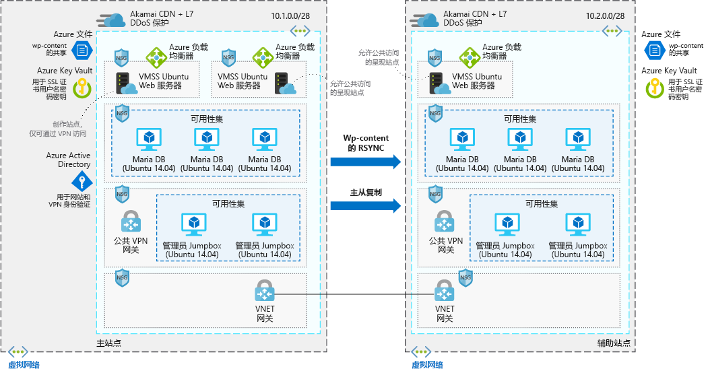

# 高度可缩放的安全 WordPress 网站

本示例方案适用于需要高度可缩放的安全 WordPress 安装的公司。 本方案基于一个用于大型会议、已成功进行扩展以应对会议期间站点出现的流量高峰的部署。

## 相关用例

其他相关用例包括：

- 媒体活动导致流量激增。
- 博客网站使用 WordPress 作为内容管理系统。
- 企业或电子商务网站使用 WordPress。
- 使用其他内容管理系统构建网站。

## 体系结构

本方案涉及到一个使用 Ubuntu Web 服务器和 MariaDB 的可缩放安全 WordPress 安装。 本方案包含两个不同的数据流，第一个是用户访问网站时产生的流：

1. 用户通过 CDN 访问前端网站。
2. CDN 使用 Azure 负载均衡器作为来源，从中提取未缓存的所有数据。
3. Azure 负载均衡器将请求分配到 Web 服务器的虚拟机规模集。
4. WordPress 应用程序从 Maria DB 群集提取所有动态信息，这些都是托管在 Azure 文件中的静态内容。
5. SSL 密钥存储在 Azure Key Vault 中。

第二个工作流涉及到作者供应新内容：

1. 作者安全连接到公共 VPN 网关。
2. VPN 身份验证信息存储在 Azure Active Directory 中。
3. 然后与管理员跳转盒建立连接。
4. 作者可以通过管理员跳转盒连接到创作群集的 Azure 负载均衡器。
5. Azure 负载均衡器将流量分配到对 Maria DB 群集拥有写入访问权限的 Web 服务器虚拟机规模集。
6. 新的静态内容上传到 Azure 文件，动态内容写入到 Maria DB 群集。
7. 然后，通过 rsync 或主/从复制将这些更改复制到备用区域。

### 组件

- [Azure 内容分发网络 (CDN)](/azure/cdn/cdn-overview) 是可以高效地向用户传送 Web 内容的分布式服务器网络。 CDN 将缓存的内容存储在靠近最终用户的接入点位置中的边缘服务器上，因此可以最小化延迟。
- [虚拟网络](/azure/virtual-network/virtual-networks-overview)允许 VM 之类的资源以安全方式彼此通信、与 Internet 通信，以及与本地网络通信。 虚拟网络提供隔离和细分，可以筛选和路由流量，并且允许在不同位置之间进行连接。 通过 VNet 在两个网络之间建立对等互连。
- [网络安全组](/azure/virtual-network/security-overview)包含一个安全规则列表，这些规则可根据源或目标 IP 地址、端口和协议允许或拒绝入站或出站网络流量。 本方案中的虚拟网络受网络安全组规则的保护，这些规则可以限制应用程序组件之间的流量。
- [负载均衡器](/azure/load-balancer/load-balancer-overview)根据规则和运行状况探测来分配入站流量。 负载均衡器提供低延迟和高吞吐量，以及为所有 TCP 和 UDP 应用程序纵向扩展到数以百万计的流。 本方案使用负载均衡器将来自内容分发网络的流量分配到前端 Web 服务器。
- 使用[虚拟机规模集][docs-vmss]可以创建并管理一组完全相同的、负载均衡的 VM。 可以根据需求或定义的计划自动增减 VM 实例的数目。 本方案使用了两个不同的虚拟机规模集 - 提供内容的前端 Web 服务器使用其中的一个规模集，创作新内容的前端 Web 服务器使用另一个规模集。
- [Azure 文件](/azure/storage/files/storage-files-introduction)在云中提供完全托管的文件共享，该共享托管本方案中的所有 WordPress 内容，使所有 VM 都可以访问这些数据。
- [Azure Key Vault](/azure/key-vault/key-vault-overview) 用于存储密码、证书和密钥以及严格控制对其的访问。
- [Azure Active Directory (Azure AD)](/azure/active-directory/fundamentals/active-directory-whatis) 是多租户、基于云的目录和标识管理服务。 在本方案中，Azure AD 为网站和 VPN 隧道提供身份验证服务。

### 备选项

- [SQL Server for Linux](/azure/virtual-machines/linux/sql/sql-server-linux-virtual-machines-overview) 可以取代 MariaDB 数据存储。
- 如果你偏向于使用完全托管的解决方案，可以用 [Azure Database for MySQL](/azure/mysql/overview) 取代 MariaDB 数据存储。

## 注意事项

### 可用性

本方案中的 VM 实例部署在多个区域中，通过 RSYNC 复制两个实例中的 WordPress 内容数据，并对 MariaDB 群集使用主从复制。

若要了解其他可用性主题，请参阅 Azure 体系结构中心的[可用性核对清单][availability]。

### 可伸缩性

本方案对每个区域中的两个前端 Web 服务器群集使用虚拟机规模集。 使用规模集时，运行前端应用程序层的 VM 实例数可以根据客户需求或定义的计划自动进行缩放。 有关详细信息，请参阅[虚拟机规模集的自动缩放概述][docs-vmss-autoscale]。

后端是可用性集中的 MariaDB 群集。 有关详细信息，请参阅 [MariaDB 群集教程][mariadb-tutorial]。

若要了解其他可伸缩性主题，请参阅 Azure 体系结构中心的[可伸缩性核对清单][scalability]。

### 安全

所有虚拟网络流量都进入前端应用程序层，受网络安全组的保护。 规则会限制流量的流动，只有前端应用程序层 VM 实例可以访问后端数据库层。 不允许数据库层发出的出站 Internet 流量。 为了减少受攻击面，请勿打开直接远程管理端口。 有关详细信息，请参阅 [Azure 网络安全组][docs-nsg]。

若需安全方案的通用设计指南，请参阅 [Azure 安全性文档][security]。

### 复原

本方案结合多个区域、数据复制和虚拟机规模集使用 Azure 负载均衡器。 这些网络组件可将流量分配到连接的 VM 实例，并且包括运行状况探测，可以确保流量只分配到正常运行的 VM。 所有这些网络组件通过 CDN 安装在前面。 这样，网络资源和应用程序便可以灵活应对那些会导致流量中断并影响最终用户访问的问题。

若需可复原方案的通用设计指南，请参阅[设计适用于 Azure 的可复原应用程序][resiliency]。

## 定价

为了方便用户了解运行本方案的成本，我们已在成本计算器中预配置了所有服务。 若要了解自己的特定用例的定价变化情况，请按预期的流量更改相应的变量。

我们根据上面的体系结构示意图，提供了预配置的[成本配置文件][pricing]。 若要为自己的用例配置定价计算器，请考虑以下几个因素：

- 预期每月的流量有多少 (GB)？ 流量对成本的影响最大，因为它会影响在虚拟机规模集中公开数据所需的 VM 数量。 此外，它直接关系到通过 CDN 公开的数据量。
- 要将多少新数据写入网站？ 写入网站的新数据关系到在区域之间镜像的数据量。
- 有多少内容是动态的？ 有多少内容是静态的？ 动态与静态内容的差异会影响需要从数据库层检索的数据量，以及要在 CDN 中缓存的数据量。

<!-- links -->
[architecture]: ./media/architecture-secure-scalable-wordpress.png
[mariadb-tutorial]: /azure/virtual-machines/linux/classic/mariadb-mysql-cluster
[docs-vmss]: /azure/virtual-machine-scale-sets/overview
[docs-vmss-autoscale]: /azure/virtual-machine-scale-sets/virtual-machine-scale-sets-autoscale-overview
[docs-nsg]: /azure/virtual-network/security-overview
[security]: /azure/security/
[availability]: ../../checklist/availability.md
[resiliency]: /azure/architecture/resiliency/
[scalability]: /azure/architecture/checklist/scalability
[pricing]: https://azure.com/e/a8c4809dab444c1ca4870c489fbb196b
