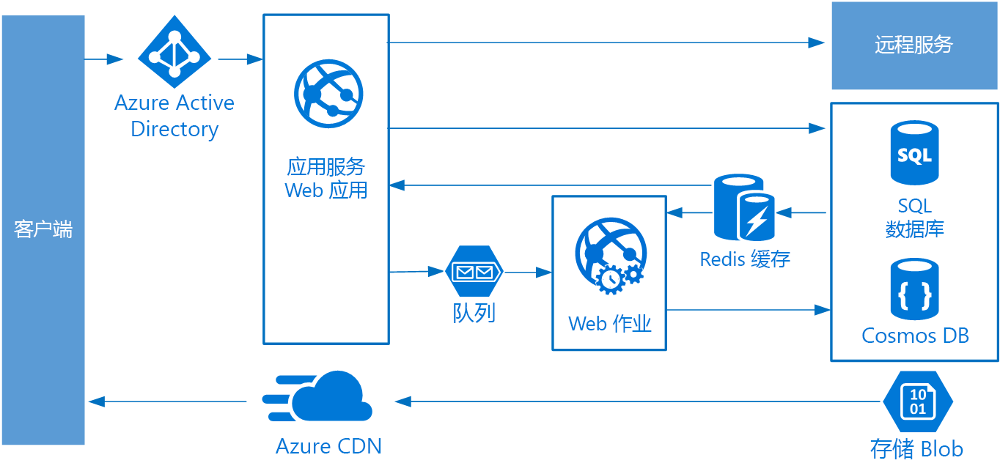

# Web 队列辅助角色体系结构样式Web-Queue-Worker architecture style

该体系结构的核心组件是处理客户端请求的 Web 前端和执行资源密集型任务、长时间运行的工作流或批处理作业的辅助角色。The core components of this architecture are a **web front end** that serves client requests, and a **worker** that performs resource-intensive tasks, long-running workflows, or batch jobs.  Web 前端通过消息队列与辅助角色进行通信。The web front end communicates with the worker through a **message queue**.

通常合并到该体系结构中的其他组件包括：Other components that are commonly incorporated into this architecture include:

- 一个或多个数据库。One or more databases.
- 存储来自数据库的值以便快速读取的缓存。A cache to store values from the database for quick reads.
- 提供静态内容的 CDNCDN to serve static content
- 远程服务，如电子邮件或 SMS 服务。Remote services, such as email or SMS service. 这些通常由第三方提供。Often these are provided by third parties.
- 用于身份验证的标识提供程序。Identity provider for authentication.

Web 和辅助角色都无状态。The web and worker are both stateless. 会话状态可以存储在分布式缓存中。Session state can be stored in a distributed cache. 任何长时间运行的工作都由辅助角色异步完成。Any long-running work is done asynchronously by the worker. 辅助角色可以由队列上的消息触发，或者在用于批处理的计划上运行。The worker can be triggered by messages on the queue, or run on a schedule for batch processing. 辅助角色是一个可选组件。The worker is an optional component. 如果没有任何长时间运行的操作，则可以省略辅助角色。If there are no long-running operations, the worker can be omitted.

前端可能包括 Web API。The front end might consist of a web API. 在客户端上，Web API 可以由进行 AJAX 调用的单页应用程序或者本机客户端应用程序使用。On the client side, the web API can be consumed by a single-page application that makes AJAX calls, or by a native client application.

## 何时使用此架构When to use this architecture

通常使用托管的计算服务（Azure App Service 或 Azure 云服务）实施 Web 队列辅助角色体系结构。The Web-Queue-Worker architecture is typically implemented using managed compute services, either Azure App Service or Azure Cloud Services.

请对以下情况考虑使用此体系结构样式：Consider this architecture style for:

- 具有相对简单的域的应用程序。Applications with a relatively simple domain.
- 具有某些长时间的工作流或批处理操作的应用程序。Applications with some long-running workflows or batch operations.
- 想要使用托管的服务而不是基础结构即服务 (IaaS)。When you want to use managed services, rather than infrastructure as a service (IaaS).

## 优点Benefits

- 体系结构相对简单，易于理解。Relatively simple architecture that is easy to understand.
- 易于部署和管理。Easy to deploy and manage.
- 清晰的关注点分离。Clear separation of concerns.
- 使用异步消息将前端从辅助角色中分离。The front end is decoupled from the worker using asynchronous messaging.
- 前端和辅助角色可以独立缩放。The front end and the worker can be scaled independently.

## 挑战Challenges

- 如果没有经过仔细设计，前端和辅助角色可能变成难以维护和更新的庞大组件。Without careful design, the front end and the worker can become large, monolithic components that are difficult to maintain and update.
- 如果前端和辅助角色共享数据架构或代码模块，可能会有隐藏依赖关系。There may be hidden dependencies, if the front end and worker share data schemas or code modules.

## 最佳做法Best practices

- 向客户端公开经过良好设计的 API。Expose a well-designed API to the client. 请参阅 [API 设计最佳做法][api-design]。See [API design best practices][api-design].
- 自动缩放以处理负载的更改。Autoscale to handle changes in load. 请参阅[自动缩放的最佳做法][autoscaling]。See [Autoscaling best practices][autoscaling].
- 缓存半静态数据。Cache semi-static data. 请参阅[缓存的最佳做法][caching]。See [Caching best practices][caching].
- 使用 CDN 来托管静态内容。Use a CDN to host static content. 请参阅 [CDN 最佳做法][cdn]。See [CDN best practices][cdn].
- 适当时使用混合持久性。Use polyglot persistence when appropriate. 请参阅[为作业使用最佳数据存储][polyglot]。See [Use the best data store for the job][polyglot].
- 分区数据，可提高可伸缩性、减少争用以及优化性能。Partition data to improve scalability, reduce contention, and optimize performance. 请参阅[数据分区最佳做法][data-partition]。See [Data partitioning best practices][data-partition].

## Azure App Service 上的 Web 队列辅助角色Web-Queue-Worker on Azure App Service

本部分介绍使用 Azure App Service 的建议的 Web 队列辅助角色体系结构。This section describes a recommended Web-Queue-Worker architecture that uses Azure App Service.

Azure 应用服务 Web 应用作为前端实现，辅助角色作为 Web 作业实现。The front end is implemented as an Azure App Service web app, and the worker is implemented as a WebJob. Web 应用和 Web 作业都与提供 VM 实例的应用服务计划相关联。The web app and the WebJob are both associated with an App Service plan that provides the VM instances.

可以为消息队列使用 Azure 服务总线或 Azure 存储队列。You can use either Azure Service Bus or Azure Storage queues for the message queue. （该图显示了 Azure 存储队列。）(The diagram shows an Azure Storage queue.)

Azure Redis 缓存存储会话状态和需要低延迟访问的其他数据。Azure Redis Cache stores session state and other data that needs low latency access.

Azure CDN 用于缓存静态内容，如映像、CSS 或 HTML。Azure CDN is used to cache static content such as images, CSS, or HTML.

对于存储，请选择最符合应用程序需要的存储技术。For storage, choose the storage technologies that best fit the needs of the application. 可能使用多个存储技术（混合持久性）。You might use multiple storage technologies (polyglot persistence). 为了说明这一点，该图显示了 Azure SQL 数据库和 Azure Cosmos DB。To illustrate this idea, the diagram shows Azure SQL Database and Azure Cosmos DB.

有关详细信息，请参阅[应用服务 Web 应用程序参考结构][scalable-web-app]。For more details, see [App Service web application reference architecture][scalable-web-app].

### 其他注意事项Additional considerations

- 并不是每个事务都必须经过队列和辅助角色才能存储。Not every transaction has to go through the queue and worker to storage. Web 前端可以直接执行简单的读取/写入操作。The web front end can perform simple read/write operations directly. 辅助角色设计用于资源密集型任务或长时间运行的工作流。Workers are designed for resource-intensive tasks or long-running workflows. 在某些情况下，可能根本不需要辅助角色。In some cases, you might not need a worker at all.

- 使用应用服务的内置自动缩放功能来扩大 VM 实例数。Use the built-in autoscale feature of App Service to scale out the number of VM instances. 如果应用程序上的负载遵循可预测的模式，请使用基于计划的自动缩放。If the load on the application follows predictable patterns, use schedule-based autoscale. 如果负载是不可预测的，请使用基于指标的自动缩放规则。If the load is unpredictable, use metrics-based autoscaling rules.

- 请考虑将 Web 应用和 Web 作业放入单独的应用服务计划中。Consider putting the web app and the WebJob into separate App Service plans. 这样，它们就托管在单独的 VM 实例上，并可以独立缩放。That way, they are hosted on separate VM instances and can be scaled independently.

- 使用单独的应用服务计划进行生产和测试。Use separate App Service plans for production and testing. 否则，如果使用同一计划进行生产和测试，则说明测试正在生产 VM 上运行。Otherwise, if you use the same plan for production and testing, it means your tests are running on your production VMs.

- 使用部署槽位以管理部署。Use deployment slots to manage deployments. 这使你可以将更新的版本部署到过渡槽，然后切换到新版本。This lets you to deploy an updated version to a staging slot, then swap over to the new version. 如果更新时出现问题，这也使你可以切换回上一版本。It also lets you swap back to the previous version, if there was a problem with the update.

<!-- links -->

[api-design]: ../../best-practices/api-design.md
[autoscaling]: ../../best-practices/auto-scaling.md
[caching]: ../../best-practices/caching.md
[cdn]: ../../best-practices/cdn.md
[data-partition]: ../../best-practices/data-partitioning.md
[polyglot]: ../design-principles/use-the-best-data-store.md
[scalable-web-app]: ../../reference-architectures/app-service-web-app/scalable-web-app.md