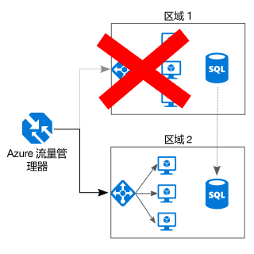

# 实现全面冗余Make all things redundant

## 在应用程序中构建冗余，以避免出现单一故障点Build redundancy into your application, to avoid having single points of failure

有弹性的应用程序围绕故障路由。A resilient application routes around failure. 标识应用程序中的关键路径。Identify the critical paths in your application. 该路径中的每个点是否都存在冗余？Is there redundancy at each point in the path? 如果子系统出现故障，应用程序是否会故障转移到其他组件？If a subsystem fails, will the application fail over to something else?

## 建议Recommendations

**考虑业务需求**。**Consider business requirements**. 在系统中生成的冗余量会影响成本和复杂度。The amount of redundancy built into a system can affect both cost and complexity. 体系结构应反映业务需求，如恢复时间目标 (RTO)。Your architecture should be informed by your business requirements, such as recovery time objective (RTO). 例如，多区域部署比单区域部署昂贵，其管理也更复杂。For example, a multi-region deployment is more expensive than a single-region deployment, and is more complicated to manage. 需要使用操作过程处理故障转移和故障回复。You will need operational procedures to handle failover and failback. 可能为一些业务方案（而不是其他方案）考虑额外的成本和复杂性。The additional cost and complexity might be justified for some business scenarios and not others.

**将 VM 放在负载均衡器之后**。**Place VMs behind a load balancer**. 请勿将一个 VM 用于任务关键的工作负载。Don't use a single VM for mission-critical workloads. 而是将多个 VM 放置于负载均衡器之后。Instead, place multiple VMs behind a load balancer. 如果任何 VM 变得不可用，负载均衡器会向其余正常运行的 VM 分配流量。If any VM becomes unavailable, the load balancer distributes traffic to the remaining healthy VMs. 若要了解如何部署此配置，请参阅[用于提高可伸缩性和可用性的多个 VM][multi-vm-blueprint]。To learn how to deploy this configuration, see [Multiple VMs for scalability and availability][multi-vm-blueprint].

**复制数据库**。**Replicate databases**. Azure SQL 数据库和 Cosmos DB 自动复制区域内的数据，且可以跨区域启用异地复制。Azure SQL Database and Cosmos DB automatically replicate the data within a region, and you can enable geo-replication across regions. 如果使用的是 IaaS 数据库解决方案，请选择支持复制和故障转移的解决方案，如 [SQL Server AlwaysOn 可用性组][sql-always-on]。If you are using an IaaS database solution, choose one that supports replication and failover, such as [SQL Server Always On Availability Groups][sql-always-on].

**启用异地复制**。**Enable geo-replication**. [Azure SQL 数据库][sql-geo-replication]和 [Cosmos DB][cosmosdb-geo-replication] 的异地复制在一个或多个次要区域中创建数据的可读次要副本。Geo-replication for [Azure SQL Database][sql-geo-replication] and [Cosmos DB][cosmosdb-geo-replication] creates secondary readable replicas of your data in one or more secondary regions. 出现故障时，数据库可以故障转移到供写入的次要区域。In the event of an outage, the database can fail over to the secondary region for writes.

**为提高可用性而分区**。**Partition for availability**. 数据库分区通常用于提高可伸缩性，但它还可以提高可用性。Database partitioning is often used to improve scalability, but it can also improve availability. 如果一个分片出现故障，仍可以访问其他分片。If one shard goes down, the other shards can still be reached. 一个分片中的故障仅中断总事务的子集。A failure in one shard will only disrupt a subset of the total transactions.

**部署到多个区域**。**Deploy to more than one region**. 为实现最高可用性，请将应用程序部署到多个区域。For the highest availability, deploy the application to more than one region. 这样，在极少数情况下，当某个问题影响到整个区域时，应用程序可以故障转移到另一区域。That way, in the rare case when a problem affects an entire region, the application can fail over to another region. 下图显示了使用 Azure 流量管理器处理故障转移的多区域应用程序。The following diagram shows a multi-region application that uses Azure Traffic Manager to handle failover.

**同步前端和后端故障转移**。**Synchronize front and backend failover**. 使用 Azure 流量管理器将前端故障转移。Use Azure Traffic Manager to fail over the front end. 如果无法访问一个区域中的前端，流量管理器会将新请求路由到次要区域。If the front end becomes unreachable in one region, Traffic Manager will route new requests to the secondary region. 可能需要协调数据库的故障转移，具体取决于数据库解决方案。Depending on your database solution, you may need to coordinate failing over the database.

**使用自动故障转移，但手动进行故障回复**。**Use automatic failover but manual failback**. 将流量管理器用于自动故障转移，而不用于自动故障回复。Use Traffic Manager for automatic failover, but not for automatic failback. 自动故障回复存在风险，即可能在区域尚未完全正常之前切换到主要区域。Automatic failback carries a risk that you might switch to the primary region before the region is completely healthy. 请改为验证所有应用程序子系统均正常运行，然后再手动进行故障回复。Instead, verify that all application subsystems are healthy before manually failing back. 此外，可能需要在故障回复前检查数据一致性，具体取决于数据库。Also, depending on the database, you might need to check data consistency before failing back.

**为流量管理器包括冗余**。**Include redundancy for Traffic Manager**. 流量管理器是一个潜在的故障点。Traffic Manager is a possible failure point. 查看流量管理器 SLA，然后决定仅使用流量管理器是否能满足高可用性的业务需求。Review the Traffic Manager SLA, and determine whether using Traffic Manager alone meets your business requirements for high availability. 如果不能，请考虑添加另一个流量管理解决方案作为故障回复机制。If not, consider adding another traffic management solution as a failback. 如果 Azure 流量管理器服务失败，请将 DNS 中的 CNAME 记录更改为指向其他流量管理服务。If the Azure Traffic Manager service fails, change your CNAME records in DNS to point to the other traffic management service.

<!-- links -->

[multi-vm-blueprint]: ../../reference-architectures/virtual-machines-windows/multi-vm.md

[cassandra]: https://cassandra.apache.org/
[cosmosdb-geo-replication]: /azure/cosmos-db/distribute-data-globally
[sql-always-on]: https://msdn.microsoft.com/library/hh510230.aspx
[sql-geo-replication]: /azure/sql-database/sql-database-geo-replication-overview
