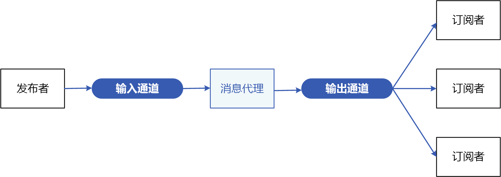
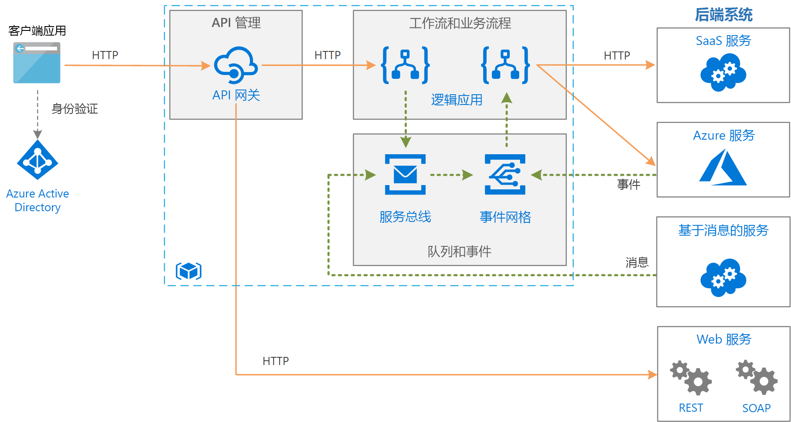

# 发布者-订阅者模式Publisher-Subscriber pattern

使应用程序能够以异步方式向多个感兴趣的使用者公布事件，而无需将发送方与接收方耦合。Enable an application to announce events to multiple interested consumers aynchronously, without coupling the senders to the receivers.

**也称为**：发布/订阅消息传送**Also called**: Pub/sub messaging

## 上下文和问题Context and problem

在基于云的分布式应用程序中，在发生事件时，系统组件通常需要向其他组件提供信息。In cloud-based and distributed applications, components of the system often need to provide information to other components as events happen.

异步消息传送是将发件者与使用者解耦的有效方式，可避免阻止发送者等待响应。Asynchronous messaging is an effective way to decouple senders from consumers, and avoid blocking the sender to wait for a response. 但是，对每个使用者使用专用消息队列不能让多个使用者有效进行缩放。However, using a dedicated message queue for each consumer does not effectively scale to many consumers. 此外，某些使用者可能仅对一部分信息感兴趣。Also, some of the consumers might be interested in only a subset of the information. 发送者如何在不知道使用者标识的情况下，向所有感兴趣的使用者公布事件？How can the sender announce events to all interested consumers without knowing their identities?

## 解决方案Solution

引入一个包括以下功能的异步消息传送子系统：Introduce an asynchronous messaging subsystem that includes the following:

- 发送者使用的输入消息传送通道。An input messaging channel used by the sender. 发送者使用已知的消息格式将事件打包成消息，然后通过输入通道发送这些消息。The sender packages events into messages, using a known message format, and sends these messages via the input channel. 在此模式中，发送者也称为“发布者”。The sender in this pattern is also called the *publisher*.

  > [!NOTE]
  > 消息是数据包。A *message* is a packet of data. 事件是一条消息，告知其他组件已发生某项更改或操作。An *event* is a message that notifies other components about a change or an action that has taken place.

- 每个使用者有一个输出消息传送通道。One output messaging channel per consumer. 使用者称为“订阅者”。The consumers are known as *subscribers*.

- 一个机制，用于将输入通道中的每条消息复制到对该消息感兴趣的所有订阅者的输出通道。A mechanism for copying each message from the input channel to the output channels for all subscribers interested in that message. 此操作通常由消息中转站或事件总线等中介处理。This operation is typically handled by a intermediary such as a message broker or event bus.

下图显示了此模式的逻辑组件：The following diagram shows the logical components of this pattern:

 
发布/订阅消息传送具有以下优势：Pub/sub messaging has the following benefits:

- 解耦仍然需要通信的子系统。It decouples subsystems that still need to communicate. 可以独立管理子系统，即使一个或多个接收者处于脱机状态，也能正确管理消息。Subsystems can be managed independently, and messages can be properly managed even if one or more receivers are offline.

- 提高可伸缩性，改善发送者的响应能力。It increases scalability and improves responsiveness of the sender. 发送者可以快速将一条消息发送到输入通道，然后恢复其核心处理责任。The sender can quickly send a single message to the input channel, then return to its core processing responsibilities. 消息传送基础结构负责确保将消息传送到感兴趣的订阅者。The messaging infrastructure is responsible for ensuring messages are delivered to interested subscribers.

- 它提高了可靠性。It improves reliability. 异步消息传送可以帮助应用程序在负载增大的情况下继续保持平稳运行，并更有效地处理间歇性故障。Asynchronous messaging helps applications continue to run smoothly under increased loads and handle intermittent failures more effectively.

- 它允许延迟或计划的处理。It allows for deferred or scheduled processing. 订阅者可以等到在非高峰期拾取消息，或者可以根据特定的计划路由或处理消息。Subscribers can wait to pick up messages until off-peak hours, or messages can be routed or processed according to a specific schedule.

- 这样可以简化使用不同平台、编程语言或通信协议的系统之间的集成，以及本地系统与云中运行的应用程序之间的集成。It enables simpler integration between systems using different platforms, programming languages, or communication protocols, as well as between on-premises systems and applications running in the cloud.

- 它简化了整个企业中的异步工作流。It facilitates asynchronous workflows across an enterprise.

- 它改善了可测试性。It improves testability. 在执行整个集成测试策略过程中，可以监视通道，并可以检查或记录消息。Channels can be monitored and messages can be inspected or logged as part of an overall integration test strategy.

- 它为应用程序提供关注点分离。It provides separation of concerns for your applications. 每个应用程序可以注重自身的核心功能，而消息传送基础结构可以处理所需的一切工作来可靠地将消息路由到多个使用者。Each application can focus on its core capabilities, while the messaging infrastructure handles everything required to reliably route messages to multiple consumers. 

## 问题和注意事项Issues and considerations

在决定如何实现此模式时，请考虑以下几点：Consider the following points when deciding how to implement this pattern:

- **现有技术。****Existing technologies.** 强烈建议使用支持发布-订阅模型的可用消息传送产品和服务，而不要自行构建。It is strongly recommended to use available messaging products and services that support a publish-subscribe model, rather than building your own. 在 Azure 中，考虑使用[服务总线](/azure/service-bus-messaging/)或[事件网格](/azure/event-grid/)。In Azure, consider using [Service Bus](/azure/service-bus-messaging/) or [Event Grid](/azure/event-grid/). 其他可用于发布/订阅消息传送的技术包括 Redis、RabbitMQ 和 Apache Kafka。Other technologies that can be used for pub/sub messaging include Redis, RabbitMQ, and Apache Kafka.

- **订阅处理。****Subscription handling.** 消息传送基础结构必须提供相应的机制，让使用者通过可用的通道订阅或取消订阅。The messaging infrastructure must provide mechanisms that consumers can use to subscribe to or unsubscribe from available channels.

- **安全性。****Security.** 连接到任何消息通道必须受安全策略的限制，以防止未经授权的用户或应用程序窃听。Connecting to any message channel must be restricted by security policy to prevent eavesdropping by unauthorized users or applications.

- **消息子集。****Subsets of messages.** 订阅者通常只对发布者分发的消息的子集感兴趣。Subscribers are usually only interested in subset of the messages distributed by a publisher. 消息传送服务通常允许订阅者按以下各项缩小接收的消息集范围：Messaging services often allow subscribers to narrow the set of messages received by:

  - **主题。****Topics.** 每个主题都有一个专用输出通道，每个使用者可以订阅所有相关主题。Each topic has a dedicated output channel, and each consumer can subscribe to all relevant topics.
  - **内容筛选。****Content filtering.** 根据每个消息的内容检查和分发消息。Messages are inspected and distributed based on the content of each message. 每个订阅者可以指定其感兴趣的内容。Each subscriber can specify the content it is interested in.

- **通配符订阅者。****Wildcard subscribers.** 考虑允许订阅者通过通配符订阅多个主题。Consider allowing subscribers to subscribe to multiple topics via wildcards.

- **双向通信。****Bi-directional communication.** 发布-订阅系统中的通道被认为是单向的。The channels in a publish-subscribe system are treated as unidirectional. 如果特定订阅者需要向发布者发回确认或状态，请考虑使用[请求/回复模式](http://www.enterpriseintegrationpatterns.com/patterns/messaging/RequestReply.html)。If a specific subscriber needs to send acknowledgement or communicate status back to the publisher, consider using the [Request/Reply Pattern](http://www.enterpriseintegrationpatterns.com/patterns/messaging/RequestReply.html). 此模式使用一个通道向订阅者发送消息，并使用一个独立的回复通道来与发布者通信。This pattern uses one channel to send a message to the subscriber, and a separate reply channel for communicating back to the publisher.

- **消息排序。****Message ordering.** 不能保证使用者实例接收消息的顺序，且不一定反映创建消息的顺序。The order in which consumer instances receive messages isn't guaranteed, and doesn't necessarily reflect the order in which the messages were created. 精心设计系统以确保消息处理是幂等的，以帮助消除对消息处理顺序的任何依赖。Design the system to ensure that message processing is idempotent to help eliminate any dependency on the order of message handling.

- **消息优先级。****Message priority.** 某些解决方案可能要求按特定的顺序处理消息。Some solutions may require that messages are processed in a specific order. [优先级队列模式](priority-queue.md)提供一种机制用于确保按顺序传送特定的消息。The [Priority Queue pattern](priority-queue.md) provides a mechanism for ensuring specific messages are delivered before others.

- **有害消息。****Poison messages.** 格式不正确的消息或需要访问不可用资源的任务可能会导致服务实例失败。A malformed message, or a task that requires access to resources that aren't available, can cause a service instance to fail. 系统应阻止将此类消息返回到队列。The system should prevent such messages being returned to the queue. 应该捕获这些消息的详细信息并将其存储在其他位置，以便可按需要对其进行分析。Instead, capture and store the details of these messages elsewhere so that they can be analyzed if necessary.

- **重复消息。****Repeated messages.** 同一条消息可能会发送多次。The same message might be sent more than once. 例如，在发布某条消息后，发送者可能会发生故障。For example, the sender might fail after posting a message. 然后，该发送者的新实例可能会启动并重复发送该消息。Then a new instance of the sender might start up and repeat the message. 消息传送基础结构应该实施基于消息 ID 的重复消息检测和删除（也称为重复项删除），以便最多只传送消息一次。The messaging infrastructure should implement duplicate message detection and removal (also known as de-duping) based on message IDs in order to provide at-most-once delivery of messages.

- **消息过期。****Message expiration.** 消息可能带有有限的生存期。A message might have a limited lifetime. 如果在此期限内未处理该消息，则它不再有用，应该将其丢弃。If it isn't processed within this period, it might no longer be relevant and should be discarded. 发送者可以在消息数据中指定过期时间。A sender can specify an experiation time as part of the data in the message. 接收者可以检查此信息，然后决定是否要执行与该消息关联的业务逻辑。A receiver can examine this information before deciding whether to perform the business logic associated with the message.

- **消息计划。****Message scheduling.** 可以暂时禁止传送某条消息，在特定的日期和时间之前，不应处理该消息。A message might be temporarily embargoed and should not be processed until a specific date and time. 在此时间之前，不应将该消息提供给接收者。The message should not be available to a receiver until this time.

## 何时使用此模式When to use this pattern

在以下情况下使用此模式：Use this pattern when:

- 应用程序需要将信息广播到大量的使用者。An application needs to broadcast information to a significant number of consumers.

- 应用程序需要与一个或多个独立开发的、可能使用不同平台、编程语言和通信协议的应用程序或服务通信。An application needs to communicate with one or more independently-developed applications or services, which may use different platforms, programming languages, and communication protocols.

- 应用程序无需使用者的实时响应，即可将信息发送到使用者。An application can send information to consumers without requiring real-time responses from the consumers.

- 集成的系统旨在支持其数据的最终一致性模型。The systems being integrated are designed to support an eventual consistency model for their data.

- 应用程序需要向多个使用者传送信息，而这些使用者的可用性要求或运行时间计划可能与发送者不同。An application needs to communicate information to multiple consumers, which may have different availability requirements or uptime schedules than the sender.

在以下情况下，此模式可能不起作用：This pattern might not be useful when:

- 应用程序只有少量的几个使用者，而这些使用者所需的信息与生成方应用程序截然不同。An application has only a few consumers who need significantly different information from the producing application.

- 应用程序需要与使用者进行近实时的交互。An application requires near real-time interaction with consumers.

## 示例Example

下图显示了一个使用服务总线来协调工作流，并使用事件网格来向子系统通知发生的事件的企业集成体系结构。The following diagram shows an enterprise integration architecture that uses Service Bus to coordinate workflows, and Event Grid notify subsystems of events that occur. 有关详细信息，请参阅 [Azure 上使用消息队列和事件的企业集成](../reference-architectures/enterprise-integration/queues-events.md)。For more information, see [Enterprise integration on Azure using message queues and events](../reference-architectures/enterprise-integration/queues-events.md).

## 相关模式和指南Related patterns and guidance

实现此模式时，可能会与以下模式和指南相关：The following patterns and guidance might be relevant when implementing this pattern:

- [在传递消息的 Azure 服务之间进行选择](/azure/event-grid/compare-messaging-services)。[Choose between Azure services that deliver messages](/azure/event-grid/compare-messaging-services).

- [事件驱动的体系结构样式](../guide/architecture-styles/event-driven.md)是使用发布/订阅消息传送的体系结构样式。The [Event-driven architecture style](../guide/architecture-styles/event-driven.md) is an architecture style that uses pub/sub messaging.

- [异步消息传送入门](https://msdn.microsoft.com/library/dn589781.aspx)。[Asynchronous Messaging Primer](https://msdn.microsoft.com/library/dn589781.aspx). 消息队列是异步通信机制。Message queues are an asynchronous communications mechanism. 如果使用者服务需要向应用程序发送回复，则可能需要实现某种形式的响应消息传送。If a consumer service needs to send a reply to an application, it might be necessary to implement some form of response messaging. 异步消息传送入门提供了有关如何使用消息队列实现请求/回复消息传送的信息。The Asynchronous Messaging Primer provides information on how to implement request/reply messaging using message queues.

- [观察者模式](https://en.wikipedia.org/wiki/Observer_pattern)。[Observer Pattern](https://en.wikipedia.org/wiki/Observer_pattern). 发布-订阅模式构建在观察者模式的基础之上，可以通过异步消息传送将主题与观察者解耦。The Publish-Subscribe pattern builds on the Observer pattern by decoupling subjects from observers via asynchronous messaging.

- [消息中转站模式](https://en.wikipedia.org/wiki/Message_broker)。[Message Broker Pattern](https://en.wikipedia.org/wiki/Message_broker). 支持发布-订阅模型的许多消息传送子系统是通过消息中转站实施的。Many messaging subsystems that support a publish-subscribe modek are implemented via a message broker.
