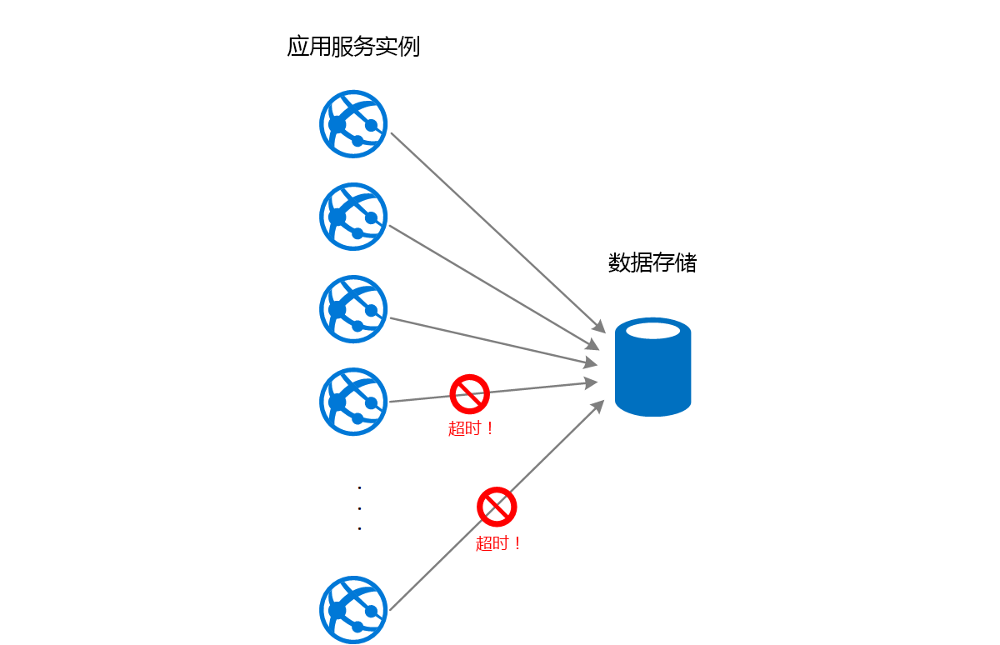
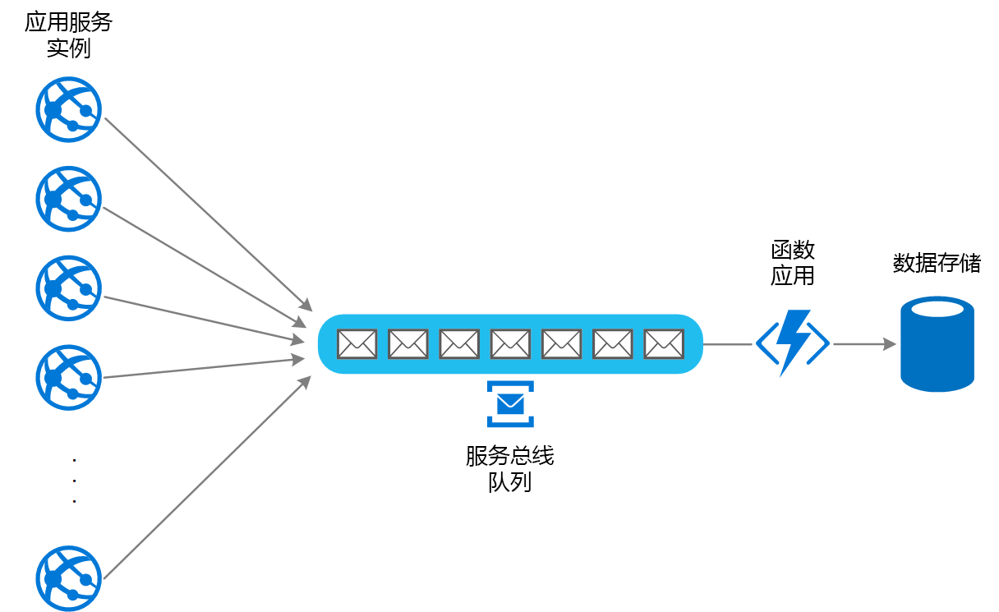

# 基于队列的负载调节模式

使用队列在任务与所调用的服务之间充当缓冲，从而缓解间歇性负载过大现象，否则会导致服务故障或任务超时。这样可以将需求高峰对任务和服务的可用性和响应能力的影响降至最低。

## 上下文和问题

云中的许多解决方案涉及运行那些调用服务的任务。 在这样的环境中，如果某个服务出现间歇性负载过大现象，则可能导致性能或可靠性问题。

服务可能与使用服务的任务同属一个解决方案；服务也可能是提供常用资源访问权限的第三方服务，例如缓存或存储服务。 如果多个同时运行的任务使用同一服务，则可能难以预测任意时刻向服务发出的请求的数量。

服务可能因需求高峰而过载，无法及时响应请求。 向服务提交大量并发请求时，如果服务无法处理这些请求导致的争用，则也可能导致服务故障。

## 解决方案

重构解决方案，在任务和服务之间引入队列。 任务和服务异步运行。 任务将包含服务所需数据的消息发布到队列。 队列充当缓冲区来存储消息，直至消息被服务检索出去。 服务从队列检索消息并对其进行处理。 多个任务提交的请求（其生成速度可能差异很大）可以通过同一消息队列传递给服务。 下图显示如何使用队列调节服务的负载。

队列使得任务与服务分离，服务可以按自己的速度处理消息，不管并发任务提供的请求数量如何。 另外，即使在任务向队列发布消息时服务不可用，也不会对任务造成延迟。

此模式具有以下优点：

- 可以最大程度地提高可用性，因为服务出现延迟时，不会立即和直接影响应用程序，后者仍可继续向队列发布消息，即使服务不可用或者当前不处理消息。
- 可以最大程度地提高可伸缩性，因为队列数和服务数均可按需改变。
- 可以控制成本，因为部署的服务实例数只需满足平均负载而非高峰负载。

    >  当需求达到某个阈值，超出该阈值就可能导致系统故障时，某些服务会实施限制。 限制可能导致可用功能减少。 可以对这些服务实施负载调节，确保不会达到该阈值。

## 问题和注意事项

在决定如何实现此模式时，请考虑以下几点：

- 必须实施应用程序逻辑，对服务处理消息的速度进行控制，避免目标资源过载。 避免将需求高峰带到系统的下一阶段。 对系统进行负载测试，确保实现所需的均衡，并相应地调整队列数和处理消息的服务实例数。
- 消息队列是一种单向通信机制。 如果任务期望从服务获得答复，则可能需要实施一种供服务用来发送响应的机制。 有关详细信息，请参阅 [Asynchronous Messaging Primer](https://msdn.microsoft.com/library/dn589781.aspx)（异步消息传送入门）。
- 如果向服务应用自动缩放，而服务正在侦听队列中的请求，请谨慎操作。 如果这些服务共享特定的资源，上述操作可能导致资源争用加剧，降低使用队列来均衡负载的有效性。

## 何时使用此模式

此模式适用于其使用的服务可能发生过载的任何应用程序。

如果应用程序需要尽量降低从服务收到响应时的延迟，则此模式不适用。

## 示例

Web 应用将数据写入外部数据存储。 如果该 Web 应用的大量实例同时运行，则数据存储可能无法以足够快的速度响应请求，导致请求超时、受限或发生其他故障。 下图显示一个数据存储因来自应用程序实例的并发请求过多而出现过载的情况。

若要解决此问题，可以使用一个队列，在应用程序实例和数据存储之间实现负载均衡。 一个 Azure Functions 应用从队列读取消息，然后向数据存储进行读/写请求。 函数应用中的应用程序逻辑可以控制该角色将请求传递给数据存储的速度，防止存储过载。 （否则，函数应用会在后端再次引发同一问题。）

## 相关模式和指南

实施此模式时，可能也会与以下模式和指南相关：

- [异步消息传送入门](https://msdn.microsoft.com/library/dn589781.aspx)。 消息队列本质上是异步的。 如果已将任务中的应用程序逻辑从直接与服务通信修改为使用消息队列，则可能需要重新设计该逻辑。 同样，可能需要重构服务才能接受来自消息队列的请求。 也可以实施代理服务，如示例中所述。

- [使用者竞争模式](./competing-consumers.md)。 可以运行多个服务实例，每一个都充当负载均衡队列中消息的使用者。 可以使用此方法来调整接收消息并将其传给给服务的速度。

- [限制模式](./throttling.md)。 若要对服务实施限制，一种简单的方式是进行基于队列的负载均衡，通过消息队列将所有请求路由到服务。 服务可以按适当速度处理请求，确保服务所需资源不会耗竭，并缓解可能会发生的争用情况。

- [在 Azure 消息传送服务之间进行选择](/azure/event-grid/compare-messaging-services)。 介绍如何在 Azure 应用程序中选择消息传送和排队机制。

- [提高 Azure Web 应用程序的可伸缩性](../reference-architectures/app-service-web-app/scalable-web-app.md)。 此参考体系结构包括基于队列的负载调节。
