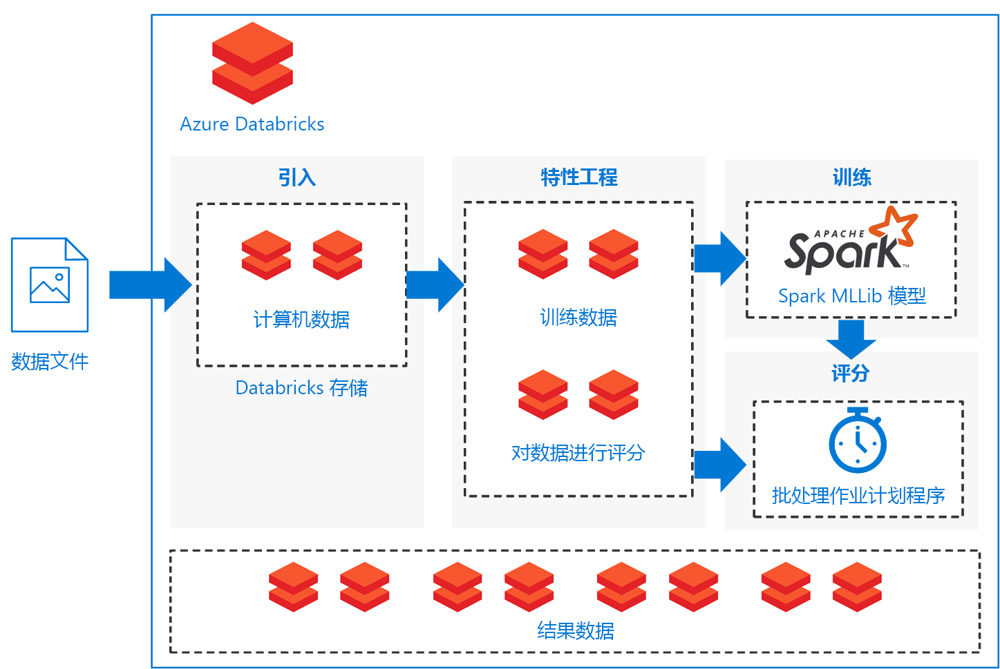

# 在 Azure Databricks 上的 Spark 机器学习批处理评分模型Batch scoring of Spark machine learning models on Azure Databricks

此参考体系结构展示了如何生成可缩放的解决方案，以使用 Azure Databricks（更适合 Azure 的基于 Apache Spark 的分析平台）定期对 Apache Spark 分类模型进行批量评分。This reference architecture shows how to build a scalable solution for batch scoring an Apache Spark classification model on a schedule using Azure Databricks, an Apache Spark-based analytics platform optimized for Azure. 可以将此解决方案用作能推广到其他应用场景中的模板。The solution can be used as a template that can be generalized to other scenarios.

 [GitHub][github] 中提供了本体系结构的参考实现。A reference implementation for this architecture is available on [GitHub][github].

**场景**：资产密集型行业中的某企业希望最大限度地减少与意外机械故障相关的成本和故障时间。**Scenario**: A business in an asset-heavy industry wants to minimize the costs and downtime associated with unexpected mechanical failures. 使用从计算机收集的 IoT 数据，他们可以创建预测性维护模型。Using IoT data collected from their machines, they can create a predictive maintenance model. 借助此模型，企业可以主动维护组件，并维修组件以免它们发生故障。This model enables the business to maintain components proactively and repair them before they fail. 通过最大限度地利用机械组件，他们可以控制成本，并减少故障时间。By maximizing mechanical component use, they can control costs and reduce downtime.

预测性维护模型从计算机收集数据，并保留组件故障的历史示例。A predictive maintenance model collects data from the machines and retains historical examples of component failures. 然后，此模型可用于监视组件的当前状态，并预测给定组件是否会在不久的将来出现故障。The model can then be used to monitor the current state of the components and predict if a given component will fail in the near future. 有关常见用例和建模方法，请参阅 [Azure AI 预测性维护解决方案指南][ai-guide]。For common use cases and modeling approaches, see [Azure AI guide for predictive maintenance solutions][ai-guide].

此参考体系结构专为组件计算机中的新数据触发的工作负载而设计。This reference architecture is designed for workloads that are triggered by the presence of new data from the component machines. 包括以下处理步骤：Processing involves the following steps:

1. 将数据从外部数据存储引入到 Azure Databricks 数据存储中。Ingest the data from the external data store onto an Azure Databricks data store.

2. 将数据转换为定型数据集，再生成 Spark MLlib 模型，从而定型机器学习模型。Train a machine learning model by transforming the data into a training data set, then building a Spark MLlib model. MLlib 包含最常用的机器学习算法和实用工具，它们更适合利用 Spark 数据可伸缩性功能。MLlib consists of most common machine learning algorithms and utilities optimized to take advantage of Spark data scalability capabilities.

3. 将数据转换为评分数据集，以通过应用定型后的模型来预测（分类）组件故障。Apply the trained model to predict (classify) component failures by transforming the data into a scoring data set. 使用 Spark MLLib 模型对数据进行评分。Score the data with the Spark MLLib model.

4. 将结果存储在 Databricks 数据存储中，以供在处理后使用。Store results on the Databricks data store for post-processing consumption.

 [GitHub][github] 上提供了执行上述每项任务的笔记本。Notebooks are provided on [GitHub][github] to perform each of these tasks.

## 体系结构Architecture

此体系结构根据一组按顺序执行的[笔记本][notebooks]，定义了完全包含在 [Azure Databricks][databricks] 中的数据流。The architecture defines a data flow that is entirely contained within [Azure Databricks][databricks] based on a set of sequentially executed [notebooks][notebooks]. 它包含以下组成部分：It consists of the following components:

**[数据文件][github]**。**[Data files][github]**. 此参考实现使用五个静态数据文件中包含的模拟数据集。The reference implementation uses a simulated data set contained in five static data files.

**[引入][notebooks]**。**[Ingestion][notebooks]**. 数据引入笔记本将输入数据文件下载到 Databricks 数据集的集合中。The data ingestion notebook downloads the input data files into a collection of Databricks data sets. 在实际应用场景中，IoT 设备中的数据会流式传输到 Databricks 可访问的存储中，如 Azure SQL Server 或 Azure Blob 存储。In a real-world scenario, data from IoT devices would stream onto Databricks-accessible storage such as Azure SQL Server or Azure Blob storage. Databricks 支持多个[数据源][data-sources]。Databricks supports multiple [data sources][data-sources].

**定型管道**。**Training pipeline**. 此笔记本执行特征工程笔记本，以根据引入的数据创建分析数据集。This notebook executes the feature engineering notebook to create an analysis data set from the ingested data. 然后，它执行模型生成笔记本，即使用 [Apache Spark MLlib][mllib] 可缩放机器学习库来定型机器学习模型。It then executes a model building notebook that trains the machine learning model using the [Apache Spark MLlib][mllib] scalable machine learning library.

**评分管道**。**Scoring pipeline**. 此笔记本执行特征工程笔记本，以根据引入的数据创建评分数据集，同时还执行评分笔记本。This notebook executes the feature engineering notebook to create scoring data set from the ingested data and executes the scoring notebook. 评分笔记本使用定型后的 [Spark MLlib][mllib-spark] 模型，针对评分数据集中的观察结果生成预测。The scoring notebook uses the trained [Spark MLlib][mllib-spark] model to generate predictions for the observations in the scoring data set. 预测结果存储在结果存储中，这是 Databricks 数据存储中的新数据集。The predictions are stored in the results store, a new data set on the Databricks data store.

**计划程序**。**Scheduler**. 定期 Databricks [作业][job]使用 Spark 模型来处理批量评分。A scheduled Databricks [job][job] handles batch scoring with the Spark model. 此作业执行评分管道笔记本，通过笔记本形参传递变量实参，以指定关于构造评分数据集，以及结果数据集存储位置的详细信息。The job executes the scoring pipeline notebook, passing variable arguments through notebook parameters to specify the details for constructing the scoring data set and where to store the results data set.

此应用场景构造为管道流。The scenario is constructed as a pipeline flow. 每个笔记本都更适合在批量上下文中执行每个操作：引入、特征工程、模型生成和模型评分。Each notebook is optimized to perform in a batch setting for each of the operations: ingestion, feature engineering, model building, and model scorings. 为此，特征工程笔记本旨在为任何定型、校准、测试或评分操作生成通用数据集。To accomplish this, the feature engineering notebook is designed to generate a general data set for any of the training, calibration, testing, or scoring operations. 在此应用场景中，我们对这些操作使用临时拆分策略，以便将笔记本形参用于设置日期范围筛选。In this scenario, we use a temporal split strategy for these operations, so the notebook parameters are used to set date-range filtering.

因为此应用场景创建了批处理管道，所以我们提供了一组可选的检查笔记本来探索管道笔记本的输出。Because the scenario creates a batch pipeline, we provide a set of optional examination notebooks to explore the output of the pipeline notebooks. 可以在 GitHub 存储库中找到下面这些笔记本：You can find these in the GitHub repository:

- `1a_raw-data_exploring`
- `2a_feature_exploration`
- `2b_model_testing`
- `3b_model_scoring_evaluation`

## 建议Recommendations

Databricks 已经过设置，可便于加载和部署定型后的模型，以使用新数据进行预测。Databricks is set up so you can load and deploy your trained models to make predictions with new data. 我们对此应用场景使用了 Databricks，因为它可以提供下列额外优势：We used Databricks for this scenario because it provides these additional advantages:

- 单一登录支持（使用 Azure Active Directory 凭据）。Single sign-on support using Azure Active Directory credentials.
- 执行生产管道作业的作业计划程序。Job scheduler to execute jobs for production pipelines.
- 包含协作功能、仪表板、REST API 的完全交互式笔记本。Fully interactive notebook with collaboration, dashboards, REST APIs.
- 可以缩放到任意大小的无限个群集。Unlimited clusters that can scale to any size.
- 高级安全性、基于角色的访问控制和审核日志。Advanced security, role-based access controls, and audit logs.

若要与 Azure Databricks 服务进行交互，请使用 Web 浏览器中的 Databricks [工作区][workspace]界面，或使用[命令行接口][cli] (CLI)。To interact with the Azure Databricks service, use the Databricks [Workspace][workspace] interface in a web browser or the [command-line interface][cli] (CLI). 从任何支持 Python 2.7.9 到 3.6 的平台访问 Databricks CLI。Access the Databricks CLI from any platform that supports Python 2.7.9 to 3.6.

此参考实现使用[笔记本][notebooks]按顺序执行任务。The reference implementation uses [notebooks][notebooks] to execute tasks in sequence. 每个笔记本将中间数据项目（定型、测试、评分或结果数据集）存储到输入数据所在的相同数据存储中。Each notebook stores intermediate data artifacts (training, test, scoring, or results data sets) to the same data store as the input data. 目标是可便于根据需要在特定用例中轻松使用它。The goal is to make it easy for you to use it as needed in your particular use case. 实际上，可以将数据源连接到 Azure Databricks 实例，这样笔记本就能直接在存储中读取和写回数据。In practice, you would connect your data source to your Azure Databricks instance for the notebooks to read and write directly back into your storage.

可以根据需要通过 Databricks 用户界面、数据存储或 Databricks [CLI][cli] 来监视作业执行情况。You can monitor job execution through the Databricks user interface, the data store, or the Databricks [CLI][cli] as necessary. 使用[事件日志][log]以及 Databricks 提供的其他[指标][metrics]来监视群集。Monitor the cluster using the [event log][log] and other [metrics][metrics] that Databricks provides.

## 性能注意事项Performance considerations

Azure Databricks 群集默认启用自动缩放，这样在运行时期间，Databricks 可以动态重新分配工作进程，以将作业特征考虑在内。An Azure Databricks cluster enables autoscaling by default so that during runtime, Databricks dynamically reallocates workers to account for the characteristics of your job. 管道的某些部分在计算方面的要求可能比另一些部分更高。Certain parts of your pipeline may be more computationally demanding than others. Databricks 会在作业的这些阶段添加额外工作进程（并在不再需要它们时将其删除）。Databricks adds additional workers during these phases of your job (and removes them when they’re no longer needed). 通过自动缩放，可以更轻松地实现高[群集利用率][cluster]，因为无需通过预配群集来匹配工作负载。Autoscaling makes it easier to achieve high [cluster utilization][cluster], because you don’t need to provision the cluster to match a workload.

此外，通过将 [Azure 数据工厂][adf]与 Azure Databricks 结合使用，可以开发更复杂的定期管道。Additionally, more complex scheduled pipelines can be developed by using [Azure Data Factory][adf] with Azure Databricks.

## 存储注意事项Storage considerations

在此参考实现中，为了简单起见，数据直接存储在 Databricks 存储中。In this reference implementation, the data is stored directly within Databricks storage for simplicity. 不过，在生产上下文中，数据可以存储在 [Azure Blob 存储][blob]等云数据存储中。In a production setting, however, the data can be stored on cloud data storage such as [Azure Blob Storage][blob]. [Databricks][databricks-connect] 还支持 Azure Data Lake Store、Azure SQL 数据仓库、Azure Cosmos DB、Apache Kafka 和 Hadoop。[Databricks][databricks-connect] also supports Azure Data Lake Store, Azure SQL Data Warehouse, Azure Cosmos DB, Apache Kafka, and Hadoop.

## 成本注意事项Cost considerations

Azure Databricks 是一项有相关成本的 Spark 高级产品/服务。Azure Databricks is a premium Spark offering with an associated cost. 此外，还有标准和高级 Databricks [定价层][pricing]。In addition, there are standard and premium Databricks [pricing tiers][pricing].

对于此应用场景，标准定价层就足够了。For this scenario, the standard pricing tier is sufficient. 不过，如果具体应用程序需要自动缩放群集来处理更大的工作负载或交互式 Databricks 仪表板，高级级别可能会进一步增加成本。However, if your specific application requires automatically scaling clusters to handle larger workloads or interactive Databricks dashboards, the premium level could increase costs further.

解决方案笔记本可以在任何基于 Spark 的平台上运行，只需一点点编辑，即可删除 Databricks 专用包。The solution notebooks can run on any Spark-based platform with minimal edits to remove the Databricks-specific packages. 请参阅以下适用于各种 Azure 平台的类似解决方案：See the following similar solutions for various Azure platforms:

- [Azure 机器学习工作室上的 Python][python-aml][Python on Azure Machine Learning Studio][python-aml]
- [SQL Server R 服务][sql-r][SQL Server R services][sql-r]
- [Azure Data Science Virtual Machine 上的 PySpark][py-dvsm][PySpark on an Azure Data Science Virtual Machine][py-dvsm]

## 部署解决方案Deploy the solution

若要部署此参考体系结构，请按照  [GitHub][github] 存储库中的步骤操作，生成可缩放的解决方案，以在 Azure Databricks 中对 Spark 模型进行批量评分。To deploy this reference architecture, follow the steps described in the [GitHub][github] repository to build a scalable solution for scoring Spark models in batch on Azure Databricks.

## 相关体系结构Related architectures

我们还生成了以下参考体系结构：使用 Spark 生成包含脱机预计算分数的[实时推荐系统][recommendation]。We have also built a reference architecture that uses Spark for building [real-time recommendation systems][recommendation] with offline, pre-computed scores. 这些推荐系统是批量处理分数的常见应用场景。These recommendation systems are common scenarios where scores are batch-processed.

[adf]: https://azure.microsoft.com/blog/operationalize-azure-databricks-notebooks-using-data-factory/
[ai-guide]: /azure/machine-learning/team-data-science-process/cortana-analytics-playbook-predictive-maintenance
[blob]: https://docs.databricks.com/spark/latest/data-sources/azure/azure-storage.html
[cli]: https://docs.databricks.com/user-guide/dev-tools/databricks-cli.html
[cluster]: https://docs.azuredatabricks.net/user-guide/clusters/sizing.html
[databricks]: /azure/azure-databricks/
[databricks-connect]: /azure/azure-databricks/databricks-connect-to-data-sources
[data-sources]: https://docs.databricks.com/spark/latest/data-sources/index.html
[github]: https://github.com/Azure/BatchSparkScoringPredictiveMaintenance
[job]: https://docs.databricks.com/user-guide/jobs.html
[log]: https://docs.databricks.com/user-guide/clusters/event-log.html
[metrics]: https://docs.databricks.com/user-guide/clusters/metrics.html
[mllib]: https://docs.databricks.com/spark/latest/mllib/index.html
[mllib-spark]: https://docs.databricks.com/spark/latest/mllib/index.html#apache-spark-mllib
[notebooks]: https://docs.databricks.com/user-guide/notebooks/index.html
[pricing]: https://azure.microsoft.com/en-us/pricing/details/databricks/
[python-aml]: https://gallery.azure.ai/Notebook/Predictive-Maintenance-Modelling-Guide-Python-Notebook-1
[py-dvsm]: https://gallery.azure.ai/Tutorial/Predictive-Maintenance-using-PySpark
[recommendation]: /azure/architecture/reference-architectures/ai/real-time-recommendation
[sql-r]: https://gallery.azure.ai/Tutorial/Predictive-Maintenance-Modeling-Guide-using-SQL-R-Services-1
[workspace]: https://docs.databricks.com/user-guide/workspace.html
