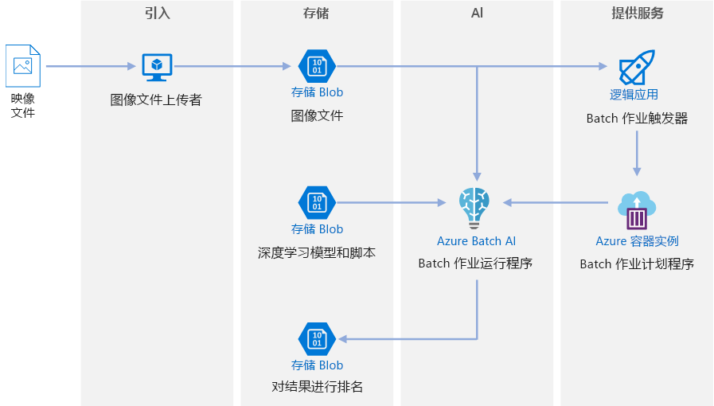
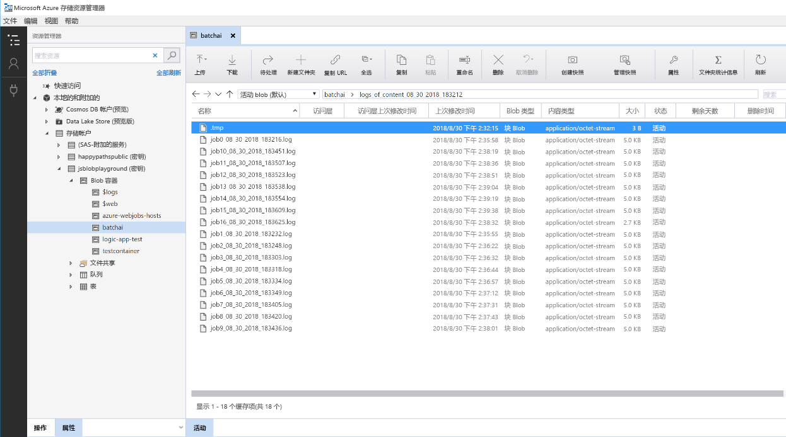

# Azure 上针对深度学习模型的批处理计分Batch scoring on Azure for deep learning models

此参考体系结构显示如何使用 Azure Batch AI 将神经样式传输应用于视频。This reference architecture shows how to apply neural style transfer to a video, using Azure Batch AI. 样式传输是一种深度学习技术，它以另一个映像的样式构成现有映像。*Style transfer* is a deep learning technique that composes an existing image in the style of another image. 可将此体系结构概括为任何使用批处理计分和深度学习的方案。This architecture can be generalized for any scenario that uses batch scoring with deep learning. [**部署此解决方案**](#deploy-the-solution)。[**Deploy this solution**](#deploy-the-solution).
 

**方案**：媒体组织存在一个需改变其样式的视频，使其看起来像一幅特定的画。**Scenario**: A media organization has a video whose style they want to change to look like a specific painting. 该组织希望能以自动化的方式及时将这种样式应用于视频的所有帧。The organization wants to be able to apply this style to all frames of the video in a timely manner and in an automated fashion. 有关神经样式传输算法的详细背景信息，请参阅[使用卷积神经网络的映像样式传输][image-style-transfer] (PDF)。For more background about neural style transfer algorithms, see [Image Style Transfer Using Convolutional Neural Networks][image-style-transfer] (PDF).

| 样式映像：Style image: | 输入/内容视频：Input/content video: | 输出视频：Output video: | 
|--------|--------|---------|
|  |  单击以观看视频 *click to view video* |  单击以观看视频 *click to view video* |

此参考体系结构专为 Azure 存储中存在新媒体时而触发的工作负载而设计。This reference architecture is designed for workloads that are triggered by the presence of new media in Azure storage. 处理包括以下步骤：Processing involves the following steps:

1. 将选定的样式映像（如梵高的画作）和样式传输脚本上传到 Blob 存储。Upload a selected style image (like a Van Gogh painting) and a style transfer script to Blob Storage.
1. 创建已准备好开始工作的自动缩放 Batch AI 群集。Create an autoscaling Batch AI cluster that is ready to start taking work.
1. 将视频文件拆分为单独的帧并将这些帧上传到 Blob 存储中。Split the video file into individual frames and upload those frames into Blob Storage.
1. 上传所有帧后，将触发器文件上传到 Blob 存储中。Once all frames are uploaded, upload a trigger file to Blob Storage.
1. 此文件触发逻辑应用，该应用创建在 Azure 容器实例中运行的容器。This file triggers a Logic App that creates a container running in Azure Container Instances.
1. 容器运行创建 Batch AI 作业的脚本。The container runs a script that creates the Batch AI jobs. 每个作业在 Batch AI 群集的节点间并行应用神经样式传输。Each job applies the neural style transfer in parallel across the nodes of the Batch AI cluster.
1. 生成映像后，将它们保存回 Blob 存储。Once the images are generated, they are saved back to Blob Storage.
1. 下载生成的帧，并将映像拼结成视频。Download the generated frames, and stitch back the images into a video.

## 体系结构Architecture
该体系结构包括以下组件。This architecture consists of the following components.

### 计算Compute

[Azure Batch AI][batch-ai] 用于运行神经样式传输算法。**[Azure Batch AI][batch-ai]** is used to run the neural style transfer algorithm. Batch AI 通过在支持 GPU 的 VM 上提供为深度学习框架预先配置的容器化环境，支持深度学习工作负载。Batch AI supports deep learning workloads by providing containerized environments that are pre-configured for deep learning frameworks, on GPU-enabled VMs. Batch AI 还可将计算群集连接到 Blob 存储。Batch AI can also connect the compute cluster to Blob storage.

### 存储Storage

[Blob 存储][blob-storage]用于存储所有映像（输入映像、样式映像和输出映像）以及从 Batch AI 生成的所有日志。**[Blob storage][blob-storage]** is used to store all images (input images, style images, and output images) as well as all logs produced from Batch AI. Blob 存储通过 [blobfuse][blobfuse] 与 Batch AI 集成，blobfuse 是由 Blob 存储支持的开源虚拟文件系统。Blob storage integrates with Batch AI via [blobfuse][blobfuse], an open-source virtual filesystem that is backed by Blob storage. 对于此工作负载所需的性能而言，Blob 存储也非常经济高效。Blob storage is also very cost-effective for the performance that this workload requires.

### 触发/计划Trigger / scheduling

[Azure 逻辑应用][logic-apps]用于触发工作流。**[Azure Logic Apps][logic-apps]** is used to trigger the workflow. 逻辑应用检测到已将 BLOb 添加到容器中时，便会触发 Batch AI 进程。When the Logic App detects that a blob has been added to the container, it triggers the Batch AI process. 逻辑应用非常适合此参考体系结构，因为它是检测 Blob 存储更改的简单方法，并提供了更改触发器的简单进程。Logic Apps is a good fit for this reference architecture because it's an easy way to detect changes to blob storage and provides an easy process for changing the trigger.

[Azure 容器实例][container-instances]用于运行创建 Batch AI 作业的 Python 脚本。**[Azure Container Instances][container-instances]** is used to run the Python scripts that create the Batch AI jobs. 在 Docker 容器中运行这些脚本是按需运行它们的便捷方式。Running these scripts inside a Docker container is a convenient way to run them on demand. 对于此体系结构，我们使用容器实例，因为它有一个预构建的逻辑应用连接器，该连接器允许逻辑应用触发 Batch AI 作业。For this architecture, we use Container Instances because there is a pre-built Logic App connector for it, which allows the Logic App to trigger the Batch AI job. 容器实例可快速启动无状态进程。Container Instances can spin up stateless processes quickly.

[DockerHub][dockerhub] 用于存储容器实例用于执行作业创建进程的 Docker 映像。**[DockerHub][dockerhub]** is used to store the Docker image that Container Instances uses to execute the job creation process. 选择 DockerHub 用于此体系结构，因为它易于使用，并且是 Docker 用户的默认映像存储库。DockerHub was chosen for this architecture because it's easy to use and is the default image repository for Docker users. 也可使用 [Azure 容器注册表][container-registry]。[Azure Container Registry][container-registry] can also be used.

### 数据准备工作Data preparation

此参考体系结构使用“树上的猩猩”视频片段。This reference architecture uses video footage of an orangutan in a tree. 可从[此处][source-video]下载该片段，然后按照以下步骤针对工作流进行处理：You can download the footage from [here][source-video] and process it for the workflow by following these steps:

1. 使用 [AzCopy][azcopy] 从公共 blob 下载视频。Use [AzCopy][azcopy] to download the video from the public blob.
2. 使用 [FFmpeg][ffmpeg] 提取音频文件，以便稍后可将音频文件拼结回输出视频。Use [FFmpeg][ffmpeg] to extract the audio file, so that the audio file can be stitched back into the output video later.
3. 使用 FFmpeg 将视频分成单个帧。Use FFmpeg to break the video into individual frames. 独立地并行处理这些帧。The frames will be processed independently, in parallel.
4. 使用 AzCopy 将各个帧复制到 blob 容器中。Use AzCopy to copy the individual frames into your blob container.

在此阶段，视频片段的形式可用于神经样式传输。At this stage, the video footage is in a form that can be used for neural style transfer. 

## 性能注意事项Performance considerations

### GPU 与 CPUGPU vs CPU

对于深度学习工作负载，GPU 通常会远远超出 CPU，以至于通常需要相当大的 CPU 群集才可获得可比的性能。For deep learning workloads, GPUs will generally out-perform CPUs by a considerable amount, to the extent that a sizeable cluster of CPUs is usually needed to get comparable performance. 虽然在此体系结构中可选择只使用 CPU，但 GPU 将提供更好的成本/性能配置文件。While it's an option to use only CPUs in this architecture, GPUs will provide a much better cost/performance profile. 我们建议使用最新的 [NCv3 系列] VM 大小 GPU 的 GPU 优化 VM。We recommend using the latest [NCv3 series]vm-sizes-gpu of GPU optimized VMs.

默认情况下，并非所有区域都启用 GPU。GPUs are not enabled by default in all regions. 确保选择启用了 GPU 的区域。Make sure to select a region with GPUs enabled. 此外，对于 GPU 优化的 VM，订阅的内核默认配额为零。In addition, subscriptions have a default quota of zero cores for GPU-optimized VMs. 可通过打开支持请求来提高此配额。You can raise this quota by opening a support request. 确保订阅有足够的配额来运行工作负载。Make sure that your subscription has enough quota to run your workload.

### 跨 VM 和内核并行执行Parallelizing across VMs vs cores

将样式传输进程作为批处理作业运行时，主要在 GPU 上运行的作业必须在 VM 间并行化。When running a style transfer process as a batch job, the jobs that run primarily on GPUs will have to be parallelized across VMs. 可使用两种方法：可使用具有单个 GPU 的 VM 创建更大的群集，也可使用具有许多 GPU 的 VM 创建较小的群集。Two approaches are possible: You can create a larger cluster using VMs that have a single GPU, or create a smaller cluster using VMs with many GPUs. 

对于此工作负载，这两个选项的性能相当。For this workload, these two options will have comparable performance. 使用更少的 VM 且每个 VM 具有更多的 GPU，可帮助减少数据移动。Using fewer VMs with more GPUs per VM can help to reduce data movement. 但是，此工作负载的每个作业的数据量并不是很大，因此 blob 存储不会受到太多限制。However, the data volume per job for this workload is not very big, so you won't observe much throttling by blob storage.

### 每个 Batch AI 作业的映像批大小Images batch size per Batch AI job

另一个必须配置的参数是每个 Batch AI 作业要处理的映像数。Another parameter that must be configured is the number of images to process per Batch AI job. 一方面，你希望确保工作广泛分部在节点间，如果作业失败，不必重试太多映像。On the one hand, you want to ensure that work is spread broadly across the nodes and that if a job fails, you don't have to retry too many images. 这意味着具有多个 Batch AI 作业，因此每个作业要处理的映像数量很少。That points to having many Batch AI jobs and thus a low number of images to process per job. 另一方面，如果每个作业处理的映像太少，则安装/启动时间会不成比例地变长。On the other hand, if too few images are processed per job, the setup/startup time becomes disproportionately large. 可将作业数设置为等于群集中的最大节点数。You can set the number of jobs to equal the maximum number of nodes in the cluster. 这在没有作业失败时最有效，因为它可以最大限度地降低安装/启动成本。This will be the most performant assuming that no jobs fail, because it minimizes the amount of setup/startup cost. 但是，如果作业失败，则可能需要重新处理大量映像。However, if a job fails, a large number of images might need to be reprocessed.

### 文件服务器File servers

使用 Batch AI 时，可根据方案所需的吞吐量选择多个存储选项。When using Batch AI, you can choose multiple storage options depending on the throughput needed for your scenario. 对于吞吐量需求低的工作负载，使用 blob 存储（通过 blobfuse）就足够了。For workloads with low throughput requirements, using blob storage (via blobfuse) should be enough. 或者，Batch AI 还支持 Batch AI 文件服务器（托管的单节点 NFS），可自动将其安装在群集节点上，为作业提供可集中访问的存储位置。Alternatively, Batch AI also supports a Batch AI File Server, a managed single-node NFS, which can be automatically mounted on cluster nodes to provide a centrally accessible storage location for jobs. 大多数情况下，一个工作区只需要一个文件服务器，可将训练作业的数据分为不同的目录。For most cases, only one file server is needed in a workspace, and you can separate data for your training jobs into different directories. 如果单节点 NFS 不适用于工作负载，Batch AI 支持其他存储选项，包括 Azure 文件或自定义解决方案，如 Gluster 或 Lustre 文件系统。If a single-node NFS isn't appropriate for your workloads, Batch AI supports other storage options, including Azure Files or custom solutions such as a Gluster or Lustre file system.

## 安全注意事项Security considerations

### 限制对 Azure Blob 存储的访问Restricting access to Azure blob storage

在此参考体系结构中，Azure Blob 存储是需要保护的主要存储组件。In this reference architecture, Azure blob storage is the main storage component that needs to be protected. GitHub 存储库中显示的基线部署使用存储帐户密钥来访问 Blob 存储。The baseline deployment shown in the GitHub repo uses storage account keys to access the blob storage. 为进一步控制和保护，请考虑改用共享访问签名 (SAS)。For further control and protection, consider using a shared access signature (SAS) instead. 这允许对存储中的对象进行有限的访问，而无需对帐户密钥进行硬编码或以纯文本形式保存。This grants limited access to objects in storage, without needing to hard code the account keys or save them in plaintext. 此方法特别有用，因为帐户密钥在逻辑应用的设计器界面中以纯文本形式可见。This approach is especially useful because account keys are visible in plaintext inside of Logic App's designer interface. 使用 SAS 还有助于确保存储帐户具有适当监管，并且仅向有意拥有访问权限的人员授予该访问权限。Using an SAS also helps to ensure that the storage account has proper governance, and that access is granted only to the people intended to have it.

在具有更多敏感数据的情况下，请确保所有存储密钥都受到保护，因为这些密钥可授予对工作负载的所有输入和输出数据的完全访问权限。For scenarios with more sensitive data, make sure that all of your storage keys are protected, because these keys grant full access to all input and output data from the workload.

### 数据加密和数据移动Data encryption and data movement

此参考体系结构使用样式传输作为批处理计分进程的示例。This reference architecture uses style transfer as an example of a batch scoring process. 在数据敏感性更强的情况下，存储中的数据应静态加密。For more data-sensitive scenarios, the data in storage should be encrypted at rest. 每次将数据从一个位置移动到另一位置时，都使用 SSL 来保护数据传输。Each time data is moved from one location to the next, use SSL to secure the data transfer. 有关详细信息，请参阅 [Azure 存储安全指南][storage-security]。For more information, see [Azure Storage security guide][storage-security]. 

### 保护虚拟网络中的数据Securing data in a virtual network

部署 Batch AI 群集时，可将群集配置为在虚拟网络的子网内进行预配。When deploying your Batch AI cluster, you can configure your cluster to be provisioned inside a subnet of a virtual network. 此操作允许群集中的计算节点安全地与其他虚拟机通信，甚至与本地网络通信。This allows the compute nodes in the cluster to communicate securely with other virtual machines, or even with an on-premises network. 还可结合使用[服务终结点][service-endpoints]与 Blob 存储以授予虚拟网络中的访问权限，或结合使用 VNET 中的单节点 NFS 和 Batch AI 以确保数据始终受到保护。You can also use [service endpoints][service-endpoints] with blob storage to grant access from a virtual network or use a single-node NFS inside the VNET with Batch AI to ensure that the data is always protected.

### 防止恶意活动Protecting against malicious activity

在存在多个用户的情况下，确保敏感数据免受恶意活动的影响。In scenarios where there are multiple users, make sure that sensitive data is protected against malicious activity. 如果其他用户可访问此部署以自定义输入数据，请注意以下预防措施和注意事项：If other users are given access to this deployment to customize the input data, take note of the following precautions and considerations:

- 使用 RBAC 限制用户只能访问他们所需的资源。Use RBAC to limit users' access to only the resources they need.
- 预配两个单独的存储帐户。Provision two separate storage accounts. 将输入和输出数据存储在第一个帐户中。Store input and output data in the first account. 可授予外部用户访问此帐户的权限。External users can be given access to this account. 将可执行脚本和输出日志文件存储在另一帐户中。Store executable scripts and output log files in the other account. 外部用户不应有权访问此帐户。External users should not have access to this account. 这可确保外部用户无法修改任何可执行文件（注入恶意代码），并且无法访问可能包含敏感信息的日志文件。This will ensure that external users cannot modify any executable files (to inject malicious code), and don't have access to logfiles, which could hold sensitive information.
- 恶意用户可对作业队列执行 DDoS 攻击或在作业队列中注入格式错误的有害消息，从而导致系统锁定或导致出列错误。Malicious users can DDOS the job queue or inject malformed poison messages in the job queue, causing the system to lock up or causing dequeuing errors. 

## 监视和日志记录Monitoring and logging

### 监视 Batch AI 作业Monitoring Batch AI jobs

运行作业时，监视进度并确保操作按预期进行，这点至关重要。While running your job, it's important to monitor the progress and make sure that things are working as expected. 然而，在活动节点群集间进行监视可能是一项挑战。However, it can be a challenge to monitor across a cluster of active nodes. 

要了解群集的整体状态，请转到 Azure 门户的“Batch AI”边栏选项卡以检查群集中节点的状态。To get a sense of the overall state of the cluster, go to the Batch AI blade of the Azure Portal to inspect the state of the nodes in the cluster. 如果节点处于非活动状态或作业失败，则错误日志将保存到 Blob 存储，并且还可在 Azure 门户的“作业”边栏选项卡中访问。If a node is inactive or a job has failed, the error logs are saved to blob storage, and are also accessible in the Jobs blade in the Azure Portal. 

通过将日志连接到 Application Insights，或通过运行单独的进程来轮询 Batch AI 群集及其作业的状态，可进一步进行监视。Monitoring can be further enriched by connecting logs to Application Insights or by running separate processes to poll for the state of the Batch AI cluster and its jobs.

### Batch AI 中的日志记录Logging in Batch AI

Batch AI 自动将所有 stdout/stderr 记录到关联的 Blob 存储帐户中。Batch AI will automatically log all stdout/stderr to the associate blob storage account. 使用存储资源管理器等存储导航工具可更轻松地浏览日志文件。Using a storage navigation tool such as Storage Explorer will provide a much easier experience for navigating log files. 

此参考体系结构的部署步骤还展示了如何设置更简单的日志记录系统，以便将不同作业中的所有日志保存到 Blob 容器中的同一目录中，如下所示。The deployment steps for this reference architecture also shows how to set up a more simple logging system, such that all the logs across the different jobs are saved to the same directory in your blob container, as shown below.
使用这些日志可监视每个作业和每个映像处理所需的时间。Use these logs to monitor how long it takes for each job and each image to process. 通过此可更好地了解如何进一步优化进程。This will give you a better sense of how to optimize the process even further.

## 成本注意事项Cost considerations

与存储和计划组件相比，此参考体系结构中使用的计算资源在成本方面遥遥领先。Compared to the storage and scheduling components, the compute resources used in this reference architecture by far dominate in terms of costs. 其中一个主要挑战是在支持 GPU 的计算机群集中有效地并行化工作。One of the main challenges is effectively parallelizing the work across a cluster of GPU-enabled machines.

Batch AI 群集大小可根据队列中的作业自动增加和减少。The Batch AI cluster size can automatically scale up and down depending on the jobs in the queue. 可通过以下两种方式之一使用 Batch AI 启用自动缩放。You can enable auto-scale with Batch AI in one of two ways. 可通过编程方式执行此操作，可在[部署步骤][deployment]中的 `.env` 文件中进行配置，也可在创建群集后直接在门户中更改缩放公式。You can do so programmatically, which can be configured in the `.env` file that is part of the [deployment steps][deployment], or you can change the scale formula directly in the portal after the cluster is created.

对于无需立即处理的工作，可配置自动缩放公式，使默认状态（最小值）为零节点群集。For work that doesn't require immediate processing, configure the auto-scale formula so the default state (minimum) is a cluster of zero nodes. 通过此配置，群集从零节点开始，仅在队列中检测到作业时才会增加。With this configuration, the cluster starts with zero nodes and only scales up when it detects jobs in the queue. 如果批处理计分进程一天只进行几次或更少，则此设置可显著节约成本。If the batch scoring process only happens a few times a day or less, this setting enables significant cost savings.

自动缩放可能不适用于彼此发生时间太接近的批处理作业。Auto-scaling may not be appropriate for batch jobs that happen too close to each other. 群集启动和停止所需的时间也会产生成本，因此如果批工作负载在上一个作业结束后的几分钟内开始，则保持群集在作业之间运行可能更具成本效益。The time that it takes for a cluster to spin up and spin down also incur a cost, so if a batch workload begins only a few minutes after the previous job ends, it might be more cost effective to keep the cluster running between jobs.

## 部署解决方案Deploy the solution

若要部署此参考体系结构，请按照 [GitHub 存储库][deployment]中所述的步骤进行操作。To deploy this reference architecture, follow the steps described in the [GitHub repo][deployment].

[azcopy]: /azure/storage/common/storage-use-azcopy-linux
[batch-ai]: /azure/batch-ai/
[blobfuse]: https://github.com/Azure/azure-storage-fuse
[blob-storage]: /azure/storage/blobs/storage-blobs-introduction
[container-instances]: /azure/container-instances/
[container-registry]: /azure/container-registry/
[deployment]: https://github.com/Azure/batch-scoring-for-dl-models
[dockerhub]: https://hub.docker.com/
[ffmpeg]: https://www.ffmpeg.org/
[image-style-transfer]: https://www.cv-foundation.org/openaccess/content_cvpr_2016/papers/Gatys_Image_Style_Transfer_CVPR_2016_paper.pdf
[logic-apps]: /azure/logic-apps/
[service-endpoints]: /azure/storage/common/storage-network-security?toc=%2fazure%2fvirtual-network%2ftoc.json#grant-access-from-a-virtual-network
[source-video]: https://happypathspublic.blob.core.windows.net/videos/orangutan.mp4
[storage-security]: /azure/storage/common/storage-security-guide
[vm-sizes-gpu]: /azure/virtual-machines/windows/sizes-gpu