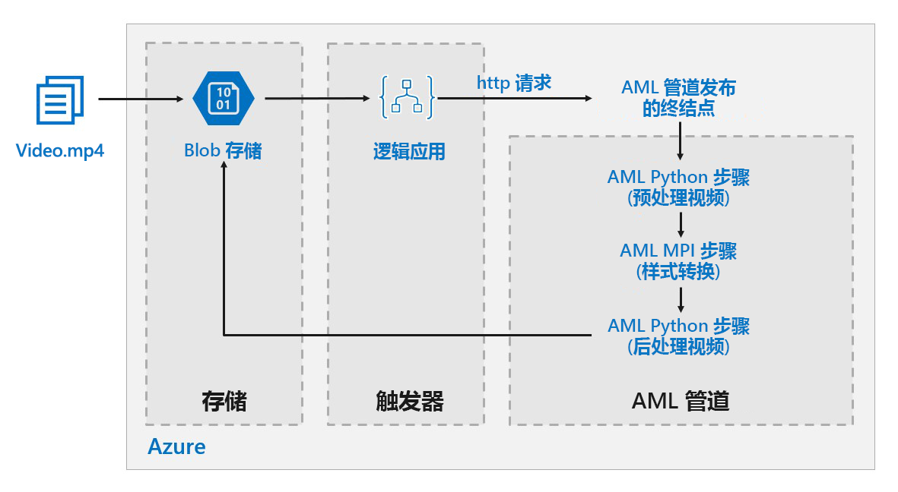

# Azure 上针对深度学习模型的批处理计分Batch scoring on Azure for deep learning models

本参考体系结构演示如何使用 Azure 机器学习将神经样式传输应用于视频。This reference architecture shows how to apply neural style transfer to a video, using Azure Machine Learning. 样式传输是一种深度学习技术，它以另一个图像的样式构成现有图像。*Style transfer* is a deep learning technique that composes an existing image in the style of another image. 可概括此体系结构，将它用于任何为深度学习使用批处理计分的场景。This architecture can be generalized for any scenario that uses batch scoring with deep learning. [**部署此解决方案**](#deploy-the-solution)。[**Deploy this solution**](#deploy-the-solution).

**场景**：媒体组织的一个视频需要改变样式，使其看起来像一幅特定的画。**Scenario**: A media organization has a video whose style they want to change to look like a specific painting. 该组织希望能以自动化的方式及时将这种样式应用于视频的所有帧。The organization wants to be able to apply this style to all frames of the video in a timely manner and in an automated fashion. 有关神经样式传输算法的详细背景信息，请参阅[使用卷积神经网络的图像样式传输][image-style-transfer] (PDF)。For more background about neural style transfer algorithms, see [Image Style Transfer Using Convolutional Neural Networks][image-style-transfer] (PDF).

| 样式图像：Style image: | 输入/内容视频：Input/content video: | 输出视频：Output video: |
|--------|--------|---------|
|  |  单击以观看视频 *click to view video* |  单击以观看视频 *click to view video* |

这个用于参考的体系结构专为 Azure 存储中存在新媒体时而触发的工作负载而设计。This reference architecture is designed for workloads that are triggered by the presence of new media in Azure storage.

包括以下处理步骤：Processing involves the following steps:

1. 将视频文件上传到存储。Upload a video file to storage.
1. 视频文件触发逻辑应用，以将请求发送到 Azure 机器学习管道发布的终结点。The video file triggers a Logic App to send a request to the Azure Machine Learning pipeline published endpoint.
1. 该管道处理视频、应用采用 MPI 的样式传输，并对视频进行后处理。The pipeline processes the video, applies style transfer with MPI, and postprocesses the video.
1. 管道完成后，输出将保存到 Blob 存储。The output is saved back to blob storage once the pipeline is completed.

## 体系结构Architecture

该体系结构包括以下组件。This architecture consists of the following components.

### 计算Compute

**[Azure 机器学习服务][amls]** 使用 Azure 机器学习管道创建可再现的且易于管理的计算序列。**[Azure Machine Learning Service][amls]** uses Azure Machine Learning Pipelines to create reproducible and easy-to-manage sequences of computation. 此外，它还提供名为 [Azure 机器学习计算][aml-compute]的托管计算目标（管道计算可在其上运行），用于对机器学习模型进行训练、部署和评分。It also offers a managed compute target (on which a pipeline computation can run) called [Azure Machine Learning Compute][aml-compute] for training, deploying, and scoring machine learning models. 

### 存储Storage

**[Blob 存储][blob-storage]** 用于存储所有图像（输入图像、样式图像和输出图像）。**[Blob storage][blob-storage]** is used to store all images (input images, style images, and output images). Azure 机器学习服务与 Blob 存储相集成，因此，用户无需手动在计算平台和 Blob 存储之间移动数据。Azure Machine Learning Service integrates with Blob storage so that users do not have to manually move data across compute platforms and Blob storage. 对于此工作负载所需的性能而言，Blob 存储也非常经济高效。Blob storage is also very cost-effective for the performance that this workload requires.

### 触发/计划Trigger / scheduling

[Azure 逻辑应用][logic-apps]用于触发工作流。**[Azure Logic Apps][logic-apps]** is used to trigger the workflow. 当逻辑应用检测到已将 Blob 添加到容器中时，会触发 Azure 机器学习管道。When the Logic App detects that a blob has been added to the container, it triggers the Azure Machine Learning Pipeline. 逻辑应用非常适合这个用于参考的体系结构，因为它是检测 Blob 存储更改的简单方法，并提供了更改触发器的简单进程。Logic Apps is a good fit for this reference architecture because it's an easy way to detect changes to blob storage and provides an easy process for changing the trigger.

### 预处理和后处理数据Preprocessing and postprocessing our data

这个用于参考的体系结构使用“树上的猩猩”视频片段。This reference architecture uses video footage of an orangutan in a tree. 可从[此处][source-video]下载该视频片段。You can download the footage from [here][source-video].

1. 使用 [FFmpeg][ffmpeg] 从视频片段中提取音频文件，以便稍后可将音频文件拼结回到输出视频。Use [FFmpeg][ffmpeg] to extract the audio file from the video footage, so that the audio file can be stitched back into the output video later.
1. 使用 FFmpeg 将视频分成单个帧。Use FFmpeg to break the video into individual frames. 独立地并行处理这些帧。The frames will be processed independently, in parallel.
1. 此时，我们可以同时将神经样式传输应用到每个帧。At this point, we can apply neural style transfer to each individual frame in parallel.
1. 处理每个帧之后，需要使用 FFmpeg 将这些帧重新拼接到一起。One each frame has been processed, we need to use FFmpeg to restitch the frames back together.
1. 最后，将音频文件重新附加到重新拼接的视频片段。Finally we reattach the audio file to the restitched footage.

## 性能注意事项Performance considerations

### GPU 与 CPUGPU vs CPU

对于深度学习工作负载，GPU 通常会远远超出 CPU，以至于通常需要相当大的 CPU 群集才可获得可比的性能。For deep learning workloads, GPUs will generally out-perform CPUs by a considerable amount, to the extent that a sizeable cluster of CPUs is usually needed to get comparable performance. 虽然在此体系结构中可选择只使用 CPU，但 GPU 将提供更好的成本/性能配置文件。While it's an option to use only CPUs in this architecture, GPUs will provide a much better cost/performance profile. 我们建议使用最新的 [NCv3 系列] VM 大小 GPU 的 GPU 优化 VM。We recommend using the latest [NCv3 series]vm-sizes-gpu of GPU optimized VMs.

默认情况下，并非所有区域都启用 GPU。GPUs are not enabled by default in all regions. 确保选择启用了 GPU 的区域。Make sure to select a region with GPUs enabled. 此外，对于 GPU 优化的 VM，订阅的内核默认配额为零。In addition, subscriptions have a default quota of zero cores for GPU-optimized VMs. 可通过打开支持请求来提高此配额。You can raise this quota by opening a support request. 确保订阅有足够的配额来运行工作负载。Make sure that your subscription has enough quota to run your workload.

### 跨 VM 和内核并行执行Parallelizing across VMs vs cores

将样式传输进程作为批处理作业运行时，主要在 GPU 上运行的作业必须在 VM 间并行化。When running a style transfer process as a batch job, the jobs that run primarily on GPUs will have to be parallelized across VMs. 可使用两种方法：可使用具有单个 GPU 的 VM 创建更大的群集，也可使用具有许多 GPU 的 VM 创建较小的群集。Two approaches are possible: You can create a larger cluster using VMs that have a single GPU, or create a smaller cluster using VMs with many GPUs.

对于此工作负载，这两个选项的性能相当。For this workload, these two options will have comparable performance. 使用更少的 VM 且每个 VM 具有更多的 GPU，可帮助减少数据移动。Using fewer VMs with more GPUs per VM can help to reduce data movement. 但是，此工作负载的每个作业的数据量并不是很大，因此 blob 存储不会受到太多限制。However, the data volume per job for this workload is not very big, so you won't observe much throttling by blob storage.

### MPI 步骤MPI step 

在 Azure 机器学习中创建管道时，用于执行并行计算的步骤之一是 MPI 步骤。When creating the pipeline in Azure Machine Learning, one of the steps used to perform parallel computation is the MPI step. MPI 步骤有助于在可用节点之间均匀拆分数据。The MPI step will help split the data evenly across the available nodes. 只有在所有请求的节点均已准备就绪时，MPI 步骤才会执行。The MPI step will not executed until all the requested nodes are ready. 如果某个节点发生故障或被抢占（如果是低优先级虚拟机），则必须重新运行 MPI 步骤。Should one node fail or get pre-empted (if it is a low-priority virtual machine), the MPI step will have to be re-run. 

## 安全注意事项Security considerations

### 限制对 Azure Blob 存储的访问Restricting access to Azure blob storage

在这个用于参考的体系结构中，Azure Blob 存储是需要保护的主要存储组件。In this reference architecture, Azure blob storage is the main storage component that needs to be protected. GitHub 存储库中显示的基线部署使用存储帐户密钥来访问 Blob 存储。The baseline deployment shown in the GitHub repo uses storage account keys to access the blob storage. 为进一步控制和保护，请考虑改用共享访问签名 (SAS)。For further control and protection, consider using a shared access signature (SAS) instead. 这允许对存储中的对象进行有限的访问，而无需对帐户密钥进行硬编码或以纯文本形式保存。This grants limited access to objects in storage, without needing to hard code the account keys or save them in plaintext. 此方法特别有用，因为帐户密钥在逻辑应用的设计器界面中以纯文本形式可见。This approach is especially useful because account keys are visible in plaintext inside of Logic App's designer interface. 使用 SAS 还有助于确保存储帐户具有适当监管，并且仅向有意拥有访问权限的人员授予该访问权限。Using an SAS also helps to ensure that the storage account has proper governance, and that access is granted only to the people intended to have it.

在具有更多敏感数据的情况下，请确保所有存储密钥都受到保护，因为这些密钥可授予对工作负载的所有输入和输出数据的完全访问权限。For scenarios with more sensitive data, make sure that all of your storage keys are protected, because these keys grant full access to all input and output data from the workload.

### 数据加密和数据移动Data encryption and data movement

这个用于参考的体系结构使用样式传输作为批处理计分进程的示例。This reference architecture uses style transfer as an example of a batch scoring process. 在数据敏感性更强的情况下，存储中的数据应静态加密。For more data-sensitive scenarios, the data in storage should be encrypted at rest. 每次将数据从一个位置移动到另一位置时，都使用 SSL 来保护数据传输。Each time data is moved from one location to the next, use SSL to secure the data transfer. 有关详细信息，请参阅 [Azure 存储安全指南][storage-security]。For more information, see [Azure Storage security guide][storage-security].

### 保护虚拟网络中的计算Securing your computation in a virtual network

部署机器学习计算群集时，可将群集配置为在[虚拟网络][virtual-network]的子网中进行预配。When deploying your Machine Learning compute cluster, you can configure your cluster to be provisioned inside a subnet of a [virtual network][virtual-network]. 这样，群集中的计算节点便可安全地与其他虚拟机通信。This allows the compute nodes in the cluster to communicate securely with other virtual machines. 

### 防止恶意活动Protecting against malicious activity

在存在多个用户的情况下，确保敏感数据免受恶意活动的影响。In scenarios where there are multiple users, make sure that sensitive data is protected against malicious activity. 如果其他用户可访问此部署以自定义输入数据，请注意以下预防措施和注意事项：If other users are given access to this deployment to customize the input data, take note of the following precautions and considerations:

- 使用 RBAC 限制用户只能访问他们所需的资源。Use RBAC to limit users' access to only the resources they need.
- 预配两个单独的存储帐户。Provision two separate storage accounts. 将输入和输出数据存储在第一个帐户中。Store input and output data in the first account. 可授予外部用户访问此帐户的权限。External users can be given access to this account. 将可执行脚本和输出日志文件存储在另一帐户中。Store executable scripts and output log files in the other account. 外部用户不应有权访问此帐户。External users should not have access to this account. 这可确保外部用户无法修改任何可执行文件（注入恶意代码），并且无法访问可能包含敏感信息的日志文件。This will ensure that external users cannot modify any executable files (to inject malicious code), and don't have access to logfiles, which could hold sensitive information.
- 恶意用户可对作业队列执行 DDoS 攻击或在作业队列中注入格式错误的有害消息，从而导致系统锁定或导致出列错误。Malicious users can DDOS the job queue or inject malformed poison messages in the job queue, causing the system to lock up or causing dequeuing errors.

## 监视和日志记录Monitoring and logging

### 监视 Batch 作业Monitoring Batch jobs

运行作业时，监视进度并确保操作按预期进行，这点至关重要。While running your job, it's important to monitor the progress and make sure that things are working as expected. 然而，在活动节点群集间进行监视可能是一项挑战。However, it can be a challenge to monitor across a cluster of active nodes.

若要了解群集的整体状态，请转到 Azure 门户的“机器学习”边栏选项卡，检查群集中节点的状态。To get a sense of the overall state of the cluster, go to the Machine Learning blade of the Azure Portal to inspect the state of the nodes in the cluster. 如果节点处于非活动状态或作业失败，则错误日志将保存到 Blob 存储，并且还可在 Azure 门户中访问。If a node is inactive or a job has failed, the error logs are saved to blob storage, and are also accessible in the Azure Portal.

通过将日志连接到 Application Insights，或通过运行单独的进程来轮询群集及其作业的状态，可进一步进行监视。Monitoring can be further enriched by connecting logs to Application Insights or by running separate processes to poll for the state of the cluster and its jobs.

### 使用 Azure 机器学习进行日志记录Logging with Azure Machine Learning

Azure 机器学习自动将所有 stdout/stderr 记录到关联的 Blob 存储帐户中。Azure Machine Learing will automatically log all stdout/stderr to the associate blob storage account. 除非另有指定，否则，Azure 机器学习工作区会自动预配一个存储帐户，并将日志转储到其中。Unless otherwise specified, your Azure Machine Learning Workspace will automatically provision a storage account and dump your logs into it. 还可以使用存储资源管理器等存储导航工具来更轻松地浏览日志文件。You can also use a storage navigation tool such as Storage Explorer which will provide a much easier experience for navigating log files.

## 成本注意事项Cost considerations

与存储和计划组件相比，这个用于参考的体系结构中使用的计算资源在成本方面遥遥领先。Compared to the storage and scheduling components, the compute resources used in this reference architecture by far dominate in terms of costs. 其中一个主要挑战是在支持 GPU 的计算机群集中有效地并行化工作。One of the main challenges is effectively parallelizing the work across a cluster of GPU-enabled machines.

机器学习计算群集大小可根据队列中的作业自动增加和减少。The Machine Learning Compute cluster size can automatically scale up and down depending on the jobs in the queue. 可以通过设置最小和最大节点数，以编程方式启用自动缩放。You can enable auto-scale programmatically by setting the minimum and maximum nodes.

对于无需立即处理的工作，可配置自动缩放，使默认状态（最小值）为零节点群集。For work that doesn't require immediate processing, configure auto-scale so the default state (minimum) is a cluster of zero nodes. 通过此配置，群集从零节点开始，仅在队列中检测到作业时才会增加。With this configuration, the cluster starts with zero nodes and only scales up when it detects jobs in the queue. 如果批处理计分进程一天只进行几次或更少，则此设置可显著节约成本。If the batch scoring process only happens a few times a day or less, this setting enables significant cost savings.

自动缩放可能不适用于彼此发生时间太接近的批处理作业。Auto-scaling may not be appropriate for batch jobs that happen too close to each other. 群集启动和停止所需的时间也会产生成本，因此如果批工作负载在上一个作业结束后的几分钟内开始，则保持群集在作业之间运行可能更具成本效益。The time that it takes for a cluster to spin up and spin down also incur a cost, so if a batch workload begins only a few minutes after the previous job ends, it might be more cost effective to keep the cluster running between jobs.

机器学习计算还支持低优先级虚拟机。Machine Learning Compute also supports low-priority virtual machines. 这样，便可以在享受折扣的虚拟机上运行计算，但需要注意，这些虚拟机随时可能会被占用。This allows you to run your computation on discounted virtual machines, with the caveat that they may be pre-empted at any time. 低优先级虚拟机非常适合用于非关键型批量评分工作负荷。Low-priority virtual machines are ideal for non-critical batch scoring workloads.

## 部署解决方案Deploy the solution

若要部署这个用于参考的体系结构，请按照 [GitHub 存储库][deployment]中所述的步骤进行操作。To deploy this reference architecture, follow the steps described in the [GitHub repo][deployment].

> [!NOTE]
> 也可以使用 Azure Kubernetes 服务部署适用于深度学习模型的批量评分体系结构。You can also deploy a batch scoring architecture for deep learning models using the Azure Kubernetes Service. 遵循此 [Github 存储库][deployment2]中所述的步骤。Follow the steps described in this [Github repo][deployment2].

<!-- links -->

[aml-compute]: /azure/machine-learning/service/how-to-set-up-training-targets#amlcompute
[amls]: /azure/machine-learning/service/overview-what-is-azure-ml
[azcopy]: /azure/storage/common/storage-use-azcopy-linux
[blob-storage]: /azure/storage/blobs/storage-blobs-introduction
[container-instances]: /azure/container-instances/
[container-registry]: /azure/container-registry/
[deployment]: https://github.com/Azure/Batch-Scoring-Deep-Learning-Models-With-AML
[deployment2]: https://github.com/Azure/Batch-Scoring-Deep-Learning-Models-With-AKS
[ffmpeg]: https://www.ffmpeg.org/
[image-style-transfer]: https://www.cv-foundation.org/openaccess/content_cvpr_2016/papers/Gatys_Image_Style_Transfer_CVPR_2016_paper.pdf
[logic-apps]: /azure/logic-apps/
[source-video]: https://happypathspublic.blob.core.windows.net/videos/orangutan.mp4
[storage-security]: /azure/storage/common/storage-security-guide
[vm-sizes-gpu]: /azure/virtual-machines/windows/sizes-gpu
[virtual-network]: /azure/machine-learning/service/how-to-enable-virtual-network
