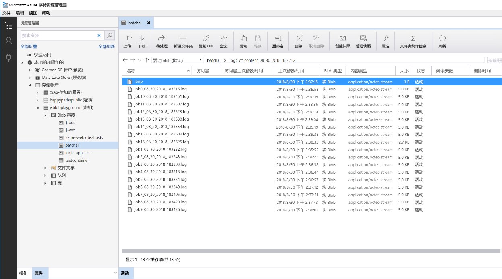

# Azure 上 Python 模型的批量评分

此参考体系结构演示如何生成一个可缩放的解决方案，以便使用 Azure Batch AI 按计划以并行方式对多个模型进行批量评分。 此解决方案可以用作模板并推广到不同的问题。

 [GitHub][github] 中提供了本体系结构的参考实现。

**场景**：此解决方案在 IoT 设置中监视大量设备的操作，而在该设置中，每个设备都会持续发送传感器读取内容。 假定每个设备都已预先训练异常情况检测模型，这些模型需要用来预测一系列已在预定义的时间间隔内进行聚合的度量是否对应于某个异常情况。 在实际场景中，这可能是传感器读取内容流，该流需要在筛选并聚合后才能用于训练或实时评分。 为了简单起见，解决方案使用的数据文件是执行评分作业时使用的文件。

## 体系结构

该体系结构包括以下组件：

[Azure 事件中心][event-hubs]。 此消息引入服务可以每秒引入数百万条事件消息。 在此体系结构中，传感器将数据流发送到事件中心。

[Azure 流分析][stream-analytics]。 一个事件处理引擎。 流分析作业从事件中心读取数据流，并执行流处理操作。

[Azure Batch AI][batch-ai]。 此分布式计算引擎用于在 Azure 中大规模训练和测试机器学习和 AI 模型。 Batch AI 通过自动缩放选项来按需创建虚拟机，该选项允许 Batch AI 群集中的每个节点针对特定的传感器运行评分作业。 评分的 Python [脚本][python-script]运行在 Docker 容器（此类容器在群集的每个节点上创建）中，可以在其中读取相关的传感器数据、生成预测并将其存储在 Blob 存储中。

[Azure Blob 存储][storage]。 Blob 容器用于存储预先训练的模型、数据和输出预测。 模型上传到 Blob 存储的 [create\_resources.ipynb][create-resources] 笔记本中。 这些[单类 SVM][one-class-svm] 模型进行训练时所使用的数据代表不同设备的不同传感器的值。 此解决方案假定数据值按固定的时间间隔聚合。

[Azure 逻辑应用][logic-apps]。 此解决方案创建一个按小时运行 Batch AI 作业的逻辑应用。 可以通过逻辑应用轻松地为解决方案创建运行时工作流和计划。 Batch AI 作业使用 Python [脚本][script]提交，该脚本也在 Docker 容器中运行。

[Azure 容器注册表][acr]。 Docker 映像在 Batch AI 和逻辑应用中使用，在 [create\_resources.ipynb][create-resources] 笔记本中创建，然后推送到容器注册表。 这样就可以通过其他 Azure 服务（此解决方案中的逻辑应用和 Batch AI）方便地托管映像并实例化容器。

## 性能注意事项

对于标准 Python 模型，仅使用 CPU 通常就足以处理工作负荷。 此体系结构使用 CPU。 但是，对于[深度学习工作负荷][deep]，GPU 通常会远远超出 CPU，通常需要相当大的 CPU 群集才可获得可比的性能。

### 跨 VM 和内核并行执行

以批处理模式运行许多模型的评分过程时，作业需跨 VM 实现并行化。 可使用两种方法：

* 使用低成本 VM 创建较大的群集。

* 使用高性能 VM 创建较小的群集，每个 VM 上提供的核心数较多。

通常情况下，为标准 Python 模型评分不像为深度学习模型评分那样苛刻，一个小的群集就可以有效地处理大量的排队模型。 可以在数据集大小增加时增加群集节点的数目。

在此方案中，为了方便起见，在单个 Batch AI 作业中提交一个评分任务。 不过，在同一 Batch AI 作业中为多个数据区块评分可能更有效。 在这些情况下，请编写自定义代码，以便在多个数据集中进行读取，并在执行单个 Batch AI 作业期间为这些数据集执行评分脚本。

### 文件服务器

使用 Batch AI 时，可根据场景所需的吞吐量选择多个存储选项。 对于吞吐量需求低的工作负载，使用 Blob 存储就足够了。 或者，Batch AI 还支持 [Batch AI 文件服务器][bai-file-server]（托管的单节点 NFS），可自动将其安装在群集节点上，为作业提供可集中访问的存储位置。 大多数情况下，一个工作区只需要一个文件服务器；可将训练作业的数据分为不同的目录。

如果单节点 NFS 不适用于工作负荷，Batch AI 会支持其他存储选项，包括 [Azure 文件][azure-files]和自定义解决方案，如 Gluster 或 Lustre 文件系统。

## 管理注意事项

### 监视 Batch AI 作业

监视正在运行的作业的进度很重要，但在活动节点群集间进行监视可能是一项挑战。 若要了解群集的整体状态，请转到 [Azure 门户][portal]的“Batch AI”边栏选项卡，检查群集中节点的状态。 如果节点处于非活动状态或作业失败，则错误日志将保存到 Blob 存储，并且还可在门户的“作业”边栏选项卡中访问。

若要进行内容更丰富的监视，请将日志连接到 [Application Insights][ai]，或通过运行单独的进程来轮询 Batch AI 群集及其作业的状态。

### Batch AI 中的日志记录

Batch AI 将所有 stdout/stderr 记录到关联的 Azure 存储帐户中。 若要轻松地导航日志文件，请使用 [Azure 存储资源管理器][explorer]等存储导航工具。

部署此参考体系结构时，可以选择设置更简单的日志记录系统。 使用此选项时，可以将不同作业中的所有日志保存到 Blob 容器中的同一目录中，如下所示。 使用这些日志可监视每个作业和每个图像处理所需的时间，以便更好地了解如何优化此过程。

## 成本注意事项

在此体系结构中使用的最昂贵组件是计算资源。

Batch AI 群集大小根据队列中的作业增加和减少。 可通过以下两种方式之一使用 Batch AI 启用[自动缩放][automatic-scaling]。 可通过编程方式执行此操作（可在[部署步骤][github]中的 .env 文件中进行配置），也可在创建群集后直接在门户中更改缩放公式。

对于无需立即处理的工作，可配置自动缩放公式，使默认状态（最小值）为零节点群集。 通过此配置，群集从零节点开始，仅在队列中检测到作业时才会增加。 如果批处理计分进程一天只进行几次或更少，则此设置可显著节约成本。

自动缩放可能不适用于彼此发生时间太接近的批处理作业。 群集启动和停止所需的时间也会产生成本，因此如果批工作负载在上一个作业结束后的几分钟内开始，则保持群集在作业之间运行可能更具成本效益。 这取决于评分过程是计划高频率运行（例如，每小时运行一次）还是低频率运行（例如，每月运行一次）。

## 部署解决方案

[GitHub][github] 中提供了本体系结构的参考实现。 按照其中的设置步骤生成一个可缩放的解决方案，以便使用 Batch AI 以并行方式对多个模型进行评分。

[acr]: /azure/container-registry/container-registry-intro
[ai]: /azure/application-insights/app-insights-overview
[automatic-scaling]: /azure/batch/batch-automatic-scaling
[azure-files]: /azure/storage/files/storage-files-introduction
[batch-ai]: /azure/batch-ai/
[bai-file-server]: /azure/batch-ai/resource-concepts#file-server
[create-resources]: https://github.com/Azure/BatchAIAnomalyDetection/blob/master/create_resources.ipynb
[deep]: /azure/architecture/reference-architectures/ai/batch-scoring-deep-learning
[event-hubs]: /azure/event-hubs/event-hubs-geo-dr
[explorer]: https://azure.microsoft.com/en-us/features/storage-explorer/
[github]: https://github.com/Azure/BatchAIAnomalyDetection
[logic-apps]: /azure/logic-apps/logic-apps-overview
[one-class-svm]: http://scikit-learn.org/stable/modules/generated/sklearn.svm.OneClassSVM.html
[portal]: https://portal.azure.com
[python-script]: https://github.com/Azure/BatchAIAnomalyDetection/blob/master/batchai/predict.py
[script]: https://github.com/Azure/BatchAIAnomalyDetection/blob/master/sched/submit_jobs.py
[storage]: /azure/storage/blobs/storage-blobs-overview
[stream-analytics]: /azure/stream-analytics/
