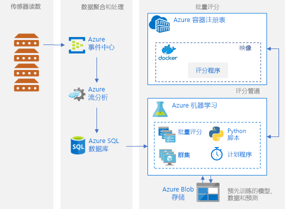

# Azure 上 Python 模型的批量评分

本参考体系结构演示如何生成一个可缩放的解决方案，以使用 Azure 机器学习服务按计划以并行方式对多个模型进行批量评分。 此解决方案可以用作模板并推广到不同的问题。

[GitHub][github] 中提供了本体系结构的参考实现。

**场景**：此解决方案在 IoT 设置中监视大量设备的操作，而在该设置中，每个设备都会持续发送传感器读取内容。 假设每个设备与预先训练的异常情况检测模型相关联，这些模型用于预测一系列已在预定义的时间间隔内进行聚合的度量是否对应于某种异常情况。 在实际场景中，这可能是传感器读取内容流，该流需要在筛选并聚合后才能用于训练或实时评分。 为简单起见，此解决方案使用的数据文件是执行评分作业时使用的文件。

本参考体系结构适用于按计划触发的工作负荷。 包括以下处理步骤：
1.  将要引入的传感器读数发送到 Azure 事件中心。
2.  执行流处理并存储原始数据。
3.  将数据发送到已准备好接管工作的机器学习群集。 群集中的每个节点针对特定的传感器运行评分作业。 
4.  执行评分管道，该管道使用机器学习 Python 脚本并行运行评分作业。 创建、发布管道，并将其计划为按预定义的时间间隔运行。
5.  生成预测结果，并将其存储在 Blob 存储中，以供日后使用。

## 体系结构

该体系结构包括以下组件：

[Azure 事件中心][event-hubs]。 此消息引入服务可以每秒引入数百万条事件消息。 在此体系结构中，传感器将数据流发送到事件中心。

[Azure 流分析][stream-analytics]。 一个事件处理引擎。 流分析作业从事件中心读取数据流，并执行流处理操作。

[Azure SQL 数据库][sql-database]。 传感器读数中的数据加载到 SQL 数据库中。 SQL 是众所周知的用于存储已处理的流式传输数据（表格式的结构化数据）的存储；但也可以使用其他数据存储。

[Azure 机器学习服务][amls]。 机器学习是用于大规模训练、评分、部署和管理机器学习模型的云服务。 在批量评分的上下文中，机器学习通过自动缩放选项来按需创建虚拟机群集，该群集中的每个节点针对特定的传感器运行评分作业。 评分作业以机器学习管理的排队 Python 脚本步骤的形式并行执行。 这些步骤是创建、发布并计划为按预定义的时间间隔运行的机器学习管道的一部分。

[Azure Blob 存储][storage]。 Blob 容器用于存储预先训练的模型、数据和输出预测。 模型上传到 Blob 存储的 [01_create_resources.ipynb][create-resources] 笔记本中。 这些[单类 SVM][one-class-svm] 模型进行训练时所使用的数据代表不同设备的不同传感器的值。 此解决方案假定数据值按固定的时间间隔聚合。

[Azure 容器注册表][acr]。 Python 评分[脚本][pyscript]在 Docker 容器（此类容器在群集的每个节点上创建）中运行，可在其中读取相关的传感器数据、生成预测并将其存储在 Blob 存储中。

## 性能注意事项

对于标准 Python 模型，仅使用 CPU 通常就足以处理工作负荷。 此体系结构使用 CPU。 但是，对于[深度学习工作负荷][deep]，GPU 通常会远远超出 CPU，通常需要相当大的 CPU 群集才可获得可比的性能。

### 跨 VM 和内核并行执行

以批处理模式运行许多模型的评分过程时，作业需跨 VM 实现并行化。 可使用两种方法：

* 使用低成本 VM 创建较大的群集。

* 使用高性能 VM 创建较小的群集，每个 VM 上提供的核心数较多。

通常情况下，为标准 Python 模型评分不像为深度学习模型评分那样苛刻，一个小的群集就可以有效地处理大量的排队模型。 可以在数据集大小增加时增加群集节点的数目。

在此方案中，为方便起见，将在单个机器学习管道步骤中提交一个评分任务。 不过，在同一管道步骤中为多个数据区块评分可能更有效。 在这种情况下，请编写自定义代码，以便在多个数据集中进行读取，并在执行单个步骤期间为这些数据集执行评分脚本。

## 管理注意事项

- **监视作业**。 监视正在运行的作业的进度很重要，但在活动节点群集间进行监视可能是一项挑战。 若要检查群集中节点的状态，请使用 [Azure 门户][portal]管理[机器学习工作区][ml-workspace]。 如果节点处于非活动状态或作业失败，则错误日志将保存到 Blob 存储，并且还可以在“管道”部分访问这些日志。 若要进行更全面的监视，请将日志连接到 [Application Insights][app-insights]，或运行单独的进程来轮询群集及其作业的状态。
-   **日志记录**。 机器学习服务将所有 stdout/stderr 记录到关联的 Azure 存储帐户中。 若要轻松查看日志文件，请使用 [Azure 存储资源管理器][explorer]等存储导航工具。

## 成本注意事项

在此体系结构中使用的最昂贵组件是计算资源。 计算群集大小根据队列中的作业增加和减少。 可以修改计算的预配配置，通过 Python SDK 以编程方式启用自动缩放。 或者使用 [Azure CLI][cli]设置群集的自动缩放参数。

对于无需立即处理的工作，可配置自动缩放公式，使默认状态（最小值）为零节点群集。 通过此配置，群集从零节点开始，仅在队列中检测到作业时才会增加。 如果批量评分进程一天只运行几次或更少，则此设置可大幅节省成本。

自动缩放可能不适用于彼此发生时间太接近的批处理作业。 群集启动和停止所需的时间也会产生成本，因此如果批处理工作负荷在上一个作业结束后的几分钟内开始，则保持群集在作业之间运行可能更具成本效益。 这取决于评分过程是计划高频率运行（例如，每小时运行一次）还是低频率运行（例如，每月运行一次）。

## 部署

若要部署这个用于参考的体系结构，请按照 [GitHub 存储库][github]中所述的步骤进行操作。

[acr]: /azure/container-registry/container-registry-intro
[ai]: /azure/application-insights/app-insights-overview
[aml-compute]: /azure/machine-learning/service/how-to-set-up-training-targets#amlcompute
[amls]: /azure/machine-learning/service/overview-what-is-azure-ml
[automatic-scaling]: /azure/batch/batch-automatic-scaling
[azure-files]: /azure/storage/files/storage-files-introduction
[cli]: https://docs.microsoft.com/en-us/cli/azure
[create-resources]: https://github.com/Microsoft/AMLBatchScoringPipeline/blob/master/01_create_resources.ipynb
[deep]: /azure/architecture/reference-architectures/ai/batch-scoring-deep-learning
[event-hubs]: /azure/event-hubs/event-hubs-geo-dr
[explorer]: https://azure.microsoft.com/en-us/features/storage-explorer/
[github]: https://github.com/Microsoft/AMLBatchScoringPipeline
[one-class-svm]: http://scikit-learn.org/stable/modules/generated/sklearn.svm.OneClassSVM.html
[portal]: https://portal.azure.com
[ml-workspace]: https://docs.microsoft.com/en-us/azure/machine-learning/studio/create-workspace
[python-script]: https://github.com/Azure/BatchAIAnomalyDetection/blob/master/batchai/predict.py
[pyscript]: https://github.com/Microsoft/AMLBatchScoringPipeline/blob/master/scripts/predict.py
[storage]: /azure/storage/blobs/storage-blobs-overview
[stream-analytics]: /azure/stream-analytics/
[sql-database]: https://docs.microsoft.com/en-us/azure/sql-database/
[app-insights]: https://docs.microsoft.com/en-us/azure/application-insights/app-insights-overview
