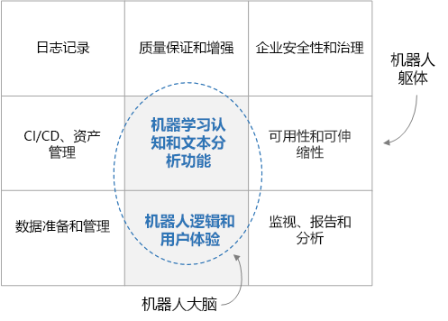

# 企业级聊天机器人

本参考体系结构介绍如何使用 [Azure Bot Framework][bot-framework] 生成企业级聊天机器人 (chatbot)。 机器人各不相同，但需要注意一些常见的模式、工作流和技术。 尤其是为企业工作负荷提供服务的机器人，除了核心功能以外，还需要考虑到许多的设计因素。 本文将介绍最基本的设计方面，以及生成可靠、安全且可主动学习的机器人所需的工具。

[![体系结构示意图][0]][0]

本体系结构中使用的最佳做法实用工具示例是完全开源的，并且已在 [GitHub][git-repo-base] 中提供。 

## 体系结构

此处所示的体系结构使用以下 Azure 服务。 你自己的机器人不一定要使用所有这些服务，有时可以整合其他服务。

### 机器人逻辑和用户体验

- **[Bot Framework Service][bot-framework-service]** (BFS)。 此服务将机器人连接到 Cortana、Facebook Messenger 或 Slack 等通信应用。 它可以简化机器人与用户之间的通信。
- **[Azure 应用服务][app-service]**。 机器人应用程序逻辑托管在 Azure 应用服务中。

### 机器人认知和智能

- **[语言理解][luis]** (LUIS)。 LUIS 属于 [Azure 认知服务][cognitive-services]，可让机器人通过识别用户意向和实体来理解自然语言。
- **[Azure 搜索][search]**。 搜索是提供可快速搜索的文档索引的托管服务。
- **[QnA Maker][qna-maker]**。 QnA Maker 是一种基于云的 API 服务，它创建基于数据的聊天式问答层。 通常，QnA Maker 连同 FAQ 等半结构化内容一起加载。 使用 QnA Maker 可以创建知识库来解答自然语言问题。
- **[Web 应用][webapp]**。 如果现有的服务不能提供机器人所需的 AI 解决方案，你可以实现自己的自定义 AI 并将其托管为 Web 应用。 这样，就可以提供一个 Web 终结点供机器人调用。

### 数据引入

机器人依赖于必须引入并准备好的原始数据。 请考虑使用以下任一选项来协调此过程：

- **[Azure 数据工厂][data-factory]**。 数据工厂可以协调和自动化数据的移动与转换。
- **[逻辑应用][logic-apps]**。 逻辑应用是一个无服务器平台，用于生成可以集成应用程序、数据和服务的工作流。 逻辑应用为许多应用程序（包括 Office 365）提供数据连接器。
- **[Azure Functions][functions]**。 使用 Azure Functions 可以编写自定义的无服务器代码供[触发器][functions-triggers]调用 &mdash; 例如，每次将文档添加到 Blob 存储或 Cosmos DB 时。

### 日志记录和监视

- **[Application Insights][app-insights]**。 使用 Application Insights 可以记录机器人的应用程序指标用于监视、诊断和分析目的。
- **[Azure Blob 存储][blob]**。 Blob 存储最适合存储巨量的非结构化数据。
- **[Cosmos DB][cosmosdb]**。 Cosmos DB 非常适合用于存储聊天等半结构化日志数据。
- **[Power BI][power-bi]**。 使用 Power BI 可为机器人创建监视仪表板。

### 安全和调控

- **[Azure Active Directory][aad]** (Azure AD)。 用户通过 Azure AD 等标识提供者进行身份验证。 机器人服务处理身份验证流和 OAuth 令牌管理。 请参阅[通过 Azure 机器人服务向机器人添加身份验证][bot-authentication]。
- **[Azure Key Vault][key-vault]**。 使用 Key Vault 存储凭据和其他机密。

### 质量保证和增强功能

- **[Azure DevOps][devops]**。 为应用管理提供许多服务，包括源代码管理、生成、测试、部署和项目跟踪。
- **[VS Code][vscode]** 用于开发应用的轻型代码编辑器。 也可以使用其他任何具有类似功能的 IDE。

## 设计注意事项

从较高层面讲，可将聊天机器人划分为机器人功能（“大脑”）和一组周边要求（“主体”）。 大脑包括领域识别组件，其中包括机器人逻辑和机器学习功能。 其他组件不具备领域知识，用于解决 CI/CD、质量保证和安全等非功能性要求。

在深入到本体系结构的细节之前，让我们先通过每个设计子组件了解数据流。 数据流包括用户发起的和系统发起的数据流。

### 用户消息流

“身份验证”。 用户首先使用机器人信道所提供的任何机制验证自己的身份。 机器人框架支持许多信道，包括 Cortana、Microsoft Teams、Facebook Messenger、Kik 和 Slack。 有关通道列表，请参阅[将机器人连接到通道](/azure/bot-service/bot-service-manage-channels)。 使用 Azure 机器人服务创建机器人时，会自动配置[网上聊天][webchat]通道。 用户可以在网页中使用此通道直接与机器人交互。 也可以使用 [Direct Line](/azure/bot-service/bot-service-channel-connect-directline) 通道将机器人连接到自定义应用。 用户的标识用于提供基于角色的访问控制，以及提供个性化内容。

**用户消息**。 完成身份验证后，用户向机器人发送消息。 机器人读取该消息，并将其路由到 [LUIS](/azure/cognitive-services/luis/) 等自然语言理解服务。 此步骤将获取**意向**（用户想要做什么）和**实体**（用户对哪些内容感兴趣）。 然后，机器人生成一个查询，该查询将传递给可提供信息的服务，例如，用于检索文档的 [Azure 搜索][search]、用于获取常见问题解答的 [QnA Maker](https://www.qnamaker.ai/)，或自定义的知识库。 机器人使用这些结果来构造响应。 若要为给定的查询提供最佳结果，机器人可能需要多次往返调用这些远程服务。

**响应**。 此时，机器人已确定最佳响应，可将其发送给用户。 如果最佳匹配解答的置信度评分较低，则响应可能是一个消除了歧义的问题，或者是机器人无法充分回复的确认。

**日志记录**。 收到用户请求或者发送响应后，应该连同外部服务返回的性能指标和常规错误，将所有聊天操作记录到日志记录存储。 以后在诊断问题和改善系统时，这些日志将很有用。

**反馈**。 另一项良好的做法是收集用户反馈和满意度评分。 作为跟进机器人最终响应的一种手段，机器人应该要求用户对回复给出满意度评分。 反馈有助于解决自然语言理解的冷启动问题，并可以持续改善响应的准确度。

### 系统数据流

**ETL**。 机器人依赖于后端 ETL 过程从原始数据中提取的信息和知识。 此数据可能是结构化的（SQL 数据库）、半结构化的（CRM 系统、FAQ）或非结构化的（Word 文档、PDF、Web 日志）。 ETL 子系统按固定的计划提取数据。 内容将会经过转换和扩充，然后载入 Cosmos DB 或 Azure Blob 存储等中间数据存储。

然后，中间存储中的数据将在 Azure 搜索中编制索引以方便检索文档，载入 QnA Maker 以创建问答对，或载入自定义 Web 应用进行非结构化文本处理。 这些数据还用于训练 LUIS 模型，以提取意向和实体。

**质量保证**。 聊天日志用于诊断和修复 bug、提供机器人用法见解，以及跟踪整体性能。 反馈数据可用于重新训练 AI 模型，以提高机器人的性能。

## 构建机器人

即使只是编写一行代码，在此之前，也必须编写功能规范，使开发团队清楚地知道机器人的预期用途是什么。 该规范应该包括一个相当全面的用户输入列表，以及预期机器人在多个知识领域方面提供的响应。 此活动文档可为机器人的开发和测试提供宝贵的指导。

### 引入数据

接下来确定数据源，使机器人能够以智能方式与用户交互。 如前所述，这些数据源可能包含结构化、半结构化或非结构化的数据集。 在开始时，良好的做法将数据一次性复制到 Cosmos DB 或 Azure 存储等中心存储。 在开发过程中，应该创建一个自动化数据引入管道来保持此数据的最新状态。 自动化引入管道的选项包括数据工厂、Functions 和逻辑应用。 根据所用的数据存储和架构，可以使用这些方法的组合。

在开始时，合理的做法是使用 Azure 门户手动创建 Azure 资源。 以后，应更多地考虑将这些资源的部署自动化。

### 核心机器人逻辑和用户体验

创建规范并引入一些数据后，可以开始将机器人付诸实现。 让我们专注于核心机器人逻辑。 这是用于处理用户聊天的代码，包括路由逻辑、消除歧义逻辑和日志记录。 首先熟悉 [Bot Framework][bot-framework]，包括：

- 该框架中使用的基本概念和术语，尤其是[聊天]、[轮次]和[活动]。
- [机器人连接器服务](/azure/bot-service/rest-api/bot-framework-rest-connector-quickstart)：用于处理机器人与通道之间的网络。
- 如何保留聊天[状态](/azure/bot-service/bot-builder-concept-state)：可以保存在内存中，不过，最好是保存在 Azure Blob 存储或 Azure Cosmos DB 等存储中。
- [中间件](/azure/bot-service/bot-builder-basics#middleware)，以及如何使用中间件将机器人挂接到认知服务等外部服务。

可以使用多个选项来丰富[用户体验](/azure/bot-service/bot-service-design-user-experience)。

- 可以使用[卡片](/azure/bot-service/bot-service-design-user-experience#cards)来包含按钮、图像、轮播和菜单。
- 机器人可以支持语音。
- 甚至可以在应用或网站中嵌入机器人，然后使用机器人所在的应用的功能。

若要开始，可以选择可用的 C# 和 Node.js 模板，使用 [Azure 机器人服务](/azure/bot-service/bot-service-quickstart)在线生成机器人。 但是，在机器人变得更复杂后，需要在本地创建机器人，然后将其部署到 Web。 选择 IDE（例如 Visual Studio 或 Visual Studio Code）和编程语言。 SDK 适用于以下语言：

- [C#](https://github.com/microsoft/botbuilder-dotnet)
- [JavaScript](https://github.com/microsoft/botbuilder-js)
- [Java](https://github.com/microsoft/botbuilder-java)（预览版）
- [Python](https://github.com/microsoft/botbuilder-python)（预览版）

首先，可以下载使用 Azure 机器人服务创建的机器人的源代码。 还可以查找简单聊天机器人或者与各种 AI 服务集成的复杂机器人的[示例代码](https://github.com/Microsoft/BotBuilder-Samples/blob/master/README.md)。

### 将智能添加到机器人

对于使用妥善定义的命令列表的简单机器人，可以使用基于规则的方法通过正则表达式分析用户输入。 确定性和可理解性是这种方法的优势。 但是，如果机器人需要理解其他自然语言消息的意向和实体，可以借助 AI 服务。

- LUIS 专用于理解用户意向和实体。 可以使用适度大小的相关[用户输入](/azure/cognitive-services/luis/luis-concept-utterance)集合与所需响应来训练机器人，然后它会返回用户给定消息的意向和实体。

- Azure 搜索可与 LUIS 一起工作。 使用搜索可以基于所有相关数据创建可搜索的索引。 机器人将在这些索引中查询 LUIS 提取的实体。 Azure 搜索还支持[同义词][synonyms]，这可以扩大正确单词映射的网络。

- QnA Maker 是可以返回给定问题的答案的另一个服务。 它通常是基于 FAQ 等半结构化数据训练的。

机器人可以使用其他 AI 服务来进一步丰富用户体验。 [预生成 AI 的认知服务套件](https://azure.microsoft.com/en-us/services/cognitive-services/?v=18.44a)服务（包括 LUIS 和 QnA Maker）为视觉、语音、语言、搜索和定位提供服务。 可以快速添加语言翻译、拼写检查、情绪分析、OCR、位置感知和内容审核等功能。 可以在机器人中将这些服务连接为中间件模块，以便以更自然、更智能的方式与用户交互。

另一种做法是集成自己的自定义 AI 服务。 这种方法更加复杂，但在机器学习算法、训练和模型方面能够全面提高灵活性。 例如，可以实现自己的主题建模，然后使用 [LDA][lda] 等算法来查找类似或相关的文档。 一种不错的方法是将自定义 AI 解决方案公开为 Web 服务终结点，然后从核心机器人逻辑调用该终结点。 Web 服务可以托管在应用服务或 VM 群集中。 [Azure 机器学习][aml]提供许多服务和库来帮助你[训练](https://github.com/Azure/MachineLearningNotebooks/tree/master/how-to-use-azureml/training)与[部署](https://github.com/Azure/MachineLearningNotebooks/tree/master/how-to-use-azureml/deployment)模型。

## 质量保证和增强功能

**日志记录**。 记录用户与机器人之间的聊天，包括基础性能指标和任何错误。 这些日志确实能够为调试问题、了解用户交互和改善系统提供宝贵的信息。 可以使用不同的数据存储来保存不同类型的日志。 例如，可以考虑使用 Application Insights 来保存 Web 日志、使用 Cosmos DB 保存聊天，使用 Azure 存储来保存大型有效负载。 请参阅[直接写入 Azure 存储][transcript-storage]。

**反馈**。 此外，必须了解用户对机器人交互的满意度。 如果记录了用户反馈，则可以使用此数据来专注于改善某些交互，并重新训练 AI 模型以提高性能。 使用反馈重新训练系统中的模型，例如 LUIS。

**测试**。 测试机器人涉及到单元测试、集成测试、回归测试和功能测试。 若要进行测试，我们建议 Azure 搜索或 QnA Maker 等外部服务提供的实际 HTTP 响应，以便在单元测试期间可以播放这些响应，而无需对外部服务发出实际的网络调用。

>[!NOTE]
> 若要在这些领域快速开始进行开发，请查看[适用于 JavaScript 的 Botbuilder 实用工具][git-repo-base]。 此存储库包含使用 [Microsoft Bot Framework v4][bot-framework] 生成的、运行 Node.js 的机器人的示例实用工具代码。 其中包括以下包：
>
> - [Cosmos DB 日志记录存储][cosmosdb-logger]。 演示如何在 Cosmos DB 中存储和查询机器人日志。
> - [Application Insights 日志记录存储][appinsights-logger]。 演示如何在 Application Insights 中存储和查询机器人日志。
> - [反馈集合中间件][feedback-util]。 提供机器人用户反馈-请求机制的示例中间件。
> - [HTTP 测试记录器][testing util]。 记录来自机器人外部服务的 HTTP 流量。 此包原生支持 LUIS、Azure 搜索和 QnAMaker，但同时提供了相应的扩展用于支持任何服务。 它可以帮助你自动完成机器人测试。
>
> 这些包以实用工具示例代码的形式提供，不保证提供支持或更新。

## 可用性注意事项

将新的功能或 bug 修复措施部署到机器人时，最好是使用多个部署环境，例如过渡和生产。 使用 [Azure DevOps][devops] 提供的部署[槽位][slots]可以在不停机的情况下实现此目的。 在将最新的升级交换到生产环境之前，可以在过渡环境中对其进行测试。 在处理负载方面，应用服务可让用户手动或自动进行纵向或横向扩展。 由于机器人托管在 Microsoft 的全球数据中心基础结构中，应用服务 SLA 可以承诺高可用性。

## 安全注意事项

与其他任何应用程序一样，机器人可以处理敏感数据。 因此，应限制谁可以登录和使用机器人。 此外，应该根据用户的标识或角色来限制可以访问的数据。 使用 Azure AD 进行标识和访问控制，并使用 Key Vault 来管理密钥和机密。

## 可管理性注意事项

### 监视和报告

在生产环境中运行机器人后，需要设立一个 DevOps 团队来保持这种状态。 持续监视系统，以确保机器人以峰值性能保持运行。 通过 Application Insights 本身、Power BI 或自定义 Web 应用仪表板，使用发送到 Application Insights 或 Cosmos DB 的日志创建监视仪表板。 如果发生严重错误或性能低于可接受的阈值，请将警报发送到 DevOps 团队。

### 自动化资源部署

机器人仅仅是某个较大系统的一部分，该系统为机器人提供最新的数据，并确保其正常运行。 必须部署其他所有 Azure 资源 &mdash; 业务流程服务（例如数据工厂）、存储服务（例如 Cosmos DB），等等。 Azure 资源管理器提供一致的管理层，可以通过 Azure 门户、PowerShell 或 Azure CLI 访问该层。 为获得速度和一致性优势，最好是使用以下方法之一将部署自动化。

### 持续机器人部署

可以直接从 IDE 或命令行（例如 Azure CLI）部署机器人逻辑。 但是，随着机器人的日趋成熟，最好是根据[设置持续部署](/azure/bot-service/bot-service-build-continuous-deployment)一文中所述，使用整合了 CI/CD 解决方案（例如 Azure DevOps）的持续部署过程。 这样，就可以很好地缓解在准生产环境中测试机器人新功能和修复措施时存在的冲突。 另外，一种不错的想法是创建多个部署环境，通常至少应该创建过渡和生产环境。 Azure DevOps 支持这种方法。

<!-- links -->

[0]: ./_images/conversational-bot.png
[aad]: /azure/active-directory/
[活动]: /azure/bot-service/rest-api/bot-framework-rest-connector-activities
[aml]: /azure/machine-learning/service/
[app-insights]: /azure/azure-monitor/app/app-insights-overview
[app-service]: /azure/app-service/
[blob]: /azure/storage/blobs/storage-blobs-introduction
[bot-authentication]: /azure/bot-service/bot-builder-authentication
[bot-framework]: https://dev.botframework.com/
[bot-framework-service]: /azure/bot-service/bot-builder-basics
[cognitive-services]: /azure/cognitive-services/welcome
[聊天]: /azure/bot-service/bot-service-design-conversation-flow
[cosmosdb]: /azure/cosmos-db/
[data-factory]: /azure/data-factory/
[data-factory-ref-arch]: ../data/enterprise-bi-adf.md
[devops]: https://azure.microsoft.com/solutions/devops/
[functions]: /azure/azure-functions/
[functions-triggers]: /azure/azure-functions/functions-triggers-bindings
[git-repo-appinsights-logger]: https://github.com/Microsoft/botbuilder-utils-js/tree/master/packages/botbuilder-transcript-app-insights
[git-repo-base]: https://github.com/Microsoft/botbuilder-utils-js
[git-repo-cosmosdb-logger]: https://github.com/Microsoft/botbuilder-utils-js/tree/master/packages/botbuilder-transcript-cosmosdb
[git-repo-feedback-util]: https://github.com/Microsoft/botbuilder-utils-js/tree/master/packages/botbuilder-feedback
[git-repo-testing-util]: https://github.com/Microsoft/botbuilder-utils-js/tree/master/packages/botbuilder-http-test-recorder
[testing-util]: https://github.com/Microsoft/botbuilder-utils-js/tree/master/packages/botbuilder-http-test-recorder
[key-vault]: /azure/key-vault/
[lda]: https://wikipedia.org/wiki/Latent_Dirichlet_allocation/
[logic-apps]: /azure/logic-apps/logic-apps-overview
[luis]: /azure/cognitive-services/luis/
[power-bi]: /power-bi/
[qna-maker]: /azure/cognitive-services/QnAMaker/
[search]: /azure/search/
[slots]: /azure/app-service/deploy-staging-slots/
[synonyms]: /azure/search/search-synonyms
[transcript-storage]: /azure/bot-service/bot-builder-howto-v4-storage
[轮次]: /azure/bot-service/bot-builder-basics#defining-a-turn
[vscode]: https://azure.microsoft.com/products/visual-studio-code/
[webapp]: /azure/app-service/overview
[webchat]: /azure/bot-service/bot-service-channel-connect-webchat?view=azure-bot-service-4.0/

[cosmosdb-logger]: https://github.com/Microsoft/botbuilder-utils-js/tree/master/packages/botbuilder-transcript-cosmosdb
[appinsights-logger]: https://github.com/Microsoft/botbuilder-utils-js/tree/master/packages/botbuilder-transcript-app-insights
[feedback-util]: https://github.com/Microsoft/botbuilder-utils-js/tree/master/packages/botbuilder-feedback
[testing util]: https://github.com/Microsoft/botbuilder-utils-js/tree/master/packages/botbuilder-http-test-recorder

