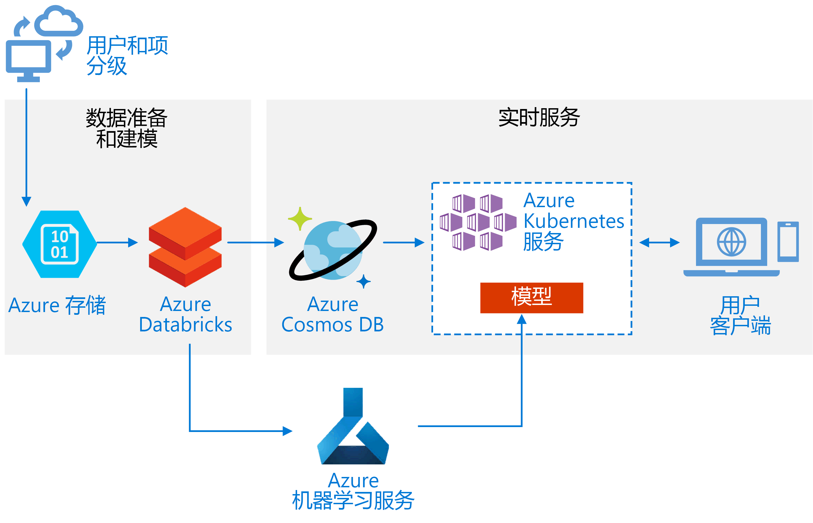
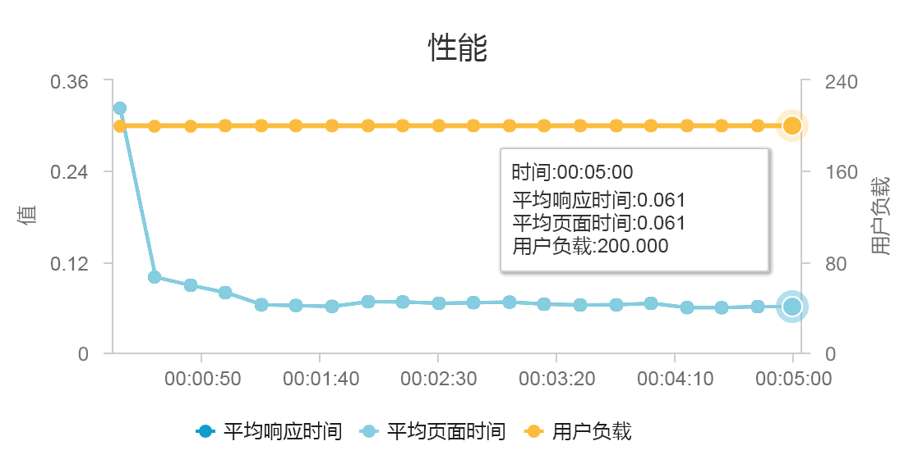
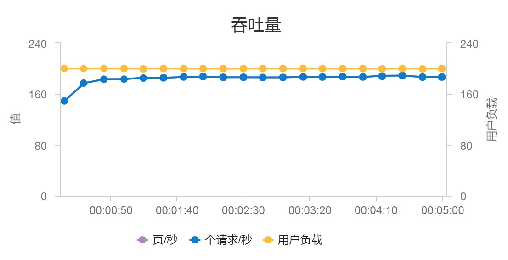

# 在 Azure 上生成实时建议 APIBuild a real-time recommendation API on Azure

本参考体系结构演示如何使用 Azure Databricks 训练一个建议模型，并使用 Azure Cosmos DB、Azure 机器学习和 Azure Kubernetes 服务 (AKS) 将其作为 API 部署。This reference architecture shows how to train a recommendation model using Azure Databricks and deploy it as an API by using Azure Cosmos DB, Azure Machine Learning, and Azure Kubernetes Service (AKS). 本体系结构可以通用于大多数建议引擎方案，包括针对产品、影片和新闻的建议。This architecture can be generalized for most recommendation engine scenarios, including recommendations for products, movies, and news.

[GitHub][als-example] 中提供了本体系结构的参考实现。A reference implementation for this architecture is available on [GitHub][als-example].

**场景**：一家媒体组织希望向其用户提供影片或视频建议。**Scenario**: A media organization wants to provide movie or video recommendations to its users. 通过提供个性化建议，组织可以满足多个业务目标，包括提高点击率、提高站点参与度以及提高用户满意度。By providing personalized recommendations, the organization meets several business goals, including increased click-through rates, increased engagement on site, and higher user satisfaction.

本参考体系结构用于训练和部署实时推荐器服务 API，以便为给定用户提供排名前 10 的影片的建议。This reference architecture is for training and deploying a real-time recommender service API that can provide the top 10 movie recommendations for a given user.

此建议模型的数据流如下：The data flow for this recommendation model is as follows:

1. 跟踪用户行为。Track user behaviors. 例如，后端服务可能会记录用户何时对影片进行了评分或单击了某个产品或某篇新闻文章。For example, a backend service might log when a user rates a movie or clicks a product or news article.

2. 从可用的[数据源][data-source]将数据加载到 Azure Databricks 中。Load the data into Azure Databricks from an available [data source][data-source].

3. 准备数据并将其拆分为训练集和测试集，以便训练模型。Prepare the data and split it into training and testing sets to train the model. （[此指南][guide]介绍拆分数据的选项。）([This guide][guide] describes options for splitting data.)

4. 根据数据对 [Spark 协作筛选][als]模型进行拟合。Fit the [Spark Collaborative Filtering][als] model to the data.

5. 使用评分和排名指标对模型质量进行评估。Evaluate the quality of the model using rating and ranking metrics. （[此指南][eval-guide]详细介绍了可以用来评估推荐器的指标。）([This guide][eval-guide] provides details about the metrics you can evaluate your recommender on.)

6. 按用户预先计算排名前 10 的建议，并在 Azure Cosmos DB 中将其作为缓存存储。Precompute the top 10 recommendations per user and store as a cache in Azure Cosmos DB.

7. 使用 Azure 机器学习 API 将 API 服务部署到 AKS，以便容器化和部署 API。Deploy an API service to AKS using the Azure Machine Learning APIs to containerize and deploy the API.

8. 当后端服务从用户获取请求时，请调用托管在 AKS 中的建议 API，以便获取排名前 10 的建议并将其显示给用户。When the backend service gets a request from a user, call the recommendations API hosted in AKS to get the top 10 recommendations and display them to the user.

## 体系结构Architecture

该体系结构包括以下组件：This architecture consists of the following components:

[Azure Databricks][databricks]。[Azure Databricks][databricks]. Databricks 是一个开发环境，用于在 Spark 群集上准备输入数据并训练推荐器模型。Databricks is a development environment used to prepare input data and train the recommender model on a Spark cluster. Azure Databricks 还提供一个交互式工作区，用于运行笔记本并在其上进行协作，以便执行数据处理或机器学习任务。Azure Databricks also provides an interactive workspace to run and collaborate on notebooks for any data processing or machine learning tasks.

[Azure Kubernetes 服务][aks] (AKS)。[Azure Kubernetes Service][aks] (AKS). AKS 用于在 Kubernetes 群集上部署机器学习模型服务 API 并使之可操作。AKS is used to deploy and operationalize a machine learning model service API on a Kubernetes cluster. AKS 托管容器化模型，提供符合吞吐量要求的可伸缩性，同时提供标识和访问管理以及日志记录和运行状况监视功能。AKS hosts the containerized model, providing scalability that meets your throughput requirements, identity and access management, and logging and health monitoring.

[Azure Cosmos DB][cosmosdb]。[Azure Cosmos DB][cosmosdb]. Cosmos DB 是一种全球分布式数据库服务，用于为每位用户存储排名前 10 的推荐影片。Cosmos DB is a globally distributed database service used to store the top 10 recommended movies for each user. Azure Cosmos DB 特别适合本方案，因为它的延迟低（99% 的情况下为 10 毫秒），可以为给定用户读取排名靠前的建议项。Azure Cosmos DB is well-suited for this scenario, because it provides low latency (10 ms at 99th percentile) to read the top recommended items for a given user.

[Azure 机器学习服务][mls]。[Azure Machine Learning Service][mls]. 此服务用于跟踪和管理机器学习模型，然后将这些模型打包并部署到可缩放的 AKS 环境。This service is used to track and manage machine learning models, and then package and deploy these models to a scalable AKS environment.

[Microsoft 推荐器][github]。[Microsoft Recommenders][github]. 此开源存储库包含实用程序代码和示例，有助于用户完成推荐器系统的生成、评估和可操作方面的入门。This open-source repository contains utility code and samples to help users get started in building, evaluating, and operationalizing a recommender system.

## 性能注意事项Performance considerations

性能是实时建议的主要考量，因为建议通常落在用户在站点上发出的请求的关键路径中。Performance is a primary consideration for real-time recommendations, because recommendations usually fall in the critical path of the request a user makes on your site.

将 AKS 和 Azure Cosmos DB 组合在一起以后，此体系结构就可以为中型工作负荷提供建议，其开销极小。The combination of AKS and Azure Cosmos DB enables this architecture to provide a good starting point to provide recommendations for a medium-sized workload with minimal overhead. 在进行 200 个并发用户的负载测试时，此体系结构可以在中等延迟（大约 60 毫秒）情况下提供建议，表现出的吞吐量为每秒 180 个请求。Under a load test with 200 concurrent users, this architecture provides recommendations at a median latency of about 60 ms and performs at a throughput of 180 requests per second. 负载测试是针对默认部署配置（一个 3x D3 v2 AKS 群集，包含 12 个 vCPU、42 GB 内存、11,000 [请求单元 (RU)/秒][ru]，针对 Azure Cosmos DB 进行预配）运行的。The load test was run against the default deployment configuration (a 3x D3 v2 AKS cluster with 12 vCPUs, 42 GB of memory, and 11,000 [Request Units (RUs) per second][ru] provisioned for Azure Cosmos DB).

建议使用 Azure Cosmos DB 是因为它的统包式全球分发功能，以及它可以用来满足应用的任何数据库要求。Azure Cosmos DB is recommended for its turnkey global distribution and usefulness in meeting any database requirements your app has. 可以考虑使用 [Azure Redis 缓存][redis]而不是 Azure Cosmos DB 来提供查找服务，这样可以稍微[降低延迟][latency]。For slightly [faster latency][latency], consider using [Azure Redis Cache][redis] instead of Azure Cosmos DB to serve lookups. 对于高度依赖后端存储中数据的系统，Redis 缓存可以改进其性能。Redis Cache can improve performance of systems that rely highly on data in back-end stores.

## 可伸缩性注意事项Scalability considerations

如果不打算使用 Spark，或者因工作负荷较小而不需要分发，则可考虑使用 [Data Science Virtual Machine][dsvm] (DSVM) 而不是 Azure Databricks。If you don't plan to use Spark, or you have a smaller workload where you don't need distribution, consider using [Data Science Virtual Machine][dsvm] (DSVM) instead of Azure Databricks. DSVM 是搭载有机器学习和数据科学深度学习框架和工具的 Azure 虚拟机。DSVM is an Azure virtual machine with deep learning frameworks and tools for machine learning and data science. 就像使用 Azure Databricks 一样，在 DSVM 中创建的任何模型都可以通过 Azure 机器学习作为 AKS 上的服务来操作。As with Azure Databricks, any model you create in a DSVM can be operationalized as a service on AKS via Azure Machine Learning.

在训练期间，请在 Azure Databricks 中预配一个较大的固定大小的 Spark 群集，或者配置[自动缩放][autoscaling]。During training, provision a larger fixed-size Spark cluster in Azure Databricks or configure [autoscaling][autoscaling]. 在启用自动缩放的情况下，Databricks 会监视群集上的负载，并根据需要进行纵向缩放。When autoscaling is enabled, Databricks monitors the load on your cluster and scales up and downs when required. 如果数据大，而你需要缩短数据准备或建模任务的完成时间，则可预配或横向扩展较大型的群集。Provision or scale out a larger cluster if you have a large data size and you want to reduce the amount of time it takes for data preparation or modeling tasks.

根据性能和吞吐量要求缩放 AKS 群集。Scale the AKS cluster to meet your performance and throughput requirements. 请谨慎地增加 [Pod][scale] 数以充分利用群集，并按服务需求缩放群集的[节点][nodes]。Take care to scale up the number of [pods][scale] to fully utilize the cluster, and to scale the [nodes][nodes] of the cluster to meet the demand of your service. 若要详细了解如何根据推荐器服务的性能和吞吐量要求来缩放群集，请参阅 [Scaling Azure Container Service Clusters][blog]（缩放 Azure 容器服务群集）。For more information on how to scale your cluster to meet the performance and throughput requirements of your recommender service, see [Scaling Azure Container Service Clusters][blog].

若要管理 Azure Cosmos DB 性能，请估算每秒所需的读取数，然后预配所需的 [RU/秒][ru]值（吞吐量）。To manage Azure Cosmos DB performance, estimate the number of reads required per second, and provision the number of [RUs per second][ru] (throughput) needed. 使用最佳做法进行[分区和水平缩放][partition-data]。Use best practices for [partitioning and horizontal scaling][partition-data].

## 成本注意事项Cost considerations

此方案中的主要成本动因包括：The main drivers of cost in this scenario are:

- 训练所需的 Azure Databricks 群集大小。The Azure Databricks cluster size required for training.
- 满足性能要求所需的 AKS 群集大小。The AKS cluster size required to meet your performance requirements.
- 根据性能要求预配的 Azure Cosmos DB RU。Azure Cosmos DB RUs provisioned to meet your performance requirements.

通过降低重新训练的频率以及在 Spark 群集不使用的情况下将其关闭，对 Azure Databricks 成本进行管理。Manage the Azure Databricks costs by retraining less frequently and turning off the Spark cluster when not in use. AKS 和 Azure Cosmos DB 的成本与站点所需的吞吐量和性能相关，并且会根据入站流量上下浮动。The AKS and Azure Cosmos DB costs are tied to the throughput and performance required by your site and will scale up and down depending on the volume of traffic to your site.

## 部署解决方案Deploy the solution

若要部署此体系结构，请按照**Azure Databricks**中的说明[安装程序文档][setup]。To deploy this architecture, follow the **Azure Databricks** instructions in the [setup document][setup]. 简单地说，说明要求你：Briefly, the instructions require you to:

1. 创建 [Azure Databricks 工作区][workspace]。Create an [Azure Databricks workspace][workspace].

1. 使用 Azure Databricks 中的以下配置创建新的群集：Create a new cluster with the following configuration in Azure Databricks:

    - 群集模式：标准Cluster mode: Standard
    - Databricks 运行时版本：4.3 （包括 Apache Spark 2.3.1 版 Scala 2.11）Databricks Runtime Version: 4.3 (includes Apache Spark 2.3.1, Scala 2.11)
    - Python 版本：3Python Version: 3
    - 驱动程序类型：Standard\_DS3\_v2Driver Type: Standard\_DS3\_v2
    - 辅助进程类型：Standard\_DS3\_v2（视需要选择最小值和最大值）Worker Type: Standard\_DS3\_v2 (min and max as required)
    - 自动终止：（视需要进行选择）Auto Termination: (as required)
    - Spark 配置：（视需要进行选择）Spark Config: (as required)
    - 环境变量：（视需要进行选择）Environment Variables: (as required)

1. 创建个人访问令牌内的[Azure Databricks 工作区][workspace]。Create a personal access token within the [Azure Databricks workspace][workspace]. 请参阅 Azure Databricks 身份验证[文档][ adbauthentication]有关详细信息。See the Azure Databricks authentication [documentation][adbauthentication] for details.

1. 克隆[Microsoft 建议者][ github]存储库到环境下都无法执行脚本 （例如在本地计算机）。Clone the [Microsoft Recommenders][github] repository into an environment where you can execute scripts (e.g. your local computer).

1. 请按照**快速安装**设置为说明[安装相关的库][ setup] Azure Databricks 上。Follow the **Quick install** setup instructions to [install the relevant libraries][setup] on Azure Databricks.

1. 请按照**快速安装**设置为说明[准备操作化的 Azure Databricks][setupo16n]。Follow the **Quick install** setup instructions to [prepare Azure Databricks for operationalization][setupo16n].

1. 导入[ALS 电影操作化 notebook] [ als-example]到你的工作区。Import the [ALS Movie Operationalization notebook][als-example] into your workspace. 登录到 Azure Databricks 工作区后，请执行以下操作：After logging into your Azure Databricks Workspace, do the following:

    a.a. 单击**主页**在工作区的左侧。Click **Home** on the left side of the workspace.

    b.b. 右键单击主目录中的空白区域。Right-click on white space in your home directory. 选择“导入”。Select **Import**.

    c.c. 选择**URL**，并粘贴到文本字段的以下： `https://github.com/Microsoft/Recommenders/blob/master/notebooks/05_operationalize/als_movie_o16n.ipynb`Select **URL**, and paste the following into the text field: `https://github.com/Microsoft/Recommenders/blob/master/notebooks/05_operationalize/als_movie_o16n.ipynb`

    d.d. 单击“导入”。Click **Import**.

1. 打开在 Azure Databricks notebook，并附加配置的群集。Open the notebook within Azure Databricks and attach the configured cluster.

1. 运行 notebook 创建创建建议 API 所需的 Azure 资源提供的、 给定用户的前 10 个电影建议。Run the notebook to create the Azure resources required to create a recommendation API that provides the top-10 movie recommendations for a given user.

## 相关体系结构Related architectures

我们还构建了使用 Spark 和 Azure Databricks 执行计划[批处理计分流程][batch-scoring]的参考体系结构。We have also built a reference architecture that uses Spark and Azure Databricks to execute scheduled [batch-scoring processes][batch-scoring]. 请参阅该参考体系结构，以了解推荐用于定期生成新建议的推荐方法。See that reference architecture to understand a recommended approach for generating new recommendations routinely.

<!-- links -->
[aci]: /azure/container-instances/container-instances-overview
[aad]: /azure/active-directory-b2c/active-directory-b2c-overview
[adbauthentication]: https://docs.azuredatabricks.net/api/latest/authentication.html#generate-a-token
[aks]: /azure/aks/intro-kubernetes
[als]: https://spark.apache.org/docs/latest/ml-collaborative-filtering.html
[als-example]: https://github.com/Microsoft/Recommenders/blob/master/notebooks/05_operationalize/als_movie_o16n.ipynb
[autoscaling]: https://docs.azuredatabricks.net/user-guide/clusters/sizing.html
[autoscale]: https://docs.azuredatabricks.net/user-guide/clusters/sizing.html#autoscaling
[availability]: /azure/architecture/checklist/availability
[batch-scoring]: /azure/architecture/reference-architectures/ai/batch-scoring-databricks
[blob]: /azure/storage/blobs/storage-blobs-introduction
[blog]: https://blogs.technet.microsoft.com/machinelearning/2018/03/20/scaling-azure-container-service-cluster/
[clusters]: https://docs.azuredatabricks.net/user-guide/clusters/configure.html
[cosmosdb]: /azure/cosmos-db/introduction
[data-source]: https://docs.azuredatabricks.net/spark/latest/data-sources/index.html
[databricks]: /azure/azure-databricks/what-is-azure-databricks
[dsvm]: /azure/machine-learning/data-science-virtual-machine/overview
[dsvm-ubuntu]: /azure/machine-learning/data-science-virtual-machine/dsvm-ubuntu-intro
[eval-guide]: https://github.com/Microsoft/Recommenders/blob/master/notebooks/03_evaluate/evaluation.ipynb
[free]: https://azure.microsoft.com/free/?WT.mc_id=A261C142F
[github]: https://github.com/Microsoft/Recommenders
[guide]: https://github.com/Microsoft/Recommenders/blob/master/notebooks/01_prepare_data/data_split.ipynb
[latency]: https://github.com/jessebenson/azure-performance
[mls]: /azure/machine-learning/service/
[n-tier]: /azure/architecture/reference-architectures/n-tier/n-tier-cassandra
[ndcg]: https://en.wikipedia.org/wiki/Discounted_cumulative_gain
[nodes]: /azure/aks/scale-cluster
[notebook]: https://github.com/Microsoft/Recommenders/notebooks/00_quick_start/als_pyspark_movielens.ipynb
[partition-data]: /azure/cosmos-db/partition-data
[redis]: /azure/redis-cache/cache-overview
[regions]: https://azure.microsoft.com/global-infrastructure/services/?products=virtual-machines&regions=all
[resiliency]: /azure/architecture/resiliency/
[ru]: /azure/cosmos-db/request-units
[sec-docs]: /azure/security/
[setup]: https://github.com/Microsoft/Recommenders/blob/master/SETUP.md#repository-installation
[setupo16n]: https://github.com/Microsoft/Recommenders/blob/master/SETUP.md#prepare-azure-databricks-for-operationalization
[scale]: /azure/aks/tutorial-kubernetes-scale
[sla]: https://azure.microsoft.com/support/legal/sla/virtual-machines/v1_8/
[vm-size]: /azure/virtual-machines/virtual-machines-linux-change-vm-size
[workspace]: https://docs.azuredatabricks.net/getting-started/index.html
