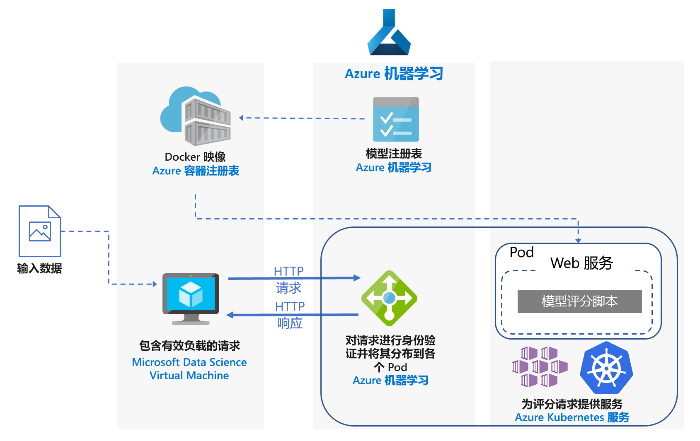
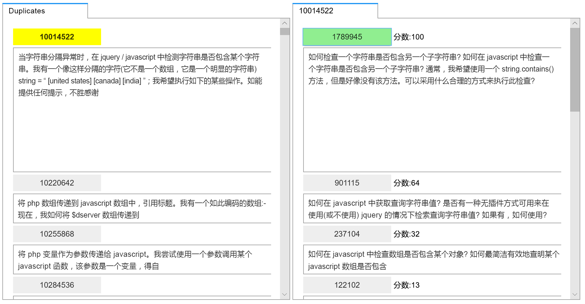
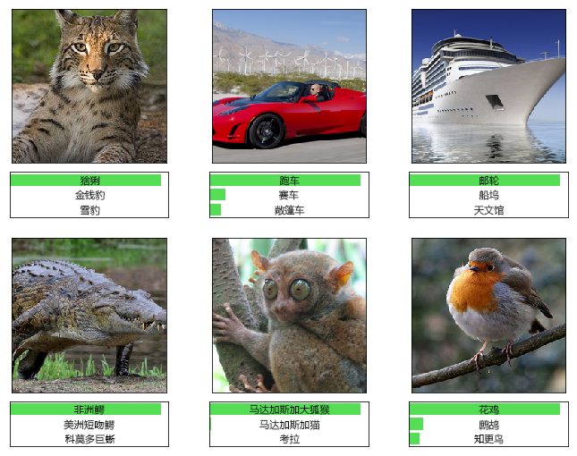

# Azure 上 Python Scikit-Learn 和深度学习模型的实时评分Real-time scoring of Python Scikit-Learn and Deep Learning Models on Azure

本参考体系结构演示如何将 Python 模型部署为 Web 服务用于进行实时预测。This reference architecture shows how to deploy Python models as web services to make real-time predictions. 将介绍两种方案：部署常规 Python 模型，以及部署深度学习模型所要满足的具体要求。Two scenarios are covered: deploying regular Python models, and the specific requirements of deploying deep learning models. 这两种方案都使用下面所示的体系结构。Both scenarios use the architecture shown.

GitHub 上提供了本体系结构的两种参考实现，一个适用于[常规 Python 模型][github-python]，另一个适用于[深度学习模型][github-dl]。Two reference implementations for this architecture are available on GitHub, one for [regular Python models][github-python] and one for [deep learning models][github-dl].

## 方案Scenarios

参考实现演示使用本体系结构的两种方案。The reference implementations demonstrate two scenarios using this architecture.

**方案 1：常见问题匹配**。**Scenario 1: FAQ matching**. 此方案演示如何将常见问题 (FAQ) 匹配模型部署为 Web 服务，用于对用户的问题提供预测。This scenario shows how to deploy a frequently asked questions (FAQ) matching model as a web service to provide predictions for user questions. 对于此方案，体系结构示意图中的“输入数据”是指包含要与 FAQ 列表匹配的用户问题的文本字符串。For this scenario, "Input Data" in the architecture diagram refers to text strings containing user questions to match with a list of FAQs. 此方案是针对适用于 Python 的 [scikit-learn][scikit] 机器学习库设计的，但可通用化为使用 Python 模型进行实时预测的任何方案。This scenario is designed for the [scikit-learn][scikit] machine learning library for Python, but can be generalized to any scenario that uses Python models to make real-time predictions.

此方案使用堆栈溢出问题数据的子集，其中包括标记为 JavaScript 的原始问题、其重复问题及其答案。This scenario uses a subset of Stack Overflow question data that includes original questions tagged as JavaScript, their duplicate questions, and their answers. 此方案训练某个 scikit-learn 管道来预测某个重复问题与每个原始问题匹配的概率。It trains a scikit-learn pipeline to predict the match probability of a duplicate question with each of the original questions. 这些预测是使用 REST API 终结点实时做出的。These predictions are made in real time using a REST API  endpoint.

本体系结构的应用程序流如下：The application flow for this architecture is as follows:

1.  客户端发送包含已编码问题数据的 HTTP POST 请求。The client sends an HTTP POST request with the encoded question data.

2.  Flask 应用从请求中提取问题。The Flask app extracts the question from the request.

3.  将问题发送到 scikit-learn 管道模型进行特征化和评分。The question is sent to the scikit-learn pipeline model for featurization and scoring.

4.  通过管道将匹配的 FAQ 问题及其评分传递给 JSON 对象，并将其返回给客户端。The matching FAQ questions with their scores are piped into a JSON object and returned to the client.

下面是使用结果的示例应用的屏幕截图：Here is a screenshot of the example app that consumes the results:

**方案 2：图像分类**。**Scenario 2: Image classification.** 此方案演示如何将卷积神经网络 (CNN) 模型部署为 Web 服务，以基于图像提供预测。This scenario shows how to deploy a Convolutional Neural Network (CNN) model as a web service to provide predictions on images. 对于此方案，体系结构示意图中的“输入数据”指图像文件。For this scenario, "Input Data" in the architecture diagram refers to image files. 在计算机视觉领域，CNN 对图像分类和对象检测等任务非常有效。CNNs are very effective in computer vision for tasks such as image classification and object detection. 此方案是针对 TensorFlow、Keras（具有 TensorFlow 后端）和 PyTorch 等框架设计的。This scenario is designed for the frameworks TensorFlow, Keras (with the TensorFlow back end), and PyTorch. 但是，它可以通用化为使用深度学习模型进行实时预测的任何方案。However, it can be generalized to any scenario that uses deep learning models to make real-time predictions.

此方案使用基于 ImageNet-1K（1,000 个类）数据集预先训练的 ResNet-152 模型来预测某个图像属于哪些类别（参阅下图）。This scenario uses a pre-trained ResNet-152 model trained on ImageNet-1K (1,000 classes) dataset to predict which category (see figure below) an image belongs to. 这些预测是使用 REST API 终结点实时做出的。These predictions are made in real time using a REST API endpoint.

深度学习模型的应用程序流如下：The application flow for the deep learning model is as follows:

1.  客户端发送包含已编码图像数据的 HTTP POST 请求。The client sends an HTTP POST request with the encoded image data.

2.  Flask 应用从请求中提取图像。The Flask app extracts the image from the request.

3.  预处理图像，并将其发送到模型进行评分。The image is preprocessed and sent to the model for scoring.

4.  通过管道将评分结果传递给 JSON 对象，并将其返回给客户端。The scoring result is piped into a JSON object and returned to the client.

## 体系结构Architecture

该体系结构包括以下组件。This architecture consists of the following components.

**[虚拟机][vm]** (VM)。**[Virtual machine][vm]** (VM). VM 显示为本地或云中的设备示例，它可以发送 HTTP 请求。The VM is shown as an example of a device &mdash; local or in the cloud &mdash; that can send an HTTP request.

**[Azure Kubernetes 服务][aks]** (AKS) 用于在 Kubernetes 群集上部署应用程序。**[Azure Kubernetes Service][aks]** (AKS) is used to deploy the application on a Kubernetes cluster. AKS 简化了 Kubernetes 的部署和操作。AKS simplifies the deployment and operations of Kubernetes. 可以使用仅有 CPU 的 VM 为常规 Python 模型配置群集，或使用支持 GPU 的 VM 为深度学习模型配置群集。The cluster can be configured using CPU-only VMs for regular Python models or GPU-enabled VMs for deep learning models.

**[负载均衡器][lb]**。**[Load balancer][lb]**. AKS 预配的负载均衡器用于在外部公开服务。A load balancer, provisioned by AKS, is used to expose the service externally. 来自负载均衡器的流量将定向到后端 pod。Traffic from the load balancer is directed to the back-end pods.

**[Docker 中心][docker]** 用于存储 Kubernetes 群集中部署的 Docker 映像。**[Docker Hub][docker]** is used to store the Docker image that is deployed on Kubernetes cluster. 之所以为本体系结构选择 Docker 中心，是因为它易于使用，并且是 Docker 用户的默认映像存储库。Docker Hub was chosen for this architecture because it's easy to use and is the default image repository for Docker users. 也可以对本体系结构使用 [Azure 容器注册表][acr]。[Azure Container Registry][acr] can also be used for this architecture.

## 性能注意事项Performance considerations

对于实时评分体系结构，吞吐量性能是首要考虑因素。For real-time scoring architectures, throughput performance becomes a dominant consideration. 对于常规 Python 模型，仅使用 CPU 通常就足以处理工作负荷。For regular Python models, it's generally accepted that CPUs are sufficient to handle the workload. 

但是，对于深度学习工作负荷，如果速度是一个瓶颈，则可以使用 GPU，因为它的[性能][gpus-vs-cpus]通常优于 CPU。However for deep learning workloads, when speed is a bottleneck, GPUs generally provide better [performance][gpus-vs-cpus] compared to CPUs. 若要在使用 CPU 的情况下获得相当于 GPU 的性能，通常一个具有需要大量 CPU 的群集。To match GPU performance using CPUs, a cluster with large number of CPUs is usually needed.

可在任一方案中对本体系结构使用 CPU，但对于深度学习模型，GPU 提供的吞吐量值明显高于 CPU 群集，而且成本类似。You can use CPUs for this architecture in either scenario, but for deep learning models, GPUs provide significantly higher throughput values compared to a CPU cluster of similar cost. AKS 支持使用 GPU，这是对本体系结构使用 AKS 的一个优势。AKS supports the use of GPUs, which is one advantage of using AKS for this architecture. 另外，深度学习部署通常使用具有大量参数的模型。Also, deep learning deployments typically use models with a high number of parameters. 使用 GPU 可以防止模型与 Web 服务之间发生资源争用，这在仅用 CPU 的部署中是一个问题。Using GPUs prevents contention for resources between the model and the web service, which is an issue in CPU-only deployments.

## 可伸缩性注意事项Scalability considerations

对于 AKS 群集是使用仅有 CPU 的 VM 预配的常规 Python 模型，在[扩展 pod 数][manually-scale-pods]时请小心。For regular Python models, where AKS cluster is provisioned with CPU-only VMs, take care when [scaling out the number of pods][manually-scale-pods]. 目标是充分利用群集。The goal is to fully utilize the cluster. 缩放取决于为 pod 定义的 CPU 请求和限制。Scaling depends on the CPU requests and limits defined for the pods. Kubernetes 还支持 pod 的[自动缩放][autoscale-pods]，以根据 CPU 利用率或其他选择指标调整部署中的 pod 数。Kubernetes also supports [autoscaling][autoscale-pods] of the pods to adjust the number of pods in a deployment depending on CPU utilization or other select metrics. [群集自动缩放程序][autoscaler]（预览版）可以根据等待中的 pod 缩放代理节点。The [cluster autoscaler][autoscaler] (in preview) can scale agent nodes based on pending pods.

对于使用支持 GPU 的 VM 的深入学习方案，pod 的资源限制方式是将一个 GPU 分配给一个 pod。For deep learning scenarios, using GPU-enabled VMs, resource limits on pods are such that one GPU is assigned to one pod. 根据所用的 VM 类型，必须[缩放群集的节点][scale-cluster]来满足服务的需求。Depending on the type of VM used, you must [scale the nodes of the cluster][scale-cluster] to meet the demand for the service. 可以使用 Azure CLI 和 kubectl 轻松实现此目的。You can do this easily using the Azure CLI and kubectl.

## 监视和日志记录注意事项Monitoring and logging considerations

### AKS 监视AKS monitoring

若要洞察 AKS 性能，请使用[用于容器的 Azure Monitor][monitor-containers] 功能。For visibility into AKS performance, use the [Azure Monitor for containers][monitor-containers] feature. 此服务通过指标 API 从 Kubernetes 中提供的控制器、节点和容器收集内存与处理器指标。It collects memory and processor metrics from controllers, nodes, and containers that are available in Kubernetes through the Metrics API.

部署应用程序时，请监视 AKS 群集，以确保它按预期方式工作、所有节点都正常运行，并且所有 pod 都在运行。While deploying your application, monitor the AKS cluster to make sure it's working as expected, all the nodes are operational, and all pods are running. 尽管你可以使用 [kubectl][kubectl] 命令行工具来检索 pod 状态，但 Kubernetes 还包含一个 Web 仪表板，用于进行基本的群集状态监视和管理。Although you can use the [kubectl][kubectl] command-line tool to retrieve pod status, Kubernetes also includes a web dashboard for basic monitoring of the cluster status and management.

若要查看群集和节点的总体状态，请转到 Kubernetes 仪表板的“节点”部分。To see the overall state of the cluster and nodes, go to the **Nodes** section of the Kubernetes dashboard. 如果某个节点处于非活动状态或发生故障，可以在该页中显示错误日志。If a node is inactive or has failed, you can display the error logs from that page. 同样，转到“Pod”和“部署”部分可获取有关 pod 数目和部署状态的信息。Similarly, go to the **Pods** and **Deployments** sections for information about the number of pods and status of your deployment.

### AKS 日志AKS logs 

AKS 自动将所有 stdout/stderr 记录到群集中 pod 的日志。AKS automatically logs all stdout/stderr to the logs of the pods in the cluster. 使用 kubectl 可查看这些日志，以及节点级别的事件和日志。Use kubectl to see these and also node-level events and logs. 有关详细信息，请参阅部署步骤。For details, see the deployment steps.

使用[用于容器的 Azure Monitor][monitor-containers] 通过适用于 Linux 的 Log Analytics 代理的容器化版本，来收集存储在 Log Analytics 工作区中的指标和日志。Use [Azure Monitor for containers][monitor-containers] to collect metrics and logs through a containerized version of the Log Analytics agent for Linux, which is stored in your Log Analytics workspace.

## 安全注意事项Security considerations

使用 [Azure 安全中心][security-center]可在一个中心视图中获得 Azure 资源的安全状态。Use [Azure Security Center][security-center] to get a central view of the security state of your Azure resources. 安全中心会监视潜在的安全问题并全面描述部署的安全运行状况，不过，它不会监视 AKS 代理节点。Security Center monitors potential security issues and provides a comprehensive picture of the security health of your deployment, although it doesn't monitor AKS agent nodes. 安全中心针对每个 Azure 订阅进行配置。Security Center is configured per Azure subscription. 根据[将 Azure 订阅载入安全中心标准版][get-started]中所述启用安全数据收集。Enable security data collection as described in [Onboard your Azure subscription to Security Center Standard][get-started]. 启用数据收集后，安全中心会自动扫描该订阅下创建的所有 VM。When data collection is enabled, Security Center automatically scans any VMs created under that subscription.

**操作**。**Operations**. 若要使用 Azure Active Directory (Azure AD) 身份验证令牌登录到 AKS 群集，请将 AKS 配置为使用 Azure AD 进行[用户身份验证][aad-auth]。To sign in to an AKS cluster using your Azure Active Directory (Azure AD) authentication token, configure AKS to use Azure AD for [user authentication][aad-auth]. 群集管理员还可以根据用户标识或目录组成员身份来配置 Kubernetes 基于角色的访问控制 (RBAC)。Cluster administrators can also configure Kubernetes role-based access control (RBAC) based on a user's identity or directory group membership.

使用 [RBAC][rbac] 控制对已部署的 Azure 资源的访问。Use [RBAC][rbac] to control access to the Azure resources that you deploy. RBAC 允许将授权角色分配给开发运营团队的成员。RBAC lets you assign authorization roles to members of your DevOps team. 可将一个用户分配到多个角色，并且可以创建自定义角色以实现更细化的[权限]。A user can be assigned to multiple roles, and you can create custom roles for even more fine-grained [permissions].

**HTTPS**。**HTTPS**. 作为安全最佳做法，应用程序应强制实施 HTTPS 并重定向 HTTP 请求。As a security best practice, the application should enforce HTTPS and redirect HTTP requests. 使用[入口控制器][ingress-controller]部署一个反向代理，用于终止 SSL 并重定向 HTTP 请求。Use an [ingress controller][ingress-controller] to deploy a reverse proxy that terminates SSL and redirects HTTP requests. 有关详细信息，请参阅[在 Azure Kubernetes 服务 (AKS) 中创建 HTTPS 入口控制器][https-ingress]。For more information, see [Create an HTTPS ingress controller on Azure Kubernetes Service (AKS)][https-ingress].

“身份验证”。**Authentication**. 此解决方案不限制对终结点的访问。This solution doesn't restrict access to the endpoints. 若要在企业设置中部署本体系结构，请通过 API 密钥保护终结点，并将某种形式的用户身份验证添加到客户端应用程序。To deploy the architecture in an enterprise setting, secure the endpoints through API keys and add some form of user authentication to the client application.

**容器注册表**。**Container registry**. 此解决方案使用公共注册表来存储 Docker 映像。This solution uses a public registry to store the Docker image. 应用程序依赖的代码以及模型将包含在此映像中。The code that the application depends on, and the model, are contained within this image. 企业应用程序应使用专用注册表来帮助防范运行恶意代码以及容器中的信息泄密。Enterprise applications should use a private registry to help guard against running malicious code and to help keep the information inside the container from being compromised.

**DDOS 防护**。**DDoS protection**. 考虑启用 [DDoS 防护标准版][ddos]。Consider enabling [DDoS Protection Standard][ddos]. 尽管基本 DDoS 防护已作为 Azure 平台的一部分启用，但 DDoS 防护标准版提供专门针对 Azure 虚拟网络资源优化的缓解功能。Although basic DDoS protection is enabled as part of the Azure platform, DDoS Protection Standard provides mitigation capabilities that are tuned specifically to Azure virtual network resources.

**日志记录**。**Logging**. 在存储日志数据之前采用最佳做法，例如，清理可能被用来实施安全欺诈行为的用户密码和其他信息。Use best practices before storing log data, such as scrubbing user passwords and other information that could be used to commit security fraud.

## 部署Deployment

若要部署本参考体系结构，请遵循 GitHub 存储库中所述的步骤：To deploy this reference architecture, follow the steps described in the GitHub repos: 

  - [常规 Python 模型][github-python][Regular Python models][github-python]
  - [深度学习模型][github-dl][Deep learning models][github-dl]

[aad-auth]: /azure/aks/aad-integration
[acr]: /azure/container-registry/
[something]: https://kubernetes.io/docs/reference/access-authn-authz/authentication/
[aks]: /azure/aks/intro-kubernetes
[autoscaler]: /azure/aks/autoscaler
[autoscale-pods]: /azure/aks/tutorial-kubernetes-scale#autoscale-pods
[azcopy]: /azure/storage/common/storage-use-azcopy-linux
[ddos]: /azure/virtual-network/ddos-protection-overview
[docker]: https://hub.docker.com/
[get-started]: /azure/security-center/security-center-get-started
[github-python]: https://github.com/Azure/MLAKSDeployment
[github-dl]: https://github.com/Microsoft/AKSDeploymentTutorial
[gpus-vs-cpus]: https://azure.microsoft.com/en-us/blog/gpus-vs-cpus-for-deployment-of-deep-learning-models/
[https-ingress]: /azure/aks/ingress-tls
[ingress-controller]: https://kubernetes.io/docs/concepts/services-networking/ingress/
[kubectl]: https://kubernetes.io/docs/tasks/tools/install-kubectl/
[lb]: /azure/load-balancer/load-balancer-overview
[manually-scale-pods]: /azure/aks/tutorial-kubernetes-scale#manually-scale-pods
[monitor-containers]: /azure/monitoring/monitoring-container-insights-overview
[权限]: /azure/aks/concepts-identity
[permissions]: /azure/aks/concepts-identity
[rbac]: /azure/active-directory/role-based-access-control-what-is
[scale-cluster]: /azure/aks/scale-cluster
[scikit]: https://pypi.org/project/scikit-learn/
[security-center]: /azure/security-center/security-center-intro
[vm]: /azure/virtual-machines/

