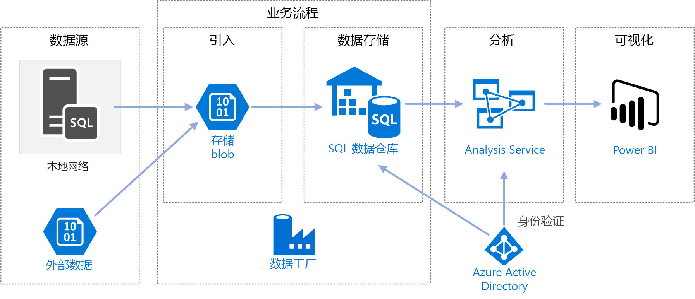
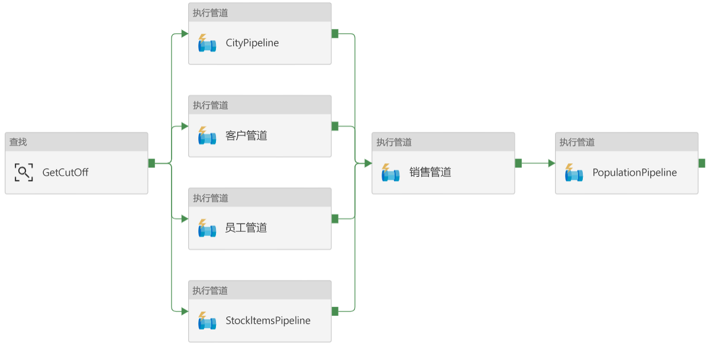
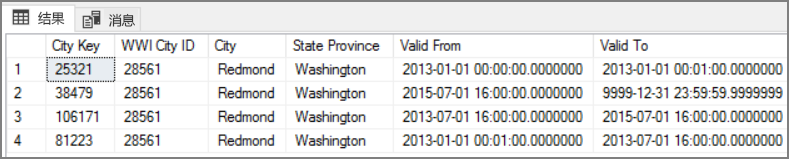

# <a name="automated-enterprise-bi-with-sql-data-warehouse-and-azure-data-factory"></a>将自动化企业 BI 与 SQL 数据仓库和 Azure 数据工厂配合使用

此参考体系结构演示如何在 [ELT](../../data-guide/relational-data/etl.md#extract-load-and-transform-elt)（提取-加载-转换）管道中执行增量加载。 它使用 Azure 数据工厂将 ELT 管道自动化。 该管道以增量方式将最新的 OLTP 数据从本地 SQL Server 数据库移入 SQL 数据仓库。 事务数据将转换为表格模型以供分析。 

[GitHub][github] 中提供了本体系结构的参考实现。



此体系结构构建在[企业 BI 与 SQL 数据仓库](./enterprise-bi-sqldw.md)中所述的体系结构基础之上，但添加了一些对企业数据仓库方案而言非常重要的功能。

-   使用数据工厂将管道自动化。
-   增量加载。
-   集成多个数据源。
-   加载地理空间数据和图像等二进制数据。

## <a name="architecture"></a>体系结构

该体系结构包括以下组件。

### <a name="data-sources"></a>数据源

**本地 SQL Server**。 源数据位于本地的 SQL Server 数据库中。 为了模拟本地环境，此体系结构的部署脚本将在 Azure 中预配一个装有 SQL Server 的虚拟机。 [Wide World Importers OLTP 示例数据库][wwi]用作源数据库。

**外部数据**。 数据仓库的常见方案是集成多个数据源。 此参考体系结构加载一个包含不同年份的城市人口的外部数据集，并将它与 OLTP 数据库中的数据集成。 可以使用此数据获取如下所述的见解：“每个区域的销量增长率是否达到或超过人口增长率？”

### <a name="ingestion-and-data-storage"></a>引入和数据存储

**Blob 存储**。 Blob 存储用作临时区域，在将源数据载入 SQL 数据仓库之前，会在此区域中存储这些数据。

**Azure SQL 数据仓库**。 [SQL 数据仓库](/azure/sql-data-warehouse/)是分布式系统，旨在对大型数据执行分析。 它支持大规模并行处理 (MPP)，因此很适合用于运行高性能分析。 

**Azure 数据工厂**。 [数据工厂][adf]是一项托管服务，用于协调和自动化数据的移动与转换。 在此体系结构中，数据工厂协调 ELT 过程的各个阶段。

### <a name="analysis-and-reporting"></a>分析和报告

**Azure Analysis Services**。 [Analysis Services](/azure/analysis-services/) 是提供数据建模功能的完全托管服务。 语义模型将载入 Analysis Services。

**Power BI**。 Power BI 是一套商业分析工具，用于分析数据以获取商业见解。 在此体系结构中，Power BI 查询 Analysis Services 中存储的语义模型。

### <a name="authentication"></a>身份验证

**Azure Active Directory** (Azure AD) 通过 Power BI 对连接到 Analysis Services 服务器的用户进行身份验证。

数据工厂还可以使用服务主体或托管服务标识 (MSI)，通过 Azure AD 对 SQL 数据仓库进行身份验证。 为简单起见，示例部署使用了 SQL Server 身份验证。

## <a name="data-pipeline"></a>数据管道

在 [Azure 数据工厂][adf]中，管道是用于协调某个任务的活动的逻辑分组 &mdash; 在本例中，该任务是将数据加载到 SQL 数据仓库中并对其进行转换。 

此参考体系结构定义一个运行一系列子管道的主管道。 每个子管道将数据载入一个或多个数据仓库表。



## <a name="incremental-loading"></a>增量加载

运行自动化的 ETL 或 ELT 过程时，最有效的做法是仅加载自上次运行以来已发生更改的数据。 这称为“增量加载”，相对于加载所有数据的“完全加载”。 若要执行增量加载，需要通过某种方式来识别哪些数据已更改。 最常用的方法是使用高水印值，即，跟踪源表中某个列的最新值：日期时间列，或唯一整数列。 

从 SQL Server 2016 开始，可以使用[时态表](/sql/relational-databases/tables/temporal-tables)。 这些表的版本受系统控制，可保留数据更改的完整历史记录。 数据库引擎会在单独的历史记录表中自动记录每项更改的历史记录。 可以通过将 FOR SYSTEM_TIME 子句添加到查询，来查询历史数据。 在内部，数据库引擎会查询历史记录表，但此操作对于应用程序而言是透明的。 

> [!NOTE]
> 对于早期版本的 SQL Server，可以使用[变更数据捕获](/sql/relational-databases/track-changes/about-change-data-capture-sql-server) (CDC)。 与时态表相比，此方法不够方便，因为必须查询单独的更改表，而更改是按日志序列号而不是时间戳跟踪的。 

时态表适用于随时可能更改的维度数据。 事实数据表通常代表不可变的事务（例如销量），在这种情况下，保留系统版本历史记录没有意义。 相反，事务通常具有一个表示事务日期的列，该日期可用作水印值。 例如，在 Wide World Importers OLTP 数据库中，Sales.Invoices 和 Sales.InvoiceLines 表具有一个默认值为 `sysdatetime()` 的 `LastEditedWhen` 字段。 

下面是 ELT 管道的常规流：

1. 针对源数据库中的每个表，跟踪最后一个 ELT 作业的运行截止时间。 将此信息存储在数据仓库中。 （在初始设置时，所有时间设置为“1-1-1900”。）

2. 在执行数据导出步骤期间，截止时间作为参数传递给源数据库中的一组存储过程。 这些存储过程会查询截止时间之后更改或创建的所有记录。 对于 Sales 事实数据表，使用 `LastEditedWhen` 列。 对于维度数据，使用版本由系统控制的时态表。

3. 完成数据迁移后，更新存储截止时间的表。

该表也可用于记录每个 ELT 轮次的沿袭。 对于给定的记录，该沿袭会将该记录与生成数据的 ELT 轮次相关联。 对于每个 ETL 轮次，将为每个表创建新的沿袭记录，其中显示起始和结束加载时间。 每个记录的沿袭键存储在维度表和事实数据表中。


将一批新数据载入仓库后，刷新 Analysis Services 表格模型。 请参阅[使用 REST API 执行异步刷新](/azure/analysis-services/analysis-services-async-refresh)。

## <a name="data-cleansing"></a>数据清理

数据清理应是 ELT 过程的一部分。 在此参考体系结构中，一个错误数据源是城市人口表，其中的某些城市人口为零，可能的原因是没有可用的数据。 在处理期间，ELT 管道会从城市人口表中删除这些城市。 针对临时表而不是外部表执行数据清理。

以下存储过程从城市人口表中删除人口为零的城市。 （可在[此处](https://github.com/mspnp/reference-architectures/blob/master/data/enterprise_bi_sqldw_advanced/azure/sqldw_scripts/citypopulation/%5BIntegration%5D.%5BMigrateExternalCityPopulationData%5D.sql)找到源文件。） 

```sql
DELETE FROM [Integration].[CityPopulation_Staging]
WHERE RowNumber in (SELECT DISTINCT RowNumber
FROM [Integration].[CityPopulation_Staging]
WHERE POPULATION = 0
GROUP BY RowNumber
HAVING COUNT(RowNumber) = 4)
```

## <a name="external-data-sources"></a>外部数据源

数据仓库通常合并多个源的数据。 此参考体系结构加载包含人口统计数据的外部数据源。 此数据集在 Azure Blob 存储中作为 [WorldWideImportersDW](https://github.com/Microsoft/sql-server-samples/tree/master/samples/databases/wide-world-importers/sample-scripts/polybase) 示例的一部分提供。

Azure 数据工厂可以使用 [Blob 存储连接器](/azure/data-factory/connector-azure-blob-storage)直接从 Blob 存储复制。 但是，连接器需要连接字符串或共享访问签名，因此它无法用于复制具有公共读取访问权限的 Blob。 解决方法之一是使用 PolyBase 创建基于 Blob 存储的外部表，然后将外部表复制到 SQL 数据仓库中。 

## <a name="handling-large-binary-data"></a>处理大型二进制数据 

在源数据库中，Cities 表包含一个 Location 列，该列保存了 [geography](/sql/t-sql/spatial-geography/spatial-types-geography) 空间数据类型。 SQL 数据仓库原生并不支持 **geography** 类型，因此，在加载期间，此字段将转换为 **varbinary** 类型。 （请参阅[适用于不支持的数据类型的解决方法](/azure/sql-data-warehouse/sql-data-warehouse-tables-data-types#unsupported-data-types)。）

但是，PolyBase 支持的最大列大小为 `varbinary(8000)`，这意味着某些数据可能会截断。 此问题的解决方法之一是在导出期间将数据分解为多个区块，然后重新汇编区块，如下所示：

1. 为 Location 列创建临时表。

2. 对于每个城市，将位置数据拆分为 8000 字节的区块，使每个城市具有 1 &ndash; N 行。

3. 若要重新汇编区块，请使用 T-SQL [PIVOT](/sql/t-sql/queries/from-using-pivot-and-unpivot) 运算符将行转换为列，然后连接每个城市的列值。

难点在于，需要根据地理数据的大小，将每个城市拆分为不同数量的行。 若要正常使用 PIVOT 运算符，每个城市的行数必须相同。 为此，T-SQL 查询（请查看[此文][MergeLocation]）会通过一些技法在行中填充空值，以便在透视后，每个城市的列数相同。 生成的查询比每次循环访问一行要快得多。

可对图像数据使用相同的方法。

## <a name="slowly-changing-dimensions"></a>缓慢变化的维度

维度数据相对而言是静态的，但仍可能发生变化。 例如，某个产品可能会重新分配到不同的产品类别。 可通过多种方法来处理缓慢变化的维度。 常用的方法称为[类型 2](https://wikipedia.org/wiki/Slowly_changing_dimension#Type_2:_add_new_row)，即，每当维度发生变化，就添加一条新记录。 

若要实现“类型 2”方法，维度表中需要包含附加的列，用于指定给定记录的有效日期范围。 此外，源数据库中的主键将会复制，因此，维度表必须包含一个人造主键。

下图显示了 Dimension.City 表。 `WWI City ID` 列是源数据库中的主键。 `City Key` 列是在运行 ETL 管道期间生成的人造键。 另请注意，该表包含 `Valid From` 和 `Valid To` 列，这些列定义每个行的有效时间范围。 当前值包含等于“9999-12-31”的 `Valid To`。


此方法的优势在于，它会保留历史数据，而这些数据对于分析可能非常有用。 但是，这也意味着，同一个实体存在多个行。 例如，以下记录与 `WWI City ID` = 28561 相匹配：



对于每个销售事实，需要将该事实与 City 维度表中对应于发票日期的单个行相关联。 在执行 ETL 过程期间，创建一个附加列 

以下 T-SQL 查询创建一个临时表，用于将每份发票与 City 维度表中的正确 City 键相关联。

```sql
CREATE TABLE CityHolder
WITH (HEAP , DISTRIBUTION = HASH([WWI Invoice ID]))
AS
SELECT DISTINCT s1.[WWI Invoice ID] AS [WWI Invoice ID],
                c.[City Key] AS [City Key]
    FROM [Integration].[Sale_Staging] s1
    CROSS APPLY (
                SELECT TOP 1 [City Key]
                    FROM [Dimension].[City]
                WHERE [WWI City ID] = s1.[WWI City ID]
                    AND s1.[Last Modified When] > [Valid From]
                    AND s1.[Last Modified When] <= [Valid To]
                ORDER BY [Valid From], [City Key] DESC
                ) c

```

此表用于填充 Sales 事实数据表中的列：

```sql
UPDATE [Integration].[Sale_Staging]
SET [Integration].[Sale_Staging].[WWI Customer ID] =  CustomerHolder.[WWI Customer ID]
```

Power BI 查询可以使用此列找到给定销售发票的正确 City 记录。

## <a name="security-considerations"></a>安全注意事项

为了提高安全性，可以使用[虚拟网络服务终结点](/azure/virtual-network/virtual-network-service-endpoints-overview)来保护 Azure 服务资源：只允许在你的虚拟网络中访问这些资源。 这可以完全避免通过公共 Internet 访问这些资源，只允许来自该虚拟网络的流量。

如果使用此方法，请在 Azure 中创建 VNet，并为 Azure 服务创建专用服务终结点。 然后，将这些服务限制为来自该虚拟网络的流量。 也可以通过网关从本地网络访问这些资源。

注意以下限制：

- 在创建此参考体系结构时，Azure 存储和 Azure SQL 数据仓库支持 VNet 服务终结点，但 Azure Analysis Service 则不支持此类终结点。 请在[此处](https://azure.microsoft.com/updates/?product=virtual-network)查看最新状态。 

- 如果为 Azure 存储启用了服务终结点，PolyBase 无法将数据从存储复制到 SQL 数据仓库。 此问题有一种缓解方法。 有关详细信息，请参阅[将 VNet 服务终结点与 Azure 存储配合使用的影响](/azure/sql-database/sql-database-vnet-service-endpoint-rule-overview?toc=%2fazure%2fvirtual-network%2ftoc.json#impact-of-using-vnet-service-endpoints-with-azure-storage)。 

- 若要将数据从本地移入 Azure 存储，需要将本地或 ExpressRoute 中的公共 IP 地址加入允许列表。 有关详细信息，请参阅[在虚拟网络中保护 Azure 服务](/azure/virtual-network/virtual-network-service-endpoints-overview#securing-azure-services-to-virtual-networks)。

- 若要允许 Analysis Services 从 SQL 数据仓库读取数据，请将一个 Windows VM 部署到包含 SQL 数据仓库服务终结点的虚拟网络。 在此 VM 上安装 [Azure 本地数据网关](/azure/analysis-services/analysis-services-gateway)。 然后将 Azure Analysis Services 连接到数据网关。

## <a name="deploy-the-solution"></a>部署解决方案

若要部署并运行参考实现，请按 [GitHub 自述文件][github]中的步骤操作。 它将部署以下部分：

  * 一个用于模拟本地数据库服务器的 Windows VM。 该 VM 包含 SQL Server 2017 和相关工具以及 Power BI Desktop。
  * 一个 Azure 存储帐户。该帐户提供 Blob 存储用于保存从 SQL Server 数据库导出的数据。
  * 一个 Azure SQL 数据仓库实例。
  * 一个 Azure Analysis Services 实例。
  * Azure 数据工厂和 ELT 作业的数据工厂管道。

[adf]: //azure/data-factory
[github]: https://github.com/mspnp/reference-architectures/tree/master/data/enterprise_bi_sqldw_advanced
[MergeLocation]: https://github.com/mspnp/reference-architectures/blob/master/data/enterprise_bi_sqldw_advanced/azure/sqldw_scripts/city/%5BIntegration%5D.%5BMergeLocation%5D.sql
[wwi]: //sql/sample/world-wide-importers/wide-world-importers-oltp-database

