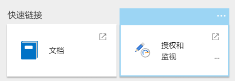
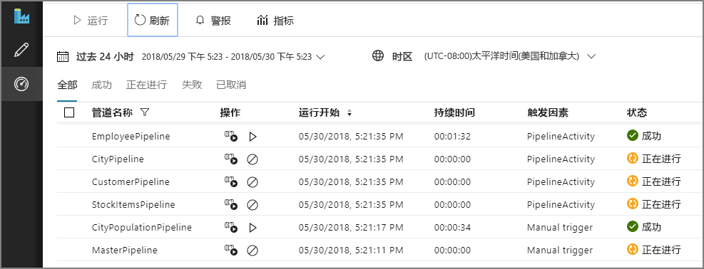
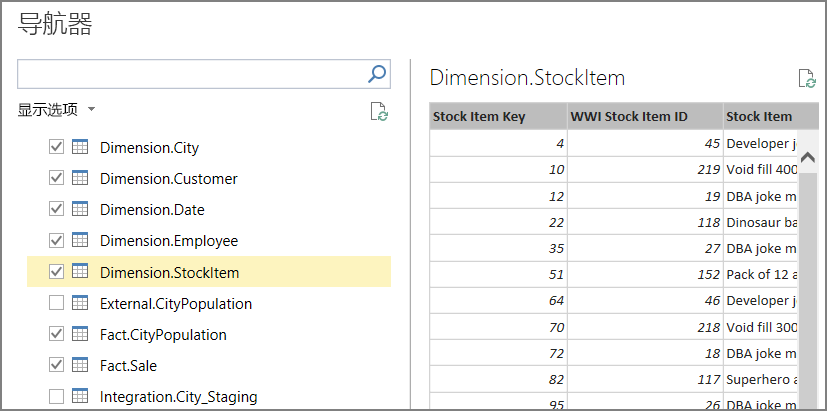
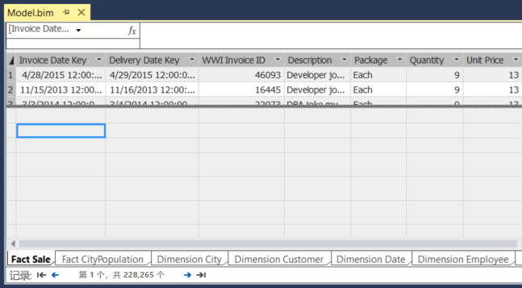
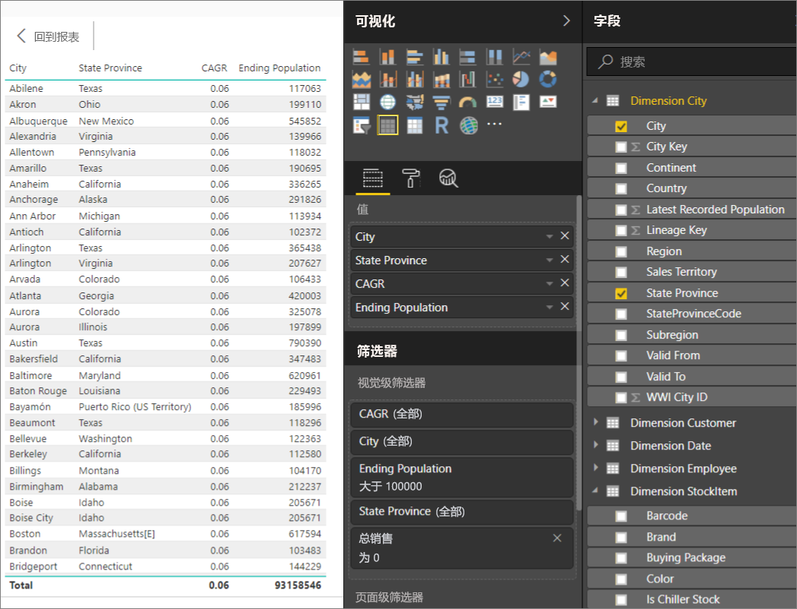

# <a name="automated-enterprise-bi-with-sql-data-warehouse-and-azure-data-factory"></a><span data-ttu-id="523e5-103">将自动化企业 BI 与 SQL 数据仓库和 Azure 数据工厂配合使用</span><span class="sxs-lookup"><span data-stu-id="523e5-103">Automated enterprise BI with SQL Data Warehouse and Azure Data Factory</span></span>

<span data-ttu-id="523e5-104">此参考体系结构演示如何在 [ELT](../../data-guide/relational-data/etl.md#extract-load-and-transform-elt)（提取-加载-转换）管道中执行增量加载。</span><span class="sxs-lookup"><span data-stu-id="523e5-104">This reference architecture shows how to perform incremental loading in an [ELT](../../data-guide/relational-data/etl.md#extract-load-and-transform-elt) (extract-load-transform) pipeline.</span></span> <span data-ttu-id="523e5-105">它使用 Azure 数据工厂将 ELT 管道自动化。</span><span class="sxs-lookup"><span data-stu-id="523e5-105">It uses Azure Data Factory to automate the ELT pipeline.</span></span> <span data-ttu-id="523e5-106">该管道以增量方式将最新的 OLTP 数据从本地 SQL Server 数据库移入 SQL 数据仓库。</span><span class="sxs-lookup"><span data-stu-id="523e5-106">The pipeline incrementally moves the latest OLTP data from an on-premises SQL Server database into SQL Data Warehouse.</span></span> <span data-ttu-id="523e5-107">事务数据将转换为表格模型以供分析。</span><span class="sxs-lookup"><span data-stu-id="523e5-107">Transactional data is transformed into a tabular model for analysis.</span></span> [<span data-ttu-id="523e5-108">**部署此解决方案**。</span><span class="sxs-lookup"><span data-stu-id="523e5-108">**Deploy this solution**.</span></span>](#deploy-the-solution)


<span data-ttu-id="523e5-109">此体系结构构建在[企业 BI 与 SQL 数据仓库](./enterprise-bi-sqldw.md)中所述的体系结构基础之上，但添加了一些对企业数据仓库方案而言非常重要的功能。</span><span class="sxs-lookup"><span data-stu-id="523e5-109">This architecture builds on the one shown in [Enterprise BI with SQL Data Warehouse](./enterprise-bi-sqldw.md), but adds some features that are important for enterprise data warehousing scenarios.</span></span>

-   <span data-ttu-id="523e5-110">使用数据工厂将管道自动化。</span><span class="sxs-lookup"><span data-stu-id="523e5-110">Automation of the pipeline using Data Factory.</span></span>
-   <span data-ttu-id="523e5-111">增量加载。</span><span class="sxs-lookup"><span data-stu-id="523e5-111">Incremental loading.</span></span>
-   <span data-ttu-id="523e5-112">集成多个数据源。</span><span class="sxs-lookup"><span data-stu-id="523e5-112">Integrating multiple data sources.</span></span>
-   <span data-ttu-id="523e5-113">加载地理空间数据和图像等二进制数据。</span><span class="sxs-lookup"><span data-stu-id="523e5-113">Loading binary data such as geospatial data and images.</span></span>

## <a name="architecture"></a><span data-ttu-id="523e5-114">体系结构</span><span class="sxs-lookup"><span data-stu-id="523e5-114">Architecture</span></span>

<span data-ttu-id="523e5-115">该体系结构包括以下组件。</span><span class="sxs-lookup"><span data-stu-id="523e5-115">The architecture consists of the following components.</span></span>

### <a name="data-sources"></a><span data-ttu-id="523e5-116">数据源</span><span class="sxs-lookup"><span data-stu-id="523e5-116">Data sources</span></span>

<span data-ttu-id="523e5-117">**本地 SQL Server**。</span><span class="sxs-lookup"><span data-stu-id="523e5-117">**On-premises SQL Server**.</span></span> <span data-ttu-id="523e5-118">源数据位于本地的 SQL Server 数据库中。</span><span class="sxs-lookup"><span data-stu-id="523e5-118">The source data is located in a SQL Server database on premises.</span></span> <span data-ttu-id="523e5-119">为了模拟本地环境，此体系结构的部署脚本将在 Azure 中预配一个装有 SQL Server 的虚拟机。</span><span class="sxs-lookup"><span data-stu-id="523e5-119">To simulate the on-premises environment, the deployment scripts for this architecture provision a virtual machine in Azure with SQL Server installed.</span></span> <span data-ttu-id="523e5-120">[Wide World Importers OLTP 示例数据库][wwi] 用作源数据库。</span><span class="sxs-lookup"><span data-stu-id="523e5-120">The [Wide World Importers OLTP sample database][wwi] is used as the source database.</span></span>

<span data-ttu-id="523e5-121">**外部数据**。</span><span class="sxs-lookup"><span data-stu-id="523e5-121">**External data**.</span></span> <span data-ttu-id="523e5-122">数据仓库的常见方案是集成多个数据源。</span><span class="sxs-lookup"><span data-stu-id="523e5-122">A common scenario for data warehouses is to integrate multiple data sources.</span></span> <span data-ttu-id="523e5-123">此参考体系结构加载一个包含不同年份的城市人口的外部数据集，并将它与 OLTP 数据库中的数据集成。</span><span class="sxs-lookup"><span data-stu-id="523e5-123">This reference architecture loads an external data set that contains city populations by year, and integrates it with the data from the OLTP database.</span></span> <span data-ttu-id="523e5-124">可以使用此数据获取如下所述的见解：“每个区域的销量增长率是否达到或超过人口增长率？”</span><span class="sxs-lookup"><span data-stu-id="523e5-124">You can use this data for insights such as: "Does sales growth in each region match or exceed population growth?"</span></span>

### <a name="ingestion-and-data-storage"></a><span data-ttu-id="523e5-125">引入和数据存储</span><span class="sxs-lookup"><span data-stu-id="523e5-125">Ingestion and data storage</span></span>

<span data-ttu-id="523e5-126">**Blob 存储**。</span><span class="sxs-lookup"><span data-stu-id="523e5-126">**Blob Storage**.</span></span> <span data-ttu-id="523e5-127">Blob 存储用作临时区域，在将源数据载入 SQL 数据仓库之前，会在此区域中存储这些数据。</span><span class="sxs-lookup"><span data-stu-id="523e5-127">Blob storage is used as a staging area for the source data before loading it into SQL Data Warehouse.</span></span>

<span data-ttu-id="523e5-128">**Azure SQL 数据仓库**。</span><span class="sxs-lookup"><span data-stu-id="523e5-128">**Azure SQL Data Warehouse**.</span></span> <span data-ttu-id="523e5-129">[SQL 数据仓库](/azure/sql-data-warehouse/)是分布式系统，旨在对大型数据执行分析。</span><span class="sxs-lookup"><span data-stu-id="523e5-129">[SQL Data Warehouse](/azure/sql-data-warehouse/) is a distributed system designed to perform analytics on large data.</span></span> <span data-ttu-id="523e5-130">它支持大规模并行处理 (MPP)，因此很适合用于运行高性能分析。</span><span class="sxs-lookup"><span data-stu-id="523e5-130">It supports massive parallel processing (MPP), which makes it suitable for running high-performance analytics.</span></span> 

<span data-ttu-id="523e5-131">**Azure 数据工厂**</span><span class="sxs-lookup"><span data-stu-id="523e5-131">**Azure Data Factory**.</span></span> <span data-ttu-id="523e5-132">[数据工厂][adf] 是一个托管服务，用于协调和自动化数据的移动与转换。</span><span class="sxs-lookup"><span data-stu-id="523e5-132">[Data Factory][adf] is a managed service that orchestrates and automates data movement and data transformation.</span></span> <span data-ttu-id="523e5-133">在此体系结构中，数据工厂协调 ELT 过程的各个阶段。</span><span class="sxs-lookup"><span data-stu-id="523e5-133">In this architecture, it coordinates the various stages of the ELT process.</span></span>

### <a name="analysis-and-reporting"></a><span data-ttu-id="523e5-134">分析和报告</span><span class="sxs-lookup"><span data-stu-id="523e5-134">Analysis and reporting</span></span>

<span data-ttu-id="523e5-135">**Azure Analysis Services**。</span><span class="sxs-lookup"><span data-stu-id="523e5-135">**Azure Analysis Services**.</span></span> <span data-ttu-id="523e5-136">[Analysis Services](/azure/analysis-services/) 是提供数据建模功能的完全托管服务。</span><span class="sxs-lookup"><span data-stu-id="523e5-136">[Analysis Services](/azure/analysis-services/) is a fully managed service that provides data modeling capabilities.</span></span> <span data-ttu-id="523e5-137">语义模型将载入 Analysis Services。</span><span class="sxs-lookup"><span data-stu-id="523e5-137">The semantic model is loaded into Analysis Services.</span></span>

<span data-ttu-id="523e5-138">**Power BI**。</span><span class="sxs-lookup"><span data-stu-id="523e5-138">**Power BI**.</span></span> <span data-ttu-id="523e5-139">Power BI 是一套商业分析工具，用于分析数据以获取商业见解。</span><span class="sxs-lookup"><span data-stu-id="523e5-139">Power BI is a suite of business analytics tools to analyze data for business insights.</span></span> <span data-ttu-id="523e5-140">在此体系结构中，Power BI 查询 Analysis Services 中存储的语义模型。</span><span class="sxs-lookup"><span data-stu-id="523e5-140">In this architecture, it queries the semantic model stored in Analysis Services.</span></span>

### <a name="authentication"></a><span data-ttu-id="523e5-141">身份验证</span><span class="sxs-lookup"><span data-stu-id="523e5-141">Authentication</span></span>

<span data-ttu-id="523e5-142">**Azure Active Directory** (Azure AD) 通过 Power BI 对连接到 Analysis Services 服务器的用户进行身份验证。</span><span class="sxs-lookup"><span data-stu-id="523e5-142">**Azure Active Directory** (Azure AD) authenticates users who connect to the Analysis Services server through Power BI.</span></span>

<span data-ttu-id="523e5-143">数据工厂还可以使用服务主体或托管服务标识 (MSI)，通过 Azure AD 对 SQL 数据仓库进行身份验证。</span><span class="sxs-lookup"><span data-stu-id="523e5-143">Data Factory can use also use Azure AD to authenticate to SQL Data Warehouse, by using a service principal or Managed Service Identity (MSI).</span></span> <span data-ttu-id="523e5-144">为简单起见，示例部署使用了 SQL Server 身份验证。</span><span class="sxs-lookup"><span data-stu-id="523e5-144">For simplicity, the example deployment uses SQL Server authentication.</span></span>

## <a name="data-pipeline"></a><span data-ttu-id="523e5-145">数据管道</span><span class="sxs-lookup"><span data-stu-id="523e5-145">Data pipeline</span></span>

<span data-ttu-id="523e5-146">在 [Azure 数据工厂][adf] 中，管道是用于协调某个任务的活动的逻辑分组 &mdash; 在本例中，该任务是将数据载入 SQL 数据仓库并对其进行转换。</span><span class="sxs-lookup"><span data-stu-id="523e5-146">In [Azure Data Factory][adf], a pipeline is a logical grouping of activities used to coordinate a task &mdash; in this case, loading and transforming data into SQL Data Warehouse.</span></span> 

<span data-ttu-id="523e5-147">此参考体系结构定义一个运行一系列子管道的主管道。</span><span class="sxs-lookup"><span data-stu-id="523e5-147">This reference architecture defines a master pipeline that runs a sequence of child pipelines.</span></span> <span data-ttu-id="523e5-148">每个子管道将数据载入一个或多个数据仓库表。</span><span class="sxs-lookup"><span data-stu-id="523e5-148">Each child pipeline loads data into one or more data warehouse tables.</span></span>


## <a name="incremental-loading"></a><span data-ttu-id="523e5-149">增量加载</span><span class="sxs-lookup"><span data-stu-id="523e5-149">Incremental loading</span></span>

<span data-ttu-id="523e5-150">运行自动化的 ETL 或 ELT 过程时，最有效的做法是仅加载自上次运行以来已发生更改的数据。</span><span class="sxs-lookup"><span data-stu-id="523e5-150">When you run an automated ETL or ELT process, it's most efficient to load only the data that changed since the previous run.</span></span> <span data-ttu-id="523e5-151">这称为“增量加载”，相对于加载所有数据的“完全加载”。</span><span class="sxs-lookup"><span data-stu-id="523e5-151">This is called an *incremental load*, as opposed to a full load that loads all of the data.</span></span> <span data-ttu-id="523e5-152">若要执行增量加载，需要通过某种方式来识别哪些数据已更改。</span><span class="sxs-lookup"><span data-stu-id="523e5-152">To perform an incremental load, you need a way to identify which data has changed.</span></span> <span data-ttu-id="523e5-153">最常用的方法是使用高水印值，即，跟踪源表中某个列的最新值：日期时间列，或唯一整数列。</span><span class="sxs-lookup"><span data-stu-id="523e5-153">The most common approach is to use a *high water mark* value, which means tracking the latest value of some column in the source table, either a datetime column or a unique integer column.</span></span> 

<span data-ttu-id="523e5-154">从 SQL Server 2016 开始，可以使用[时态表](/sql/relational-databases/tables/temporal-tables)。</span><span class="sxs-lookup"><span data-stu-id="523e5-154">Starting with SQL Server 2016, you can use [temporal tables](/sql/relational-databases/tables/temporal-tables).</span></span> <span data-ttu-id="523e5-155">这些表的版本受系统控制，可保留数据更改的完整历史记录。</span><span class="sxs-lookup"><span data-stu-id="523e5-155">These are system-versioned tables that keep a full history of data changes.</span></span> <span data-ttu-id="523e5-156">数据库引擎会在单独的历史记录表中自动记录每项更改的历史记录。</span><span class="sxs-lookup"><span data-stu-id="523e5-156">The database engine automatically records the history of every change in a separate history table.</span></span> <span data-ttu-id="523e5-157">可以通过将 FOR SYSTEM_TIME 子句添加到查询，来查询历史数据。</span><span class="sxs-lookup"><span data-stu-id="523e5-157">You can query the historical data by adding a FOR SYSTEM_TIME clause to a query.</span></span> <span data-ttu-id="523e5-158">在内部，数据库引擎会查询历史记录表，但此操作对于应用程序而言是透明的。</span><span class="sxs-lookup"><span data-stu-id="523e5-158">Internally, the database engine queries the history table, but this is transparent to the application.</span></span> 

> [!NOTE]
> <span data-ttu-id="523e5-159">对于早期版本的 SQL Server，可以使用[变更数据捕获](/sql/relational-databases/track-changes/about-change-data-capture-sql-server) (CDC)。</span><span class="sxs-lookup"><span data-stu-id="523e5-159">For earlier versions of SQL Server, you can use [Change Data Capture](/sql/relational-databases/track-changes/about-change-data-capture-sql-server) (CDC).</span></span> <span data-ttu-id="523e5-160">与时态表相比，此方法不够方便，因为必须查询单独的更改表，而更改是按日志序列号而不是时间戳跟踪的。</span><span class="sxs-lookup"><span data-stu-id="523e5-160">This approach is less convenient than temporal tables, because you have to query a separate change table, and changes are tracked by a log sequence number, rather than a timestamp.</span></span> 

<span data-ttu-id="523e5-161">时态表适用于随时可能更改的维度数据。</span><span class="sxs-lookup"><span data-stu-id="523e5-161">Temporal tables are useful for dimension data, which can change over time.</span></span> <span data-ttu-id="523e5-162">事实数据表通常代表不可变的事务（例如销量），在这种情况下，保留系统版本历史记录没有意义。</span><span class="sxs-lookup"><span data-stu-id="523e5-162">Fact tables usually represent an immutable transaction such as a sale, in which case keeping the system version history doesn't make sense.</span></span> <span data-ttu-id="523e5-163">相反，事务通常具有一个表示事务日期的列，该日期可用作水印值。</span><span class="sxs-lookup"><span data-stu-id="523e5-163">Instead, transactions usually have a column that represents the transaction date, which can be used as the watermark value.</span></span> <span data-ttu-id="523e5-164">例如，在 Wide World Importers OLTP 数据库中，Sales.Invoices 和 Sales.InvoiceLines 表具有一个默认值为 `sysdatetime()` 的 `LastEditedWhen` 字段。</span><span class="sxs-lookup"><span data-stu-id="523e5-164">For example, in the Wide World Importers OLTP databse, the Sales.Invoices and Sales.InvoiceLines tables have a `LastEditedWhen` field that defaults to `sysdatetime()`.</span></span> 

<span data-ttu-id="523e5-165">下面是 ELT 管道的常规流：</span><span class="sxs-lookup"><span data-stu-id="523e5-165">Here is the general flow for the ELT pipeline:</span></span>

1. <span data-ttu-id="523e5-166">针对源数据库中的每个表，跟踪最后一个 ELT 作业的运行截止时间。</span><span class="sxs-lookup"><span data-stu-id="523e5-166">For each table in the source database, track the cutoff time when the last ELT job ran.</span></span> <span data-ttu-id="523e5-167">将此信息存储在数据仓库中。</span><span class="sxs-lookup"><span data-stu-id="523e5-167">Store this information in the data warehouse.</span></span> <span data-ttu-id="523e5-168">（在初始设置时，所有时间设置为“1-1-1900”。）</span><span class="sxs-lookup"><span data-stu-id="523e5-168">(On initial setup, all times are set to '1-1-1900'.)</span></span>

2. <span data-ttu-id="523e5-169">在执行数据导出步骤期间，截止时间作为参数传递给源数据库中的一组存储过程。</span><span class="sxs-lookup"><span data-stu-id="523e5-169">During the data export step, the cutoff time is passed as a parameter to a set of stored procedures in the source database.</span></span> <span data-ttu-id="523e5-170">这些存储过程会查询截止时间之后更改或创建的所有记录。</span><span class="sxs-lookup"><span data-stu-id="523e5-170">These stored procedures query for any records that were changed or created after the cutoff time.</span></span> <span data-ttu-id="523e5-171">对于 Sales 事实数据表，使用 `LastEditedWhen` 列。</span><span class="sxs-lookup"><span data-stu-id="523e5-171">For the Sales fact table, the `LastEditedWhen` column is used.</span></span> <span data-ttu-id="523e5-172">对于维度数据，使用版本由系统控制的时态表。</span><span class="sxs-lookup"><span data-stu-id="523e5-172">For the dimension data, system-versioned temporal tables are used.</span></span>

3. <span data-ttu-id="523e5-173">完成数据迁移后，更新存储截止时间的表。</span><span class="sxs-lookup"><span data-stu-id="523e5-173">When the data migration is complete, update the table that stores the cutoff times.</span></span>

<span data-ttu-id="523e5-174">该表也可用于记录每个 ELT 轮次的沿袭。</span><span class="sxs-lookup"><span data-stu-id="523e5-174">It's also useful to record a *lineage* for each ELT run.</span></span> <span data-ttu-id="523e5-175">对于给定的记录，该沿袭会将该记录与生成数据的 ELT 轮次相关联。</span><span class="sxs-lookup"><span data-stu-id="523e5-175">For a given record, the lineage associates that record with the ELT run that produced the data.</span></span> <span data-ttu-id="523e5-176">对于每个 ETL 轮次，将为每个表创建新的沿袭记录，其中显示起始和结束加载时间。</span><span class="sxs-lookup"><span data-stu-id="523e5-176">For each ETL run, a new lineage record is created for every table, showing the starting and ending load times.</span></span> <span data-ttu-id="523e5-177">每个记录的沿袭键存储在维度表和事实数据表中。</span><span class="sxs-lookup"><span data-stu-id="523e5-177">The lineage keys for each record are stored in the dimension and fact tables.</span></span>


<span data-ttu-id="523e5-178">将一批新数据载入仓库后，刷新 Analysis Services 表格模型。</span><span class="sxs-lookup"><span data-stu-id="523e5-178">After a new batch of data is loaded into the warehouse, refresh the Analysis Services tabular model.</span></span> <span data-ttu-id="523e5-179">请参阅[使用 REST API 执行异步刷新](/azure/analysis-services/analysis-services-async-refresh)。</span><span class="sxs-lookup"><span data-stu-id="523e5-179">See [Asynchronous refresh with the REST API](/azure/analysis-services/analysis-services-async-refresh).</span></span>

## <a name="data-cleansing"></a><span data-ttu-id="523e5-180">数据清理</span><span class="sxs-lookup"><span data-stu-id="523e5-180">Data cleansing</span></span>

<span data-ttu-id="523e5-181">数据清理应是 ELT 过程的一部分。</span><span class="sxs-lookup"><span data-stu-id="523e5-181">Data cleansing should be part of the ELT process.</span></span> <span data-ttu-id="523e5-182">在此参考体系结构中，一个错误数据源是城市人口表，其中的某些城市人口为零，可能的原因是没有可用的数据。</span><span class="sxs-lookup"><span data-stu-id="523e5-182">In this reference architecture, one source of bad data is the city population table, where some cities have zero population, perhaps because no data was available.</span></span> <span data-ttu-id="523e5-183">在处理期间，ELT 管道会从城市人口表中删除这些城市。</span><span class="sxs-lookup"><span data-stu-id="523e5-183">During processing, the ELT pipeline removes those cities from the city population table.</span></span> <span data-ttu-id="523e5-184">针对临时表而不是外部表执行数据清理。</span><span class="sxs-lookup"><span data-stu-id="523e5-184">Perform data cleansing on staging tables, rather than external tables.</span></span>

<span data-ttu-id="523e5-185">以下存储过程从城市人口表中删除人口为零的城市。</span><span class="sxs-lookup"><span data-stu-id="523e5-185">Here is the stored procedure that removes the cities with zero population from the City Population table.</span></span> <span data-ttu-id="523e5-186">（可在[此处](https://github.com/mspnp/reference-architectures/blob/master/data/enterprise_bi_sqldw_advanced/azure/sqldw_scripts/citypopulation/%5BIntegration%5D.%5BMigrateExternalCityPopulationData%5D.sql)找到源文件。）</span><span class="sxs-lookup"><span data-stu-id="523e5-186">(You can find the source file [here](https://github.com/mspnp/reference-architectures/blob/master/data/enterprise_bi_sqldw_advanced/azure/sqldw_scripts/citypopulation/%5BIntegration%5D.%5BMigrateExternalCityPopulationData%5D.sql).)</span></span> 

```sql
DELETE FROM [Integration].[CityPopulation_Staging]
WHERE RowNumber in (SELECT DISTINCT RowNumber
FROM [Integration].[CityPopulation_Staging]
WHERE POPULATION = 0
GROUP BY RowNumber
HAVING COUNT(RowNumber) = 4)
```

## <a name="external-data-sources"></a><span data-ttu-id="523e5-187">外部数据源</span><span class="sxs-lookup"><span data-stu-id="523e5-187">External data sources</span></span>

<span data-ttu-id="523e5-188">数据仓库通常合并多个源的数据。</span><span class="sxs-lookup"><span data-stu-id="523e5-188">Data warehouses often consolidate data from multiple sources.</span></span> <span data-ttu-id="523e5-189">此参考体系结构加载包含人口统计数据的外部数据源。</span><span class="sxs-lookup"><span data-stu-id="523e5-189">This reference architecture loads an external data source that contains demographics data.</span></span> <span data-ttu-id="523e5-190">此数据集在 Azure Blob 存储中作为 [WorldWideImportersDW](https://github.com/Microsoft/sql-server-samples/tree/master/samples/databases/wide-world-importers/sample-scripts/polybase) 示例的一部分提供。</span><span class="sxs-lookup"><span data-stu-id="523e5-190">This dataset is available in Azure blob storage as part of the [WorldWideImportersDW](https://github.com/Microsoft/sql-server-samples/tree/master/samples/databases/wide-world-importers/sample-scripts/polybase) sample.</span></span>

<span data-ttu-id="523e5-191">Azure 数据工厂可以使用 [Blob 存储连接器](/azure/data-factory/connector-azure-blob-storage)直接从 Blob 存储复制。</span><span class="sxs-lookup"><span data-stu-id="523e5-191">Azure Data Factory can copy directly from blob storage, using the [blob storage connector](/azure/data-factory/connector-azure-blob-storage).</span></span> <span data-ttu-id="523e5-192">但是，连接器需要连接字符串或共享访问签名，因此它无法用于复制具有公共读取访问权限的 Blob。</span><span class="sxs-lookup"><span data-stu-id="523e5-192">However, the connector requires a connection string or a shared access signature, so it can't be used to copy a blob with public read access.</span></span> <span data-ttu-id="523e5-193">解决方法之一是使用 PolyBase 创建基于 Blob 存储的外部表，然后将外部表复制到 SQL 数据仓库中。</span><span class="sxs-lookup"><span data-stu-id="523e5-193">As a workaround, you can use PolyBase to create an external table over Blob storage and then copy the external tables into SQL Data Warehouse.</span></span> 

## <a name="handling-large-binary-data"></a><span data-ttu-id="523e5-194">处理大型二进制数据</span><span class="sxs-lookup"><span data-stu-id="523e5-194">Handling large binary data</span></span> 

<span data-ttu-id="523e5-195">在源数据库中，Cities 表包含一个 Location 列，该列保存了 [geography](/sql/t-sql/spatial-geography/spatial-types-geography) 空间数据类型。</span><span class="sxs-lookup"><span data-stu-id="523e5-195">In the source database, the Cities table has a Location column that holds a [geography](/sql/t-sql/spatial-geography/spatial-types-geography) spatial data type.</span></span> <span data-ttu-id="523e5-196">SQL 数据仓库原生并不支持 **geography** 类型，因此，在加载期间，此字段将转换为 **varbinary** 类型。</span><span class="sxs-lookup"><span data-stu-id="523e5-196">SQL Data Warehouse doesn't support the **geography** type natively, so this field is converted to a **varbinary** type during loading.</span></span> <span data-ttu-id="523e5-197">（请参阅[适用于不支持的数据类型的解决方法](/azure/sql-data-warehouse/sql-data-warehouse-tables-data-types#unsupported-data-types)。）</span><span class="sxs-lookup"><span data-stu-id="523e5-197">(See [Workarounds for unsupported data types](/azure/sql-data-warehouse/sql-data-warehouse-tables-data-types#unsupported-data-types).)</span></span>

<span data-ttu-id="523e5-198">但是，PolyBase 支持的最大列大小为 `varbinary(8000)`，这意味着某些数据可能会截断。</span><span class="sxs-lookup"><span data-stu-id="523e5-198">However, PolyBase supports a maximum column size of `varbinary(8000)`, which means some data could be truncated.</span></span> <span data-ttu-id="523e5-199">此问题的解决方法之一是在导出期间将数据分解为多个区块，然后重新汇编区块，如下所示：</span><span class="sxs-lookup"><span data-stu-id="523e5-199">A workaround for this problem is to break the data up into chunks during export, and then reassemble the chunks, as follows:</span></span>

1. <span data-ttu-id="523e5-200">为 Location 列创建临时表。</span><span class="sxs-lookup"><span data-stu-id="523e5-200">Create a temporary staging table for the Location column.</span></span>

2. <span data-ttu-id="523e5-201">对于每个城市，将位置数据拆分为 8000 字节的区块，使每个城市具有 1 &ndash; N 行。</span><span class="sxs-lookup"><span data-stu-id="523e5-201">For each city, split the location data into 8000-byte chunks, resulting in 1 &ndash; N rows for each city.</span></span>

3. <span data-ttu-id="523e5-202">若要重新汇编区块，请使用 T-SQL [PIVOT](/sql/t-sql/queries/from-using-pivot-and-unpivot) 运算符将行转换为列，然后连接每个城市的列值。</span><span class="sxs-lookup"><span data-stu-id="523e5-202">To reassemble the chunks, use the T-SQL [PIVOT](/sql/t-sql/queries/from-using-pivot-and-unpivot) operator to convert rows into columns and then concatenate the column values for each city.</span></span>

<span data-ttu-id="523e5-203">难点在于，需要根据地理数据的大小，将每个城市拆分为不同数量的行。</span><span class="sxs-lookup"><span data-stu-id="523e5-203">The challenge is that each city will be split into a different number of rows, depending on the size of geography data.</span></span> <span data-ttu-id="523e5-204">若要正常使用 PIVOT 运算符，每个城市的行数必须相同。</span><span class="sxs-lookup"><span data-stu-id="523e5-204">For the PIVOT operator to work, every city must have the same number of rows.</span></span> <span data-ttu-id="523e5-205">为此，T-SQL 查询（请查看 [此主题][MergeLocation]）会通过一些技法在行中填充空值，以便在透视后，每个城市的行数相同。</span><span class="sxs-lookup"><span data-stu-id="523e5-205">To make this work, the T-SQL query (which you can view [here][MergeLocation]) does some tricks to pad out the rows with blank values, so that every city has the same number of columns after the pivot.</span></span> <span data-ttu-id="523e5-206">生成的查询比每次循环访问一行要快得多。</span><span class="sxs-lookup"><span data-stu-id="523e5-206">The resulting query turns out to be much faster than looping through the rows one at a time.</span></span>

<span data-ttu-id="523e5-207">可对图像数据使用相同的方法。</span><span class="sxs-lookup"><span data-stu-id="523e5-207">The same approach is used for image data.</span></span>

## <a name="slowly-changing-dimensions"></a><span data-ttu-id="523e5-208">缓慢变化的维度</span><span class="sxs-lookup"><span data-stu-id="523e5-208">Slowly changing dimensions</span></span>

<span data-ttu-id="523e5-209">维度数据相对而言是静态的，但仍可能发生变化。</span><span class="sxs-lookup"><span data-stu-id="523e5-209">Dimension data is relatively static, but it can change.</span></span> <span data-ttu-id="523e5-210">例如，某个产品可能会重新分配到不同的产品类别。</span><span class="sxs-lookup"><span data-stu-id="523e5-210">For example, a product might get reassigned to a different product category.</span></span> <span data-ttu-id="523e5-211">可通过多种方法来处理缓慢变化的维度。</span><span class="sxs-lookup"><span data-stu-id="523e5-211">There are several approaches to handling slowly changing dimensions.</span></span> <span data-ttu-id="523e5-212">常用的方法称为[类型 2](https://wikipedia.org/wiki/Slowly_changing_dimension#Type_2:_add_new_row)，即，每当维度发生变化，就添加一条新记录。</span><span class="sxs-lookup"><span data-stu-id="523e5-212">A common technique, called [Type 2](https://wikipedia.org/wiki/Slowly_changing_dimension#Type_2:_add_new_row), is to add a new record whenever a dimension changes.</span></span> 

<span data-ttu-id="523e5-213">若要实现“类型 2”方法，维度表中需要包含附加的列，用于指定给定记录的有效日期范围。</span><span class="sxs-lookup"><span data-stu-id="523e5-213">In order to implement the Type 2 approach, dimension tables need additional columns that specify the effective date range for a given record.</span></span> <span data-ttu-id="523e5-214">此外，源数据库中的主键将会复制，因此，维度表必须包含一个人造主键。</span><span class="sxs-lookup"><span data-stu-id="523e5-214">Also, primary keys from the source database will be duplicated, so the dimension table must have an artificial primary key.</span></span>

<span data-ttu-id="523e5-215">下图显示了 Dimension.City 表。</span><span class="sxs-lookup"><span data-stu-id="523e5-215">The following image shows the Dimension.City table.</span></span> <span data-ttu-id="523e5-216">`WWI City ID` 列是源数据库中的主键。</span><span class="sxs-lookup"><span data-stu-id="523e5-216">The `WWI City ID` column is the primary key from the source database.</span></span> <span data-ttu-id="523e5-217">`City Key` 列是在运行 ETL 管道期间生成的人造键。</span><span class="sxs-lookup"><span data-stu-id="523e5-217">The `City Key` column is an artificial key generated during the ETL pipeline.</span></span> <span data-ttu-id="523e5-218">另请注意，该表包含 `Valid From` 和 `Valid To` 列，这些列定义每个行的有效时间范围。</span><span class="sxs-lookup"><span data-stu-id="523e5-218">Also notice that the table has `Valid From` and `Valid To` columns, which define the range when each row was valid.</span></span> <span data-ttu-id="523e5-219">当前值包含等于“9999-12-31”的 `Valid To`。</span><span class="sxs-lookup"><span data-stu-id="523e5-219">Current values have a `Valid To` equal to '9999-12-31'.</span></span>


<span data-ttu-id="523e5-220">此方法的优势在于，它会保留历史数据，而这些数据对于分析可能非常有用。</span><span class="sxs-lookup"><span data-stu-id="523e5-220">The advantage of this approach is that it preserves historical data, which can be valuable for analysis.</span></span> <span data-ttu-id="523e5-221">但是，这也意味着，同一个实体存在多个行。</span><span class="sxs-lookup"><span data-stu-id="523e5-221">However, it also means there will be multiple rows for the same entity.</span></span> <span data-ttu-id="523e5-222">例如，以下记录与 `WWI City ID` = 28561 相匹配：</span><span class="sxs-lookup"><span data-stu-id="523e5-222">For example, here are the records that match `WWI City ID` = 28561:</span></span>


<span data-ttu-id="523e5-223">对于每个销售事实，需要将该事实与 City 维度表中对应于发票日期的单个行相关联。</span><span class="sxs-lookup"><span data-stu-id="523e5-223">For each Sales fact, you want to associate that fact with a single row in City dimension table, corresponding to the invoice date.</span></span> <span data-ttu-id="523e5-224">在执行 ETL 过程期间，创建一个附加列</span><span class="sxs-lookup"><span data-stu-id="523e5-224">As part of the ETL process, create an additional column that</span></span> 

<span data-ttu-id="523e5-225">以下 T-SQL 查询创建一个临时表，用于将每份发票与 City 维度表中的正确 City 键相关联。</span><span class="sxs-lookup"><span data-stu-id="523e5-225">The following T-SQL query creates a temporary table that associates each invoice with the correct City Key from the City dimension table.</span></span>

```sql
CREATE TABLE CityHolder
WITH (HEAP , DISTRIBUTION = HASH([WWI Invoice ID]))
AS
SELECT DISTINCT s1.[WWI Invoice ID] AS [WWI Invoice ID],
                c.[City Key] AS [City Key]
    FROM [Integration].[Sale_Staging] s1
    CROSS APPLY (
                SELECT TOP 1 [City Key]
                    FROM [Dimension].[City]
                WHERE [WWI City ID] = s1.[WWI City ID]
                    AND s1.[Last Modified When] > [Valid From]
                    AND s1.[Last Modified When] <= [Valid To]
                ORDER BY [Valid From], [City Key] DESC
                ) c

```

<span data-ttu-id="523e5-226">此表用于填充 Sales 事实数据表中的列：</span><span class="sxs-lookup"><span data-stu-id="523e5-226">This table is used to populate a column in the Sales fact table:</span></span>

```sql
UPDATE [Integration].[Sale_Staging]
SET [Integration].[Sale_Staging].[WWI Customer ID] =  CustomerHolder.[WWI Customer ID]
```

<span data-ttu-id="523e5-227">Power BI 查询可以使用此列找到给定销售发票的正确 City 记录。</span><span class="sxs-lookup"><span data-stu-id="523e5-227">This column enables a Power BI query to find the correct City record for a given sales invoice.</span></span>

## <a name="security-considerations"></a><span data-ttu-id="523e5-228">安全注意事项</span><span class="sxs-lookup"><span data-stu-id="523e5-228">Security considerations</span></span>

<span data-ttu-id="523e5-229">为了提高安全性，可以使用[虚拟网络服务终结点](/azure/virtual-network/virtual-network-service-endpoints-overview)来保护 Azure 服务资源：只允许在你的虚拟网络中访问这些资源。</span><span class="sxs-lookup"><span data-stu-id="523e5-229">For additional security, you can use [Virtual Network service endpoints](/azure/virtual-network/virtual-network-service-endpoints-overview) to secure Azure service resources to only your virtual network.</span></span> <span data-ttu-id="523e5-230">这可以完全避免通过公共 Internet 访问这些资源，只允许来自该虚拟网络的流量。</span><span class="sxs-lookup"><span data-stu-id="523e5-230">This fully removes public Internet access to those resources, allowing traffic only from your virtual network.</span></span>

<span data-ttu-id="523e5-231">如果使用此方法，请在 Azure 中创建 VNet，并为 Azure 服务创建专用服务终结点。</span><span class="sxs-lookup"><span data-stu-id="523e5-231">With this approach, you create a VNet in Azure and then create private service endpoints for Azure services.</span></span> <span data-ttu-id="523e5-232">然后，将这些服务限制为来自该虚拟网络的流量。</span><span class="sxs-lookup"><span data-stu-id="523e5-232">Those services are then restricted to traffic from that virtual network.</span></span> <span data-ttu-id="523e5-233">也可以通过网关从本地网络访问这些资源。</span><span class="sxs-lookup"><span data-stu-id="523e5-233">You can also reach them from your on-premises network through a gateway.</span></span>

<span data-ttu-id="523e5-234">注意以下限制：</span><span class="sxs-lookup"><span data-stu-id="523e5-234">Be aware of the following limitations:</span></span>

- <span data-ttu-id="523e5-235">在创建此参考体系结构时，Azure 存储和 Azure SQL 数据仓库支持 VNet 服务终结点，但 Azure Analysis Service 则不支持此类终结点。</span><span class="sxs-lookup"><span data-stu-id="523e5-235">At the time this reference architecture was created, VNet service endpoints are supported for Azure Storage and Azure SQL Data Warehouse, but not for Azure Analysis Service.</span></span> <span data-ttu-id="523e5-236">请在[此处](https://azure.microsoft.com/updates/?product=virtual-network)查看最新状态。</span><span class="sxs-lookup"><span data-stu-id="523e5-236">Check the latest status [here](https://azure.microsoft.com/updates/?product=virtual-network).</span></span> 

- <span data-ttu-id="523e5-237">如果为 Azure 存储启用了服务终结点，PolyBase 无法将数据从存储复制到 SQL 数据仓库。</span><span class="sxs-lookup"><span data-stu-id="523e5-237">If service endpoints are enabled for Azure Storage, PolyBase cannot copy data from Storage into SQL Data Warehouse.</span></span> <span data-ttu-id="523e5-238">此问题有一种缓解方法。</span><span class="sxs-lookup"><span data-stu-id="523e5-238">There is a mitigation for this issue.</span></span> <span data-ttu-id="523e5-239">有关详细信息，请参阅[将 VNet 服务终结点与 Azure 存储配合使用的影响](/azure/sql-database/sql-database-vnet-service-endpoint-rule-overview?toc=%2fazure%2fvirtual-network%2ftoc.json#impact-of-using-vnet-service-endpoints-with-azure-storage)。</span><span class="sxs-lookup"><span data-stu-id="523e5-239">For more information, see [Impact of using VNet Service Endpoints with Azure storage](/azure/sql-database/sql-database-vnet-service-endpoint-rule-overview?toc=%2fazure%2fvirtual-network%2ftoc.json#impact-of-using-vnet-service-endpoints-with-azure-storage).</span></span> 

- <span data-ttu-id="523e5-240">若要将数据从本地移入 Azure 存储，需要将本地或 ExpressRoute 中的公共 IP 地址加入允许列表。</span><span class="sxs-lookup"><span data-stu-id="523e5-240">To move data from on-premises into Azure Storage, you will need to whitelist public IP addresses from your on-premises or ExpressRoute.</span></span> <span data-ttu-id="523e5-241">有关详细信息，请参阅[在虚拟网络中保护 Azure 服务](/azure/virtual-network/virtual-network-service-endpoints-overview#securing-azure-services-to-virtual-networks)。</span><span class="sxs-lookup"><span data-stu-id="523e5-241">For details, see [Securing Azure services to virtual networks](/azure/virtual-network/virtual-network-service-endpoints-overview#securing-azure-services-to-virtual-networks).</span></span>

- <span data-ttu-id="523e5-242">若要允许 Analysis Services 从 SQL 数据仓库读取数据，请将一个 Windows VM 部署到包含 SQL 数据仓库服务终结点的虚拟网络。</span><span class="sxs-lookup"><span data-stu-id="523e5-242">To enable Analysis Services to read data from SQL Data Warehouse, deploy a Windows VM to the virtual network that contains the SQL Data Warehouse service endpoint.</span></span> <span data-ttu-id="523e5-243">在此 VM 上安装 [Azure 本地数据网关](/azure/analysis-services/analysis-services-gateway)。</span><span class="sxs-lookup"><span data-stu-id="523e5-243">Install [Azure On-premises Data Gateway](/azure/analysis-services/analysis-services-gateway) on this VM.</span></span> <span data-ttu-id="523e5-244">然后将 Azure Analysis Services 连接到数据网关。</span><span class="sxs-lookup"><span data-stu-id="523e5-244">Then connect your Azure Analysis service to the data gateway.</span></span>

## <a name="deploy-the-solution"></a><span data-ttu-id="523e5-245">部署解决方案</span><span class="sxs-lookup"><span data-stu-id="523e5-245">Deploy the solution</span></span>

<span data-ttu-id="523e5-246">[GitHub][ref-arch-repo-folder] 中提供了此参考体系结构的部署。</span><span class="sxs-lookup"><span data-stu-id="523e5-246">A deployment for this reference architecture is available on [GitHub][ref-arch-repo-folder].</span></span> <span data-ttu-id="523e5-247">它将部署以下部分：</span><span class="sxs-lookup"><span data-stu-id="523e5-247">It deploys the following:</span></span>

  * <span data-ttu-id="523e5-248">一个用于模拟本地数据库服务器的 Windows VM。</span><span class="sxs-lookup"><span data-stu-id="523e5-248">A Windows VM to simulate an on-premises database server.</span></span> <span data-ttu-id="523e5-249">该 VM 包含 SQL Server 2017 和相关工具以及 Power BI Desktop。</span><span class="sxs-lookup"><span data-stu-id="523e5-249">It includes SQL Server 2017 and related tools, along with Power BI Desktop.</span></span>
  * <span data-ttu-id="523e5-250">一个 Azure 存储帐户。该帐户提供 Blob 存储用于保存从 SQL Server 数据库导出的数据。</span><span class="sxs-lookup"><span data-stu-id="523e5-250">An Azure storage account that provides Blob storage to hold data exported from the SQL Server database.</span></span>
  * <span data-ttu-id="523e5-251">一个 Azure SQL 数据仓库实例。</span><span class="sxs-lookup"><span data-stu-id="523e5-251">An Azure SQL Data Warehouse instance.</span></span>
  * <span data-ttu-id="523e5-252">一个 Azure Analysis Services 实例。</span><span class="sxs-lookup"><span data-stu-id="523e5-252">An Azure Analysis Services instance.</span></span>
  * <span data-ttu-id="523e5-253">Azure 数据工厂和 ELT 作业的数据工厂管道。</span><span class="sxs-lookup"><span data-stu-id="523e5-253">Azure Data Factory and the Data Factory pipeline for the ELT job.</span></span>

### <a name="prerequisites"></a><span data-ttu-id="523e5-254">先决条件</span><span class="sxs-lookup"><span data-stu-id="523e5-254">Prerequisites</span></span>

[!INCLUDE [ref-arch-prerequisites.md](../../../includes/ref-arch-prerequisites.md)]

### <a name="variables"></a><span data-ttu-id="523e5-255">变量</span><span class="sxs-lookup"><span data-stu-id="523e5-255">Variables</span></span>

<span data-ttu-id="523e5-256">以下步骤包括一些用户定义的变量。</span><span class="sxs-lookup"><span data-stu-id="523e5-256">The steps that follow include some user-defined variables.</span></span> <span data-ttu-id="523e5-257">需要将这些变量替换为定义的值。</span><span class="sxs-lookup"><span data-stu-id="523e5-257">You will need to replace these with values that you define.</span></span>

- <span data-ttu-id="523e5-258">`<data_factory_name>`。</span><span class="sxs-lookup"><span data-stu-id="523e5-258">`<data_factory_name>`.</span></span> <span data-ttu-id="523e5-259">数据工厂名称。</span><span class="sxs-lookup"><span data-stu-id="523e5-259">Data Factory name.</span></span>
- <span data-ttu-id="523e5-260">`<analysis_server_name>`。</span><span class="sxs-lookup"><span data-stu-id="523e5-260">`<analysis_server_name>`.</span></span> <span data-ttu-id="523e5-261">Analysis Services 服务器名称。</span><span class="sxs-lookup"><span data-stu-id="523e5-261">Analysis Services server name.</span></span>
- <span data-ttu-id="523e5-262">`<active_directory_upn>`。</span><span class="sxs-lookup"><span data-stu-id="523e5-262">`<active_directory_upn>`.</span></span> <span data-ttu-id="523e5-263">Azure Active Directory 用户主体名称 (UPN)。</span><span class="sxs-lookup"><span data-stu-id="523e5-263">Your Azure Active Directory user principal name (UPN).</span></span> <span data-ttu-id="523e5-264">例如，`user@contoso.com`。</span><span class="sxs-lookup"><span data-stu-id="523e5-264">For example, `user@contoso.com`.</span></span>
- <span data-ttu-id="523e5-265">`<data_warehouse_server_name>`。</span><span class="sxs-lookup"><span data-stu-id="523e5-265">`<data_warehouse_server_name>`.</span></span> <span data-ttu-id="523e5-266">SQL 数据仓库服务器名称。</span><span class="sxs-lookup"><span data-stu-id="523e5-266">SQL Data Warehouse server name.</span></span>
- <span data-ttu-id="523e5-267">`<data_warehouse_password>`。</span><span class="sxs-lookup"><span data-stu-id="523e5-267">`<data_warehouse_password>`.</span></span> <span data-ttu-id="523e5-268">SQL 数据仓库管理员密码。</span><span class="sxs-lookup"><span data-stu-id="523e5-268">SQL Data Warehouse administrator password.</span></span>
- <span data-ttu-id="523e5-269">`<resource_group_name>`。</span><span class="sxs-lookup"><span data-stu-id="523e5-269">`<resource_group_name>`.</span></span> <span data-ttu-id="523e5-270">资源组的名称。</span><span class="sxs-lookup"><span data-stu-id="523e5-270">The name of the resource group.</span></span>
- <span data-ttu-id="523e5-271">`<region>`。</span><span class="sxs-lookup"><span data-stu-id="523e5-271">`<region>`.</span></span> <span data-ttu-id="523e5-272">部署资源的 Azure 区域。</span><span class="sxs-lookup"><span data-stu-id="523e5-272">The Azure region where the resources will be deployed.</span></span>
- <span data-ttu-id="523e5-273">`<storage_account_name>`。</span><span class="sxs-lookup"><span data-stu-id="523e5-273">`<storage_account_name>`.</span></span> <span data-ttu-id="523e5-274">存储帐户名称。</span><span class="sxs-lookup"><span data-stu-id="523e5-274">Storage account name.</span></span> <span data-ttu-id="523e5-275">必须遵循存储帐户的[命名规则](../../best-practices/naming-conventions.md#naming-rules-and-restrictions)。</span><span class="sxs-lookup"><span data-stu-id="523e5-275">Must follow the [naming rules](../../best-practices/naming-conventions.md#naming-rules-and-restrictions) for Storage accounts.</span></span>
- <span data-ttu-id="523e5-276">`<sql-db-password>`。</span><span class="sxs-lookup"><span data-stu-id="523e5-276">`<sql-db-password>`.</span></span> <span data-ttu-id="523e5-277">SQL Server 登录密码。</span><span class="sxs-lookup"><span data-stu-id="523e5-277">SQL Server login password.</span></span>

### <a name="deploy-azure-data-factory"></a><span data-ttu-id="523e5-278">部署 Azure 数据工厂</span><span class="sxs-lookup"><span data-stu-id="523e5-278">Deploy Azure Data Factory</span></span>

1. <span data-ttu-id="523e5-279">导航到 [GitHub 存储库][ref-arch-repo] 的 `data\enterprise_bi_sqldw_advanced\azure\templates` 文件夹。</span><span class="sxs-lookup"><span data-stu-id="523e5-279">Navigate to the `data\enterprise_bi_sqldw_advanced\azure\templates` folder of the [GitHub repository][ref-arch-repo].</span></span>

2. <span data-ttu-id="523e5-280">运行以下 Azure CLI 命令创建资源组。</span><span class="sxs-lookup"><span data-stu-id="523e5-280">Run the following Azure CLI command to create a resource group.</span></span>  

    ```bash
    az group create --name <resource_group_name> --location <region>  
    ```

    <span data-ttu-id="523e5-281">指定支持 SQL 数据仓库、Azure Analysis Services 和数据工厂 v2 的区域。</span><span class="sxs-lookup"><span data-stu-id="523e5-281">Specify a region that supports SQL Data Warehouse, Azure Analysis Services, and Data Factory v2.</span></span> <span data-ttu-id="523e5-282">参阅 [Azure 产品（按区域）](https://azure.microsoft.com/global-infrastructure/services/)。</span><span class="sxs-lookup"><span data-stu-id="523e5-282">See [Azure Products by Region](https://azure.microsoft.com/global-infrastructure/services/)</span></span>

3. <span data-ttu-id="523e5-283">运行以下命令</span><span class="sxs-lookup"><span data-stu-id="523e5-283">Run the following command</span></span>

    ```
    az group deployment create --resource-group <resource_group_name> \
        --template-file adf-create-deploy.json \
        --parameters factoryName=<data_factory_name> location=<location>
    ```

<span data-ttu-id="523e5-284">接下来，使用 Azure 门户获取 Azure 数据工厂[集成运行时](/azure/data-factory/concepts-integration-runtime)的身份验证密钥，如下所示：</span><span class="sxs-lookup"><span data-stu-id="523e5-284">Next, use the Azure Portal to get the authentication key for the Azure Data Factory [integration runtime](/azure/data-factory/concepts-integration-runtime), as follows:</span></span>

1. <span data-ttu-id="523e5-285">在 [Azure 门户](https://portal.azure.com/)中，导航到数据工厂实例。</span><span class="sxs-lookup"><span data-stu-id="523e5-285">In the [Azure Portal](https://portal.azure.com/), navigate to the Data Factory instance.</span></span>

2. <span data-ttu-id="523e5-286">在“数据工厂”边栏选项卡中，单击“创作和监视”。</span><span class="sxs-lookup"><span data-stu-id="523e5-286">In the Data Factory blade, click **Author & Monitor**.</span></span> <span data-ttu-id="523e5-287">此时会在另一个浏览器窗口中打开 Azure 数据工厂门户。</span><span class="sxs-lookup"><span data-stu-id="523e5-287">This opens the Azure Data Factory portal in another browser window.</span></span>

    

3. <span data-ttu-id="523e5-288">在 Azure 数据工厂门户中，选择铅笔图标（“创作”）。</span><span class="sxs-lookup"><span data-stu-id="523e5-288">In the Azure Data Factory portal, select the pencil icon ("Author").</span></span> 

4. <span data-ttu-id="523e5-289">单击“连接”，然后选择“集成运行时”。</span><span class="sxs-lookup"><span data-stu-id="523e5-289">Click **Connections**, and then select **Integration Runtimes**.</span></span>

5. <span data-ttu-id="523e5-290">在“sourceIntegrationRuntime”下，单击铅笔图标（“编辑”）。</span><span class="sxs-lookup"><span data-stu-id="523e5-290">Under **sourceIntegrationRuntime**, click the pencil icon ("Edit").</span></span>

    > [!NOTE]
    > <span data-ttu-id="523e5-291">门户将显示“不可用”状态。</span><span class="sxs-lookup"><span data-stu-id="523e5-291">The portal will show the status as "unavailable".</span></span> <span data-ttu-id="523e5-292">在部署本地服务器之前，这是预期的状态。</span><span class="sxs-lookup"><span data-stu-id="523e5-292">This is expected until you deploy the on-premises server.</span></span>

6. <span data-ttu-id="523e5-293">找到“密钥 1”并复制身份验证密钥的值。</span><span class="sxs-lookup"><span data-stu-id="523e5-293">Find **Key1** and copy the value of the authentication key.</span></span>

<span data-ttu-id="523e5-294">下一步骤需要用到此身份验证密钥。</span><span class="sxs-lookup"><span data-stu-id="523e5-294">You will need the authentication key for the next step.</span></span>

### <a name="deploy-the-simulated-on-premises-server"></a><span data-ttu-id="523e5-295">部署模拟的本地服务器</span><span class="sxs-lookup"><span data-stu-id="523e5-295">Deploy the simulated on-premises server</span></span>

<span data-ttu-id="523e5-296">此步骤将 VM 部署为包含 SQL Server 2017 和相关工具的模拟本地服务器。</span><span class="sxs-lookup"><span data-stu-id="523e5-296">This step deploys a VM as a simulated on-premises server, which includes SQL Server 2017 and related tools.</span></span> <span data-ttu-id="523e5-297">它还会将 [Wide World Importers OLTP 数据库][wwi] 载入 SQL Server。</span><span class="sxs-lookup"><span data-stu-id="523e5-297">It also loads the [Wide World Importers OLTP database][wwi] into SQL Server.</span></span>

1. <span data-ttu-id="523e5-298">导航到存储库的 `data\enterprise_bi_sqldw_advanced\onprem\templates` 文件夹。</span><span class="sxs-lookup"><span data-stu-id="523e5-298">Navigate to the `data\enterprise_bi_sqldw_advanced\onprem\templates` folder of the repository.</span></span>

2. <span data-ttu-id="523e5-299">在 `onprem.parameters.json` 文件中，搜索 `adminPassword`。</span><span class="sxs-lookup"><span data-stu-id="523e5-299">In the `onprem.parameters.json` file, search for `adminPassword`.</span></span> <span data-ttu-id="523e5-300">这是用于登录 SQL Server VM 的密码。</span><span class="sxs-lookup"><span data-stu-id="523e5-300">This is the password to log into the SQL Server VM.</span></span> <span data-ttu-id="523e5-301">将值替换为另一个密码。</span><span class="sxs-lookup"><span data-stu-id="523e5-301">Replace the value with another password.</span></span>

3. <span data-ttu-id="523e5-302">在同一文件中，搜索 `SqlUserCredentials`。</span><span class="sxs-lookup"><span data-stu-id="523e5-302">In the same file, search for `SqlUserCredentials`.</span></span> <span data-ttu-id="523e5-303">此属性指定 SQL Server 帐户凭据。</span><span class="sxs-lookup"><span data-stu-id="523e5-303">This property specifies the SQL Server account credentials.</span></span> <span data-ttu-id="523e5-304">将密码替换为其他值。</span><span class="sxs-lookup"><span data-stu-id="523e5-304">Replace the password with a different value.</span></span>

4. <span data-ttu-id="523e5-305">在同一文件中，将 Integration Runtime 身份验证密钥粘贴到 `IntegrationRuntimeGatewayKey` 参数中，如下所示：</span><span class="sxs-lookup"><span data-stu-id="523e5-305">In the same file, paste the Integration Runtime authentication key into the `IntegrationRuntimeGatewayKey` parameter, as shown below:</span></span>

    ```json
    "protectedSettings": {
        "configurationArguments": {
            "SqlUserCredentials": {
                "userName": ".\\adminUser",
                "password": "<sql-db-password>"
            },
            "IntegrationRuntimeGatewayKey": "<authentication key>"
        }
    ```

5. <span data-ttu-id="523e5-306">运行以下命令。</span><span class="sxs-lookup"><span data-stu-id="523e5-306">Run the following command.</span></span>

    ```bash
    azbb -s <subscription_id> -g <resource_group_name> -l <region> -p onprem.parameters.json --deploy
    ```

<span data-ttu-id="523e5-307">此步骤可能需要 20 到 30 分钟才能完成。</span><span class="sxs-lookup"><span data-stu-id="523e5-307">This step may take 20 to 30 minutes to complete.</span></span> <span data-ttu-id="523e5-308">整个过程包括运行 [DSC](/powershell/dsc/overview) 脚本来安装工具和还原数据库。</span><span class="sxs-lookup"><span data-stu-id="523e5-308">It includes running a [DSC](/powershell/dsc/overview) script to install the tools and restore the database.</span></span> 

### <a name="deploy-azure-resources"></a><span data-ttu-id="523e5-309">部署 Azure 资源</span><span class="sxs-lookup"><span data-stu-id="523e5-309">Deploy Azure resources</span></span>

<span data-ttu-id="523e5-310">此步骤预配 SQL 数据仓库、Azure Analysis Services 和数据工厂。</span><span class="sxs-lookup"><span data-stu-id="523e5-310">This step provisions SQL Data Warehouse, Azure Analysis Services, and Data Factory.</span></span>

1. <span data-ttu-id="523e5-311">导航到 [GitHub 存储库][ref-arch-repo] 的 `data\enterprise_bi_sqldw_advanced\azure\templates` 文件夹。</span><span class="sxs-lookup"><span data-stu-id="523e5-311">Navigate to the `data\enterprise_bi_sqldw_advanced\azure\templates` folder of the [GitHub repository][ref-arch-repo].</span></span>

2. <span data-ttu-id="523e5-312">运行以下 Azure CLI 命令。</span><span class="sxs-lookup"><span data-stu-id="523e5-312">Run the following Azure CLI command.</span></span> <span data-ttu-id="523e5-313">替换尖括号中显示的参数值。</span><span class="sxs-lookup"><span data-stu-id="523e5-313">Replace the parameter values shown in angle brackets.</span></span>

    ```bash
    az group deployment create --resource-group <resource_group_name> \
     --template-file azure-resources-deploy.json \
     --parameters "dwServerName"="<data_warehouse_server_name>" \
     "dwAdminLogin"="adminuser" "dwAdminPassword"="<data_warehouse_password>" \ 
     "storageAccountName"="<storage_account_name>" \
     "analysisServerName"="<analysis_server_name>" \
     "analysisServerAdmin"="<user@contoso.com>"
    ```

    - <span data-ttu-id="523e5-314">`storageAccountName` 参数必须后接存储帐户的[命名规则](../../best-practices/naming-conventions.md#naming-rules-and-restrictions)。</span><span class="sxs-lookup"><span data-stu-id="523e5-314">The `storageAccountName` parameter must follow the [naming rules](../../best-practices/naming-conventions.md#naming-rules-and-restrictions) for Storage accounts.</span></span> 
    - <span data-ttu-id="523e5-315">对于 `analysisServerAdmin` 参数，请使用 Azure Active Directory 用户主体名称 (UPN)。</span><span class="sxs-lookup"><span data-stu-id="523e5-315">For the `analysisServerAdmin` parameter, use your Azure Active Directory user principal name (UPN).</span></span>

3. <span data-ttu-id="523e5-316">运行以下 Azure CLI 命令，获取存储帐户的访问密钥。</span><span class="sxs-lookup"><span data-stu-id="523e5-316">Run the following Azure CLI command to get the access key for the storage account.</span></span> <span data-ttu-id="523e5-317">下一步骤中将会用到此密钥。</span><span class="sxs-lookup"><span data-stu-id="523e5-317">You will use this key in the next step.</span></span>

    ```bash
    az storage account keys list -n <storage_account_name> -g <resource_group_name> --query [0].value
    ```

4. <span data-ttu-id="523e5-318">运行以下 Azure CLI 命令。</span><span class="sxs-lookup"><span data-stu-id="523e5-318">Run the following Azure CLI command.</span></span> <span data-ttu-id="523e5-319">替换尖括号中显示的参数值。</span><span class="sxs-lookup"><span data-stu-id="523e5-319">Replace the parameter values shown in angle brackets.</span></span> 

    ```bash
    az group deployment create --resource-group <resource_group_name> \
    --template-file adf-pipeline-deploy.json \
    --parameters "factoryName"="<data_factory_name>" \
    "sinkDWConnectionString"="Server=tcp:<data_warehouse_server_name>.database.windows.net,1433;Initial Catalog=wwi;Persist Security Info=False;User ID=adminuser;Password=<data_warehouse_password>;MultipleActiveResultSets=False;Encrypt=True;TrustServerCertificate=False;Connection Timeout=30;" \
    "blobConnectionString"="DefaultEndpointsProtocol=https;AccountName=<storage_account_name>;AccountKey=<storage_account_key>;EndpointSuffix=core.windows.net" \
    "sourceDBConnectionString"="Server=sql1;Database=WideWorldImporters;User Id=adminuser;Password=<sql-db-password>;Trusted_Connection=True;"
    ```

    <span data-ttu-id="523e5-320">连接字符串包含尖括号中所示的子字符串，必须替换这些子字符串。</span><span class="sxs-lookup"><span data-stu-id="523e5-320">The connection strings have substrings shown in angle brackets that must be replaced.</span></span> <span data-ttu-id="523e5-321">对于 `<storage_account_key>`，请使用上一步骤中获取的密钥。</span><span class="sxs-lookup"><span data-stu-id="523e5-321">For `<storage_account_key>`, use the key that you got in the previous step.</span></span> <span data-ttu-id="523e5-322">对于 `<sql-db-password>`，请使用前面在 `onprem.parameters.json` 文件中指定的 SQL Server 帐户密码。</span><span class="sxs-lookup"><span data-stu-id="523e5-322">For `<sql-db-password>`, use the SQL Server account password that you specified in the `onprem.parameters.json` file previously.</span></span>

### <a name="run-the-data-warehouse-scripts"></a><span data-ttu-id="523e5-323">运行数据仓库脚本</span><span class="sxs-lookup"><span data-stu-id="523e5-323">Run the data warehouse scripts</span></span>

1. <span data-ttu-id="523e5-324">在 [Azure 门户](https://portal.azure.com/)中，找到名为 `sql-vm1` 的本地 VM。</span><span class="sxs-lookup"><span data-stu-id="523e5-324">In the [Azure Portal](https://portal.azure.com/), find the on-premises VM, which is named `sql-vm1`.</span></span> <span data-ttu-id="523e5-325">VM 的用户名和密码已在 `onprem.parameters.json` 文件中指定。</span><span class="sxs-lookup"><span data-stu-id="523e5-325">The user name and password for the VM are specified in the `onprem.parameters.json` file.</span></span>

2. <span data-ttu-id="523e5-326">单击“连接”，使用远程桌面连接到 VM。</span><span class="sxs-lookup"><span data-stu-id="523e5-326">Click **Connect** and use Remote Desktop to connect to the VM.</span></span>

3. <span data-ttu-id="523e5-327">在远程桌面会话中打开命令提示符，并导航到 VM 上的以下文件夹：</span><span class="sxs-lookup"><span data-stu-id="523e5-327">From your Remote Desktop session, open a command prompt and navigate to the following folder on the VM:</span></span>

    ```
    cd C:\SampleDataFiles\reference-architectures\data\enterprise_bi_sqldw_advanced\azure\sqldw_scripts
    ```

4. <span data-ttu-id="523e5-328">运行以下命令：</span><span class="sxs-lookup"><span data-stu-id="523e5-328">Run the following command:</span></span>

    ```
    deploy_database.cmd -S <data_warehouse_server_name>.database.windows.net -d wwi -U adminuser -P <data_warehouse_password> -N -I
    ```

    <span data-ttu-id="523e5-329">对于 `<data_warehouse_server_name>` 和 `<data_warehouse_password>`，请使用前面指定的数据仓库服务器名称和密码。</span><span class="sxs-lookup"><span data-stu-id="523e5-329">For `<data_warehouse_server_name>` and `<data_warehouse_password>`, use the data warehouse server name and password from earlier.</span></span>

<span data-ttu-id="523e5-330">若要验证此步骤，可以使用 SQL Server Management Studio (SSMS) 连接到 SQL 数据仓库数据库。</span><span class="sxs-lookup"><span data-stu-id="523e5-330">To verify this step, you can use SQL Server Management Studio (SSMS) to connect to the SQL Data Warehouse database.</span></span> <span data-ttu-id="523e5-331">应会看到数据库表架构。</span><span class="sxs-lookup"><span data-stu-id="523e5-331">You should see the database table schemas.</span></span>

### <a name="run-the-data-factory-pipeline"></a><span data-ttu-id="523e5-332">运行数据工厂管道</span><span class="sxs-lookup"><span data-stu-id="523e5-332">Run the Data Factory pipeline</span></span>

1. <span data-ttu-id="523e5-333">在同一远程桌面会话中，打开 PowerShell 窗口。</span><span class="sxs-lookup"><span data-stu-id="523e5-333">From the same Remote Desktop session, open a PowerShell window.</span></span>

2. <span data-ttu-id="523e5-334">运行以下 PowerShell 命令。</span><span class="sxs-lookup"><span data-stu-id="523e5-334">Run the following PowerShell command.</span></span> <span data-ttu-id="523e5-335">出现提示时选择“是”。</span><span class="sxs-lookup"><span data-stu-id="523e5-335">Choose **Yes** when prompted.</span></span>

    ```powershell
    Install-Module -Name AzureRM -AllowClobber
    ```

3. <span data-ttu-id="523e5-336">运行以下 PowerShell 命令。</span><span class="sxs-lookup"><span data-stu-id="523e5-336">Run the following PowerShell command.</span></span> <span data-ttu-id="523e5-337">在系统提示时输入 Azure 凭据。</span><span class="sxs-lookup"><span data-stu-id="523e5-337">Enter your Azure credentials when prompted.</span></span>

    ```powershell
    Connect-AzureRmAccount 
    ```

4. <span data-ttu-id="523e5-338">运行以下 PowerShell 命令。</span><span class="sxs-lookup"><span data-stu-id="523e5-338">Run the following PowerShell commands.</span></span> <span data-ttu-id="523e5-339">替换尖括号中的值。</span><span class="sxs-lookup"><span data-stu-id="523e5-339">Replace the values in angle brackets.</span></span>

    ```powershell
    Set-AzureRmContext -SubscriptionId <subscription id>

    Invoke-AzureRmDataFactoryV2Pipeline -DataFactory <data-factory-name> -PipelineName "MasterPipeline" -ResourceGroupName <resource_group_name>

5. In the Azure Portal, navigate to the Data Factory instance that was created earlier.

6. In the Data Factory blade, click **Author & Monitor**. This opens the Azure Data Factory portal in another browser window.

    

7. In the Azure Data Factory portal, click the **Monitor** icon. 

8. Verify that the pipeline completes successfully. It can take a few minutes.

    


## Build the Analysis Services model

In this step, you will create a tabular model that imports data from the data warehouse. Then you will deploy the model to Azure Analysis Services.

**Create a new tabular project**

1. From your Remote Desktop session, launch SQL Server Data Tools 2015.

2. Select **File** > **New** > **Project**.

3. In the **New Project** dialog, under **Templates**, select  **Business Intelligence** > **Analysis Services** > **Analysis Services Tabular Project**. 

4. Name the project and click **OK**.

5. In the **Tabular model designer** dialog, select **Integrated workspace**  and set **Compatibility level** to `SQL Server 2017 / Azure Analysis Services (1400)`. 

6. Click **OK**.


**Import data**

1. In the **Tabular Model Explorer** window, right-click the project and select **Import from Data Source**.

2. Select **Azure SQL Data Warehouse** and click **Connect**.

3. For **Server**, enter the fully qualified name of your Azure SQL Data Warehouse server. You can get this value from the Azure Portal. For **Database**, enter `wwi`. Click **OK**.

4. In the next dialog, choose **Database** authentication and enter your Azure SQL Data Warehouse user name and password, and click **OK**.

5. In the **Navigator** dialog, select the checkboxes for the **Fact.\*** and **Dimension.\*** tables.

    

6. Click **Load**. When processing is complete, click **Close**. You should now see a tabular view of the data.

**Create measures**

1. In the model designer, select the **Fact Sale** table.

2. Click a cell in the the measure grid. By default, the measure grid is displayed below the table. 

    

3. In the formula bar, enter the following and press ENTER:

    ```
    <span data-ttu-id="523e5-340">Total Sales:=SUM('Fact Sale'[Total Including Tax])</span><span class="sxs-lookup"><span data-stu-id="523e5-340">Total Sales:=SUM('Fact Sale'[Total Including Tax])</span></span>
    ```

4. Repeat these steps to create the following measures:

    ```
    <span data-ttu-id="523e5-341">Number of Years:=(MAX('Fact CityPopulation'[YearNumber])-MIN('Fact CityPopulation'[YearNumber]))+1</span><span class="sxs-lookup"><span data-stu-id="523e5-341">Number of Years:=(MAX('Fact CityPopulation'[YearNumber])-MIN('Fact CityPopulation'[YearNumber]))+1</span></span>
    
    <span data-ttu-id="523e5-342">Beginning Population:=CALCULATE(SUM('Fact CityPopulation'[Population]),FILTER('Fact CityPopulation','Fact CityPopulation'[YearNumber]=MIN('Fact CityPopulation'[YearNumber])))</span><span class="sxs-lookup"><span data-stu-id="523e5-342">Beginning Population:=CALCULATE(SUM('Fact CityPopulation'[Population]),FILTER('Fact CityPopulation','Fact CityPopulation'[YearNumber]=MIN('Fact CityPopulation'[YearNumber])))</span></span>
    
    <span data-ttu-id="523e5-343">Ending Population:=CALCULATE(SUM('Fact CityPopulation'[Population]),FILTER('Fact CityPopulation','Fact CityPopulation'[YearNumber]=MAX('Fact CityPopulation'[YearNumber])))</span><span class="sxs-lookup"><span data-stu-id="523e5-343">Ending Population:=CALCULATE(SUM('Fact CityPopulation'[Population]),FILTER('Fact CityPopulation','Fact CityPopulation'[YearNumber]=MAX('Fact CityPopulation'[YearNumber])))</span></span>
    
    <span data-ttu-id="523e5-344">CAGR:=IFERROR((([Ending Population]/[Beginning Population])^(1/[Number of Years]))-1,0)</span><span class="sxs-lookup"><span data-stu-id="523e5-344">CAGR:=IFERROR((([Ending Population]/[Beginning Population])^(1/[Number of Years]))-1,0)</span></span>
    ```

    

For more information about creating measures in SQL Server Data Tools, see [Measures](/sql/analysis-services/tabular-models/measures-ssas-tabular).

**Create relationships**

1. In the **Tabular Model Explorer** window, right-click the project and select **Model View** > **Diagram View**.

2. Drag the **[Fact Sale].[City Key]** field to the **[Dimension City].[City Key]** field to create a relationship.  

3. Drag the **[Face CityPopulation].[City Key]** field to the **[Dimension City].[City Key]** field.  

    

**Deploy the model**

1. From the **File** menu, choose **Save All**.

2. In **Solution Explorer**, right-click the project and select **Properties**. 

3. Under **Server**, enter the URL of your Azure Analysis Services instance. You can get this value from the Azure Portal. In the portal, select the Analysis Services resource, click the Overview pane, and look for the **Server Name** property. It will be similar to `asazure://westus.asazure.windows.net/contoso`. Click **OK**.

    

4. In **Solution Explorer**, right-click the project and select **Deploy**. Sign into Azure if prompted. When processing is complete, click **Close**.

5. In the Azure portal, view the details for your Azure Analysis Services instance. Verify that your model appears in the list of models.

    

## Analyze the data in Power BI Desktop

In this step, you will use Power BI to create a report from the data in Analysis Services.

1. From your Remote Desktop session, launch Power BI Desktop.

2. In the Welcome Scren, click **Get Data**.

3. Select **Azure** > **Azure Analysis Services database**. Click **Connect**

    

4. Enter the URL of your Analysis Services instance, then click **OK**. Sign into Azure if prompted.

5. In the **Navigator** dialog, expand the tabular project, select the model, and click **OK**.

2. In the **Visualizations** pane, select the **Table** icon. In the Report view, resize the visualization to make it larger.

6. In the **Fields** pane, expand **Dimension City**.

7. From **Dimension City**, drag **City** and **State Province** to the **Values** well.

9. In the **Fields** pane, expand **Fact Sale**.

10. From **Fact Sale**, drag **CAGR**, **Ending Population**,  and **Total Sales** to the **Value** well.

11. Under **Visual Level Filters**, select **Ending Population**. Set the filter to "is greater than 100000" and click **Apply filter**.

12. Under **Visual Level Filters**, select **Total Sales**. Set the filter to "is 0" and click **Apply filter**.



The table now shows cities with population greater than 100,000 and zero sales. CAGR  stands for Compounded Annual Growth Rate and measures the rate of population growth per city. You could use this value to find cities with high growth rates, for example. However, note that the values for CAGR in the model aren't accurate, because they are derived from sample data.

To learn more about Power BI Desktop, see [Getting started with Power BI Desktop](/power-bi/desktop-getting-started).


[adf]: //azure/data-factory
[azure-cli-2]: //azure/install-azure-cli
[azbb-repo]: https://github.com/mspnp/template-building-blocks
[azbb-wiki]: https://github.com/mspnp/template-building-blocks/wiki/Install-Azure-Building-Blocks
[MergeLocation]: https://github.com/mspnp/reference-architectures/blob/master/data/enterprise_bi_sqldw_advanced/azure/sqldw_scripts/city/%5BIntegration%5D.%5BMergeLocation%5D.sql
[ref-arch-repo]: https://github.com/mspnp/reference-architectures
[ref-arch-repo-folder]: https://github.com/mspnp/reference-architectures/tree/master/data/enterprise_bi_sqldw_advanced
[wwi]: //sql/sample/world-wide-importers/wide-world-importers-oltp-database
