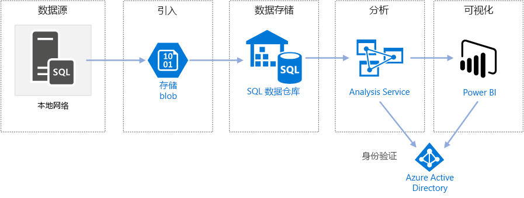

# 将 Azure 中的 Enterprise BI 与 SQL 数据仓库配合使用

此参考体系结构实现 [ELT](../../data-guide/relational-data/etl.md#extract-load-and-transform-elt)（提取-加载-转换）管道，该管道可将数据从本地 SQL Server 数据库移到 SQL 数据仓库，并转换数据以进行分析。 

[GitHub][github-folder] 中提供了本体系结构的参考实现

**场景**：某个组织在本地的 SQL Server 数据库中存储了大型 OLTP 数据集。 该组织想要使用 SQL 数据仓库通过 Power BI 执行分析。 

此参考体系结构是针对一次性或按需作业设计的。 如果需要持续移动数据（每小时或每日），我们建议使用 Azure 数据工厂来定义自动化工作流。 如需使用数据工厂的参考体系结构，请参阅[将自动化企业 BI 与 SQL 数据仓库和 Azure 数据工厂配合使用][adf-ra]。

## 体系结构

该体系结构包括以下组件。

### 数据源

**SQL Server**。 源数据位于本地的 SQL Server 数据库中。 为了模拟本地环境，此体系结构的部署脚本将在 Azure 中预配一个装有 SQL Server 的 VM。 [Wide World Importers OLTP 示例数据库][wwi]用作源数据库。

### 引入和数据存储

**Blob 存储**。 Blob 存储用作临时区域，在将数据载入 SQL 数据仓库之前，会先将数据复制到该区域。

**Azure SQL 数据仓库**。 [SQL 数据仓库](/azure/sql-data-warehouse/)是分布式系统，旨在对大型数据执行分析。 它支持大规模并行处理 (MPP)，因此很适合用于运行高性能分析。 

### 分析和报告

**Azure Analysis Services**。 [Analysis Services](/azure/analysis-services/) 是提供数据建模功能的完全托管服务。 使用 Analysis Services 能够创建用户可查询的语义模型。 Analysis Services 在 BI 仪表板场景中尤其有用。 在此体系结构中，Analysis Services 从数据仓库读取数据以处理语义模型，并有效地为仪表板查询提供服务。 它还通过横向扩展副本来加快查询处理的速度，以支持弹性并发性。

目前，Azure Analysis Services 支持表格模型，但不支持多维模型。 表格模型使用关系建模构造（表和列），而多维模型使用 OLAP 建模构造（多维数据集、维度和度量值）。 如果需要多维模型，请使用 SQL Server Analysis Services (SSAS)。 有关详细信息，请参阅[表格和多维解决方案的比较](/sql/analysis-services/comparing-tabular-and-multidimensional-solutions-ssas)。

**Power BI**。 Power BI 是一套商业分析工具，用于分析数据以获取商业见解。 在此体系结构中，Power BI 查询 Analysis Services 中存储的语义模型。

### 身份验证

**Azure Active Directory** (Azure AD) 通过 Power BI 对连接到 Analysis Services 服务器的用户进行身份验证。

## 数据管道
 
此参考体系结构使用 [WorldWideImporters](/sql/sample/world-wide-importers/wide-world-importers-oltp-database) 示例数据库作为数据源。 数据管道具有以下阶段：

1. 将数据从 SQL Server 导出到平面文件（bcp 实用工具）。
2. 将平面文件复制到 Azure Blob 存储 (AzCopy)。
3. 将数据载入 SQL 数据仓库 (PolyBase)。
4. 将数据转换为星型架构 (T-SQL)。
5. 将语义模型载入 Analysis Services (SQL Server Data Tools)。

 
> [!NOTE]
> 对于步骤 1 &ndash; 3，请考虑使用 Redgate Data Platform Studio。 Data Platform Studio 应用了适当的兼容性修补程序和优化措施，可以快速启动 SQL 数据仓库操作。 有关详细信息，请参阅[使用 Redgate Data Platform Studio 加载数据](/azure/sql-data-warehouse/sql-data-warehouse-load-with-redgate)。 

后续部分将会更详细地介绍这些阶段。

### 从 SQL Server 导出数据

使用 [bcp](/sql/tools/bcp-utility)（批量复制程序）实用工具可以从 SQL 表快速创建平面文本文件。 在此步骤中，请选择想要导出的列，但不要转换数据。 所有数据转换应在 SQL 数据仓库中进行。

**建议**

请尽量将数据提取安排在非高峰期，以最大程度地减少生产环境中的资源争用情况。 

避免在数据库服务器上运行 bcp， 应该从另一台计算机运行 bcp。 将文件写入本地驱动器。 确保有足够的 I/O 资源用于处理并发写入。 为获得最佳性能，请将文件导出到专用的高速存储驱动器。

以 Gzip 压缩格式保存导出的数据可以加速网络传输。 但是，将压缩文件载入仓库的速度比加载非压缩文件要慢，因此，加快网络传输速度与加快加载速度之间各有利弊。 如果决定使用 Gzip 压缩，请不要创建单个 Gzip 文件， 而是将数据拆分为多个压缩文件。

### 将平面文件复制到 Blob 存储中

[AzCopy](/azure/storage/common/storage-use-azcopy) 实用工具旨在以较高的性能将数据复制到 Azure Blob 存储。

**建议**

在靠近源数据位置的区域中创建存储帐户。 在同一区域中部署存储帐户和 SQL 数据仓库实例。 

不要在运行生产工作负荷的同一台计算机上运行 AzCopy，因为 CPU 和 I/O 消耗可能会干扰生产工作负荷。 

首先测试上传，以确定大致的上传速度。 可以在 AzCopy 中使用 /NC 选项来指定并发复制操作的数目。 使用默认值启动，然后使用此设置进行试验，以优化性能。 在低带宽环境中，过多的并发操作可能会使网络连接瘫痪，并导致操作无法彻底完成。  

AzCopy 通过公共 Internet 将数据移到存储中。 如果速度不够快，请考虑设置 [ExpressRoute](/azure/expressroute/) 线路。 ExpressRoute 是通过专用连接将数据路由到 Azure 的服务。 如果网络连接速度太慢，可以采用另一种做法，即以物理方式将磁盘上的数据传送到 Azure 数据中心。 有关详细信息，请参阅[将数据传入和传出 Azure](/azure/architecture/data-guide/scenarios/data-transfer)。

在执行复制操作期间，AzCopy 将创建一个临时日记文件，使 AzCopy 在操作中断（例如，由于网络错误）时重启操作。 确保有足够的磁盘空间用于存储日记文件。 可以使用 /Z 选项指定日记文件的写入位置。

### 将数据载入 SQL 数据仓库

使用 [PolyBase](/sql/relational-databases/polybase/polybase-guide) 将文件从 Blob 存储载入数据仓库。 PolyBase 利用 SQL 数据仓库的 MPP（大规模并行处理）体系结构，因此是将数据载入 Azure SQL 数据仓库的最快方式。 

加载数据的过程包括两个步骤：

1. 为数据创建一组外部表。 外部表是指向仓库外部存储的数据（在本例中，为 Blob 存储中的平面文件）的表定义。 此步骤不会将任何数据移入仓库。
2. 创建临时表，并将数据载入临时表。 此步骤将数据复制到仓库中。

**建议**

如果有大量的数据（超过 1 TB），并在运行受益于并行度的分析工作负荷，请考虑使用 SQL 数据仓库。 SQL 数据仓库并不很适合 OLTP 工作负荷或较小的数据集（小于 250 GB）。 对于小于 250 GB 的数据集，请考虑使用 Azure SQL 数据库或 SQL Server。 有关详细信息，请参阅[数据仓库](../../data-guide/relational-data/data-warehousing.md)。

将临时表创建为未编制索引的堆表。 创建生产表的查询将导致全表扫描，因此没有理由为临时表编制索引。

PolyBase 自动利用仓库中的并行度。 负载性能会随着 DWU 的增加而扩展。 为获得最佳性能，请使用单个加载操作。 将输入数据分解为区块和运行多个并发负载不会带来任何性能优势。

PolyBase 可以读取 Gzip 压缩文件。 但是，只会对每个压缩文件使用单个读取器，因为解压缩文件是单线程操作。 因此，请避免加载单个大型压缩文件。 应该将数据拆分为多个压缩文件，以利用并行度。 

注意以下限制：

- PolyBase 支持的最大列大小为 `varchar(8000)`、`nvarchar(4000)` 或 `varbinary(8000)`。 如果数据超过这些限制，一种做法是在导出数据时将数据分解为区块，然后在导入后重新汇编区块。 

- PolyBase 使用固定行终止符 \n 或换行符。 如果源数据中显示换行符，则可能会导致问题。

- 源数据架构可能包含 SQL 数据仓库中不支持的数据类型。

若要解决这些限制，可以创建一个执行所需转换的存储过程。 运行 bcp 时引用此存储过程。 或者，使用 [Redgate Data Platform Studio](/azure/sql-data-warehouse/sql-data-warehouse-load-with-redgate) 自动转换 SQL 数据仓库中不支持的数据类型。

有关详细信息，请参阅以下文章：

- [将数据载入 Azure SQL 数据仓库的最佳做法](/azure/sql-data-warehouse/guidance-for-loading-data)
- [将架构迁移到 SQL 数据仓库](/azure/sql-data-warehouse/sql-data-warehouse-migrate-schema)
- [有关为 SQL 数据仓库中的表定义数据类型的指南](/azure/sql-data-warehouse/sql-data-warehouse-tables-data-types)

### 转换数据

转换数据，并将其移入生产表。 在此步骤中，数据将转换为包含维度表和事实数据表且适用于语义建模的星型架构。

创建具有聚集列存储索引并提供最佳整体查询性能的生产表。 列存储索引已针对扫描大量记录的查询进行优化。 列存储索引并不是很适合用于单一实例查找（即，查找单个行）。 如果需要执行频繁的单一实例查找，可以在表中添加非聚集索引。 使用非聚集索引能够明显加快单一实例查找的运行速度。 但是，与在 OLTP 工作负荷中相比，单一实例查找在数据仓库场景中通常不太常见。 有关详细信息，请参阅[为 SQL 数据仓库中的表编制索引](/azure/sql-data-warehouse/sql-data-warehouse-tables-index)。

> [!NOTE]
> 聚集列存储表不支持 `varchar(max)`、`nvarchar(max)` 或 `varbinary(max)` 数据类型。 在这种情况下，请考虑堆或聚集索引。 可将这些列放入单独的表中。

由于示例数据库不是很大，因此我们创建了不带分区的复制表。 对于生产工作负荷，使用分布式表可能会提高查询性能。 请参阅[有关在 Azure SQL 数据仓库中设计分布式表的指南](/azure/sql-data-warehouse/sql-data-warehouse-tables-distribute)。 示例脚本使用静态[资源类](/azure/sql-data-warehouse/resource-classes-for-workload-management)运行查询。

### 加载语义模型

将数据载入 Azure Analysis Services 中的表格模型。 在此步骤中，我们将使用 SQL Server Data Tools (SSDT) 创建语义数据模型。 也可以通过从 Power BI Desktop 文件导入一个模型来创建该模型。 由于 SQL 数据仓库不支持外键，因为必须将关系添加到语义模型，以便可以跨表联接。

### 使用 Power BI 将数据可视化

Power BI 支持使用两个选项连接到 Azure Analysis Services：

- 导入。 将数据导入 Power BI 模型。
- 实时连接。 直接从 Analysis Services 提取数据。

我们建议使用“实时连接”，因为此选项不需要将数据复制到 Power BI 模型中。 此外，使用 DirectQuery 可确保结果始终与最新源数据保持一致。 有关详细信息，请参阅[使用 Power BI 进行连接](/azure/analysis-services/analysis-services-connect-pbi)。

**建议**

避免直接对数据仓库运行 BI 仪表板查询。 BI 仪表板要求的响应时间很短，针对仓库直接运行查询可能无法满足该要求。 此外，刷新仪表板的操作将计入并发查询次数，这可能会影响性能。 

Azure Analysis Services 旨在处理 BI 仪表板的查询要求，因此建议的做法是从 Power BI 查询 Analysis Services。

## 可伸缩性注意事项

### SQL 数据仓库

使用 SQL 数据仓库可以按需横向扩展计算资源。 查询引擎基于计算节点数目优化并行处理的查询，并按需在节点之间移动数据。 有关详细信息，请参阅[管理 Azure SQL 数据仓库中的计算资源](/azure/sql-data-warehouse/sql-data-warehouse-manage-compute-overview)。

### Analysis Services

对于生产工作负荷，我们建议使用 Azure Analysis Services 的标准层，因为该层支持分区和 DirectQuery。 在层中，实例大小确定内存和处理能力。 处理能力以查询处理单位 (QPU) 来计量。 请监视 QPU 使用率以选择适当的大小。 有关详细信息，请参阅[监视服务器指标](/azure/analysis-services/analysis-services-monitor)。

在负载较高的情况下，查询性能可能因查询并发性而下降。 可以通过创建副本池来处理查询，以横向扩展 Analysis Services，从而能够并行执行更多的查询。 处理数据模型的工作始终在主服务器上进行。 默认情况下，主服务器也会处理查询。 （可选）可以指定以独占方式运行处理的主服务器，让查询池处理所有查询。 如果处理要求较高，应将处理负载与查询池隔离开来。 如果查询负载较高，而处理负载相对较低，则可以在查询池中包含主服务器。 有关详细信息，请参阅 [Azure Analysis Services 横向扩展](/azure/analysis-services/analysis-services-scale-out)。 

若要减少不必要的处理量，请考虑使用分区将表格模型划分为逻辑部分。 可以单独处理每个分区。 有关详细信息，请参阅[分区](/sql/analysis-services/tabular-models/partitions-ssas-tabular)。

## 安全注意事项

### Analysis Services 客户端的 IP 允许列表

考虑使用 Analysis Services 防火墙功能将客户端 IP 地址加入允许列表。 如果已启用防火墙，防火墙会阻止其规则中指定的连接以外的所有客户端连接。 默认规则会将 Power BI 服务加入允许列表，但你可以根据需要禁用此规则。 有关详细信息，请参阅[使用新防火墙功能强化 Azure Analysis Services](https://azure.microsoft.com/blog/hardening-azure-analysis-services-with-the-new-firewall-capability/)。

### 授权

Azure Analysis Services 使用 Azure Active Directory (Azure AD) 对连接到 Analysis Services 服务器的用户进行身份验证。 可以通过创建角色，然后将 Azure AD 用户或组分配到这些角色，来限制特定的用户可以查看哪些数据。 对于每个角色，可以： 

- 保护表或单个列。 
- 基于筛选表达式保护单个行。 

有关详细信息，请参阅[管理数据库角色和用户](/azure/analysis-services/analysis-services-database-users)。

## 部署解决方案

若要部署并运行参考实现，请按 [GitHub 自述文件][github-folder]中的步骤操作。 它将部署以下部分：

  * 一个用于模拟本地数据库服务器的 Windows VM。 该 VM 包含 SQL Server 2017 和相关工具以及 Power BI Desktop。
  * 一个 Azure 存储帐户。该帐户提供 Blob 存储用于保存从 SQL Server 数据库导出的数据。
  * 一个 Azure SQL 数据仓库实例。
  * 一个 Azure Analysis Services 实例。

## 后续步骤

- 使用 Azure 数据工厂将 ELT 管道自动化。 请参阅[将自动化企业 BI 与 SQL 数据仓库和 Azure 数据工厂配合使用][adf-ra]。

<!-- links -->

[adf-ra]: ./enterprise-bi-adf.md
[github-folder]: https://github.com/mspnp/reference-architectures/tree/master/data/enterprise_bi_sqldw
[wwi]: /sql/sample/world-wide-importers/wide-world-importers-oltp-database

