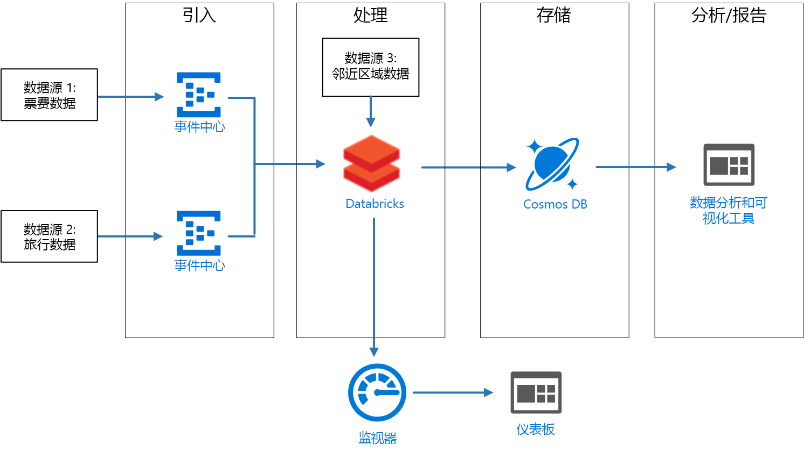
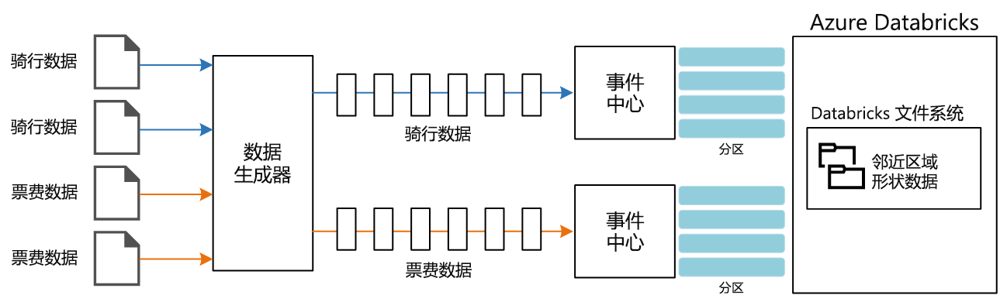

# <a name="stream-processing-with-azure-databricks"></a><span data-ttu-id="5f868-103">使用 Azure Databricks 进行流处理</span><span class="sxs-lookup"><span data-stu-id="5f868-103">Stream processing with Azure Databricks</span></span>

<span data-ttu-id="5f868-104">本参考体系结构演示一个端到端[流处理](/azure/architecture/data-guide/big-data/real-time-processing)管道。</span><span class="sxs-lookup"><span data-stu-id="5f868-104">This reference architecture shows an end-to-end [stream processing](/azure/architecture/data-guide/big-data/real-time-processing) pipeline.</span></span> <span data-ttu-id="5f868-105">此类管道包括四个阶段：引入、处理、存储，以及分析和报告。</span><span class="sxs-lookup"><span data-stu-id="5f868-105">This type of pipeline has four stages: ingest, process, store, and analysis and reporting.</span></span> <span data-ttu-id="5f868-106">本参考体系结构中的管道从两个源引入数据，针对每个流中的相关记录执行联接，丰富结果，然后实时计算平均值。</span><span class="sxs-lookup"><span data-stu-id="5f868-106">For this reference architecture, the pipeline ingests data from two sources, performs a join on related records from each stream, enriches the result, and calculates an average in real time.</span></span> <span data-ttu-id="5f868-107">将存储结果以供进一步分析。</span><span class="sxs-lookup"><span data-stu-id="5f868-107">The results are stored for further analysis.</span></span> [<span data-ttu-id="5f868-108">**部署此解决方案**。</span><span class="sxs-lookup"><span data-stu-id="5f868-108">**Deploy this solution**.</span></span>](#deploy-the-solution)



<span data-ttu-id="5f868-109">**场景**：某家出租车公司需要收集有关出租车的每次行程的数据。</span><span class="sxs-lookup"><span data-stu-id="5f868-109">**Scenario**: A taxi company collects data about each taxi trip.</span></span> <span data-ttu-id="5f868-110">对于此场景，我们假设有两个不同的设备在发送数据。</span><span class="sxs-lookup"><span data-stu-id="5f868-110">For this scenario, we assume there are two separate devices sending data.</span></span> <span data-ttu-id="5f868-111">出租车的计量表发送有关每次行程的信息 &mdash; 持续时间、距离以及上车和下车地点。</span><span class="sxs-lookup"><span data-stu-id="5f868-111">The taxi has a meter that sends information about each ride &mdash; the duration, distance, and pickup and dropoff locations.</span></span> <span data-ttu-id="5f868-112">有一个单独的设备接受客户的付款，并发送有关费用的数据。</span><span class="sxs-lookup"><span data-stu-id="5f868-112">A separate device accepts payments from customers and sends data about fares.</span></span> <span data-ttu-id="5f868-113">为了绘制行程趋势图，该出租车公司想要实时计算每个周边区域的每英里平均小费。</span><span class="sxs-lookup"><span data-stu-id="5f868-113">To spot ridership trends, the taxi company wants to calculate the average tip per mile driven, in real time, for each neighborhood.</span></span>

## <a name="architecture"></a><span data-ttu-id="5f868-114">体系结构</span><span class="sxs-lookup"><span data-stu-id="5f868-114">Architecture</span></span>

<span data-ttu-id="5f868-115">该体系结构包括以下组件。</span><span class="sxs-lookup"><span data-stu-id="5f868-115">The architecture consists of the following components.</span></span>

<span data-ttu-id="5f868-116">**数据源**。</span><span class="sxs-lookup"><span data-stu-id="5f868-116">**Data sources**.</span></span> <span data-ttu-id="5f868-117">在此体系结构中，有两个数据源实时生成数据流。</span><span class="sxs-lookup"><span data-stu-id="5f868-117">In this architecture, there are two data sources that generate data streams in real time.</span></span> <span data-ttu-id="5f868-118">第一个流包含行程信息，第二个流包含费用信息。</span><span class="sxs-lookup"><span data-stu-id="5f868-118">The first stream contains ride information, and the second contains fare information.</span></span> <span data-ttu-id="5f868-119">该参考体系结构包含一个模拟的数据生成器，该生成器读取一组静态文件，并将数据推送到事件中心。</span><span class="sxs-lookup"><span data-stu-id="5f868-119">The reference architecture includes a simulated data generator that reads from a set of static files and pushes the data to Event Hubs.</span></span> <span data-ttu-id="5f868-120">实际应用中的数据源是安装在出租车内部的设备。</span><span class="sxs-lookup"><span data-stu-id="5f868-120">The data sources in a real application would be devices installed in the taxi cabs.</span></span>

<span data-ttu-id="5f868-121">**Azure 事件中心**。</span><span class="sxs-lookup"><span data-stu-id="5f868-121">**Azure Event Hubs**.</span></span> <span data-ttu-id="5f868-122">[事件中心](/azure/event-hubs/)是一个事件引入服务。</span><span class="sxs-lookup"><span data-stu-id="5f868-122">[Event Hubs](/azure/event-hubs/) is an event ingestion service.</span></span> <span data-ttu-id="5f868-123">此体系结构使用两个事件中心实例，每个数据源各对应一个。</span><span class="sxs-lookup"><span data-stu-id="5f868-123">This architecture uses two event hub instances, one for each data source.</span></span> <span data-ttu-id="5f868-124">每个数据源将数据流发送到关联的事件中心。</span><span class="sxs-lookup"><span data-stu-id="5f868-124">Each data source sends a stream of data to the associated event hub.</span></span>

<span data-ttu-id="5f868-125">**Azure Databricks**。</span><span class="sxs-lookup"><span data-stu-id="5f868-125">**Azure Databricks**.</span></span> <span data-ttu-id="5f868-126">[Databricks](/azure/azure-databricks/) 是基于 Apache Spark 的分析平台，已针对 Microsoft Azure 云服务平台进行优化。</span><span class="sxs-lookup"><span data-stu-id="5f868-126">[Databricks](/azure/azure-databricks/) is an Apache Spark-based analytics platform optimized for the Microsoft Azure cloud services platform.</span></span> <span data-ttu-id="5f868-127">Databricks 用于关联出租车行程数据和费用数据，以及使用 Databricks 文件系统中存储的周边区域数据丰富关联的数据。</span><span class="sxs-lookup"><span data-stu-id="5f868-127">Databricks is used to correlate of the taxi ride and fare data, and also to enrich the correlated data with neighborhood data stored in the Databricks file system.</span></span>

<span data-ttu-id="5f868-128">**Cosmos DB**。</span><span class="sxs-lookup"><span data-stu-id="5f868-128">**Cosmos DB**.</span></span> <span data-ttu-id="5f868-129">Azure Databricks 作业的输出是使用 Cassandra API 写入到 [Cosmos DB](/azure/cosmos-db/) 的一系列记录。</span><span class="sxs-lookup"><span data-stu-id="5f868-129">The output from Azure Databricks job is a series of records, which are written to [Cosmos DB](/azure/cosmos-db/) using the Cassandra API.</span></span> <span data-ttu-id="5f868-130">之所以使用 Cassandra API，是因为它支持时序数据建模。</span><span class="sxs-lookup"><span data-stu-id="5f868-130">The Cassandra API is used because it supports time series data modeling.</span></span>

<span data-ttu-id="5f868-131">**Azure Log Analytics**。</span><span class="sxs-lookup"><span data-stu-id="5f868-131">**Azure Log Analytics**.</span></span> <span data-ttu-id="5f868-132">[Azure Monitor](/azure/monitoring-and-diagnostics/) 收集的应用程序日志数据存储在 [Log Analytics 工作区](/azure/log-analytics)中。</span><span class="sxs-lookup"><span data-stu-id="5f868-132">Application log data collected by [Azure Monitor](/azure/monitoring-and-diagnostics/) is stored in a [Log Analytics workspace](/azure/log-analytics).</span></span> <span data-ttu-id="5f868-133">可以使用 Log Analytics 来分析和可视化指标，以及检查日志消息以确定应用程序中的问题。</span><span class="sxs-lookup"><span data-stu-id="5f868-133">Log Analytics queries can be used to analyze and visualize metrics and inspect log messages to identify issues within the application.</span></span>

## <a name="data-ingestion"></a><span data-ttu-id="5f868-134">数据引入</span><span class="sxs-lookup"><span data-stu-id="5f868-134">Data ingestion</span></span>

<span data-ttu-id="5f868-135">为了模拟数据源，此参考体系结构使用了[纽约市出租车数据](https://uofi.app.box.com/v/NYCtaxidata/folder/2332218797)数据集<sup>[[1]](#note1)</sup>。</span><span class="sxs-lookup"><span data-stu-id="5f868-135">To simulate a data source, this reference architecture uses the [New York City Taxi Data](https://uofi.app.box.com/v/NYCtaxidata/folder/2332218797) dataset<sup>[[1]](#note1)</sup>.</span></span> <span data-ttu-id="5f868-136">此数据集包含纽约市过去四年（2010 年 &ndash; 2013 年）的出租车行程数据。</span><span class="sxs-lookup"><span data-stu-id="5f868-136">This dataset contains data about taxi trips in New York City over a four-year period (2010 &ndash; 2013).</span></span> <span data-ttu-id="5f868-137">其包含两种类型的记录：行程数据和费用数据。</span><span class="sxs-lookup"><span data-stu-id="5f868-137">It contains two types of record: Ride data and fare data.</span></span> <span data-ttu-id="5f868-138">行程数据包括行程持续时间、行程距离以及上车和下车地点。</span><span class="sxs-lookup"><span data-stu-id="5f868-138">Ride data includes trip duration, trip distance, and pickup and dropoff location.</span></span> <span data-ttu-id="5f868-139">费用数据包括乘车费、税费和小费金额。</span><span class="sxs-lookup"><span data-stu-id="5f868-139">Fare data includes fare, tax, and tip amounts.</span></span> <span data-ttu-id="5f868-140">这两种记录类型中的通用字段包括牌照号、出租车驾照和供应商 ID。</span><span class="sxs-lookup"><span data-stu-id="5f868-140">Common fields in both record types include medallion number, hack license, and vendor ID.</span></span> <span data-ttu-id="5f868-141">这三个字段相结合，唯一标识了出租车和驾驶员。</span><span class="sxs-lookup"><span data-stu-id="5f868-141">Together these three fields uniquely identify a taxi plus a driver.</span></span> <span data-ttu-id="5f868-142">数据以 CSV 格式存储。</span><span class="sxs-lookup"><span data-stu-id="5f868-142">The data is stored in CSV format.</span></span> 

<span data-ttu-id="5f868-143">数据生成器是一个读取记录并将其发送到 Azure 事件中心的 .NET Core 应用程序。</span><span class="sxs-lookup"><span data-stu-id="5f868-143">The data generator is a .NET Core application that reads the records and sends them to Azure Event Hubs.</span></span> <span data-ttu-id="5f868-144">该生成器发送 JSON 格式的行程数据以及 CSV 格式的费用数据。</span><span class="sxs-lookup"><span data-stu-id="5f868-144">The generator sends ride data in JSON format and fare data in CSV format.</span></span> 

<span data-ttu-id="5f868-145">事件中心使用[分区](/azure/event-hubs/event-hubs-features#partitions)将数据分段。</span><span class="sxs-lookup"><span data-stu-id="5f868-145">Event Hubs uses [partitions](/azure/event-hubs/event-hubs-features#partitions) to segment the data.</span></span> <span data-ttu-id="5f868-146">使用者可以通过分区功能并行读取每个分区。</span><span class="sxs-lookup"><span data-stu-id="5f868-146">Partitions allow a consumer to read each partition in parallel.</span></span> <span data-ttu-id="5f868-147">将数据发送到事件中心时，可以显式指定分区键。</span><span class="sxs-lookup"><span data-stu-id="5f868-147">When you send data to Event Hubs, you can specify the partition key explicitly.</span></span> <span data-ttu-id="5f868-148">否则，记录将以循环方式分配到分区。</span><span class="sxs-lookup"><span data-stu-id="5f868-148">Otherwise, records are assigned to partitions in round-robin fashion.</span></span> 

<span data-ttu-id="5f868-149">在此场景中，给定出租车的行程数据和费用数据最终会获得相同的分区 ID。</span><span class="sxs-lookup"><span data-stu-id="5f868-149">In this scenario, ride data and fare data should end up with the same partition ID for a given taxi cab.</span></span> <span data-ttu-id="5f868-150">这样，在关联两个流时，Databricks 可以应用某种并行度。</span><span class="sxs-lookup"><span data-stu-id="5f868-150">This enables Databricks to apply a degree of parallelism when it correlates the two streams.</span></span> <span data-ttu-id="5f868-151">行程数据分区 *n* 中的记录将与费用数据分区 *n* 中的记录进行匹配。</span><span class="sxs-lookup"><span data-stu-id="5f868-151">A record in partition *n* of the ride data will match a record in partition *n* of the fare data.</span></span>



<span data-ttu-id="5f868-152">在数据生成器中，这两种记录类型的通用数据模型具有 `PartitionKey` 属性，该属性是 `Medallion`、`HackLicense` 和 `VendorId` 的串联形式。</span><span class="sxs-lookup"><span data-stu-id="5f868-152">In the data generator, the common data model for both record types has a `PartitionKey` property that is the concatenation of `Medallion`, `HackLicense`, and `VendorId`.</span></span>

```csharp
public abstract class TaxiData
{
    public TaxiData()
    {
    }

    [JsonProperty]
    public long Medallion { get; set; }

    [JsonProperty]
    public long HackLicense { get; set; }

    [JsonProperty]
    public string VendorId { get; set; }

    [JsonProperty]
    public DateTimeOffset PickupTime { get; set; }

    [JsonIgnore]
    public string PartitionKey
    {
        get => $"{Medallion}_{HackLicense}_{VendorId}";
    }
```

<span data-ttu-id="5f868-153">将数据发送到事件中心时，会使用此属性来提供显式分区键：</span><span class="sxs-lookup"><span data-stu-id="5f868-153">This property is used to provide an explicit partition key when sending to Event Hubs:</span></span>

```csharp
using (var client = pool.GetObject())
{
    return client.Value.SendAsync(new EventData(Encoding.UTF8.GetBytes(
        t.GetData(dataFormat))), t.PartitionKey);
}
```

### <a name="event-hubs"></a><span data-ttu-id="5f868-154">事件中心</span><span class="sxs-lookup"><span data-stu-id="5f868-154">Event Hubs</span></span>

<span data-ttu-id="5f868-155">事件中心的吞吐量容量以[吞吐量单位](/azure/event-hubs/event-hubs-features#throughput-units)来度量。</span><span class="sxs-lookup"><span data-stu-id="5f868-155">The throughput capacity of Event Hubs is measured in [throughput units](/azure/event-hubs/event-hubs-features#throughput-units).</span></span> <span data-ttu-id="5f868-156">可以通过启用[自动扩充](/azure/event-hubs/event-hubs-auto-inflate)来自动缩放事件中心。自动扩充可以根据流量，最高将吞吐量单位自动扩展到配置的上限。</span><span class="sxs-lookup"><span data-stu-id="5f868-156">You can autoscale an event hub by enabling [auto-inflate](/azure/event-hubs/event-hubs-auto-inflate), which automatically scales the throughput units based on traffic, up to a configured maximum.</span></span> 

## <a name="stream-processing"></a><span data-ttu-id="5f868-157">流处理</span><span class="sxs-lookup"><span data-stu-id="5f868-157">Stream processing</span></span>

<span data-ttu-id="5f868-158">在 Azure Databricks 中，数据处理由某个作业执行。</span><span class="sxs-lookup"><span data-stu-id="5f868-158">In Azure Databricks, data processing is performed by a job.</span></span> <span data-ttu-id="5f868-159">该作业分配到群集并在其上运行。</span><span class="sxs-lookup"><span data-stu-id="5f868-159">The job is assigned to and runs on a cluster.</span></span> <span data-ttu-id="5f868-160">作业可以是以 Java 编写的自定义代码，或 Spark [笔记本](https://docs.databricks.com/user-guide/notebooks/index.html)。</span><span class="sxs-lookup"><span data-stu-id="5f868-160">The job can either be custom code written in Java, or a Spark [notebook](https://docs.databricks.com/user-guide/notebooks/index.html).</span></span>

<span data-ttu-id="5f868-161">在本参考体系结构中，作业是一个 Java 存档，其中包含以 Java 和 Scala 编写的类。</span><span class="sxs-lookup"><span data-stu-id="5f868-161">In this reference architecture, the job is a Java archive with classes written in both Java and Scala.</span></span> <span data-ttu-id="5f868-162">为 Databricks 作业指定 Java 存档时，将指定该类，让 Databricks 群集执行。</span><span class="sxs-lookup"><span data-stu-id="5f868-162">When specifying the Java archive for a Databricks job, the class is specified for execution by the Databricks cluster.</span></span> <span data-ttu-id="5f868-163">此处，**com.microsoft.pnp.TaxiCabReader** 类的 **main** 方法包含数据处理逻辑。</span><span class="sxs-lookup"><span data-stu-id="5f868-163">Here, the **main** method of the **com.microsoft.pnp.TaxiCabReader** class contains the data processing logic.</span></span> 

### <a name="reading-the-stream-from-the-two-event-hub-instances"></a><span data-ttu-id="5f868-164">从两个事件中心实例读取流</span><span class="sxs-lookup"><span data-stu-id="5f868-164">Reading the stream from the two event hub instances</span></span>

<span data-ttu-id="5f868-165">数据处理逻辑使用 [Spark 结构化流](https://spark.apache.org/docs/2.1.2/structured-streaming-programming-guide.html)从两个 Azure 事件中心实例读取数据：</span><span class="sxs-lookup"><span data-stu-id="5f868-165">The data processing logic uses [Spark structured streaming](https://spark.apache.org/docs/2.1.2/structured-streaming-programming-guide.html) to read from the two Azure event hub instances:</span></span>

```scala
val rideEventHubOptions = EventHubsConf(rideEventHubConnectionString)
      .setConsumerGroup(conf.taxiRideConsumerGroup())
      .setStartingPosition(EventPosition.fromStartOfStream)
    val rideEvents = spark.readStream
      .format("eventhubs")
      .options(rideEventHubOptions.toMap)
      .load

    val fareEventHubOptions = EventHubsConf(fareEventHubConnectionString)
      .setConsumerGroup(conf.taxiFareConsumerGroup())
      .setStartingPosition(EventPosition.fromStartOfStream)
    val fareEvents = spark.readStream
      .format("eventhubs")
      .options(fareEventHubOptions.toMap)
      .load
```

### <a name="enriching-the-data-with-the-neighborhood-information"></a><span data-ttu-id="5f868-166">使用周边区域信息丰富数据</span><span class="sxs-lookup"><span data-stu-id="5f868-166">Enriching the data with the neighborhood information</span></span>

<span data-ttu-id="5f868-167">行程数据包括上车和下车地点的纬度与经度坐标。</span><span class="sxs-lookup"><span data-stu-id="5f868-167">The ride data includes the latitude and longitude coordinates of the pick up and drop off locations.</span></span> <span data-ttu-id="5f868-168">尽管这些坐标很有用，但不可轻松用于分析。</span><span class="sxs-lookup"><span data-stu-id="5f868-168">While these coordinates are useful, they are not easily consumed for analysis.</span></span> <span data-ttu-id="5f868-169">因此，已使用从[形状文件](https://en.wikipedia.org/wiki/Shapefile)读取的周边区域数据丰富了这些数据。</span><span class="sxs-lookup"><span data-stu-id="5f868-169">Therefore, this data is enriched with neighborhood data that is read from a [shapefile](https://en.wikipedia.org/wiki/Shapefile).</span></span> 

<span data-ttu-id="5f868-170">形状文件采用二进制格式且不可轻松分析，但 [GeoTools](http://geotools.org/) 库提供了相应的工具用于处理使用形状文件格式的地理空间数据。</span><span class="sxs-lookup"><span data-stu-id="5f868-170">The shapefile format is binary and not easily parsed, but the [GeoTools](http://geotools.org/) library provides tools for geospatial data that use the shapefile format.</span></span> <span data-ttu-id="5f868-171">**com.microsoft.pnp.GeoFinder** 类中使用了此库来根据上车和下车地点坐标确定周边区域名称。</span><span class="sxs-lookup"><span data-stu-id="5f868-171">This library is used in the **com.microsoft.pnp.GeoFinder** class to determine the neighborhood name based on the pick up and drop off coordinates.</span></span> 

```scala
val neighborhoodFinder = (lon: Double, lat: Double) => {
      NeighborhoodFinder.getNeighborhood(lon, lat).get()
    }
```

### <a name="joining-the-ride-and-fare-data"></a><span data-ttu-id="5f868-172">联接行程数据和费用数据</span><span class="sxs-lookup"><span data-stu-id="5f868-172">Joining the ride and fare data</span></span>

<span data-ttu-id="5f868-173">首先转换行程数据和费用数据：</span><span class="sxs-lookup"><span data-stu-id="5f868-173">First the ride and fare data is transformed:</span></span>

```scala
    val rides = transformedRides
      .filter(r => {
        if (r.isNullAt(r.fieldIndex("errorMessage"))) {
          true
        }
        else {
          malformedRides.add(1)
          false
        }
      })
      .select(
        $"ride.*",
        to_neighborhood($"ride.pickupLon", $"ride.pickupLat")
          .as("pickupNeighborhood"),
        to_neighborhood($"ride.dropoffLon", $"ride.dropoffLat")
          .as("dropoffNeighborhood")
      )
      .withWatermark("pickupTime", conf.taxiRideWatermarkInterval())

    val fares = transformedFares
      .filter(r => {
        if (r.isNullAt(r.fieldIndex("errorMessage"))) {
          true
        }
        else {
          malformedFares.add(1)
          false
        }
      })
      .select(
        $"fare.*",
        $"pickupTime"
      )
      .withWatermark("pickupTime", conf.taxiFareWatermarkInterval())
```

<span data-ttu-id="5f868-174">然后将行程数据与费用数据相联接：</span><span class="sxs-lookup"><span data-stu-id="5f868-174">And then the ride data is joined with the fare data:</span></span>

```scala
val mergedTaxiTrip = rides.join(fares, Seq("medallion", "hackLicense", "vendorId", "pickupTime"))
```

### <a name="processing-the-data-and-inserting-into-cosmos-db"></a><span data-ttu-id="5f868-175">处理数据并将其插入到 Cosmos DB</span><span class="sxs-lookup"><span data-stu-id="5f868-175">Processing the data and inserting into Cosmos DB</span></span>

<span data-ttu-id="5f868-176">按给定的时间间隔计算每个周边区域的平均费用金额：</span><span class="sxs-lookup"><span data-stu-id="5f868-176">The average fare amount for each neighborhood is calculated for a given time interval:</span></span>

```scala
val maxAvgFarePerNeighborhood = mergedTaxiTrip.selectExpr("medallion", "hackLicense", "vendorId", "pickupTime", "rateCode", "storeAndForwardFlag", "dropoffTime", "passengerCount", "tripTimeInSeconds", "tripDistanceInMiles", "pickupLon", "pickupLat", "dropoffLon", "dropoffLat", "paymentType", "fareAmount", "surcharge", "mtaTax", "tipAmount", "tollsAmount", "totalAmount", "pickupNeighborhood", "dropoffNeighborhood")
      .groupBy(window($"pickupTime", conf.windowInterval()), $"pickupNeighborhood")
      .agg(
        count("*").as("rideCount"),
        sum($"fareAmount").as("totalFareAmount"),
        sum($"tipAmount").as("totalTipAmount")
      )
      .select($"window.start", $"window.end", $"pickupNeighborhood", $"rideCount", $"totalFareAmount", $"totalTipAmount")
```

<span data-ttu-id="5f868-177">然后将此金额插入到 Cosmos DB：</span><span class="sxs-lookup"><span data-stu-id="5f868-177">Which is then inserted into Cosmos DB:</span></span>

```scala
maxAvgFarePerNeighborhood
      .writeStream
      .queryName("maxAvgFarePerNeighborhood_cassandra_insert")
      .outputMode(OutputMode.Append())
      .foreach(new CassandraSinkForeach(connector))
      .start()
      .awaitTermination()
```

## <a name="security-considerations"></a><span data-ttu-id="5f868-178">安全注意事项</span><span class="sxs-lookup"><span data-stu-id="5f868-178">Security considerations</span></span>

<span data-ttu-id="5f868-179">使用[管理员控制台](https://docs.databricks.com/administration-guide/admin-settings/index.html)控制对 Azure 数据库工作区的访问。</span><span class="sxs-lookup"><span data-stu-id="5f868-179">Access to the Azure Database workspace is controlled using the [administrator console](https://docs.databricks.com/administration-guide/admin-settings/index.html).</span></span> <span data-ttu-id="5f868-180">管理员控制台包含添加用户、管理用户权限和设置单一登录的功能。</span><span class="sxs-lookup"><span data-stu-id="5f868-180">The administrator console includes functionality to add users, manage user permissions, and set up single sign-on.</span></span> <span data-ttu-id="5f868-181">还可以通过管理员控制台设置工作区、群集、作业和表的访问控制。</span><span class="sxs-lookup"><span data-stu-id="5f868-181">Access control for workspaces, clusters, jobs, and tables can also be set through the administrator console.</span></span>

### <a name="managing-secrets"></a><span data-ttu-id="5f868-182">管理机密</span><span class="sxs-lookup"><span data-stu-id="5f868-182">Managing secrets</span></span>

<span data-ttu-id="5f868-183">Azure Databricks 包含一个用于存储机密（包括连接字符串、访问密钥、用户名和密码）的[机密存储](https://docs.azuredatabricks.net/user-guide/secrets/index.html)。</span><span class="sxs-lookup"><span data-stu-id="5f868-183">Azure Databricks includes a [secret store](https://docs.azuredatabricks.net/user-guide/secrets/index.html) that is used to store secrets, including connection strings, access keys, user names, and passwords.</span></span> <span data-ttu-id="5f868-184">Azure Databricks 机密存储中的机密按**范围**分区：</span><span class="sxs-lookup"><span data-stu-id="5f868-184">Secrets within the Azure Databricks secret store are partitioned by **scopes**:</span></span>

```bash
databricks secrets create-scope --scope "azure-databricks-job"
```

<span data-ttu-id="5f868-185">机密是在范围级别添加的：</span><span class="sxs-lookup"><span data-stu-id="5f868-185">Secrets are added at the scope level:</span></span>

```bash
databricks secrets put --scope "azure-databricks-job" --key "taxi-ride"
```

> [!NOTE]
> <span data-ttu-id="5f868-186">可以使用基于 Azure Key Vault 的范围来取代本机 Azure Databricks 范围。</span><span class="sxs-lookup"><span data-stu-id="5f868-186">An Azure Key Vault-backed scope can be used instead of the native Azure Databricks scope.</span></span> <span data-ttu-id="5f868-187">有关详细信息，请参阅[基于 Azure Key Vault 的范围](https://docs.azuredatabricks.net/user-guide/secrets/secret-scopes.html#azure-key-vault-backed-scopes)。</span><span class="sxs-lookup"><span data-stu-id="5f868-187">To learn more, see [Azure Key Vault-backed scopes](https://docs.azuredatabricks.net/user-guide/secrets/secret-scopes.html#azure-key-vault-backed-scopes).</span></span>

<span data-ttu-id="5f868-188">在代码中，可以通过 Azure Databricks [机密实用工具](https://docs.databricks.com/user-guide/dev-tools/dbutils.html#secrets-utilities)访问机密。</span><span class="sxs-lookup"><span data-stu-id="5f868-188">In code, secrets are accessed via the Azure Databricks [secrets utilities](https://docs.databricks.com/user-guide/dev-tools/dbutils.html#secrets-utilities).</span></span>


## <a name="monitoring-considerations"></a><span data-ttu-id="5f868-189">监视注意事项</span><span class="sxs-lookup"><span data-stu-id="5f868-189">Monitoring considerations</span></span>

<span data-ttu-id="5f868-190">Azure Databricks 基于 Apache Spark，两者都使用 [log4j](https://logging.apache.org/log4j/2.x/) 作为日志记录的标准库。</span><span class="sxs-lookup"><span data-stu-id="5f868-190">Azure Databricks is based on Apache Spark, and both use [log4j](https://logging.apache.org/log4j/2.x/) as the standard library for logging.</span></span> <span data-ttu-id="5f868-191">除了 Apache Spark 提供的默认日志记录以外，本参考体系结构还会将日志和指标发送到 [Azure Log Analytics](/azure/log-analytics/)。</span><span class="sxs-lookup"><span data-stu-id="5f868-191">In addition to the default logging provided by Apache Spark, this reference architecture sends logs and metrics to [Azure Log Analytics](/azure/log-analytics/).</span></span>

<span data-ttu-id="5f868-192">**com.microsoft.pnp.TaxiCabReader** 类将 Apache Spark 日志记录系统配置为使用 **log4j.properties** 文件中的值向 Azure Log Analytics 发送其日志。</span><span class="sxs-lookup"><span data-stu-id="5f868-192">The **com.microsoft.pnp.TaxiCabReader** class configures the Apache Spark logging system to send its logs to Azure Log Analytics using the values in the **log4j.properties** file.</span></span> <span data-ttu-id="5f868-193">Apache Spark 记录器消息为字符串，不过，Azure Log Analytics 要求日志消息采用 JSON 格式。</span><span class="sxs-lookup"><span data-stu-id="5f868-193">While the Apache Spark logger messages are strings, Azure Log Analytics requires log messages to be formatted as JSON.</span></span> <span data-ttu-id="5f868-194">**com.microsoft.pnp.log4j.LogAnalyticsAppender** 类可将这些消息转换为 JSON：</span><span class="sxs-lookup"><span data-stu-id="5f868-194">The **com.microsoft.pnp.log4j.LogAnalyticsAppender** class transforms these messages to JSON:</span></span>

```scala

    @Override
    protected void append(LoggingEvent loggingEvent) {
        if (this.layout == null) {
            this.setLayout(new JSONLayout());
        }

        String json = this.getLayout().format(loggingEvent);
        try {
            this.client.send(json, this.logType);
        } catch(IOException ioe) {
            LogLog.warn("Error sending LoggingEvent to Log Analytics", ioe);
        }
    }

```

<span data-ttu-id="5f868-195">**com.microsoft.pnp.TaxiCabReader** 类将处理行程和费用消息，如果其中一种消息的格式不当，则该消息无效。</span><span class="sxs-lookup"><span data-stu-id="5f868-195">As the **com.microsoft.pnp.TaxiCabReader** class processes ride and fare messages, it's possible that either one may be malformed and therefore not valid.</span></span> <span data-ttu-id="5f868-196">在生产环境中，必须分析这些格式不当的消息来识别数据源的问题，以便可以快速解决问题并防止数据丢失。</span><span class="sxs-lookup"><span data-stu-id="5f868-196">In a production environment, it's important to analyze these malformed messages to identify a problem with the data sources so it can be fixed quickly to prevent data loss.</span></span> <span data-ttu-id="5f868-197">**com.microsoft.pnp.TaxiCabReader** 类注册 Apache Spark Accumulator，该程序可以跟踪格式不当的费用记录和行程记录的数目：</span><span class="sxs-lookup"><span data-stu-id="5f868-197">The **com.microsoft.pnp.TaxiCabReader** class registers an Apache Spark Accumulator that keeps track of the number of malformed fare and ride records:</span></span>

```scala
    @transient val appMetrics = new AppMetrics(spark.sparkContext)
    appMetrics.registerGauge("metrics.malformedrides", AppAccumulators.getRideInstance(spark.sparkContext))
    appMetrics.registerGauge("metrics.malformedfares", AppAccumulators.getFareInstance(spark.sparkContext))
    SparkEnv.get.metricsSystem.registerSource(appMetrics)
```

<span data-ttu-id="5f868-198">Apache Spark 使用 Dropwizard 库发送指标；某些本机 Dropwizard 指标字段与 Azure Log Analytics 不兼容。</span><span class="sxs-lookup"><span data-stu-id="5f868-198">Apache Spark uses the Dropwizard library to send metrics, and some of the native Dropwizard metrics fields are incompatible with Azure Log Analytics.</span></span> <span data-ttu-id="5f868-199">因此，本参考体系结构包含了自定义的 Dropwizard 接收器和报告器。</span><span class="sxs-lookup"><span data-stu-id="5f868-199">Therefore, this reference architecture includes a custom Dropwizard sink and reporter.</span></span> <span data-ttu-id="5f868-200">它会根据 Azure Log Analytics 的预期设置指标格式。</span><span class="sxs-lookup"><span data-stu-id="5f868-200">It formats the metrics in the format expected by Azure Log Analytics.</span></span> <span data-ttu-id="5f868-201">当 Apache Spark 报告指标时，也会发送格式不当的行程数据和费用数据的自定义指标。</span><span class="sxs-lookup"><span data-stu-id="5f868-201">When Apache Spark reports metrics, the custom metrics for the malformed ride and fare data are also sent.</span></span>

<span data-ttu-id="5f868-202">要记录到 Azure Log Analytics 工作区的最后一个指标是 Spark 结构化流作业进度的累积进度。</span><span class="sxs-lookup"><span data-stu-id="5f868-202">The last metric to be logged to the Azure Log Analytics workspace is the cumulative progress of the Spark Structured Streaming job progress.</span></span> <span data-ttu-id="5f868-203">此指标是使用 **com.microsoft.pnp.StreamingMetricsListener** 类中实现的自定义 StreamingQuery 侦听器记录的。</span><span class="sxs-lookup"><span data-stu-id="5f868-203">This is done using a custom StreamingQuery listener implemented in the **com.microsoft.pnp.StreamingMetricsListener** class.</span></span> <span data-ttu-id="5f868-204">当作业运行时，此类将注册到 Apache Spark 会话：</span><span class="sxs-lookup"><span data-stu-id="5f868-204">This class is registered to the Apache Spark Session when the job runs:</span></span>

```scala
spark.streams.addListener(new StreamingMetricsListener())
```

<span data-ttu-id="5f868-205">每当发生结构化流事件、将日志消息和指标发送到 Azure Log Analytics 工作区时，Apache Spark 运行时都会调用 StreamingMetricsListener 中的方法。</span><span class="sxs-lookup"><span data-stu-id="5f868-205">The methods in the StreamingMetricsListener are called by the Apache Spark runtime whenever a structured steaming event occurs, sending log messages and metrics to the Azure Log Analytics workspace.</span></span> <span data-ttu-id="5f868-206">可在工作区中使用以下查询来监视应用程序：</span><span class="sxs-lookup"><span data-stu-id="5f868-206">You can use the following queries in your workspace to monitor the application:</span></span>

### <a name="latency-and-throughput-for-streaming-queries"></a><span data-ttu-id="5f868-207">流查询的延迟和吞吐量</span><span class="sxs-lookup"><span data-stu-id="5f868-207">Latency and throughput for streaming queries</span></span> 

```shell
taxijob_CL
| where TimeGenerated > startofday(datetime(<date>)) and TimeGenerated < endofday(datetime(<date>))
| project  mdc_inputRowsPerSecond_d, mdc_durationms_triggerExecution_d  
| render timechart
``` 
### <a name="exceptions-logged-during-stream-query-execution"></a><span data-ttu-id="5f868-208">流查询执行期间记录的异常</span><span class="sxs-lookup"><span data-stu-id="5f868-208">Exceptions logged during stream query execution</span></span>

```shell
taxijob_CL
| where TimeGenerated > startofday(datetime(<date>)) and TimeGenerated < endofday(datetime(<date>))
| where Level contains "Error" 
```

### <a name="accumulation-of-malformed-fare-and-ride-data"></a><span data-ttu-id="5f868-209">格式不当的费用和行程数据的累积数目</span><span class="sxs-lookup"><span data-stu-id="5f868-209">Accumulation of malformed fare and ride data</span></span>

```shell
SparkMetric_CL 
| where TimeGenerated > startofday(datetime(<date>)) and TimeGenerated < endofday(datetime(<date>))
| render timechart 
| where name_s contains "metrics.malformedrides"

SparkMetric_CL 
| where TimeGenerated > startofday(datetime(<date>)) and TimeGenerated < endofday(datetime(<date>))
| render timechart 
| where name_s contains "metrics.malformedfares" 
```

### <a name="job-execution-to-trace-resiliency"></a><span data-ttu-id="5f868-210">用于跟踪复原能力的作业执行</span><span class="sxs-lookup"><span data-stu-id="5f868-210">Job execution to trace resiliency</span></span>

```shell
SparkMetric_CL 
| where TimeGenerated > startofday(datetime(<date>)) and TimeGenerated < endofday(datetime(<date>))
| render timechart 
| where name_s contains "driver.DAGScheduler.job.allJobs" 
```

## <a name="deploy-the-solution"></a><span data-ttu-id="5f868-211">部署解决方案</span><span class="sxs-lookup"><span data-stu-id="5f868-211">Deploy the solution</span></span>

<span data-ttu-id="5f868-212">[GitHub](https://github.com/mspnp/azure-databricks-streaming-analytics) 中提供了此参考体系结构的部署。</span><span class="sxs-lookup"><span data-stu-id="5f868-212">A deployment for this reference architecture is available on [GitHub](https://github.com/mspnp/azure-databricks-streaming-analytics).</span></span> 

### <a name="prerequisites"></a><span data-ttu-id="5f868-213">先决条件</span><span class="sxs-lookup"><span data-stu-id="5f868-213">Prerequisites</span></span>

1. <span data-ttu-id="5f868-214">克隆或下载 [stream processing with Azure Databricks](https://github.com/mspnp/azure-databricks-streaming-analytics)（使用 Azure Databricks 进行流处理）一文的 GitHub 存储库或者创建其分库。</span><span class="sxs-lookup"><span data-stu-id="5f868-214">Clone, fork, or download the [stream processing with Azure Databricks](https://github.com/mspnp/azure-databricks-streaming-analytics) GitHub repository.</span></span>

2. <span data-ttu-id="5f868-215">安装运行数据生成器的 [Docker](https://www.docker.com/)。</span><span class="sxs-lookup"><span data-stu-id="5f868-215">Install [Docker](https://www.docker.com/) to run the data generator.</span></span>

3. <span data-ttu-id="5f868-216">安装 [Azure CLI 2.0](/cli/azure/install-azure-cli?view=azure-cli-latest)。</span><span class="sxs-lookup"><span data-stu-id="5f868-216">Install [Azure CLI 2.0](/cli/azure/install-azure-cli?view=azure-cli-latest).</span></span>

4. <span data-ttu-id="5f868-217">安装 [Databricks CLI](https://docs.databricks.com/user-guide/dev-tools/databricks-cli.html)。</span><span class="sxs-lookup"><span data-stu-id="5f868-217">Install [Databricks CLI](https://docs.databricks.com/user-guide/dev-tools/databricks-cli.html).</span></span>

5. <span data-ttu-id="5f868-218">在命令提示符、bash 提示符或 PowerShell 提示符下，按如下所示登录到你的 Azure 帐户：</span><span class="sxs-lookup"><span data-stu-id="5f868-218">From a command prompt, bash prompt, or PowerShell prompt, sign into your Azure account as follows:</span></span>
    ```shell
    az login
    ```
6. <span data-ttu-id="5f868-219">安装包含以下资源的 Java IDE：</span><span class="sxs-lookup"><span data-stu-id="5f868-219">Install a Java IDE, with the following resources:</span></span>
    - <span data-ttu-id="5f868-220">JDK 1.8</span><span class="sxs-lookup"><span data-stu-id="5f868-220">JDK 1.8</span></span>
    - <span data-ttu-id="5f868-221">Scala SDK 2.11</span><span class="sxs-lookup"><span data-stu-id="5f868-221">Scala SDK 2.11</span></span>
    - <span data-ttu-id="5f868-222">Maven 3.5.4</span><span class="sxs-lookup"><span data-stu-id="5f868-222">Maven 3.5.4</span></span>

### <a name="download-the-new-york-city-taxi-and-neighborhood-data-files"></a><span data-ttu-id="5f868-223">下载纽约市出租车和周边区域数据文件</span><span class="sxs-lookup"><span data-stu-id="5f868-223">Download the New York City taxi and neighborhood data files</span></span>

1. <span data-ttu-id="5f868-224">在本地文件系统的已克隆 Github 存储库的根中创建名为 `DataFile` 的目录。</span><span class="sxs-lookup"><span data-stu-id="5f868-224">Create a directory named `DataFile` in the root of the cloned Github repository in your local file system.</span></span>

2. <span data-ttu-id="5f868-225">打开 Web 浏览器并导航到 https://uofi.app.box.com/v/NYCtaxidata/folder/2332219935。</span><span class="sxs-lookup"><span data-stu-id="5f868-225">Open a web browser and navigate to https://uofi.app.box.com/v/NYCtaxidata/folder/2332219935.</span></span>

3. <span data-ttu-id="5f868-226">单击此页上的“下载”按钮，下载该年份的所有出租车数据 zip 文件。</span><span class="sxs-lookup"><span data-stu-id="5f868-226">Click the **Download** button on this page to download a zip file of all the taxi data for that year.</span></span>

4. <span data-ttu-id="5f868-227">将 zip 文件解压缩到 `DataFile` 目录。</span><span class="sxs-lookup"><span data-stu-id="5f868-227">Extract the zip file to the `DataFile` directory.</span></span>

    > [!NOTE]
    > <span data-ttu-id="5f868-228">此 zip 文件包含其他 zip 文件。</span><span class="sxs-lookup"><span data-stu-id="5f868-228">This zip file contains other zip files.</span></span> <span data-ttu-id="5f868-229">不要解压缩子 zip 文件。</span><span class="sxs-lookup"><span data-stu-id="5f868-229">Don't extract the child zip files.</span></span>

    <span data-ttu-id="5f868-230">目录结构必须如下所示：</span><span class="sxs-lookup"><span data-stu-id="5f868-230">The directory structure must look like the following:</span></span>

    ```shell
    /DataFile
        /FOIL2013
            trip_data_1.zip
            trip_data_2.zip
            trip_data_3.zip
            ...
    ```

5. <span data-ttu-id="5f868-231">打开 Web 浏览器并导航到 https://www.zillow.com/howto/api/neighborhood-boundaries.htm。</span><span class="sxs-lookup"><span data-stu-id="5f868-231">Open a web browser and navigate to https://www.zillow.com/howto/api/neighborhood-boundaries.htm.</span></span> 

6. <span data-ttu-id="5f868-232">单击“New York Neighborhood Boundaries”以下载该文件。</span><span class="sxs-lookup"><span data-stu-id="5f868-232">Click on **New York Neighborhood Boundaries** to download the file.</span></span>

7. <span data-ttu-id="5f868-233">将浏览器的“下载”目录中的“ZillowNeighborhoods-NY.zip”文件复制到 `DataFile` 目录。</span><span class="sxs-lookup"><span data-stu-id="5f868-233">Copy the **ZillowNeighborhoods-NY.zip** file from your browser's **downloads** directory to the `DataFile` directory.</span></span>

### <a name="deploy-the-azure-resources"></a><span data-ttu-id="5f868-234">部署 Azure 资源</span><span class="sxs-lookup"><span data-stu-id="5f868-234">Deploy the Azure resources</span></span>

1. <span data-ttu-id="5f868-235">在 shell 或 Windows 命令提示符下，运行以下命令并遵照登录提示操作：</span><span class="sxs-lookup"><span data-stu-id="5f868-235">From a shell or Windows Command Prompt, run the following command and follow the sign-in prompt:</span></span>

    ```bash
    az login
    ```

2. <span data-ttu-id="5f868-236">导航到 GitHub 存储库中名为 `azure` 的文件夹：</span><span class="sxs-lookup"><span data-stu-id="5f868-236">Navigate to the folder named `azure` in the GitHub repository:</span></span>

    ```bash
    cd azure
    ```

3. <span data-ttu-id="5f868-237">运行以下命令以部署 Azure 资源：</span><span class="sxs-lookup"><span data-stu-id="5f868-237">Run the following commands to deploy the Azure resources:</span></span>

    ```bash
    export resourceGroup='[Resource group name]'
    export resourceLocation='[Region]'
    export eventHubNamespace='[Event Hubs namespace name]'
    export databricksWorkspaceName='[Azure Databricks workspace name]'
    export cosmosDatabaseAccount='[Cosmos DB database name]'
    export logAnalyticsWorkspaceName='[Log Analytics workspace name]'
    export logAnalyticsWorkspaceRegion='[Log Analytics region]'

    # Create a resource group
    az group create --name $resourceGroup --location $resourceLocation

    # Deploy resources
    az group deployment create --resource-group $resourceGroup \
        --template-file deployresources.json --parameters \
        eventHubNamespace=$eventHubNamespace \
        databricksWorkspaceName=$databricksWorkspaceName \
        cosmosDatabaseAccount=$cosmosDatabaseAccount \
        logAnalyticsWorkspaceName=$logAnalyticsWorkspaceName \
        logAnalyticsWorkspaceRegion=$logAnalyticsWorkspaceRegion
    ```

4. <span data-ttu-id="5f868-238">完成后，部署的输出将写入到控制台。</span><span class="sxs-lookup"><span data-stu-id="5f868-238">The output of the deployment is written to the console once complete.</span></span> <span data-ttu-id="5f868-239">搜索以下 JSON 的输出：</span><span class="sxs-lookup"><span data-stu-id="5f868-239">Search the output for the following JSON:</span></span>

```JSON
"outputs": {
        "cosmosDb": {
          "type": "Object",
          "value": {
            "hostName": <value>,
            "secret": <value>,
            "username": <value>
          }
        },
        "eventHubs": {
          "type": "Object",
          "value": {
            "taxi-fare-eh": <value>,
            "taxi-ride-eh": <value>
          }
        },
        "logAnalytics": {
          "type": "Object",
          "value": {
            "secret": <value>,
            "workspaceId": <value>
          }
        }
},
```
<span data-ttu-id="5f868-240">这些值是在后续部分要添加到 Databricks 机密中的机密。</span><span class="sxs-lookup"><span data-stu-id="5f868-240">These values are the secrets that will be added to Databricks secrets in upcoming sections.</span></span> <span data-ttu-id="5f868-241">在这些部分添加这些机密之前，请将其妥善保存。</span><span class="sxs-lookup"><span data-stu-id="5f868-241">Keep them secure until you add them in those sections.</span></span>

### <a name="add-a-cassandra-table-to-the-cosmos-db-account"></a><span data-ttu-id="5f868-242">将 Cassandra 表添加到 Cosmos DB 帐户</span><span class="sxs-lookup"><span data-stu-id="5f868-242">Add a Cassandra table to the Cosmos DB Account</span></span>

1. <span data-ttu-id="5f868-243">在 Azure 门户中，导航到在前面“部署 Azure 资源”部分创建的资源组。</span><span class="sxs-lookup"><span data-stu-id="5f868-243">In the Azure portal, navigate to the resource group created in the **deploy the Azure resources** section above.</span></span> <span data-ttu-id="5f868-244">单击“Azure Cosmos DB 帐户”。</span><span class="sxs-lookup"><span data-stu-id="5f868-244">Click on **Azure Cosmos DB Account**.</span></span> <span data-ttu-id="5f868-245">使用 Cassandra API 创建一个表。</span><span class="sxs-lookup"><span data-stu-id="5f868-245">Create a table with the Cassandra API.</span></span>

2. <span data-ttu-id="5f868-246">在“概述”边栏选项卡中，单击“添加表”。</span><span class="sxs-lookup"><span data-stu-id="5f868-246">In the **overview** blade, click **add table**.</span></span>

3. <span data-ttu-id="5f868-247">“添加表”边栏选项卡打开后，在“密钥空间名称”文本框中输入 `newyorktaxi`。</span><span class="sxs-lookup"><span data-stu-id="5f868-247">When the **add table** blade opens, enter `newyorktaxi` in the **Keyspace name** text box.</span></span> 

4. <span data-ttu-id="5f868-248">在“输入用于创建表的 CQL 命令”部分的 `newyorktaxi` 旁边的文本框中输入 `neighborhoodstats`。</span><span class="sxs-lookup"><span data-stu-id="5f868-248">In the **enter CQL command to create the table** section, enter `neighborhoodstats` in the text box beside `newyorktaxi`.</span></span>

5. <span data-ttu-id="5f868-249">在下面的文本框中输入以下内容：</span><span class="sxs-lookup"><span data-stu-id="5f868-249">In the text box below, enter the following::</span></span>
```shell
(neighborhood text, window_end timestamp, number_of_rides bigint,total_fare_amount double, primary key(neighborhood, window_end))
```
6. <span data-ttu-id="5f868-250">在“吞吐量(1,000 - 1,000,000 RU/秒)”文本框中，输入值 `4000`。</span><span class="sxs-lookup"><span data-stu-id="5f868-250">In the **Throughput (1,000 - 1,000,000 RU/s)** text box enter the value `4000`.</span></span>

7. <span data-ttu-id="5f868-251">单击“确定”。</span><span class="sxs-lookup"><span data-stu-id="5f868-251">Click **OK**.</span></span>

### <a name="add-the-databricks-secrets-using-the-databricks-cli"></a><span data-ttu-id="5f868-252">使用 Databricks CLI 添加 Databricks 机密</span><span class="sxs-lookup"><span data-stu-id="5f868-252">Add the Databricks secrets using the Databricks CLI</span></span>

<span data-ttu-id="5f868-253">首先输入事件中心的机密：</span><span class="sxs-lookup"><span data-stu-id="5f868-253">First, enter the secrets for EventHub:</span></span>

1. <span data-ttu-id="5f868-254">使用先决条件部分的步骤 2 中安装的 **Azure Databricks CLI**，创建 Azure Databricks 机密范围：</span><span class="sxs-lookup"><span data-stu-id="5f868-254">Using the **Azure Databricks CLI** installed in step 2 of the prerequisites, create the Azure Databricks secret scope:</span></span>
    ```shell
    databricks secrets create-scope --scope "azure-databricks-job"
    ```
2. <span data-ttu-id="5f868-255">添加出租车行程事件中心的机密：</span><span class="sxs-lookup"><span data-stu-id="5f868-255">Add the secret for the taxi ride EventHub:</span></span>
    ```shell
    databricks secrets put --scope "azure-databricks-job" --key "taxi-ride"
    ```
    <span data-ttu-id="5f868-256">执行后，此命令会打开 vi 编辑器。</span><span class="sxs-lookup"><span data-stu-id="5f868-256">Once executed, this command opens the vi editor.</span></span> <span data-ttu-id="5f868-257">输入在执行“部署 Azure 资源”部分的步骤 4 时，**eventHubs** 输出部分显示的 **taxi-ride-eh** 值。</span><span class="sxs-lookup"><span data-stu-id="5f868-257">Enter the **taxi-ride-eh** value from the **eventHubs** output section in step 4 of the *deploy the Azure resources* section.</span></span> <span data-ttu-id="5f868-258">保存并退出 vi。</span><span class="sxs-lookup"><span data-stu-id="5f868-258">Save and exit vi.</span></span>

3. <span data-ttu-id="5f868-259">添加出租车费用事件中心的机密：</span><span class="sxs-lookup"><span data-stu-id="5f868-259">Add the secret for the taxi fare EventHub:</span></span>
    ```shell
    databricks secrets put --scope "azure-databricks-job" --key "taxi-fare"
    ```
    <span data-ttu-id="5f868-260">执行后，此命令会打开 vi 编辑器。</span><span class="sxs-lookup"><span data-stu-id="5f868-260">Once executed, this command opens the vi editor.</span></span> <span data-ttu-id="5f868-261">输入在执行“部署 Azure 资源”部分的步骤 4 时，**eventHubs** 输出部分显示的 **taxi-fare-eh** 值。</span><span class="sxs-lookup"><span data-stu-id="5f868-261">Enter the **taxi-fare-eh** value from the **eventHubs** output section in step 4 of the *deploy the Azure resources* section.</span></span> <span data-ttu-id="5f868-262">保存并退出 vi。</span><span class="sxs-lookup"><span data-stu-id="5f868-262">Save and exit vi.</span></span>

<span data-ttu-id="5f868-263">接下来，输入 Cosmos DB 的机密：</span><span class="sxs-lookup"><span data-stu-id="5f868-263">Next, enter the secrets for Cosmos DB:</span></span>

1. <span data-ttu-id="5f868-264">打开 Azure 门户，导航到在“部署 Azure 资源”部分的步骤 3 中指定的资源组。</span><span class="sxs-lookup"><span data-stu-id="5f868-264">Open the Azure portal, and navigate to the resource group specified in step 3 of the **deploy the Azure resources** section.</span></span> <span data-ttu-id="5f868-265">单击“Azure Cosmos DB 帐户”。</span><span class="sxs-lookup"><span data-stu-id="5f868-265">Click on the Azure Cosmos DB Account.</span></span>

2. <span data-ttu-id="5f868-266">使用 **Azure Databricks CLI** 添加 Cosmos DB 用户名的机密：</span><span class="sxs-lookup"><span data-stu-id="5f868-266">Using the **Azure Databricks CLI**, add the secret for the Cosmos DB user name:</span></span>
    ```shell
    databricks secrets put --scope azure-databricks-job --key "cassandra-username"
    ```
<span data-ttu-id="5f868-267">执行后，此命令会打开 vi 编辑器。</span><span class="sxs-lookup"><span data-stu-id="5f868-267">Once executed, this command opens the vi editor.</span></span> <span data-ttu-id="5f868-268">输入在执行“部署 Azure 资源”部分的步骤 4 时，**CosmosDb** 输出部分显示的 **username** 值。</span><span class="sxs-lookup"><span data-stu-id="5f868-268">Enter the **username** value from the **CosmosDb** output section in step 4 of the *deploy the Azure resources* section.</span></span> <span data-ttu-id="5f868-269">保存并退出 vi。</span><span class="sxs-lookup"><span data-stu-id="5f868-269">Save and exit vi.</span></span>

3. <span data-ttu-id="5f868-270">接下来，添加 Cosmos DB 密码的机密：</span><span class="sxs-lookup"><span data-stu-id="5f868-270">Next, add the secret for the Cosmos DB password:</span></span>
    ```shell
    databricks secrets put --scope azure-databricks-job --key "cassandra-password"
    ```

<span data-ttu-id="5f868-271">执行后，此命令会打开 vi 编辑器。</span><span class="sxs-lookup"><span data-stu-id="5f868-271">Once executed, this command opens the vi editor.</span></span> <span data-ttu-id="5f868-272">输入在执行“部署 Azure 资源”部分的步骤 4 时，**CosmosDb** 输出部分显示的 **secret** 值。</span><span class="sxs-lookup"><span data-stu-id="5f868-272">Enter the **secret** value from the **CosmosDb** output section in step 4 of the *deploy the Azure resources* section.</span></span> <span data-ttu-id="5f868-273">保存并退出 vi。</span><span class="sxs-lookup"><span data-stu-id="5f868-273">Save and exit vi.</span></span>

> [!NOTE]
> <span data-ttu-id="5f868-274">如果使用[基于 Azure Key Vault 的机密范围](https://docs.azuredatabricks.net/user-guide/secrets/secret-scopes.html#azure-key-vault-backed-scopes)，则必须将范围命名为 **azure-databricks-job**，并且机密名称必须与上述名称完全相同。</span><span class="sxs-lookup"><span data-stu-id="5f868-274">If using an [Azure Key Vault-backed secret scope](https://docs.azuredatabricks.net/user-guide/secrets/secret-scopes.html#azure-key-vault-backed-scopes), the scope must be named **azure-databricks-job** and the secrets must have the exact same names as those above.</span></span>

### <a name="add-the-zillow-neighborhoods-data-file-to-the-databricks-file-system"></a><span data-ttu-id="5f868-275">将 Zillow Neighborhoods 数据文件添加到 Databricks 文件系统</span><span class="sxs-lookup"><span data-stu-id="5f868-275">Add the Zillow Neighborhoods data file to the Databricks file system</span></span>

1. <span data-ttu-id="5f868-276">在 Databricks 文件系统中创建一个目录：</span><span class="sxs-lookup"><span data-stu-id="5f868-276">Create a directory in the Databricks file system:</span></span>
    ```bash
    dbfs mkdirs dbfs:/azure-databricks-jobs
    ```

2. <span data-ttu-id="5f868-277">导航到 `DataFile` 目录并输入以下内容：</span><span class="sxs-lookup"><span data-stu-id="5f868-277">Navigate to the `DataFile` directory and enter the following:</span></span>
    ```bash
    dbfs cp ZillowNeighborhoods-NY.zip dbfs:/azure-databricks-jobs
    ```

### <a name="add-the-azure-log-analytics-workspace-id-and-primary-key-to-configuration-files"></a><span data-ttu-id="5f868-278">将 Azure Log Analytics 工作区 ID 和主密钥添加到配置文件</span><span class="sxs-lookup"><span data-stu-id="5f868-278">Add the Azure Log Analytics workspace ID and primary key to configuration files</span></span>

<span data-ttu-id="5f868-279">在本部分，需要使用 Log Analytics 工作区 ID 和主密钥。</span><span class="sxs-lookup"><span data-stu-id="5f868-279">For this section, you require the Log Analytics workspace ID and primary key.</span></span> <span data-ttu-id="5f868-280">工作区 ID 是在执行“部署 Azure 资源”部分的步骤 4 时，**logAnalytics** 输出部分显示的 **workspaceId** 值。</span><span class="sxs-lookup"><span data-stu-id="5f868-280">The workspace ID is the **workspaceId** value from the **logAnalytics** output section in step 4 of the *deploy the Azure resources* section.</span></span> <span data-ttu-id="5f868-281">主密钥是输出部分显示的 **secret** 值。</span><span class="sxs-lookup"><span data-stu-id="5f868-281">The primary key is the **secret** from the output section.</span></span> 

1. <span data-ttu-id="5f868-282">若要配置 log4j 日志记录，请打开 `\azure\AzureDataBricksJob\src\main\resources\com\microsoft\pnp\azuredatabricksjob\log4j.properties`。</span><span class="sxs-lookup"><span data-stu-id="5f868-282">To configure log4j logging, open `\azure\AzureDataBricksJob\src\main\resources\com\microsoft\pnp\azuredatabricksjob\log4j.properties`.</span></span> <span data-ttu-id="5f868-283">编辑以下两个值：</span><span class="sxs-lookup"><span data-stu-id="5f868-283">Edit the following two values:</span></span>
    ```shell
    log4j.appender.A1.workspaceId=<Log Analytics workspace ID>
    log4j.appender.A1.secret=<Log Analytics primary key>
    ```

2. <span data-ttu-id="5f868-284">若要配置自定义日志记录，请打开 `\azure\azure-databricks-monitoring\scripts\metrics.properties`。</span><span class="sxs-lookup"><span data-stu-id="5f868-284">To configure custom logging, open `\azure\azure-databricks-monitoring\scripts\metrics.properties`.</span></span> <span data-ttu-id="5f868-285">编辑以下两个值：</span><span class="sxs-lookup"><span data-stu-id="5f868-285">Edit the following two values:</span></span>
    ```shell
    *.sink.loganalytics.workspaceId=<Log Analytics workspace ID>
    *.sink.loganalytics.secret=<Log Analytics primary key>
    ```

### <a name="build-the-jar-files-for-the-databricks-job-and-databricks-monitoring"></a><span data-ttu-id="5f868-286">生成用于 Databricks 作业和 Databricks 监视的 .jar 文件</span><span class="sxs-lookup"><span data-stu-id="5f868-286">Build the .jar files for the Databricks job and Databricks monitoring</span></span>

1. <span data-ttu-id="5f868-287">使用 Java IDE 导入根目录中名为 **pom.xml** 的 Maven 项目文件。</span><span class="sxs-lookup"><span data-stu-id="5f868-287">Use your Java IDE to import the Maven project file named **pom.xml** located in the root directory.</span></span> 

2. <span data-ttu-id="5f868-288">执行全新生成。</span><span class="sxs-lookup"><span data-stu-id="5f868-288">Perform a clean build.</span></span> <span data-ttu-id="5f868-289">此项生成的输出是名为 **azure-databricks-job-1.0-SNAPSHOT.jar** 和 **azure-databricks-monitoring-0.9.jar** 的文件。</span><span class="sxs-lookup"><span data-stu-id="5f868-289">The output of this build is files named **azure-databricks-job-1.0-SNAPSHOT.jar** and **azure-databricks-monitoring-0.9.jar**.</span></span> 

### <a name="configure-custom-logging-for-the-databricks-job"></a><span data-ttu-id="5f868-290">为 Databricks 作业配置自定义日志记录</span><span class="sxs-lookup"><span data-stu-id="5f868-290">Configure custom logging for the Databricks job</span></span>

1. <span data-ttu-id="5f868-291">在 **Databricks CLI** 中输入以下命令，将 **azure-databricks-monitoring-0.9.jar** 文件复制到 Databricks 文件系统：</span><span class="sxs-lookup"><span data-stu-id="5f868-291">Copy the **azure-databricks-monitoring-0.9.jar** file to the Databricks file system by entering the following command in the **Databricks CLI**:</span></span>
    ```shell
    databricks fs cp --overwrite azure-databricks-monitoring-0.9.jar dbfs:/azure-databricks-job/azure-databricks-monitoring-0.9.jar
    ```

2. <span data-ttu-id="5f868-292">输入以下命令，将自定义日志记录属性从 `\azure\azure-databricks-monitoring\scripts\metrics.properties` 复制到 Databricks 文件系统：</span><span class="sxs-lookup"><span data-stu-id="5f868-292">Copy the custom logging properties from `\azure\azure-databricks-monitoring\scripts\metrics.properties` to the Databricks file system by entering the following command:</span></span>
    ```shell
    databricks fs cp --overwrite metrics.properties dbfs:/azure-databricks-job/metrics.properties
    ```

3. <span data-ttu-id="5f868-293">如果尚未确定 Databricks 群集的名称，现在请选择一个名称。</span><span class="sxs-lookup"><span data-stu-id="5f868-293">While you haven't yet decided on a name for your Databricks cluster, select one now.</span></span> <span data-ttu-id="5f868-294">稍后将在群集的 Databricks 文件系统路径中输入以下名称。</span><span class="sxs-lookup"><span data-stu-id="5f868-294">You'll enter the name below in the Databricks file system path for your cluster.</span></span> <span data-ttu-id="5f868-295">输入以下命令，将初始化脚本从 `\azure\azure-databricks-monitoring\scripts\spark.metrics` 复制到 Databricks 文件系统：</span><span class="sxs-lookup"><span data-stu-id="5f868-295">Copy the initialization script from `\azure\azure-databricks-monitoring\scripts\spark.metrics` to the Databricks file system by entering the following command:</span></span>
    ```
    databricks fs cp --overwrite spark-metrics.sh dbfs:/databricks/init/<cluster-name>/spark-metrics.sh
    ```

### <a name="create-a-databricks-cluster"></a><span data-ttu-id="5f868-296">创建 Databricks 群集</span><span class="sxs-lookup"><span data-stu-id="5f868-296">Create a Databricks cluster</span></span>

1. <span data-ttu-id="5f868-297">在 Databricks 工作区中，依次单击“群集”、“创建群集”。</span><span class="sxs-lookup"><span data-stu-id="5f868-297">In the Databricks workspace, click "Clusters", then click "create cluster".</span></span> <span data-ttu-id="5f868-298">输入在前面“为 Databricks 作业配置自定义日志记录”部分的步骤 3 中创建的群集名称。</span><span class="sxs-lookup"><span data-stu-id="5f868-298">Enter the cluster name you created in step 3 of the **configure custom logging for the Databricks job** section above.</span></span> 

2. <span data-ttu-id="5f868-299">选择一种**标准**群集模式。</span><span class="sxs-lookup"><span data-stu-id="5f868-299">Select a **standard** cluster mode.</span></span>

3. <span data-ttu-id="5f868-300">将“Databricks 运行时版本”设置为“4.3 (包括 Apache Spark 2.3.1、Scala 2.11)”。</span><span class="sxs-lookup"><span data-stu-id="5f868-300">Set **Databricks runtime version** to **4.3 (includes Apache Spark 2.3.1, Scala 2.11)**</span></span>

4. <span data-ttu-id="5f868-301">将“Python 版本”设置为“2”。</span><span class="sxs-lookup"><span data-stu-id="5f868-301">Set **Python version** to **2**.</span></span>

5. <span data-ttu-id="5f868-302">将“驱动程序类型”设置为“与辅助角色相同”。</span><span class="sxs-lookup"><span data-stu-id="5f868-302">Set **Driver Type** to **Same as worker**</span></span>

6. <span data-ttu-id="5f868-303">将“辅助角色类型”设置为“Standard_DS3_v2”。</span><span class="sxs-lookup"><span data-stu-id="5f868-303">Set **Worker Type** to **Standard_DS3_v2**.</span></span>

7. <span data-ttu-id="5f868-304">将“最小辅助角色数目”设置为“2”。</span><span class="sxs-lookup"><span data-stu-id="5f868-304">Set **Min Workers** to **2**.</span></span>

8. <span data-ttu-id="5f868-305">取消选择“启用自动缩放”。</span><span class="sxs-lookup"><span data-stu-id="5f868-305">Deselect **Enable autoscaling**.</span></span> 

9. <span data-ttu-id="5f868-306">在“自动终止”对话框下面，单击“初始化脚本”。</span><span class="sxs-lookup"><span data-stu-id="5f868-306">Below the **Auto Termination** dialog box, click on **Init Scripts**.</span></span> 

10. <span data-ttu-id="5f868-307">输入 **dbfs:/databricks/init/<cluster-name>/spark-metrics.sh**（请将 <cluster-name> 替换为步骤 1 中创建的群集名称）。</span><span class="sxs-lookup"><span data-stu-id="5f868-307">Enter **dbfs:/databricks/init/<cluster-name>/spark-metrics.sh**, substituting the cluster name created in step 1 for <cluster-name>.</span></span>

11. <span data-ttu-id="5f868-308">单击“添加”按钮。</span><span class="sxs-lookup"><span data-stu-id="5f868-308">Click the **Add** button.</span></span>

12. <span data-ttu-id="5f868-309">单击“创建群集”按钮。</span><span class="sxs-lookup"><span data-stu-id="5f868-309">Click the **Create Cluster** button.</span></span>

### <a name="create-a-databricks-job"></a><span data-ttu-id="5f868-310">创建 Databricks 作业</span><span class="sxs-lookup"><span data-stu-id="5f868-310">Create a Databricks job</span></span>

1. <span data-ttu-id="5f868-311">在 Databricks 工作区中，依次单击“作业”、“创建作业”。</span><span class="sxs-lookup"><span data-stu-id="5f868-311">In the Databricks workspace, click "Jobs", "create job".</span></span>

2. <span data-ttu-id="5f868-312">输入作业名称。</span><span class="sxs-lookup"><span data-stu-id="5f868-312">Enter a job name.</span></span>

3. <span data-ttu-id="5f868-313">单击“设置 jar”，此时会打开“上传要运行的 JAR”对话框。</span><span class="sxs-lookup"><span data-stu-id="5f868-313">Click "set jar", this opens the "Upload JAR to Run" dialog box.</span></span>

4. <span data-ttu-id="5f868-314">将“生成 Databricks 作业的 .jar”部分创建的 **azure-databricks-job-1.0-SNAPSHOT.jar** 文件拖放到“在此处放置要上传的 JAR”框中。</span><span class="sxs-lookup"><span data-stu-id="5f868-314">Drag the **azure-databricks-job-1.0-SNAPSHOT.jar** file you created in the **build the .jar for the Databricks job** section to the **Drop JAR here to upload** box.</span></span>

5. <span data-ttu-id="5f868-315">在“Main 类”字段中输入 **com.microsoft.pnp.TaxiCabReader**。</span><span class="sxs-lookup"><span data-stu-id="5f868-315">Enter **com.microsoft.pnp.TaxiCabReader** in the **Main Class** field.</span></span>

6. <span data-ttu-id="5f868-316">在“参数”字段中输入以下内容：</span><span class="sxs-lookup"><span data-stu-id="5f868-316">In the arguments field, enter the following:</span></span>
    ```shell
    -n jar:file:/dbfs/azure-databricks-jobs/ZillowNeighborhoods-NY.zip!/ZillowNeighborhoods-NY.shp --taxi-ride-consumer-group taxi-ride-eh-cg --taxi-fare-consumer-group taxi-fare-eh-cg --window-interval "1 minute" --cassandra-host <Cosmos DB Cassandra host name from above> 
    ``` 

7. <span data-ttu-id="5f868-317">遵循以下步骤安装依赖库：</span><span class="sxs-lookup"><span data-stu-id="5f868-317">Install the dependent libraries by following these steps:</span></span>
    
    1. <span data-ttu-id="5f868-318">在 Databricks 用户界面中，单击“开始”按钮。</span><span class="sxs-lookup"><span data-stu-id="5f868-318">In the Databricks user interface, click on the **home** button.</span></span>
    
    2. <span data-ttu-id="5f868-319">在“用户”下拉列表中，单击你的用户帐户名打开帐户工作区设置。</span><span class="sxs-lookup"><span data-stu-id="5f868-319">In the **Users** drop-down, click on your user account name to open your account workspace settings.</span></span>
    
    3. <span data-ttu-id="5f868-320">单击帐户名旁边的下拉箭头，单击“创建”，然后单击“库”打开“新建库”对话框。</span><span class="sxs-lookup"><span data-stu-id="5f868-320">Click on the drop-down arrow beside your account name, click on **create**, and click on **Library** to open the **New Library** dialog.</span></span>
    
    4. <span data-ttu-id="5f868-321">在“源”下拉控件中，选择“Maven 坐标”。</span><span class="sxs-lookup"><span data-stu-id="5f868-321">In the **Source** drop-down control, select **Maven Coordinate**.</span></span>
    
    5. <span data-ttu-id="5f868-322">在“安装 Maven 项目”标题下的“坐标”文本框中输入 `com.microsoft.azure:azure-eventhubs-spark_2.11:2.3.5`。</span><span class="sxs-lookup"><span data-stu-id="5f868-322">Under the **Install Maven Artifacts** heading, enter `com.microsoft.azure:azure-eventhubs-spark_2.11:2.3.5` in the **Coordinate** text box.</span></span> 
    
    6. <span data-ttu-id="5f868-323">单击“创建库”打开“项目”窗口。</span><span class="sxs-lookup"><span data-stu-id="5f868-323">Click on **Create Library** to open the **Artifacts** window.</span></span>
    
    7. <span data-ttu-id="5f868-324">在“正在运行的群集的状态”下，选中“自动附加到所有群集”复选框。</span><span class="sxs-lookup"><span data-stu-id="5f868-324">Under **Status on running clusters** check the **Attach automatically to all clusters** checkbox.</span></span>
    
    8. <span data-ttu-id="5f868-325">针对 `com.microsoft.azure.cosmosdb:azure-cosmos-cassandra-spark-helper:1.0.0` Maven 坐标重复步骤 1 - 7。</span><span class="sxs-lookup"><span data-stu-id="5f868-325">Repeat steps 1 - 7 for the `com.microsoft.azure.cosmosdb:azure-cosmos-cassandra-spark-helper:1.0.0` Maven coordinate.</span></span>
    
    9. <span data-ttu-id="5f868-326">针对 `org.geotools:gt-shapefile:19.2` Maven 坐标重复步骤 1 - 6。</span><span class="sxs-lookup"><span data-stu-id="5f868-326">Repeat steps 1 - 6 for the `org.geotools:gt-shapefile:19.2` Maven coordinate.</span></span>
    
    10. <span data-ttu-id="5f868-327">单击“高级选项”。</span><span class="sxs-lookup"><span data-stu-id="5f868-327">Click on **Advanced Options**.</span></span>
    
    11. <span data-ttu-id="5f868-328">在“存储库”文本框中输入 `http://download.osgeo.org/webdav/geotools/`。</span><span class="sxs-lookup"><span data-stu-id="5f868-328">Enter `http://download.osgeo.org/webdav/geotools/` in the **Repository** text box.</span></span> 
    
    12. <span data-ttu-id="5f868-329">单击“创建库”打开“项目”窗口。</span><span class="sxs-lookup"><span data-stu-id="5f868-329">Click **Create Library** to open the **Artifacts** window.</span></span> 
    
    13. <span data-ttu-id="5f868-330">在“正在运行的群集的状态”下，选中“自动附加到所有群集”复选框。</span><span class="sxs-lookup"><span data-stu-id="5f868-330">Under **Status on running clusters** check the **Attach automatically to all clusters** checkbox.</span></span>

8. <span data-ttu-id="5f868-331">将步骤 7 中添加的依赖库添加到完成步骤 6 时创建的作业：</span><span class="sxs-lookup"><span data-stu-id="5f868-331">Add the dependent libraries added in step 7 to the job created at the end of step 6:</span></span>
    1. <span data-ttu-id="5f868-332">在 Azure Databricks 工作区中，单击“作业”。</span><span class="sxs-lookup"><span data-stu-id="5f868-332">In the Azure Databricks workspace, click on **Jobs**.</span></span>

    2. <span data-ttu-id="5f868-333">单击“创建 Databricks 作业”部分的步骤 2 中创建的作业名称。</span><span class="sxs-lookup"><span data-stu-id="5f868-333">Click on the job name created in step 2 of the **create a Databricks job** section.</span></span> 
    
    3. <span data-ttu-id="5f868-334">在“依赖库”部分的旁边，单击“添加”打开“添加依赖库”对话框。</span><span class="sxs-lookup"><span data-stu-id="5f868-334">Beside the **Dependent Libraries** section, click on **Add** to open the **Add Dependent Library** dialog.</span></span> 
    
    4. <span data-ttu-id="5f868-335">在“以下位置的库”下，选择“工作区”。</span><span class="sxs-lookup"><span data-stu-id="5f868-335">Under **Library From** select **Workspace**.</span></span>
    
    5. <span data-ttu-id="5f868-336">依次单击“用户”、你的用户名、`azure-eventhubs-spark_2.11:2.3.5`。</span><span class="sxs-lookup"><span data-stu-id="5f868-336">Click on **users**, then your username, then click on `azure-eventhubs-spark_2.11:2.3.5`.</span></span> 
    
    6. <span data-ttu-id="5f868-337">单击“确定”。</span><span class="sxs-lookup"><span data-stu-id="5f868-337">Click **OK**.</span></span>
    
    7. <span data-ttu-id="5f868-338">针对 `spark-cassandra-connector_2.11:2.3.1` 和 `gt-shapefile:19.2` 重复步骤 1 - 6。</span><span class="sxs-lookup"><span data-stu-id="5f868-338">Repeat steps 1 - 6 for `spark-cassandra-connector_2.11:2.3.1` and `gt-shapefile:19.2`.</span></span>

9. <span data-ttu-id="5f868-339">在“群集:”旁边，单击“编辑”。</span><span class="sxs-lookup"><span data-stu-id="5f868-339">Beside **Cluster:**, click on **Edit**.</span></span> <span data-ttu-id="5f868-340">此时会打开“配置群集”对话框。</span><span class="sxs-lookup"><span data-stu-id="5f868-340">This opens the **Configure Cluster** dialog.</span></span> <span data-ttu-id="5f868-341">在“群集类型”下拉列表中，选择“现有群集”。</span><span class="sxs-lookup"><span data-stu-id="5f868-341">In the **Cluster Type** drop-down, select **Existing Cluster**.</span></span> <span data-ttu-id="5f868-342">在“选择群集”下拉列表中，选择在“创建 Databricks 群集”部分创建的群集。</span><span class="sxs-lookup"><span data-stu-id="5f868-342">In the **Select Cluster** drop-down, select the cluster created the **create a Databricks cluster** section.</span></span> <span data-ttu-id="5f868-343">单击“确认”。</span><span class="sxs-lookup"><span data-stu-id="5f868-343">Click **confirm**.</span></span>

10. <span data-ttu-id="5f868-344">单击“立即运行”。</span><span class="sxs-lookup"><span data-stu-id="5f868-344">Click **run now**.</span></span>

### <a name="run-the-data-generator"></a><span data-ttu-id="5f868-345">运行数据生成器</span><span class="sxs-lookup"><span data-stu-id="5f868-345">Run the data generator</span></span>

1. <span data-ttu-id="5f868-346">导航到 GitHub 存储库中名为 `onprem` 的目录。</span><span class="sxs-lookup"><span data-stu-id="5f868-346">Navigate to the directory named `onprem` in the GitHub repository.</span></span>

2. <span data-ttu-id="5f868-347">按如下所示更新 **main.env** 文件中的值：</span><span class="sxs-lookup"><span data-stu-id="5f868-347">Update the values in the file **main.env** as follows:</span></span>

    ```shell
    RIDE_EVENT_HUB=[Connection string for the taxi-ride event hub]
    FARE_EVENT_HUB=[Connection string for the taxi-fare event hub]
    RIDE_DATA_FILE_PATH=/DataFile/FOIL2013
    MINUTES_TO_LEAD=0
    PUSH_RIDE_DATA_FIRST=false
    ```
    <span data-ttu-id="5f868-348">taxi-ride 事件中心的连接字符串是在执行“部署 Azure 资源”部分的步骤 4 时，**eventHubs** 输出部分显示的 **taxi-ride-eh** 值。</span><span class="sxs-lookup"><span data-stu-id="5f868-348">The connection string for the taxi-ride event hub is the **taxi-ride-eh** value from the **eventHubs** output section in step 4 of the *deploy the Azure resources* section.</span></span> <span data-ttu-id="5f868-349">taxi-fare 事件中心的连接字符串是在执行“部署 Azure 资源”部分的步骤 4 时，**eventHubs** 输出部分显示的 **taxi-fare-eh** 值。</span><span class="sxs-lookup"><span data-stu-id="5f868-349">The connection string for the taxi-fare event hub the **taxi-fare-eh** value from the **eventHubs** output section in step 4 of the *deploy the Azure resources* section.</span></span>

3. <span data-ttu-id="5f868-350">运行以下命令以生成 Docker 映像。</span><span class="sxs-lookup"><span data-stu-id="5f868-350">Run the following command to build the Docker image.</span></span>

    ```bash
    docker build --no-cache -t dataloader .
    ```

4. <span data-ttu-id="5f868-351">导航回父目录。</span><span class="sxs-lookup"><span data-stu-id="5f868-351">Navigate back to the parent directory.</span></span>

    ```bash
    cd ..
    ```

5. <span data-ttu-id="5f868-352">运行以下命令以运行 Docker 映像。</span><span class="sxs-lookup"><span data-stu-id="5f868-352">Run the following command to run the Docker image.</span></span>

    ```bash
    docker run -v `pwd`/DataFile:/DataFile --env-file=onprem/main.env dataloader:latest
    ```

<span data-ttu-id="5f868-353">输出应如下所示：</span><span class="sxs-lookup"><span data-stu-id="5f868-353">The output should look like the following:</span></span>

```
Created 10000 records for TaxiFare
Created 10000 records for TaxiRide
Created 20000 records for TaxiFare
Created 20000 records for TaxiRide
Created 30000 records for TaxiFare
...
```

<span data-ttu-id="5f868-354">若要验证 Databricks 作业是否在正常运行，请打开 Azure 门户并导航到 Cosmos DB 数据库。</span><span class="sxs-lookup"><span data-stu-id="5f868-354">To verify the Databricks job is running correctly, open the Azure portal and navigate to the Cosmos DB database.</span></span> <span data-ttu-id="5f868-355">打开“数据资源管理器”边栏选项卡，并检查“出租车记录”表中的数据。</span><span class="sxs-lookup"><span data-stu-id="5f868-355">Open the **Data Explorer** blade and examine the data in the **taxi records** table.</span></span> 

<span data-ttu-id="5f868-356">[1] <span id="note1">Donovan, Brian；Work, Dan (2016)：纽约市出租车行程数据 (2010-2013)。</span><span class="sxs-lookup"><span data-stu-id="5f868-356">[1] <span id="note1">Donovan, Brian; Work, Dan (2016): New York City Taxi Trip Data (2010-2013).</span></span> <span data-ttu-id="5f868-357">伊利诺伊大学厄巴纳-香槟分校。</span><span class="sxs-lookup"><span data-stu-id="5f868-357">University of Illinois at Urbana-Champaign.</span></span> <span data-ttu-id="5f868-358">https://doi.org/10.13012/J8PN93H8</span><span class="sxs-lookup"><span data-stu-id="5f868-358">https://doi.org/10.13012/J8PN93H8</span></span>
