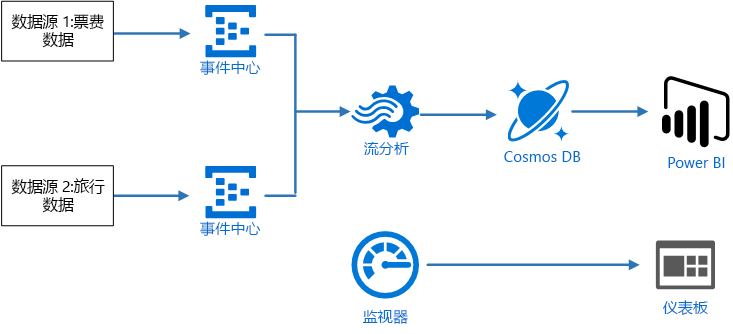
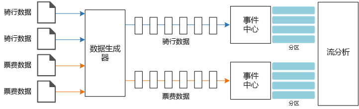
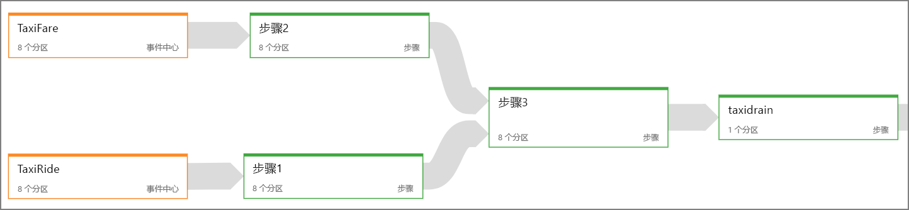
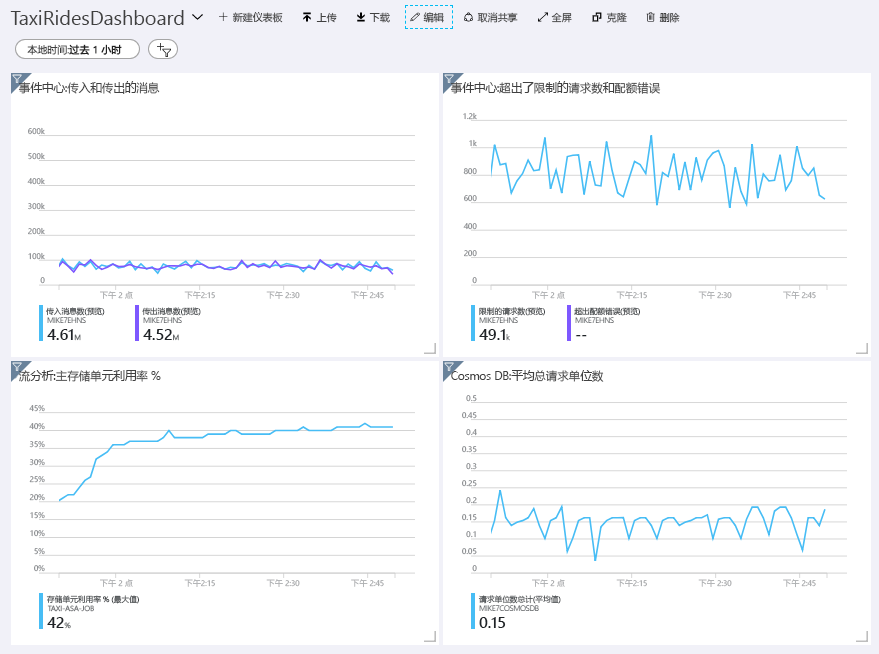
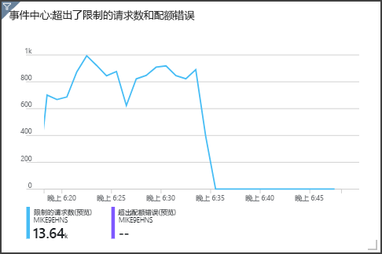

# <a name="create-a-stream-processing-pipeline-with-azure-stream-analytics"></a>使用 Azure 流分析创建流处理管道

本参考体系结构演示一个端到端[流处理](/azure/architecture/data-guide/big-data/real-time-processing)管道。 该管道从两个源引入数据、关联两个流中的记录，然后计算某个时间窗口的移动平均值。 将存储结果以供进一步分析。

[GitHub][github] 中提供了本体系结构的参考实现。



**场景**：某家出租车公司需要收集有关出租车的每次行程的数据。 对于此场景，我们假设有两个不同的设备在发送数据。 出租车的计量表发送有关每次行程的信息 &mdash; 持续时间、距离以及上车和下车地点。 有一个单独的设备接受客户的付款，并发送有关费用的数据。 该出租车公司想要实时计算每英里的平均小费，以绘制趋势图。

## <a name="architecture"></a>体系结构

该体系结构包括以下组件。

**数据源**。 在此体系结构中，有两个数据源实时生成数据流。 第一个流包含行程信息，第二个流包含费用信息。 该参考体系结构包含一个模拟的数据生成器，该生成器读取一组静态文件，并将数据推送到事件中心。 在实际应用中，数据源是安装在出租车内部的设备。

**Azure 事件中心**。 [事件中心](/azure/event-hubs/)是一个事件引入服务。 此体系结构使用两个事件中心实例，每个数据源各对应一个。 每个数据源将数据流发送到关联的事件中心。

**Azure 流分析**。 [流分析](/azure/stream-analytics/)是一个事件处理引擎。 流分析作业从两个事件中心读取数据流，并执行流处理。

**Cosmos DB**。 流分析作业的输出是一系列记录，这些记录编写为 Cosmos DB 文档数据库中的 JSON 文档。

**Microsoft Power BI**。 Power BI 是一套商业分析工具，用于分析数据以获取商业见解。 在此体系结构中，Power BI 从 Cosmos DB 加载数据。 这样，用户便可以分析收集的完整历史数据集。 还可将结果直接从流分析流式传输到 Power BI，以显示数据的实时视图。 有关详细信息，请参阅 [Power BI 中的实时流式处理](/power-bi/service-real-time-streaming)。

**Azure Monitor**。 [Azure Monitor](/azure/monitoring-and-diagnostics/) 收集解决方案中部署的 Azure 服务的性能指标。 通过在仪表板中可视化这些信息，可以洞察解决方案的运行状况。

## <a name="data-ingestion"></a>数据引入

<!-- markdownlint-disable MD033 MD034 -->

为了模拟数据源，此参考体系结构使用了[纽约市出租车数据](https://uofi.app.box.com/v/NYCtaxidata/folder/2332218797)数据集<sup>[[1]](#note1)</sup>。 此数据集包含纽约市过去 4 年（2010 年 &ndash; 2013 年）的出租车行程数据。 其包含两种类型的记录：行程数据和费用数据。 行程数据包括行程持续时间、行程距离以及上车和下车地点。 费用数据包括乘车费、税费和小费金额。 这两种记录类型中的通用字段包括牌照号、出租车驾照和供应商 ID。 这三个字段相结合，唯一标识了出租车和驾驶员。 数据以 CSV 格式存储。

[1] <span id="note1">Donovan, Brian；Work, Dan (2016)：纽约市出租车行程数据 (2010-2013)。 伊利诺伊大学厄巴纳-香槟分校。 https://doi.org/10.13012/J8PN93H8

<!-- markdownlint-enable MD033 MD034 -->

数据生成器是一个读取记录并将其发送到 Azure 事件中心的 .NET Core 应用程序。 该生成器发送 JSON 格式的行程数据以及 CSV 格式的费用数据。

事件中心使用[分区](/azure/event-hubs/event-hubs-features#partitions)将数据分段。 使用者可以通过分区功能并行读取每个分区。 将数据发送到事件中心时，可以显式指定分区键。 否则，记录将以循环方式分配到分区。

在此特定场景中，给定出租车的行程数据和费用数据最终会获得相同的分区 ID。 这样，在关联两个流时，流分析可以应用某种并行度。 行程数据分区 *n* 中的记录将与费用数据分区 *n* 中的记录进行匹配。



在数据生成器中，这两种记录类型的通用数据模型具有 `PartitionKey` 属性，该属性是 `Medallion`、`HackLicense` 和 `VendorId` 的串联形式。

```csharp
public abstract class TaxiData
{
    public TaxiData()
    {
    }

    [JsonProperty]
    public long Medallion { get; set; }

    [JsonProperty]
    public long HackLicense { get; set; }

    [JsonProperty]
    public string VendorId { get; set; }

    [JsonProperty]
    public DateTimeOffset PickupTime { get; set; }

    [JsonIgnore]
    public string PartitionKey
    {
        get => $"{Medallion}_{HackLicense}_{VendorId}";
    }
```

将数据发送到事件中心时，会使用此属性来提供显式分区键：

```csharp
using (var client = pool.GetObject())
{
    return client.Value.SendAsync(new EventData(Encoding.UTF8.GetBytes(
        t.GetData(dataFormat))), t.PartitionKey);
}
```

## <a name="stream-processing"></a>流处理

流处理作业是使用 SQL 查询通过多个不同的步骤定义的。 前两个步骤只是从两个输入流中选择记录。

```sql
WITH
Step1 AS (
    SELECT PartitionId,
           TRY_CAST(Medallion AS nvarchar(max)) AS Medallion,
           TRY_CAST(HackLicense AS nvarchar(max)) AS HackLicense,
           VendorId,
           TRY_CAST(PickupTime AS datetime) AS PickupTime,
           TripDistanceInMiles
    FROM [TaxiRide] PARTITION BY PartitionId
),
Step2 AS (
    SELECT PartitionId,
           medallion AS Medallion,
           hack_license AS HackLicense,
           vendor_id AS VendorId,
           TRY_CAST(pickup_datetime AS datetime) AS PickupTime,
           tip_amount AS TipAmount
    FROM [TaxiFare] PARTITION BY PartitionId
),
```

下一个步骤联接两个输入流，以便从每个流中选择匹配的记录。

```sql
Step3 AS (
  SELECT
         tr.Medallion,
         tr.HackLicense,
         tr.VendorId,
         tr.PickupTime,
         tr.TripDistanceInMiles,
         tf.TipAmount
    FROM [Step1] tr
    PARTITION BY PartitionId
    JOIN [Step2] tf PARTITION BY PartitionId
      ON tr.Medallion = tf.Medallion
     AND tr.HackLicense = tf.HackLicense
     AND tr.VendorId = tf.VendorId
     AND tr.PickupTime = tf.PickupTime
     AND tr.PartitionId = tf.PartitionId
     AND DATEDIFF(minute, tr, tf) BETWEEN 0 AND 15
)
```

此查询将记录联接到唯一标识匹配记录（Medallion、HackLicense、VendorId 和 PickupTime）的一组字段中。 `JOIN` 语句还包含分区 ID。 如前所述，此功能利用了以下事实：此场景中匹配的记录始终具有相同的分区 ID。

在流分析中，联接是时态性的，也就是说，将在特定的时间窗口中联接记录。 否则，作业可能需要无限期等待出现匹配项。 [DATEDIFF](https://msdn.microsoft.com/azure/stream-analytics/reference/join-azure-stream-analytics) 函数指定在进行匹配时，两条匹配的记录在时间上可以相隔多久。

作业中的最后一个步骤计算每英里的平均小费，该值按 5 分钟的跳跃窗口分组。

```sql
SELECT System.Timestamp AS WindowTime,
       SUM(tr.TipAmount) / SUM(tr.TripDistanceInMiles) AS AverageTipPerMile
  INTO [TaxiDrain]
  FROM [Step3] tr
  GROUP BY HoppingWindow(Duration(minute, 5), Hop(minute, 1))
```

流分析提供多个[开窗函数](/azure/stream-analytics/stream-analytics-window-functions)。 跳跃窗口的时间按固定的时段前移，在本例中，每个跳跃时段为 1 分钟。 结果是计算过去 5 分钟的移动平均值。

在此处所示的体系结构中，只会将流分析作业的结果保存到 Cosmos DB。 在大数据方案中，另请考虑使用[事件中心捕获](/azure/event-hubs/event-hubs-capture-overview)功能将原始事件数据保存到 Azure Blob 存储。 保存原始数据可方便以后针对历史数据运行批量查询，以从数据中推断出新的见解。

## <a name="scalability-considerations"></a>可伸缩性注意事项

### <a name="event-hubs"></a>事件中心

事件中心的吞吐量容量以[吞吐量单位](/azure/event-hubs/event-hubs-features#throughput-units)来度量。 可以通过启用[自动扩充](/azure/event-hubs/event-hubs-auto-inflate)来自动缩放事件中心。自动扩充可以根据流量，最高将吞吐量单位自动扩展到配置的上限。

### <a name="stream-analytics"></a>流分析

对于流分析而言，分配给作业的计算资源以流单元来度量。 如果能够将流分析作业并行化，则这些作业可获得最佳的可伸缩性。 这样，流分析便可以跨多个计算节点分配作业。

对于事件中心输入，请使用 `PARTITION BY` 关键字将流分析作业分区。 根据事件中心分区将数据划分为子集。

开窗函数和时态联接需要额外的 SU。 尽量使用 `PARTITION BY`，以便单独处理每个分区。 有关详细信息，请参阅[了解和调整流单元](/azure/stream-analytics/stream-analytics-streaming-unit-consumption#windowed-aggregates)。

如果无法并行化整个流分析作业，请尝试将作业分解为多个步骤，并从一个或多个并行步骤开始。 这样，前几个步骤便可并行运行。 例如，在以下参考体系结构中：

- 步骤 1 和 2 是在单个分区中选择记录的简单 `SELECT` 语句。
- 步骤 3 跨两个输入流执行分区的联接。 此步骤利用了以下事实：匹配的记录具有相同的分区键，因此保证这些记录在每个输入流中具有相同的分区 ID。
- 步骤 4 跨所有分区聚合数据。 此步骤无法并行化。

使用流分析[作业关系图](/azure/stream-analytics/stream-analytics-job-diagram-with-metrics)可以查看已将多少个分区分配到了作业中的每个步骤。 下图显示了此参考体系结构的作业关系图：



### <a name="cosmos-db"></a>Cosmos DB

Cosmos DB 的吞吐量容量以[请求单位](/azure/cosmos-db/request-units) (RU) 来度量。 若要将某个 Cosmos DB 容器扩展到超过 10,000 RU，必须在创建该容器时指定[分区键](/azure/cosmos-db/partition-data)，并在每个文档中包含该分区键。

在此参考体系结构中，每分钟（跳跃窗口间隔）只会创建新文档一次，因此吞吐量要求相当低。 因此，在此场景中不需要分配分区键。

## <a name="monitoring-considerations"></a>监视注意事项

使用任何流处理解决方案时，必须监视系统的性能和运行状况。 [Azure Monitor](/azure/monitoring-and-diagnostics/) 收集体系结构中使用的 Azure 服务的指标和诊断日志。 Azure Monitor 内置于 Azure 平台中，不需要在应用程序中编写任何附加代码。

以下任何警告信号指示应该横向扩展相关的 Azure 资源：

- 事件中心限制了请求，或者即将达到每日消息配额。
- 流分析作业一贯使用超过 80% 的分配流单元 (SU)。
- Cosmos DB 开始限制请求。

参考体系结构包含部署在 Azure 门户中的自定义仪表板。 部署体系结构后，可以通过打开 [Azure 门户](https://portal.azure.com)并从仪表板列表中选择 `TaxiRidesDashboard` 来查看仪表板。 有关在 Azure 门户中创建和部署自定义仪表板的详细信息，请参阅[以编程方式创建 Azure 仪表板](/azure/azure-portal/azure-portal-dashboards-create-programmatically)。

下图显示了在流分析作业大约运行一小时之后的仪表板。



左下方的面板显示流分析作业的 SU 消耗量在前 15 分钟不断攀升，然后保持稳定。 这是作业在达到稳定状态时的典型模式。

在右上方面板中可以看到，事件中心正在限制请求。 偶发性的限制请求并不是问题，因为事件中心客户端 SDK 在收到限制错误时会自动重试。 但是，如果一直出现限制错误，则意味着事件中心需要更多的吞吐量单位。 下图显示了一个使用事件中心自动扩充功能的测试运行。该功能会按需自动横向扩展吞吐量单位。



自动扩充是在大约 06:35 标记处启用的。 可以看到，当事件中心自动纵向扩展到 3 个吞吐量单位时，限制的请求中出现 p 下降。

有趣的是，这对流分析作业中的 SU 利用率增长造成了负面影响。 通过限制，事件中心人为地降低了流分析作业的引入速率。 解决一个性能瓶颈的同时却又揭露了另一个瓶颈，这种情况确实很常见。 在这种情况下，为流分析作业分配更多的 SU 便可解决问题。

## <a name="deploy-the-solution"></a>部署解决方案

若要部署并运行参考实现，请按 [GitHub 自述文件][github]中的步骤操作。

[github]: https://github.com/mspnp/reference-architectures/tree/master/data/streaming_asa
