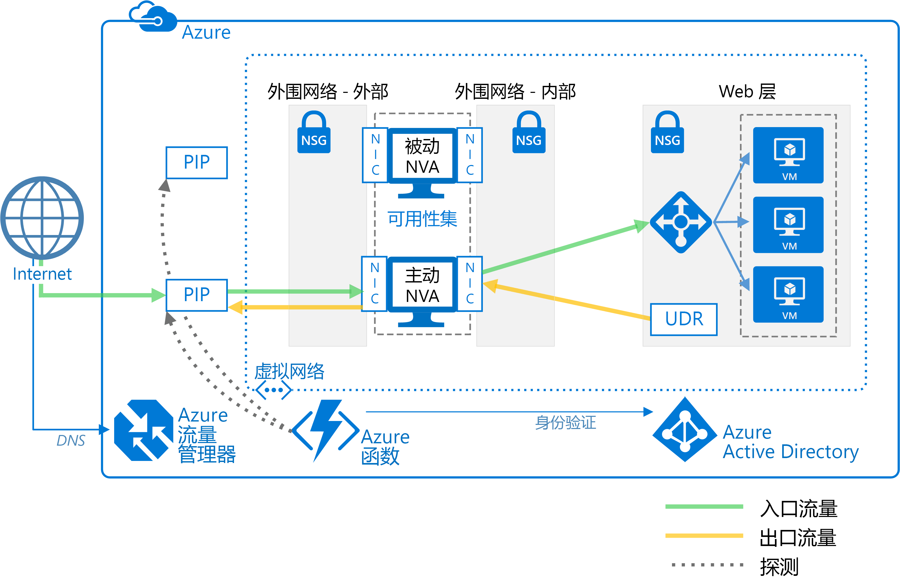

# 部署具有高可用性的网络虚拟设备。Deploy highly available network virtual appliances

本文展示了如何在 Azure 中部署一组网络虚拟设备 (NVA) 以实现高可用性。This article shows how to deploy a set of network virtual appliances (NVAs) for high availability in Azure. NVA 通常用来控制从外围网络（也称为 DMZ）到其他网络或子网的网络流量流。An NVA is typically used to control the flow of network traffic from a perimeter network, also known as a DMZ, to other networks or subnets. 若要了解如何在 Azure 中实现外围网络，请参阅 [Microsoft cloud services and network security][cloud-security]（Microsoft 云服务和网络安全）。To learn about implementing a DMZ in Azure, see [Microsoft cloud services and network security][cloud-security]. 本文包括了仅用于入口、仅用于出口和同时用于入口和出口的示例体系结构。The article includes example architectures for ingress only, egress only, and both ingress and egress.

**先决条件：** 本文假设读者对 Azure 网络、[Azure 负载均衡器][lb-overview]和[用户定义的路由][udr-overview] (UDR) 有一个基本了解。**Prerequisites:** This article assumes a basic understanding of Azure networking, [Azure load balancers][lb-overview], and [user-defined routes][udr-overview] (UDRs).

## 体系结构关系图Architecture diagrams

NVA 可以采用许多不同的体系结构部署到外围网络中。An NVA can be deployed to a DMZ in many different architectures. 例如，下图展示了用于入口的[单个 NVA][nva-scenario] 的使用。For example, the following figure illustrates the use of a [single NVA][nva-scenario] for ingress.

![[0]][0]![[0]][0]

在此体系结构中，NVA 会检查所有入站和出站网络流量并且仅会放行符合网络安全规则的流量，从而提供一个安全的网络边界。In this architecture, the NVA provides a secure network boundary by checking all inbound and outbound network traffic and passing only the traffic that meets network security rules. 不过，因为所有网络流量都必须通过 NVA，这意味着 NVA 是网络中的单一故障点。However, the fact that all network traffic must pass through the NVA means that the NVA is a single point of failure in the network. 如果 NVA 发生故障，则网络流量没有其他路径可用，并且所有后端子网都不可用。If the NVA fails, there is no other path for network traffic and all the back-end subnets are unavailable.

若要使 NVA 高度可用，请将多个 NVA 部署到可用性集中。To make an NVA highly available, deploy more than one NVA into an availability set.

下面的体系结构描述了实现高度可用的 NVA 所需的资源和配置：The following architectures describe the resources and configuration necessary for highly available NVAs:

<!-- markdownlint-disable MD033 -->

| 解决方案Solution | 优点Benefits | 注意事项Considerations |
| --- | --- | --- |
| [具有第 7 层 NVA 的入口][ingress-with-layer-7][Ingress with layer 7 NVAs][ingress-with-layer-7] |所有 NVA 节点都是主动的All NVA nodes are active |需要一个可以终止连接的 NVA 并使用 SNATRequires an NVA that can terminate connections and use SNAT  对于来自 Internet 和来自 Azure 的流量，需要单独的一组 NVARequires a separate set of NVAs for traffic coming from the Internet and from Azure   只能用于在 Azure 外部产生的流量Can only be used for traffic originating outside Azure |
| [具有第 7 层 NVA 的出口][egress-with-layer-7][Egress with layer 7 NVAs][egress-with-layer-7] |所有 NVA 节点都是主动的All NVA nodes are active | 需要一个可以终止连接的 NVA 并实现源网络地址转换 (SNAT)Requires an NVA that can terminate connections and implements source network address translation (SNAT)
| [具有第 7 层 NVA 的入口-出口][ingress-egress-with-layer-7][Ingress-Egress with layer 7 NVAs][ingress-egress-with-layer-7] |所有节点都是主动的All nodes are active 能够处理在 Azure 中产生的流量Able to handle traffic originated in Azure |需要一个可以终止连接的 NVA 并使用 SNATRequires an NVA that can terminate connections and use SNAT 对于来自 Internet 和来自 Azure 的流量，需要单独的一组 NVARequires a separate set of NVAs for traffic coming from the Internet and from Azure |
| [PIP-UDR 切换][pip-udr-switch][PIP-UDR switch][pip-udr-switch] |用于所有流量的单组 NVASingle set of NVAs for all traffic 可以处理所有流量（没有端口限制规则）Can handle all traffic (no limit on port rules) |主动-被动Active-passive 需要故障转移流程Requires a failover process |
| [不使用 SNAT 的 PIP-UDRPIP-UDR without SNAT](#pip-udr-nvas-without-snat) | 用于所有流量的单组 NVASingle set of NVAs for all traffic 可以处理所有流量（没有端口限制规则）Can handle all traffic (no limit on port rules) 不需要为入站请求配置 SNATDoes not require configuring SNAT for inbound requests |主动-被动Active-passive 需要故障转移流程Requires a failover process 在虚拟网络外部运行的探测和故障转移逻辑Probing and failover logic run outside the virtual network |

<!-- markdown-enable MD033 -->

## 具有第 7 层 NVA 的入口Ingress with layer 7 NVAs

下图显示了一个高可用性体系结构，它在面向 Internet 的负载均衡器后实现了一个入口外围网络。The following figure shows a high availability architecture that implements an ingress DMZ behind an internet-facing load balancer. 此体系结构设计用于提供到 Azure 工作负荷的连接以用于第 7 层流量，例如 HTTP 或 HTTPS：This architecture is designed to provide connectivity to Azure workloads for layer 7 traffic, such as HTTP or HTTPS:

![[1]][1]![[1]][1]

此体系结构的好处是所有 NVA 都是主动的，并且如果其中一个发生故障，则负载均衡器会将网络流量定向到另一个 NVA。The benefit of this architecture is that all NVAs are active, and if one fails the load balancer directs network traffic to the other NVA. 两个 NVA 都将流量路由到内部负载均衡器，因此，只要有一个 NVA 是主动的，流量便可继续流动。Both NVAs route traffic to the internal load balancer so as long as one NVA is active, traffic continues to flow. 这些 NVA 是终止用于 Web 层 VM 的 SSL 流量所必需的。The NVAs are required to terminate SSL traffic intended for the web tier VMs. 不能扩展这些 NVA 来处理内部流量，因为内部流量需要另一组具有其自己的网络路由的专用 NVA。These NVAs cannot be extended to handle on-premises traffic because on-premises traffic requires another dedicated set of NVAs with their own network routes.

> [!NOTE]
> 此体系结构用于 [Azure 与本地数据中心之间的外围网络][dmz-on-prem]参考体系结构和 [Azure 与 Internet 之间的外围网络][dmz-internet]参考体系结构中。This architecture is used in the [DMZ between Azure and your on-premises datacenter][dmz-on-prem] reference architecture and the [DMZ between Azure and the Internet][dmz-internet] reference architecture. 这些参考体系结构每个都包括你可以使用的部署解决方案。Each of these reference architectures includes a deployment solution that you can use. 有关详细信息，请参阅以下链接。Follow the links for more information.

## 具有第 7 层 NVA 的出口Egress with layer 7 NVAs

可以扩展上面的体系结构来为在 Azure 工作负荷中产生的请求提供一个出口外围网络。The previous architecture can be expanded to provide an egress DMZ for requests originating in the Azure workload. 下面的体系结构设计用于在外围网络中提供具有高可用性的 NVA 以用于第 7 层流量，例如 HTTP 或 HTTPS：The following architecture is designed to provide high availability of the NVAs in the DMZ for layer 7 traffic, such as HTTP or HTTPS:

![[2]][2]![[2]][2]

在此体系结构中，在 Azure 中产生的所有流量都被路由到一个外部负载均衡器。In this architecture, all traffic originating in Azure is routed to an internal load balancer. 该负载均衡器将传出请求分布到一组 NVA 中。The load balancer distributes outgoing requests between a set of NVAs. 这些 NVA 使用其各自的公共 IP 地址将流量定向到 Internet。These NVAs direct traffic to the Internet using their individual public IP addresses.

> [!NOTE]
> 此体系结构用于 [Azure 与本地数据中心之间的外围网络][dmz-on-prem]参考体系结构和 [Azure 与 Internet 之间的外围网络][dmz-internet]参考体系结构中。This architecture is used in the [DMZ between Azure and your on-premises datacenter][dmz-on-prem] reference architecture and the [DMZ between Azure and the Internet][dmz-internet] reference architecture. 这些参考体系结构每个都包括你可以使用的部署解决方案。Each of these reference architectures includes a deployment solution that you can use. 有关详细信息，请参阅以下链接。Follow the links for more information.

## 具有第 7 层 NVA 的入口-出口Ingress-egress with layer 7 NVAs

在上面的两个体系结构中，都有一个单独的用于入口和出口的外围网络。In the two previous architectures, there was a separate DMZ for ingress and egress. 下面的体系结构演示了如何创建可以同时用于入口和出口的外围网络以用于第 7 层流量，例如 HTTP 或 HTTPS：The following architecture demonstrates how to create a DMZ that can be used for both ingress and egress for layer 7 traffic, such as HTTP or HTTPS:

![[4]][4]

在此体系结构中，NVA 处理来自应用程序网关的传入请求。In this architecture, the NVAs process incoming requests from the application gateway. NVA 还处理负载均衡器的后端池中的工作负荷 VM 发出的传出请求。The NVAs also process outgoing requests from the workload VMs in the back-end pool of the load balancer. 因为传入流量是通过应用程序网关进行路由的，并且传出流量是通过负载均衡器进行路由的，所以，NVA 负责维护会话相关性。Because incoming traffic is routed with an application gateway and outgoing traffic is routed with a load balancer, the NVAs are responsible for maintaining session affinity. 也就是说，应用程序网关维护入站和出站请求的映射，因此，它可以将正确的响应转发到原始请求者。That is, the application gateway maintains a mapping of inbound and outbound requests so it can forward the correct response to the original requestor. 但是，内部负载均衡器无权访问应用程序网关映射，它使用其自己的逻辑将响应发送到 NVA。However, the internal load balancer does not have access to the application gateway mappings, and uses its own logic to send responses to the NVAs. 负载均衡器可能会将响应发送到起初没有从应用程序网关收到请求的 NVA。It's possible the load balancer could send a response to an NVA that did not initially receive the request from the application gateway. 在这种情况下，各个 NVA 必须进行通信并在它们之间传输响应，以便正确的 NVA 可以将响应转发到应用程序网关。In this case, the NVAs must communicate and transfer the response between them so the correct NVA can forward the response to the application gateway.

> [!NOTE]
> 你还可以通过确保 NVA 执行入站源网络地址转换 (SNAT) 来解决非对称路由问题。You can also solve the asymmetric routing issue by ensuring the NVAs perform inbound source network address translation (SNAT). 这会将请求者的原始源 IP 替换为入站流上使用的 NVA 的 IP 地址之一。This would replace the original source IP of the requestor to one of the IP addresses of the NVA used on the inbound flow. 这确保可以一次使用多个 NVA，同时保持路由对称性。This ensures that you can use multiple NVAs at a time, while preserving the route symmetry.

## 采用第 4 层 NVA 的 PIP-UDR 切换PIP-UDR switch with layer 4 NVAs

下面的体系结构展示了具有一个主动和一个被动 NVA 的体系结构。The following architecture demonstrates an architecture with one active and one passive NVA. 此体系结构同时处理第 4 层流量的入口和出口：This architecture handles both ingress and egress for layer 4 traffic:

![[3]][3]![[3]][3]

> [!TIP]
> [GitHub][pnp-ha-nva] 上提供了此体系结构的完整解决方案。A complete solution for this architecture is available on [GitHub][pnp-ha-nva].

此体系结构类似于本文中讨论的第一个体系结构。This architecture is similar to the first architecture discussed in this article. 该体系结构包括了用于接受和筛选传入的第 4 层请求的单个 NVA。That architecture included a single NVA accepting and filtering incoming layer 4 requests. 此体系结构添加了另一个被动 NVA 来提供高可用性。This architecture adds a second passive NVA to provide high availability. 如果主动 NVA 发生故障，则被动 NVA 将成为主动的，并且 UDR 和 PIP 将更改为指向目前的主动 NVA 上的 NIC。If the active NVA fails, the passive NVA is made active and the UDR and PIP are changed to point to the NICs on the now active NVA. 对 UDR 和 PIP 的这些更改可以手动完成，也可以使用自动化流程来完成。These changes to the UDR and PIP can either be done manually or using an automated process. 自动化流程通常是在 Azure 中运行的守护程序或其他监视服务。The automated process is typically daemon or other monitoring service running in Azure. 它查询主动 NVA 上的运行状态探测，并且在检测到 NVA 故障时执行 UDR 和 PIP 切换。It queries a health probe on the active NVA and performs the UDR and PIP switch when it detects a failure of the NVA.

上图显示了一个示例 [ZooKeeper][zookeeper] 群集，它提供了一个高可用性守护程序。The preceding figure shows an example [ZooKeeper][zookeeper] cluster providing a high availability daemon. 在 ZooKeeper 群集内，节点的仲裁选拨一个领导。Within the ZooKeeper cluster, a quorum of nodes elects a leader. 如果领导发生故障，则剩余节点将举行选举来选拨新领导。If the leader fails, the remaining nodes hold an election to elect a new leader. 对于此体系结构，领导节点将执行对 NVA 上的运行状况终结点进行查询的守护程序。For this architecture, the leader node executes the daemon that queries the health endpoint on the NVA. 如果 NVA 无法响应运行状况探测，则守护程序将激活被动 NVA。If the NVA fails to respond to the health probe, the daemon activates the passive NVA. 然后，守护程序将调用 Azure REST API 来从发生故障的 NVA 中删除 PIP 并将其附加到新激活的 NVA。The daemon then calls the Azure REST API to remove the PIP from the failed NVA and attaches it to newly activated NVA. 然后，守护程序将修改 UDR 来指向新激活的 NVA 的内部 IP 地址。The daemon then modifies the UDR to point to the newly activated NVA's internal IP address.

不要将 ZooKeeper 节点包括在只能使用包括 NVA 的路由进行访问的子网中。Do not include the ZooKeeper nodes in a subnet that is only accessible using a route that includes the NVA. 否则，如果 NVA 发生故障，则 ZooKeeper 节点将无法访问。Otherwise, the ZooKeeper nodes are inaccessible if the NVA fails. 如果守护程序因任何原因而发生故障，则你将无法访问任何 ZooKeeper 节点来诊断问题。Should the daemon fail for any reason, you won't be able to access any of the ZooKeeper nodes to diagnose the problem.

若要查看完整解决方案（包括示例代码），请参阅 [GitHub 存储库][pnp-ha-nva]中的文件。To see the complete solution including sample code, see the files in the [GitHub repository][pnp-ha-nva].

## 不使用 SNAT 的 PIP-UDR NVAPIP-UDR NVAs without SNAT

此体系结构使用两个 Azure 虚拟机来托管采用主动-被动配置的 NVA 防火墙，该防火墙支持自动故障转移，但不需要源网络地址转换 (SNAT)。This architecture uses two Azure virtual machines to host the NVA firewall in an active-passive configuration that supports automated failover but does not require Source Network Address Translation (SNAT).

> [!TIP]
> [GitHub][ha-nva-fo] 上提供了此体系结构的完整解决方案。A complete solution for this architecture is available on [GitHub][ha-nva-fo].

此解决方案适用于无法在 NVA 防火墙中为入站请求配置 SNAT 的 Azure 客户。This solution is designed for Azure customers who cannot configure SNAT for inbound requests on their NVA firewalls. SNAT 隐藏原始源客户端 IP 地址。SNAT hides the original source client IP address. 如果需要记录原始 IP 或者在 NVA 后面的其他分层安全组件中使用原始 IP，则此解决方案可提供一种基本方法。If you need to log the original IPs or used them within other layered security components behind your NVAs, this solution offers a basic approach.

UDR 表条目的故障转移由某个下一跃点地址自动完成，该地址设置为主动 NVA 防火墙虚拟机上的接口的 IP 地址。The failover of UDR table entries is automated by a next-hop address set to the IP address of an interface on the active NVA firewall virtual machine. 自动故障转移逻辑托管在使用 [Azure Functions](/azure/azure-functions/) 创建的函数应用中。The automated failover logic is hosted in a function app that you create using [Azure Functions](/azure/azure-functions/). 故障转移代码在 Azure Functions 中作为无服务器函数运行。The failover code runs as a serverless function inside Azure Functions. 部署十分方便、经济高效，且易于维护和自定义。Deployment is convenient, cost-effective, and easy to maintain and customize. 此外，函数应用托管在 Azure Functions 中，因此不依赖于虚拟网络。In addition, the function app is hosted within Azure Functions, so it has no dependencies on the virtual network. 如果对虚拟网络的更改会影响 NVA 防火墙，则函数应用可继续独立运行。If changes to the virtual network impact the NVA firewalls, the function app continues to run independently. 此外，测试更加准确，因为测试是使用与入站客户端请求相同的路由在虚拟网络外部进行的。Testing is more accurate as well, because it takes place outside the virtual network using the same route as the inbound client requests.

为了检查 NVA 防火墙的可用性，函数应用代码将通过两种方式之一探测防火墙：To check the availability of the NVA firewall, the function app code probes it in one of two ways:

- 监视托管 NVA 防火墙的 Azure 虚拟机的状态。By monitoring the state of the Azure virtual machines hosting the NVA firewall.

- 测试防火墙中是否向后端 Web 服务器开放了端口。By testing whether there is an open port through the firewall to the back-end web server. 对于此选项，NVA 必须通过 PIP 公开一个套接字，供函数应用代码测试。For this option, the NVA must expose a socket via PIP for the function app code to test.

配置函数应用时，请选择要使用的探测类型。You choose the type of probe you want to use when you configure the function app. 若要查看完整解决方案（包括示例代码），请参阅 [GitHub 存储库][ha-nva-fo]中的文件。To see the complete solution including sample code, see the files in the [GitHub repository][ha-nva-fo].

## 后续步骤Next steps

- 了解如何使用第 7 层 NVA [在 Azure 与本地数据中心之间实现外围网络][dmz-on-prem]。Learn how to [implement a DMZ between Azure and your on-premises datacenter][dmz-on-prem] using layer-7 NVAs.
- 了解如何使用第 7 层 NVA [在 Azure 与 Internet 之间实现外围网络][dmz-internet]。Learn how to [implement a DMZ between Azure and the Internet][dmz-internet] using layer-7 NVAs.
- [排查 Azure 中的网络虚拟设备问题Troubleshoot network virtual appliance issues in Azure](/azure/virtual-network/virtual-network-troubleshoot-nva)

<!-- links -->

[cloud-security]: /azure/best-practices-network-security
[dmz-on-prem]: ./secure-vnet-hybrid.md
[dmz-internet]: ./secure-vnet-dmz.md
[egress-with-layer-7]: #egress-with-layer-7-nvas
[ingress-with-layer-7]: #ingress-with-layer-7-nvas
[ingress-egress-with-layer-7]: #ingress-egress-with-layer-7-nvas
[lb-overview]: /azure/load-balancer/load-balancer-overview/
[nva-scenario]: /azure/virtual-network/virtual-network-scenario-udr-gw-nva/
[pip-udr-switch]: #pip-udr-switch-with-layer-4-nvas
[udr-overview]: /azure/virtual-network/virtual-networks-udr-overview/
[zookeeper]: https://zookeeper.apache.org/
[pnp-ha-nva]: https://github.com/mspnp/ha-nva
[ha-nva-fo]: https://aka.ms/ha-nva-fo

<!-- images -->

[0]: ./images/nva-ha/single-nva.png "单 NVA 体系结构"
[1]: ./images/nva-ha/l7-ingress.png "第 7 层入口"
[2]: ./images/nva-ha/l7-ingress-egress.png "第 7 层出口"
[3]: ./images/nva-ha/active-passive.png "主动-被动群集"
[4]: ./images/nva-ha/l7-ingress-egress-ag.png
