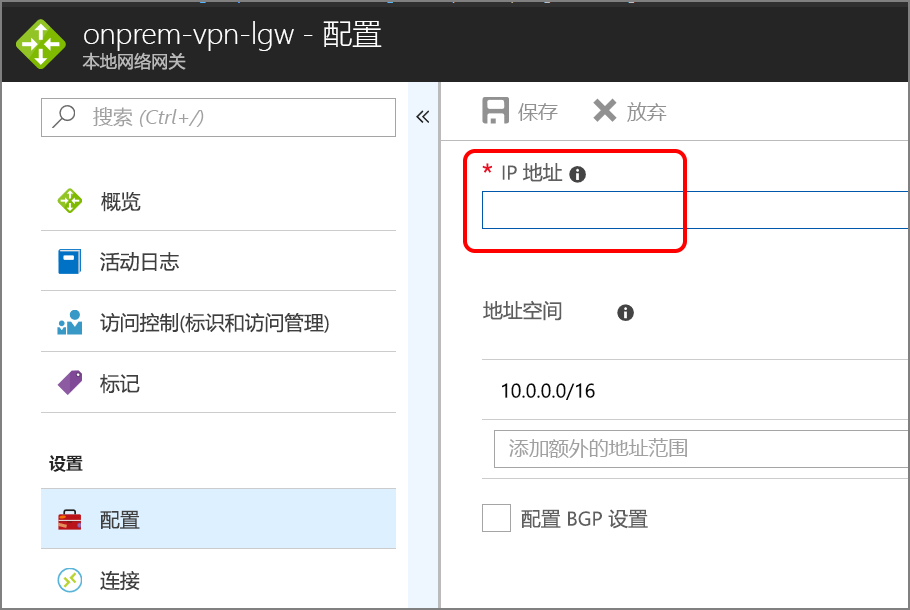

# <a name="dmz-between-azure-and-the-internet"></a><span data-ttu-id="c3a13-103">Azure 与 Internet 之间的外围网络</span><span class="sxs-lookup"><span data-stu-id="c3a13-103">DMZ between Azure and the Internet</span></span>

<span data-ttu-id="c3a13-104">此参考体系结构显示了一个可将本地网络扩展到 Azure 并接受 Internet 流量的安全混合网络。</span><span class="sxs-lookup"><span data-stu-id="c3a13-104">This reference architecture shows a secure hybrid network that extends an on-premises network to Azure and also accepts Internet traffic.</span></span> [<span data-ttu-id="c3a13-105">**部署此解决方案**。</span><span class="sxs-lookup"><span data-stu-id="c3a13-105">**Deploy this solution**.</span></span>](#deploy-the-solution)

<span data-ttu-id="c3a13-106">[![0]][0]</span><span class="sxs-lookup"><span data-stu-id="c3a13-106">[![0]][0]</span></span> 

<span data-ttu-id="c3a13-107">下载此体系结构的 [Visio 文件][visio-download]。</span><span class="sxs-lookup"><span data-stu-id="c3a13-107">*Download a [Visio file][visio-download] of this architecture.*</span></span>

<span data-ttu-id="c3a13-108">此参考体系结构扩展[在 Azure 与本地数据中心之间实施外围网络][implementing-a-secure-hybrid-network-architecture]中所述的体系结构。</span><span class="sxs-lookup"><span data-stu-id="c3a13-108">This reference architecture extends the architecture described in [Implementing a DMZ between Azure and your on-premises datacenter][implementing-a-secure-hybrid-network-architecture].</span></span> <span data-ttu-id="c3a13-109">它添加了一个用于处理 Internet 流量的公共外围网络，以及一个用于处理来自本地网络的流量的专用外围网络</span><span class="sxs-lookup"><span data-stu-id="c3a13-109">It adds a public DMZ that handles Internet traffic, in addition to the private DMZ that handles traffic from the on-premises network</span></span> 

<span data-ttu-id="c3a13-110">此体系结构的典型用途包括：</span><span class="sxs-lookup"><span data-stu-id="c3a13-110">Typical uses for this architecture include:</span></span>

* <span data-ttu-id="c3a13-111">在本地运行一部分工作负荷，在 Azure 中运行一部分工作负荷的混合应用程序。</span><span class="sxs-lookup"><span data-stu-id="c3a13-111">Hybrid applications where workloads run partly on-premises and partly in Azure.</span></span>
* <span data-ttu-id="c3a13-112">可路由来自本地和 Internet 的传入流量的 Azure 基础结构。</span><span class="sxs-lookup"><span data-stu-id="c3a13-112">Azure infrastructure that routes incoming traffic from on-premises and the Internet.</span></span>

## <a name="architecture"></a><span data-ttu-id="c3a13-113">体系结构</span><span class="sxs-lookup"><span data-stu-id="c3a13-113">Architecture</span></span>

<span data-ttu-id="c3a13-114">该体系结构包括以下组件。</span><span class="sxs-lookup"><span data-stu-id="c3a13-114">The architecture consists of the following components.</span></span>

* <span data-ttu-id="c3a13-115">**公共 IP 地址 (PIP)**。</span><span class="sxs-lookup"><span data-stu-id="c3a13-115">**Public IP address (PIP)**.</span></span> <span data-ttu-id="c3a13-116">公共终结点的 IP 地址。</span><span class="sxs-lookup"><span data-stu-id="c3a13-116">The IP address of the public endpoint.</span></span> <span data-ttu-id="c3a13-117">连接到 Internet 的外部用户可通过此地址访问系统。</span><span class="sxs-lookup"><span data-stu-id="c3a13-117">External users connected to the Internet can access the system through this address.</span></span>
* <span data-ttu-id="c3a13-118">**网络虚拟设备 (NVA)**。</span><span class="sxs-lookup"><span data-stu-id="c3a13-118">**Network virtual appliance (NVA)**.</span></span> <span data-ttu-id="c3a13-119">此体系结构包含一个用于处理源自 Internet 的流量的独立 NVA 池。</span><span class="sxs-lookup"><span data-stu-id="c3a13-119">This architecture includes a separate pool of NVAs for traffic originating on the Internet.</span></span>
* <span data-ttu-id="c3a13-120">**Azure 负载均衡器**。</span><span class="sxs-lookup"><span data-stu-id="c3a13-120">**Azure load balancer**.</span></span> <span data-ttu-id="c3a13-121">来自 Internet 的所有传入请求通过负载均衡器，并分发到公共外围网络中的 NVA。</span><span class="sxs-lookup"><span data-stu-id="c3a13-121">All incoming requests from the Internet pass through the load balancer and are distributed to the NVAs in the public DMZ.</span></span>
* <span data-ttu-id="c3a13-122">**公共外围网络入站子网**。</span><span class="sxs-lookup"><span data-stu-id="c3a13-122">**Public DMZ inbound subnet**.</span></span> <span data-ttu-id="c3a13-123">此子网接受来自 Azure 负载均衡器的请求。</span><span class="sxs-lookup"><span data-stu-id="c3a13-123">This subnet accepts requests from the Azure load balancer.</span></span> <span data-ttu-id="c3a13-124">传入的请求传递到公共外围网络中某个 NVA。</span><span class="sxs-lookup"><span data-stu-id="c3a13-124">Incoming requests are passed to one of the NVAs in the public DMZ.</span></span>
* <span data-ttu-id="c3a13-125">**公共外围网络出站子网**。</span><span class="sxs-lookup"><span data-stu-id="c3a13-125">**Public DMZ outbound subnet**.</span></span> <span data-ttu-id="c3a13-126">NVA 批准的请求通过此子网传递到 Web 层的内部负载均衡器。</span><span class="sxs-lookup"><span data-stu-id="c3a13-126">Requests that are approved by the NVA pass through this subnet to the internal load balancer for the web tier.</span></span>

## <a name="recommendations"></a><span data-ttu-id="c3a13-127">建议</span><span class="sxs-lookup"><span data-stu-id="c3a13-127">Recommendations</span></span>

<span data-ttu-id="c3a13-128">以下建议适用于大多数方案。</span><span class="sxs-lookup"><span data-stu-id="c3a13-128">The following recommendations apply for most scenarios.</span></span> <span data-ttu-id="c3a13-129">除非有优先于这些建议的特定要求，否则请遵循这些建议。</span><span class="sxs-lookup"><span data-stu-id="c3a13-129">Follow these recommendations unless you have a specific requirement that overrides them.</span></span> 

### <a name="nva-recommendations"></a><span data-ttu-id="c3a13-130">有关 NVA 的建议</span><span class="sxs-lookup"><span data-stu-id="c3a13-130">NVA recommendations</span></span>

<span data-ttu-id="c3a13-131">请对源自 Internet 的流量使用一组 NVA，对源自本地的流量使用另一组 NVA。</span><span class="sxs-lookup"><span data-stu-id="c3a13-131">Use one set of NVAs for traffic originating on the Internet, and another for traffic originating on-premises.</span></span> <span data-ttu-id="c3a13-132">若仅对两组网络流量使用一组 NVA，则存在安全风险，因为它不会在两组网络流量之间提供安全周边。</span><span class="sxs-lookup"><span data-stu-id="c3a13-132">Using only one set of NVAs for both is a security risk, because it provides no security perimeter between the two sets of network traffic.</span></span> <span data-ttu-id="c3a13-133">使用不同 NVA 可以降低检查安全规则的复杂性，并指明哪项规则与每个传入网络请求相对应。</span><span class="sxs-lookup"><span data-stu-id="c3a13-133">Using separate NVAs reduces the complexity of checking security rules, and makes it clear which rules correspond to each incoming network request.</span></span> <span data-ttu-id="c3a13-134">一组 NVA 仅对 Internet 流量实施规则，另一组 NVA 仅对本地流量实施规则。</span><span class="sxs-lookup"><span data-stu-id="c3a13-134">One set of NVAs implements rules for Internet traffic only, while another set of NVAs implement rules for on-premises traffic only.</span></span>

<span data-ttu-id="c3a13-135">包含第 7 层 NVA，以在 NVA 级别终止应用程序连接，并保持与后端层的兼容性。</span><span class="sxs-lookup"><span data-stu-id="c3a13-135">Include a layer-7 NVA to terminate application connections at the NVA level and maintain compatibility with the backend tiers.</span></span> <span data-ttu-id="c3a13-136">这可以保证建立对称连接，使得来自后端层的响应流量可通过 NVA 返回。</span><span class="sxs-lookup"><span data-stu-id="c3a13-136">This guarantees symmetric connectivity where response traffic from the backend tiers returns through the NVA.</span></span>  

### <a name="public-load-balancer-recommendations"></a><span data-ttu-id="c3a13-137">有关公共负载均衡器的建议</span><span class="sxs-lookup"><span data-stu-id="c3a13-137">Public load balancer recommendations</span></span>

<span data-ttu-id="c3a13-138">为了实现可伸缩性和可用性，请在[可用性集][availability-set]中部署公共外围网络 NVA，并使用[面向 Internet 的负载均衡器][load-balancer]在可用性集中的 NVA 之间分发 Internet 请求。</span><span class="sxs-lookup"><span data-stu-id="c3a13-138">For scalability and availability, deploy the public DMZ NVAs in an [availability set][availability-set] and use an [Internet facing load balancer][load-balancer] to distribute Internet requests across the NVAs in the availability set.</span></span>  

<span data-ttu-id="c3a13-139">将负载均衡器配置为仅接受传送 Internet 流量时所要开放的端口上的请求。</span><span class="sxs-lookup"><span data-stu-id="c3a13-139">Configure the load balancer to accept requests only on the ports necessary for Internet traffic.</span></span> <span data-ttu-id="c3a13-140">例如，将入站 HTTP 请求限制为端口 80，将入站 HTTPS 请求限制为端口 443。</span><span class="sxs-lookup"><span data-stu-id="c3a13-140">For example, restrict inbound HTTP requests to port 80 and inbound HTTPS requests to port 443.</span></span>

## <a name="scalability-considerations"></a><span data-ttu-id="c3a13-141">可伸缩性注意事项</span><span class="sxs-lookup"><span data-stu-id="c3a13-141">Scalability considerations</span></span>

<span data-ttu-id="c3a13-142">即使体系结构最初只需在公共外围网络中部署单个 NVA，我们也还是建议一开始就在公共外围网络的前面部署一个负载均衡器。</span><span class="sxs-lookup"><span data-stu-id="c3a13-142">Even if your architecture initially requires a single NVA in the public DMZ, we recommend putting a load balancer in front of the public DMZ from the beginning.</span></span> <span data-ttu-id="c3a13-143">这样，以后便可以根据需要更轻松地扩展到多个 NVA。</span><span class="sxs-lookup"><span data-stu-id="c3a13-143">That will make it easier to scale to multiple NVAs in the future, if needed.</span></span>

## <a name="availability-considerations"></a><span data-ttu-id="c3a13-144">可用性注意事项</span><span class="sxs-lookup"><span data-stu-id="c3a13-144">Availability considerations</span></span>

<span data-ttu-id="c3a13-145">面向 Internet 的负载均衡器要求将每个 NVA 部署在公共外围网络入站子网中，以实施[运行状况探测][lb-probe]。</span><span class="sxs-lookup"><span data-stu-id="c3a13-145">The Internet facing load balancer requires each NVA in the public DMZ inbound subnet to implement a [health probe][lb-probe].</span></span> <span data-ttu-id="c3a13-146">无法在此终结点上做出响应的运行状况探测被视为不可用，负载均衡器会将请求定向到同一可用性集中的其他 NVA。</span><span class="sxs-lookup"><span data-stu-id="c3a13-146">A health probe that fails to respond on this endpoint is considered to be unavailable, and the load balancer will direct requests to other NVAs in the same availability set.</span></span> <span data-ttu-id="c3a13-147">请注意，如果所有 NVA 都无法做出响应，应用程序将会失败，因此必须配置监视功能，以便在正常的 NVA 实例数低于定义的阈值时，向 DevOps 发出警报。</span><span class="sxs-lookup"><span data-stu-id="c3a13-147">Note that if all NVAs fail to respond, your application will fail, so it's important to have monitoring configured to alert DevOps when the number of healthy NVA instances falls below a defined threshold.</span></span>

## <a name="manageability-considerations"></a><span data-ttu-id="c3a13-148">可管理性注意事项</span><span class="sxs-lookup"><span data-stu-id="c3a13-148">Manageability considerations</span></span>

<span data-ttu-id="c3a13-149">应该通过管理子网中的 Jumpbox 对公共外围网络中的 NVA 执行所有监视和管理。</span><span class="sxs-lookup"><span data-stu-id="c3a13-149">All monitoring and management for the NVAs in the public DMZ should be performed by the jumpbox in the management subnet.</span></span> <span data-ttu-id="c3a13-150">如[在 Azure 与本地数据中心之间实施外围网络][implementing-a-secure-hybrid-network-architecture]中所述，定义从本地网络到网关再到 Jumpbox 的单个网络路由，以限制访问。</span><span class="sxs-lookup"><span data-stu-id="c3a13-150">As discussed in [Implementing a DMZ between Azure and your on-premises datacenter][implementing-a-secure-hybrid-network-architecture], define a single network route from the on-premises network through the gateway to the jumpbox, in order to restrict access.</span></span>

<span data-ttu-id="c3a13-151">如果从本地网络到 Azure 的网关连接断开，仍可以通过部署公共 IP 地址、将该地址添加到 Jumpbox，然后从 Internet 登录，来连接 Jumpbox。</span><span class="sxs-lookup"><span data-stu-id="c3a13-151">If gateway connectivity from your on-premises network to Azure is down, you can still reach the jumpbox by deploying a public IP address, adding it to the jumpbox, and logging in from the Internet.</span></span>

## <a name="security-considerations"></a><span data-ttu-id="c3a13-152">安全注意事项</span><span class="sxs-lookup"><span data-stu-id="c3a13-152">Security considerations</span></span>

<span data-ttu-id="c3a13-153">此参考体系结构实施多个安全级别：</span><span class="sxs-lookup"><span data-stu-id="c3a13-153">This reference architecture implements multiple levels of security:</span></span>

* <span data-ttu-id="c3a13-154">面向 Internet 的负载均衡器将请求定向到入站公共外围网络子网中的、且仅位于需要为应用程序开放的端口上的 NVA。</span><span class="sxs-lookup"><span data-stu-id="c3a13-154">The Internet facing load balancer directs requests to the NVAs in the inbound public DMZ subnet, and only on the ports necessary for the application.</span></span>
* <span data-ttu-id="c3a13-155">针对入站和出站公共外围网络子网实施的 NSG 通过阻止超出 NSG 规则范围的请求，来防止 NVA 受到威胁。</span><span class="sxs-lookup"><span data-stu-id="c3a13-155">The NSG rules for the inbound and outbound public DMZ subnets prevent the NVAs from being compromised, by blocking requests that fall outside of the NSG rules.</span></span>
* <span data-ttu-id="c3a13-156">NVA 的 NAT 路由配置将端口 80 和端口 443 上的传入请求定向到 Web 层负载均衡器，但忽略其他所有端口上的请求。</span><span class="sxs-lookup"><span data-stu-id="c3a13-156">The NAT routing configuration for the NVAs directs incoming requests on port 80 and port 443 to the web tier load balancer, but ignores requests on all other ports.</span></span>

<span data-ttu-id="c3a13-157">应该记录所有端口上的所有传入请求。</span><span class="sxs-lookup"><span data-stu-id="c3a13-157">You should log all incoming requests on all ports.</span></span> <span data-ttu-id="c3a13-158">定期审核日志，并关注超出预期参数范围的请求，因为这些请求可能暗示着发生了入侵企图。</span><span class="sxs-lookup"><span data-stu-id="c3a13-158">Regularly audit the logs, paying attention to requests that fall outside of expected parameters, as these may indicate intrusion attempts.</span></span>


## <a name="deploy-the-solution"></a><span data-ttu-id="c3a13-159">部署解决方案</span><span class="sxs-lookup"><span data-stu-id="c3a13-159">Deploy the solution</span></span>

<span data-ttu-id="c3a13-160">[GitHub][github-folder] 上提供了可实施这些建议的参考体系结构部署。</span><span class="sxs-lookup"><span data-stu-id="c3a13-160">A deployment for a reference architecture that implements these recommendations is available on [GitHub][github-folder].</span></span> 

### <a name="prerequisites"></a><span data-ttu-id="c3a13-161">先决条件</span><span class="sxs-lookup"><span data-stu-id="c3a13-161">Prerequisites</span></span>

[!INCLUDE [ref-arch-prerequisites.md](../../../includes/ref-arch-prerequisites.md)]

### <a name="deploy-resources"></a><span data-ttu-id="c3a13-162">部署资源</span><span class="sxs-lookup"><span data-stu-id="c3a13-162">Deploy resources</span></span>

1. <span data-ttu-id="c3a13-163">导航到参考体系结构 GitHub 存储库的 `/dmz/secure-vnet-dmz` 文件夹。</span><span class="sxs-lookup"><span data-stu-id="c3a13-163">Navigate to the `/dmz/secure-vnet-dmz` folder of the reference architectures GitHub repository.</span></span>

2. <span data-ttu-id="c3a13-164">运行以下命令：</span><span class="sxs-lookup"><span data-stu-id="c3a13-164">Run the following command:</span></span>

    ```bash
    azbb -s <subscription_id> -g <resource_group_name> -l <region> -p onprem.json --deploy
    ```

3. <span data-ttu-id="c3a13-165">运行以下命令：</span><span class="sxs-lookup"><span data-stu-id="c3a13-165">Run the following command:</span></span>

    ```bash
    azbb -s <subscription_id> -g <resource_group_name> -l <region> -p secure-vnet-hybrid.json --deploy
    ```

### <a name="connect-the-on-premises-and-azure-gateways"></a><span data-ttu-id="c3a13-166">连接本地网关和 Azure 网关</span><span class="sxs-lookup"><span data-stu-id="c3a13-166">Connect the on-premises and Azure gateways</span></span>

<span data-ttu-id="c3a13-167">此步骤连接两个本地网络网关。</span><span class="sxs-lookup"><span data-stu-id="c3a13-167">In this step, you will connect the two local network gateways.</span></span>

1. <span data-ttu-id="c3a13-168">在 Azure 门户中，导航到已创建的资源组。</span><span class="sxs-lookup"><span data-stu-id="c3a13-168">In the Azure Portal, navigate to the resource group that you created.</span></span> 

2. <span data-ttu-id="c3a13-169">找到名为 `ra-vpn-vgw-pip` 的资源，并复制“概述”边栏选项卡中显示的 IP 地址。</span><span class="sxs-lookup"><span data-stu-id="c3a13-169">Find the resource named `ra-vpn-vgw-pip` and copy the IP address shown in the **Overview** blade.</span></span>

3. <span data-ttu-id="c3a13-170">找到名为 `onprem-vpn-lgw` 的资源。</span><span class="sxs-lookup"><span data-stu-id="c3a13-170">Find the resource named `onprem-vpn-lgw`.</span></span>

4. <span data-ttu-id="c3a13-171">单击“配置”边栏选项卡。</span><span class="sxs-lookup"><span data-stu-id="c3a13-171">Click the **Configuration** blade.</span></span> <span data-ttu-id="c3a13-172">在“IP 地址”下，粘贴步骤 2 中获取的 IP 地址。</span><span class="sxs-lookup"><span data-stu-id="c3a13-172">Under **IP address**, paste in the IP address from step 2.</span></span>

    

5. <span data-ttu-id="c3a13-173">单击“保存”并等待操作完成。</span><span class="sxs-lookup"><span data-stu-id="c3a13-173">Click **Save** and wait for the operation to complete.</span></span> <span data-ttu-id="c3a13-174">可能需要大约 5 分钟。</span><span class="sxs-lookup"><span data-stu-id="c3a13-174">It can take about 5 minutes.</span></span>

6. <span data-ttu-id="c3a13-175">找到名为 `onprem-vpn-gateway1-pip` 的资源。</span><span class="sxs-lookup"><span data-stu-id="c3a13-175">Find the resource named `onprem-vpn-gateway1-pip`.</span></span> <span data-ttu-id="c3a13-176">复制“概述”边栏选项卡中显示的 IP 地址。</span><span class="sxs-lookup"><span data-stu-id="c3a13-176">Copy the IP address shown in the **Overview** blade.</span></span>

7. <span data-ttu-id="c3a13-177">找到名为 `ra-vpn-lgw` 的资源。</span><span class="sxs-lookup"><span data-stu-id="c3a13-177">Find the resource named `ra-vpn-lgw`.</span></span> 

8. <span data-ttu-id="c3a13-178">单击“配置”边栏选项卡。</span><span class="sxs-lookup"><span data-stu-id="c3a13-178">Click the **Configuration** blade.</span></span> <span data-ttu-id="c3a13-179">在“IP 地址”下，粘贴步骤 6 中获取的 IP 地址。</span><span class="sxs-lookup"><span data-stu-id="c3a13-179">Under **IP address**, paste in the IP address from step 6.</span></span>

9. <span data-ttu-id="c3a13-180">单击“保存”并等待操作完成。</span><span class="sxs-lookup"><span data-stu-id="c3a13-180">Click **Save** and wait for the operation to complete.</span></span>

10. <span data-ttu-id="c3a13-181">若要验证连接，请转到每个网关的“连接”边栏选项卡。</span><span class="sxs-lookup"><span data-stu-id="c3a13-181">To verify the connection, go to the **Connections** blade for each gateway.</span></span> <span data-ttu-id="c3a13-182">状态应为“已连接”。</span><span class="sxs-lookup"><span data-stu-id="c3a13-182">The status should be **Connected**.</span></span>

### <a name="verify-that-network-traffic-reaches-the-web-tier"></a><span data-ttu-id="c3a13-183">验证网络流量是否抵达 Web 层</span><span class="sxs-lookup"><span data-stu-id="c3a13-183">Verify that network traffic reaches the web tier</span></span>

1. <span data-ttu-id="c3a13-184">在 Azure 门户中，导航到已创建的资源组。</span><span class="sxs-lookup"><span data-stu-id="c3a13-184">In the Azure Portal, navigate to the resource group that you created.</span></span> 

2. <span data-ttu-id="c3a13-185">找到名为 `pub-dmz-lb` 的资源，即公共外围网络前面的负载均衡器。</span><span class="sxs-lookup"><span data-stu-id="c3a13-185">Find the resource named `pub-dmz-lb`, which is the load balancer in front of the public DMZ.</span></span> 

3. <span data-ttu-id="c3a13-186">复制“概述”边栏选项卡中的公共 IP 地址，并在 Web 浏览器中打开此地址。</span><span class="sxs-lookup"><span data-stu-id="c3a13-186">Copy the public IP addess from the **Overview** blade and open this address in a web browser.</span></span> <span data-ttu-id="c3a13-187">应会看到默认的 Apache2 服务器主页。</span><span class="sxs-lookup"><span data-stu-id="c3a13-187">You should see the default Apache2 server home page.</span></span>

4. <span data-ttu-id="c3a13-188">找到名为 `int-dmz-lb` 的资源，即专用外围网络前面的负载均衡器。</span><span class="sxs-lookup"><span data-stu-id="c3a13-188">Find the resource named `int-dmz-lb`, which is the load balancer in front of the private DMZ.</span></span> <span data-ttu-id="c3a13-189">复制“概述”边栏选项卡中的专用 IP 地址。</span><span class="sxs-lookup"><span data-stu-id="c3a13-189">Copy the private IP address from the **Overview** blade.</span></span>

5. <span data-ttu-id="c3a13-190">找到名为 `jb-vm1` 的 VM。</span><span class="sxs-lookup"><span data-stu-id="c3a13-190">Find the VM named `jb-vm1`.</span></span> <span data-ttu-id="c3a13-191">单击“连接”，使用远程桌面连接到 VM。</span><span class="sxs-lookup"><span data-stu-id="c3a13-191">Click **Connect** and use Remote Desktop to connect to the VM.</span></span> <span data-ttu-id="c3a13-192">用户名和密码已在 onprem.json 文件中指定。</span><span class="sxs-lookup"><span data-stu-id="c3a13-192">The user name and password are specified in the onprem.json file.</span></span>

6. <span data-ttu-id="c3a13-193">在远程桌面会话中打开 Web 浏览器，并导航到步骤 4 中获取的 IP 地址。</span><span class="sxs-lookup"><span data-stu-id="c3a13-193">From the Remote Desktop Session, open a web browser and navigate to the IP address from step 4.</span></span> <span data-ttu-id="c3a13-194">应会看到默认的 Apache2 服务器主页。</span><span class="sxs-lookup"><span data-stu-id="c3a13-194">You should see the default Apache2 server home page.</span></span>

[availability-set]: /azure/virtual-machines/virtual-machines-windows-manage-availability
[github-folder]: https://github.com/mspnp/reference-architectures/tree/master/dmz/secure-vnet-dmz

[implementing-a-secure-hybrid-network-architecture]: ./secure-vnet-hybrid.md
[iptables]: https://help.ubuntu.com/community/IptablesHowTo
[lb-probe]: /azure/load-balancer/load-balancer-custom-probe-overview
[load-balancer]: /azure/load-balancer/load-balancer-Internet-overview
[network-security-group]: /azure/virtual-network/virtual-networks-nsg

[visio-download]: https://archcenter.blob.core.windows.net/cdn/dmz-reference-architectures.vsdx


[0]: ./images/dmz-public.png "保护混合网络体系结构"
